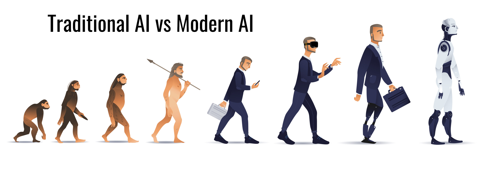

# AI Workshop: LLM Automate Course



## Clone the Repository
```bash
git clone https://github.com/racksync/workshop-ai.git
cd workshop-ai
```

## 📚 Course Overview

**Video Conference (Live & Record)**

คอร์สเนื้อหา AI เน้นเครื่องมือและเทคโนโลยีที่เกี่ยวข้องกับ RAG, n8n, Open-WebUI, Bolt, OpenAI API, Gemini API และเครื่องมืออื่น ๆ ที่เกี่ยวข้อง สามารถปรับลดหรือขยายตามเวลาที่เหมาะสมได้ โดยมุ่งเน้นการพัฒนาโซลูชัน AI สมัยใหม่ ตั้งแต่การทำความรู้จัก Generative AI และ Large Language Models (LLMs) ตลอดจนเทคนิค RAG (Retrieval-Augmented Generation) และ Agentic เพื่อให้ระบบ AI ที่แม่นยำและมีแหล่ง source อ้างอิงที่ชัดเจน นอกจากนี้ยังสอนการใช้งาน OpenAI API และเทคนิคการออกแบบ Prompt อย่างมีประสิทธิภาพ รวมถึงการประยุกต์ใช้ n8n เพื่อเชื่อมโยงการทำงานและพัฒนา Chatbot หรือ Workflow หลายๆ Agent ได้ โดยการเทรนเป็นแบบ Video Conferrence มีการบันทึกวีดีโอสำหรับผู้เข้าร่วมสามารถดูย้อนหลังเพื่อทบทวนได้ (Lifetime Access)

### 👥 ผู้เรียนเป้าหมาย
- นักพัฒนาซอฟต์แวร์
- Data Scientist
- AI Engineer
- ผู้ที่สนใจเรียนรู้การพัฒนาโซลูชัน AI และกระบวนการทำงานอัตโนมัติด้วยเครื่องมือสมัยใหม่

### ⏱️ ระยะเวลา
- 2 วัน (12 ชั่วโมง)

### 🎓 รูปแบบการสอน
- Online Lecture (บรรยายแบบออนไลน์)
- Workshop (ลงมือปฏิบัติ)
- Demo & Q&A


## 📋 ตารางการเรียนรู้

| หัวข้อ | รายละเอียด |
|-------|------------|
| **[Prerequisite](chapters/00-prerequisite.md)** | • การเตรียมความพร้อมก่อนเรียน<br>• พื้นฐานทั่วไป |
| **[Session 1: Modern AI Overview](chapters/01-modern-ai-overview.md)** | • ภาพรวมเทคโนโลยี AI ปัจจุบัน<br>• Generative AI, LLMs, Model<br>• Basic of LLM: Transformer Process, Tokenizer, Embedding |
| **[Session 2: Prompt Engineering](chapters/02-prompt-engineering.md)** | • เทคนิคการออกแบบ Prompt ที่มีประสิทธิภาพ<br>• Zero-shot และ Chain of Thought (CoT)<br>• ReAct Framework<br>• Large Language Models as Zero-Shot Reasoners |
| **[Session 3: OpenAI API และ Gemini API](chapters/03-api-provider.md)** | • แนะนำ OpenAI API, Gemini API<br>• วิธีการสร้างโปรเจกต์เล็ก ๆ เพื่อประยุกต์ใช้ API<br>• ควรระวังเรื่อง Cost และ Best Practices |
| **[Session 4: Local Model](chapters/04-local-model.md)** | • Ollama คืออะไร?<br>• การใช้งาน Local LLM ด้วย Ollama<br>• การปรับแต่งโมเดลและ Custom endpoint |
| **[Session 5: Function Calling](chapters/05-function-calling.md)** | • Function Calling กับ OpenAI<br>• ReAct with LangChain<br>• การพัฒนา Tool-Augmented LLM Application |
| **[Session 6: n8n Automation](chapters/06-n8n-automation.md)** | • แนะนำ n8n: Low-code Workflow Automation |
| **[Session 7: AI Agentic (Agent)](chapters/07-ai-agentic.md)** | • แนวคิด Agentic AI<br>• ตัวอย่างเครื่องมือ/Framework สำหรับสร้าง Agent<br>• Use Cases: Chatbot ที่ทำงานอัตโนมัติ, สั่งการระบบอื่นๆ<br>• การเชื่อมต่อ Agent กับ Automation เพื่อทำงานแบบ End-to-End |
| **[Session 8: RAG (Retrieval-Augmented Generation)](chapters/08-rag.md)** | • หลักการทำงานของ RAG<br>• Workshop: การใช้ Website เป็น Data Source<br>• Processing: Chunking, Embedding, Vector Database (Chroma)<br>• Similarity Search และ Re-ranking<br>• การประยุกต์ใช้ใน use case ต่าง ๆ |
| **[Session 9: Advanced Augmentation Methods](chapters/09-advanced-augmentation.md)** | • CAG (Cache-Augmented Generation)<br>• Caching: Context/prompt (OpenAI, Anthropic)<br>• Response/semantic caching |
| **[Session 10: MCP (Model Context Protocol)](chapters/10-mcp.md)** | • MCP คืออะไรและทำงานอย่างไร<br>• การนำ MCP ไปประยุกต์ใช้ในแอปพลิเคชัน<br>• Workshop: การพัฒนาระบบด้วย MCP<br>• Demo: การทำงานของ MCP ในโปรเจคจริง |
| **[Session 11: Vibe Coding & Framework](chapters/11-vibe-coding-framework.md)** | • Vibe Coding คืออะไร?<br>• การใช้ Vibe Coding เพื่อพัฒนา Web Application แบบรวดเร็วทั้ง back-end และ front end<br>• แนวทางการ Deploy |
| **[Bonus: Tools & Best Practices](chapters/tools-and-best-practices.md)** | • แนะนำเครื่องมืออื่น ๆ ที่เกี่ยวข้อง<br>• แนวทางการดูแลโมเดล, Security และ Data Privacy<br>• Best Practices ในการออกแบบ Workflow |
| **Q&A, Summary & Next Steps** | • ถาม-ตอบ สรุปแนวทางต่อยอดของผู้เรียน<br>• แชร์ Resource & Community สำหรับการพัฒนาต่อ |


## RACKSYNC CO., LTD.

[RACKSYNC](https://github.com/racksync) เป็นบริษัทที่มีความเชี่ยวชาญในการพัฒนาโซลูชั่นด้าน IoT และระบบอัตโนมัติ เรามุ่งมั่นในการสร้างเทคโนโลยีที่เชื่อมต่อโลกเข้าด้วยกันผ่านระบบ IoT ที่มีประสิทธิภาพและเสถียร

### บริการของเรา
- การออกแบบและพัฒนาระบบ IoT แบบครบวงจร
- โซลูชั่นเชื่อมต่อสำหรับอุตสาหกรรม 4.0
- ระบบอัตโนมัติสำหรับบ้านและอาคารอัจฉริยะ
- การฝึกอบรมและเวิร์คช็อปด้าน IoT

## ติดต่อเรา
- **โทร**: 08 5880 8885
- **อีเมล**: info@racksync.com
- **เว็บไซต์**: https://racksync.com
- **Facebook**: https://www.facebook.com/racksync

© 2007-2025 RACKSYNC CO., LTD. All rights reserved.

    