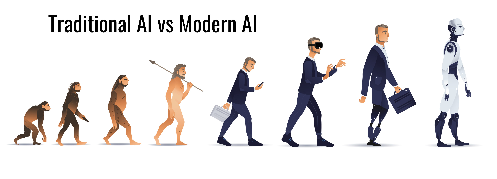
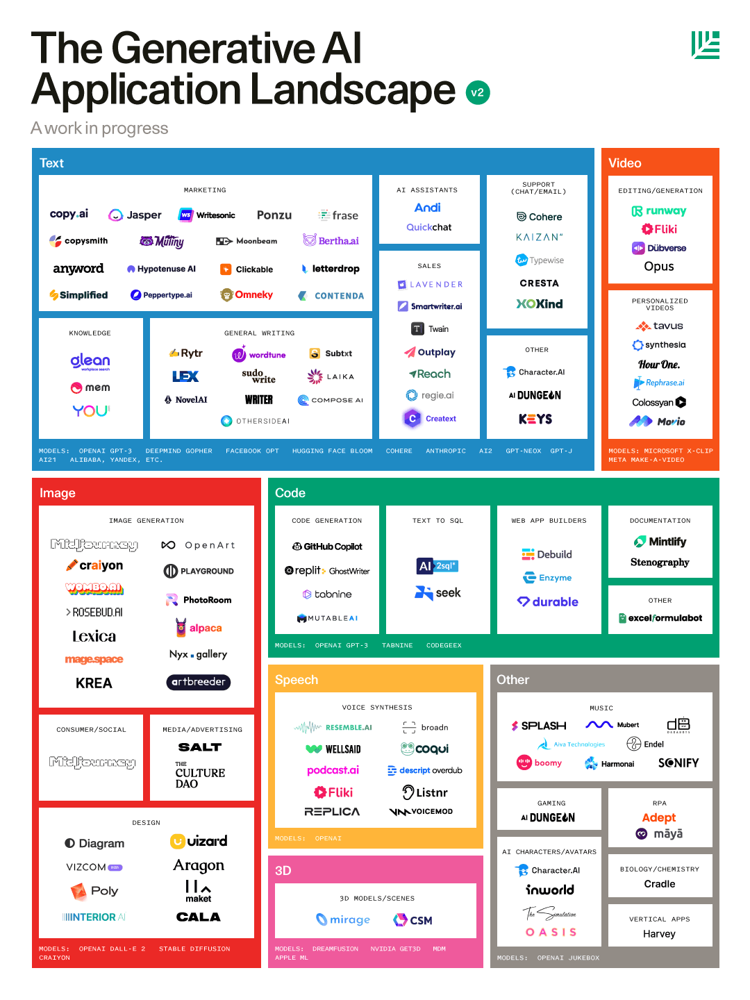
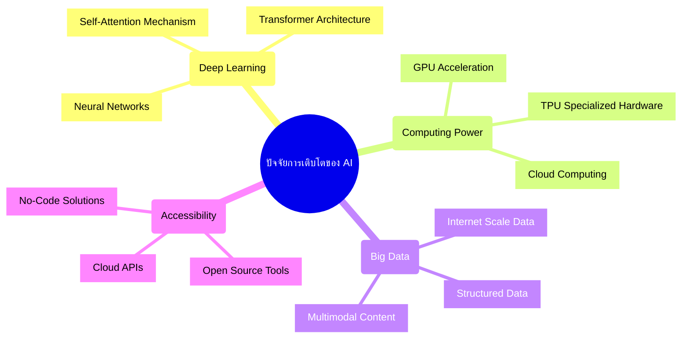
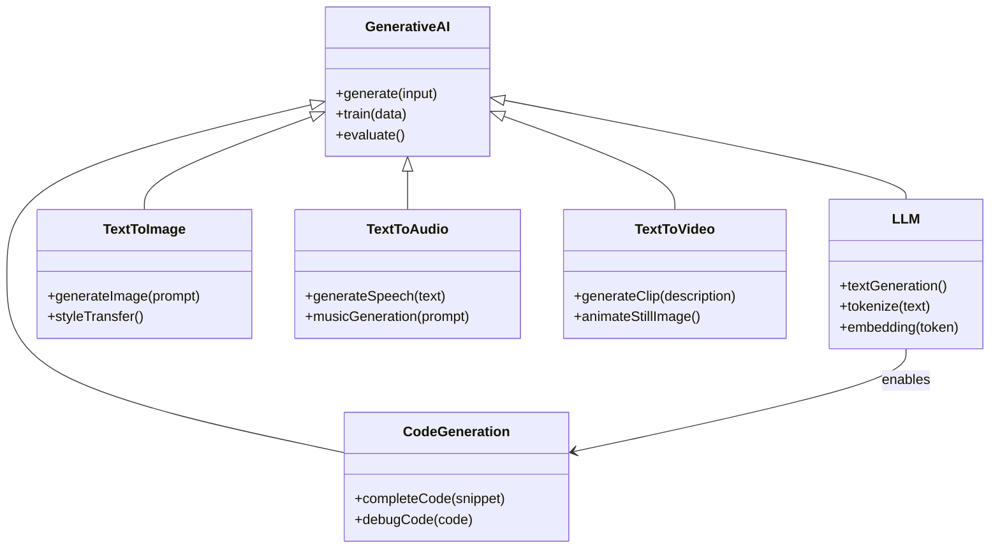
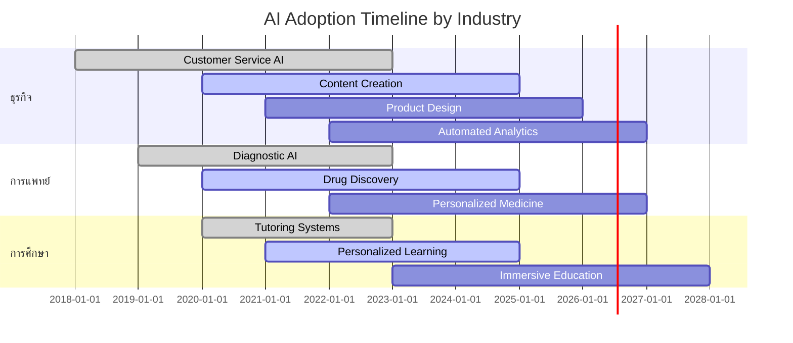
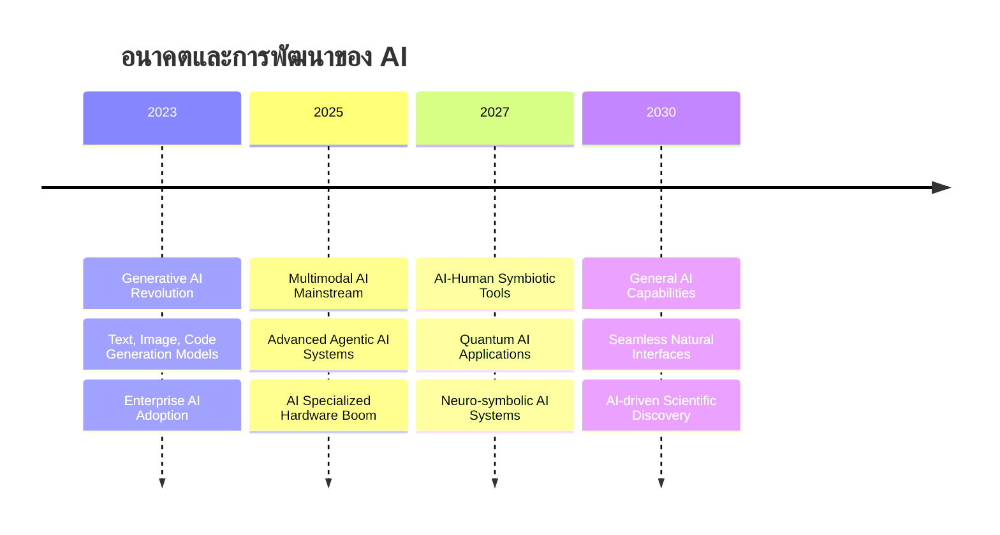

# Modern AI Overview

## ภาพรวมเทคโนโลยี AI ปัจจุบัน

  

AI ในปัจจุบันมีการพัฒนาก้าวหน้าอย่างรวดเร็ว โดยเฉพาะในด้าน Natural Language Processing และ Computer Vision ปัจจัยสำคัญที่ทำให้ AI มีความสำคัญ:

- การพัฒนาของ Deep Learning
- การเพิ่มขึ้นของพลังการประมวลผลด้วย GPU และ TPU
- ข้อมูลมหาศาลสำหรับการฝึกฝนโมเดล
- การเข้าถึงเทคโนโลยี AI ที่ง่ายขึ้นผ่าน API และเครื่องมือต่างๆ

> **Key Takeaway:** เทคโนโลยี AI ในปัจจุบันมีความก้าวหน้าอย่างมาก เนื่องจากการพัฒนาของ Deep Learning, คอมพิวเตอร์ประสิทธิภาพสูง, ข้อมูลขนาดใหญ่ และการเข้าถึงที่ง่ายขึ้น

## AI ที่โดดเด่นในปัจจุบัน

### ChatGPT (OpenAI)
- โมเดลภาษาที่โต้ตอบแบบมนุษย์
- เข้าใจบริบทการสนทนา ตอบสนองอย่างสมเหตุสมผล
- สร้างเนื้อหาได้หลากหลาย: บทความ, โค้ด, บทกวี

### Midjourney
- สร้างภาพจากคำอธิบาย (text-to-image)
- ภาพที่สร้างมีความละเอียดและสวยงามสูง
- ได้รับความนิยมในวงการศิลปะและการออกแบบ

### Stable Diffusion
- โมเดล open-source สำหรับสร้างภาพ
- สามารถรันบนคอมพิวเตอร์ส่วนตัวได้
- มีชุมชนนักพัฒนาที่กระตือรือร้น

> **Key Takeaway:** AI ยุคใหม่สามารถสร้างเนื้อหาที่มีคุณภาพสูง ทั้งข้อความและภาพที่สมจริง โดยผู้ใช้สามารถเข้าถึงได้ง่ายผ่านแพลตฟอร์มต่างๆ

## Generative AI และ LLMs

### ความเข้าใจเกี่ยวกับ Generative AI
Generative AI คือระบบที่สร้างเนื้อหาใหม่ได้ ไม่ว่าจะเป็นข้อความ รูปภาพ เสียง หรือวิดีโอ โดยเรียนรู้จากข้อมูลที่มีอยู่ แตกต่างจาก AI แบบดั้งเดิมที่มักจะวิเคราะห์หรือจำแนกข้อมูลเท่านั้น

### Large Language Models (LLMs)
LLMs คือโมเดลภาษาขนาดใหญ่ที่ได้รับการฝึกฝนด้วยข้อมูลมหาศาล ความสามารถหลัก:
- เข้าใจและสร้างภาษามนุษย์
- แก้ปัญหาและคิดเชิงตรรกะ
- สร้างสรรค์เนื้อหาที่หลากหลาย
- เขียนและอธิบายโค้ด

โมเดลที่โดดเด่น: GPT-4, Claude, Llama 2, Gemini, DeepSeek

### กระบวนการทำงานของ LLMs

> **Key Takeaway:** LLMs ผ่านกระบวนการฝึกฝนหลายขั้นตอน ตั้งแต่ Pre-training จนถึงการปรับแต่งด้วย Human Feedback (RLHF) เพื่อให้ได้โมเดลที่มีประสิทธิภาพสูงและตอบสนองความต้องการของผู้ใช้

## การใช้งาน AI ในโลกธุรกิจและงานวิจัย

### ธุรกิจ
- **Customer Service** - แชทบอทที่ตอบคำถามลูกค้า
- **Content Creation** - สร้างเนื้อหาการตลาด บทความ โฆษณา
- **Product Design** - สร้างแนวคิดการออกแบบและโปรโตไทป์
- **Data Analysis** - วิเคราะห์ข้อมูลและสร้างรายงานอัตโนมัติ

### งานวิจัยและการศึกษา
- **Academic Research** - สรุปงานวิจัย ค้นหาข้อมูล
- **Drug Discovery** - ค้นหาโมเลกุลยาที่มีประสิทธิภาพ
- **Climate Modeling** - ทำนายการเปลี่ยนแปลงสภาพภูมิอากาศ
- **Personalized Education** - ปรับเนื้อหาการเรียนรู้เฉพาะบุคคล

> **Key Takeaway:** AI กำลังเปลี่ยนแปลงภาคธุรกิจและงานวิจัยอย่างมีนัยสำคัญ ช่วยเพิ่มประสิทธิภาพ ลดต้นทุน และเปิดโอกาสใหม่ๆ ในหลากหลายอุตสาหกรรม

### ประโยชน์ที่จับต้องได้

- **เพิ่มประสิทธิภาพการทำงาน** - ช่วยให้ทำงานได้รวดเร็วขึ้น ลดเวลาในงานที่ทำซ้ำๆ
- **ประหยัดต้นทุน** - ลดค่าใช้จ่ายในกระบวนการที่ทำงานอัตโนมัติได้
- **ต่อยอดนวัตกรรม** - สร้างแนวคิดและวิธีการแก้ปัญหาใหม่ๆ
- **ทลายข้อจำกัดการเข้าถึง** - ทำให้เทคโนโลยีขั้นสูงกลายเป็นเรื่องใกล้ตัว

### ข้อจำกัดที่ต้องระมัดระวัง

- **การสร้างข้อมูลเท็จ (Hallucination)** - AI อาจให้ข้อมูลที่ไม่ถูกต้อง
- **อคติในการประมวลผล (Bias)** - AI อาจสะท้อนอคติที่มีในข้อมูลฝึกฝน
- **ความเสี่ยงด้านความปลอดภัย** - มีความท้าทายในการป้องกันการใช้งานที่ผิด
- **ขอบเขตความสามารถ** - AI ยังไม่สามารถทดแทนวิจารณญาณของมนุษย์ได้อย่างสมบูรณ์

> **Key Takeaway:** การใช้ AI อย่างมีประสิทธิภาพต้องตระหนักถึงทั้งประโยชน์และข้อจำกัด ควรใช้วิจารณญาณในการตรวจสอบข้อมูลและผลลัพธ์ที่ได้จาก AI เสมอ

## อนาคตของ AI

### แนวโน้มสำคัญ
- **Multimodal AI** - AI ที่ทำงานกับข้อมูลหลายรูปแบบ (ข้อความ, รูปภาพ, เสียง, วิดีโอ)
- **Agentic AI** - AI ที่ทำงานอัตโนมัติ มีความเป็นอิสระมากขึ้น
- **Smaller, Specialized Models** - โมเดลขนาดเล็กที่มีประสิทธิภาพสูงสำหรับงานเฉพาะทาง
- **AI-Human Collaboration** - การทำงานร่วมกันระหว่าง AI และมนุษย์

### ความท้าทายในอนาคต
- **Ethics and Governance** - การกำกับดูแลและจริยธรรม
- **Privacy Concerns** - การรักษาความเป็นส่วนตัว
- **Job Displacement** - ผลกระทบต่อตลาดแรงงาน
- **Digital Divide** - ความไม่เท่าเทียมในการเข้าถึงเทคโนโลยี

> **Key Takeaway:** อนาคตของ AI จะมุ่งไปสู่โมเดลที่มีความสามารถหลากหลาย (Multimodal) และเป็นอิสระมากขึ้น (Agentic) พร้อมกับความท้าทายด้านจริยธรรมและการกำกับดูแลที่จะต้องพัฒนาไปพร้อมกัน

## สรุป

เทคโนโลยี AI โดยเฉพาะ Generative AI และ LLMs กำลังเปลี่ยนแปลงโลกอย่างรวดเร็ว การเข้าใจพื้นฐาน ศักยภาพ และข้อจำกัดของเทคโนโลยีเหล่านี้มีความสำคัญอย่างยิ่ง เพื่อให้เราใช้ประโยชน์ได้อย่างเต็มที่และรับมือกับความท้าทายที่อาจเกิดขึ้น การเรียนรู้เครื่องมือและเทคนิคในการใช้งาน AI จะช่วยเตรียมความพร้อมสำหรับโลกแห่งอนาคตที่ AI จะมีบทบาทมากขึ้นในทุกภาคส่วนของสังคม

> **Key Takeaway:** การเรียนรู้และเข้าใจเทคโนโลยี AI ไม่ใช่เพียงทางเลือก แต่เป็นสิ่งจำเป็นสำหรับการเติบโตในโลกยุคใหม่ ทั้งในระดับบุคคลและองค์กร

## แหล่งข้อมูลเพิ่มเติม

- [State of AI Report](https://www.stateof.ai/) - รายงานประจำปีเกี่ยวกับความก้าวหน้าของ AI
- [OpenAI Documentation](https://platform.openai.com/docs) - เอกสารและแนวทางการใช้งาน API ของ OpenAI
- [Hugging Face - The AI community](https://huggingface.co/) - แพลตฟอร์มสำหรับโมเดล AI open-source
- [AI Index Report - Stanford HAI](https://aiindex.stanford.edu/report/) - รายงานวิจัยและสถิติเกี่ยวกับ AI จากมหาวิทยาลัย Stanford
- [Papers With Code](https://paperswithcode.com/) - งานวิจัยด้าน AI พร้อม code ที่พร้อมนำไปใช้งาน
- [Learn Prompting](https://learnprompting.org/) - แหล่งเรียนรู้เกี่ยวกับ prompt engineering
- [Coursera - AI For Everyone](https://www.coursera.org/learn/ai-for-everyone) - คอร์สพื้นฐาน AI สำหรับทุกคน

---
## RACKSYNC CO., LTD.

[RACKSYNC](https://github.com/racksync) เป็นบริษัทที่มีความเชี่ยวชาญในการพัฒนาโซลูชั่นด้าน IoT และระบบอัตโนมัติ เรามุ่งมั่นในการสร้างเทคโนโลยีที่เชื่อมต่อโลกเข้าด้วยกันผ่านระบบ IoT ที่มีประสิทธิภาพและเสถียร

### บริการของเรา
- การออกแบบและพัฒนาระบบ IoT แบบครบวงจร
- โซลูชั่นเชื่อมต่อสำหรับอุตสาหกรรม 4.0
- ระบบอัตโนมัติสำหรับบ้านและอาคารอัจฉริยะ
- การฝึกอบรมและเวิร์คช็อปด้าน IoT

## ติดต่อเรา
- **โทร**: 08 5880 8885
- **อีเมล**: info@racksync.com
- **เว็บไซต์**: https://racksync.com
- **Facebook**: https://www.facebook.com/racksync

© 2007-2025 RACKSYNC CO., LTD. All rights reserved.
