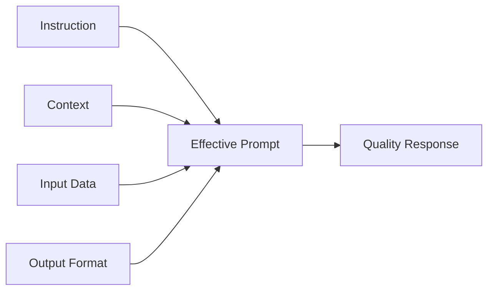
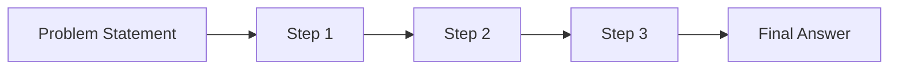
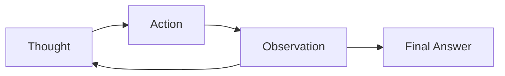
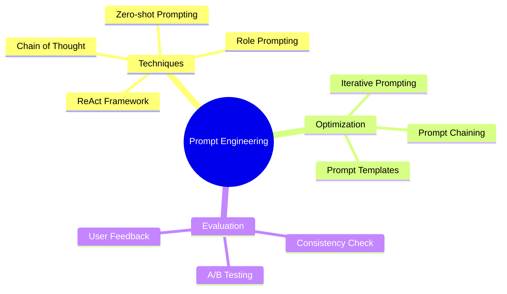

# Prompt Engineering


Prompt Engineering เป็นศาสตร์และศิลป์ของการออกแบบคำถามหรือคำสั่งที่มีประสิทธิภาพเพื่อสื่อสารกับ Large Language Models (LLMs) ให้ได้ผลลัพธ์ที่ตรงตามความต้องการมากที่สุด

## ความสำคัญของ Prompt Engineering

การออกแบบ Prompt ที่ดีเปรียบเสมือนการสื่อสารที่มีประสิทธิภาพกับ AI โดยเฉพาะในยุคที่ LLMs กำลังมีบทบาทสำคัญในหลากหลายอุตสาหกรรม ผู้ที่สามารถออกแบบ Prompt ได้อย่างมีประสิทธิภาพจะสามารถใช้ประโยชน์จาก AI ได้อย่างเต็มที่และแก้ไขข้อจำกัดของโมเดลได้

> **Key Takeaway**: Prompt Engineering ไม่ใช่เพียงการตั้งคำถาม แต่เป็นการออกแบบวิธีการสื่อสารกับ AI อย่างมีกลยุทธ์เพื่อให้ได้ผลลัพธ์ที่ถูกต้อง แม่นยำ และตรงตามความต้องการ

## โครงสร้างของ Prompt ที่มีประสิทธิภาพ

โครงสร้าง Prompt ที่มีประสิทธิภาพมักประกอบด้วยองค์ประกอบหลักดังนี้:

- **Instruction**: คำสั่งหรือวัตถุประสงค์ที่ชัดเจน
- **Context**: บริบทหรือข้อมูลพื้นฐานที่จำเป็น
- **Input Data**: ข้อมูลที่ต้องการให้ LLM ประมวลผล
- **Output Format**: รูปแบบของผลลัพธ์ที่ต้องการ



## เทคนิคการออกแบบ Prompt ที่มีประสิทธิภาพ

### Role Prompting

การกำหนดบทบาทให้ AI ช่วยให้ได้ผลลัพธ์ที่เฉพาะเจาะจงมากขึ้น

```
คุณเป็นผู้เชี่ยวชาญด้าน Data Science ช่วยอธิบายขั้นตอนการทำ Time Series Analysis ให้เข้าใจง่าย
```

### Zero-shot Prompting

การขอให้ LLM ทำงานโดยไม่มีตัวอย่างมาก่อน เหมาะกับงานไม่ซับซ้อนและโมเดลที่มีความสามารถสูง

```
จัดหมวดหมู่ข้อความนี้ว่าเป็นความคิดเห็นเชิงบวกหรือเชิงลบ: "อาหารร้านนี้รสชาติดีมาก แต่บริการช้าเกินไป"
```


### Chain of Thought (CoT)

การกระตุ้นให้ LLM แสดงกระบวนการคิดเป็นขั้นตอน ช่วยเพิ่มความถูกต้องในการตอบคำถามที่ซับซ้อน

```
คำถาม: ถ้าผ้าผืนหนึ่งราคา 120 บาท และลดราคา 25% จะเหลือราคาเท่าไร? 
ช่วยคิดทีละขั้นตอน
```

> **Key Takeaway**: Chain of Thought ช่วยให้ LLM แสดงเหตุผลอย่างเป็นขั้นตอน ทำให้ผลลัพธ์ที่ได้มีความถูกต้องสูงขึ้น โดยเฉพาะในโจทย์ที่ต้องการการคิดวิเคราะห์หรือการคำนวณ



### ReAct Framework

ReAct (Reasoning + Acting) เป็นเฟรมเวิร์กที่ผสมผสานระหว่างการให้เหตุผล (Reasoning) และการกระทำ (Acting) ช่วยให้ LLM สามารถแก้ปัญหาที่ซับซ้อนได้ดีขึ้น


ReAct Framework มีขั้นตอนหลักๆ ดังนี้:
- **Thought**: ขั้นตอนการคิดและวิเคราะห์
- **Action**: การกระทำหรือการค้นหาข้อมูล
- **Observation**: การสังเกตผลลัพธ์
- **Repeat**: ทำซ้ำจนกว่าจะได้คำตอบที่สมบูรณ์



## การประยุกต์ใช้ Large Language Models as Zero-Shot Reasoners

LLMs มีความสามารถในการให้เหตุผลและแก้ปัญหาโดยไม่จำเป็นต้องมีการฝึกฝนเฉพาะทาง (Zero-shot Reasoning) ซึ่งเป็นคุณสมบัติที่ทรงพลังมาก

ตัวอย่าง Prompt สำหรับ Zero-Shot Reasoning:

```
จงวิเคราะห์ว่าบทความนี้มีอคติหรือไม่ อย่างไร: "การศึกษาล่าสุดแสดงให้เห็นว่าวัคซีน A มีประสิทธิภาพมากกว่าวัคซีน B แม้ว่าจะมีข้อสงสัยเกี่ยวกับวิธีการทำวิจัย"
```

> **Key Takeaway**: Zero-Shot Reasoners สามารถแก้ปัญหาและวิเคราะห์ในสถานการณ์ที่ไม่เคยเจอมาก่อน แต่ประสิทธิภาพขึ้นอยู่กับความสามารถของโมเดลและคุณภาพของ Prompt

## เทคนิคการปรับแต่ง Prompt

### Prompt Chaining
การแบ่ง Prompt เป็นขั้นตอนย่อยๆ และเชื่อมโยงผลลัพธ์แต่ละขั้นเข้าด้วยกัน

### Prompt Templates
การสร้างแม่แบบ Prompt ที่สามารถนำไปใช้ได้หลากหลายกรณี

```
คุณเป็น{role} ช่วย{task}โดยใช้{approach}และให้ผลลัพธ์ในรูปแบบ{format}
```

### Iterative Prompting
การปรับปรุง Prompt อย่างต่อเนื่องตามผลลัพธ์ที่ได้




## แนวทางการทดสอบและประเมินผล Prompt

การทดสอบและประเมินผล Prompt มีความสำคัญในการปรับปรุงประสิทธิภาพ:

- **A/B Testing**: เปรียบเทียบผลลัพธ์ระหว่าง Prompt แบบต่างๆ
- **Consistency Check**: ตรวจสอบความสม่ำเสมอของผลลัพธ์
- **Evaluation Metrics**: การใช้เกณฑ์วัดผลที่ชัดเจน เช่น ความถูกต้อง ความครบถ้วน
- **User Feedback**: รับฟังความคิดเห็นจากผู้ใช้งานจริง

> **Key Takeaway**: การทดสอบและประเมินผล Prompt อย่างเป็นระบบช่วยให้เราพัฒนาและปรับปรุง Prompt ได้อย่างมีประสิทธิภาพ

## สรุป

Prompt Engineering เป็นทักษะสำคัญในยุคของ AI โดยเฉพาะ LLMs การเข้าใจหลักการและเทคนิคต่างๆ จะช่วยให้สามารถสื่อสารกับ AI ได้อย่างมีประสิทธิภาพ ไม่ว่าจะเป็น Zero-shot, Chain of Thought หรือ ReAct Framework ล้วนเป็นเครื่องมือที่ช่วยยกระดับความสามารถในการใช้งาน AI ให้สูงขึ้น

การฝึกฝนและทดลองใช้เทคนิคต่างๆ อย่างต่อเนื่องจะช่วยให้เราสามารถดึงศักยภาพสูงสุดจาก LLMs และประยุกต์ใช้ในงานต่างๆ ได้อย่างมีประสิทธิภาพ

## แหล่งข้อมูลเพิ่มเติม

- [OpenAI Prompt Engineering Guide](https://www.google.com/search?q=OpenAI+Prompt+Engineering+Guide)
- [Anthropic's Claude Prompt Design Guidelines](https://www.google.com/search?q=Anthropic+Claude+Prompt+Design+Guidelines)
- [LangChain Documentation](https://www.google.com/search?q=LangChain+Documentation+Prompting)
- [DeepLearning.AI Prompt Engineering for Developers](https://www.google.com/search?q=DeepLearning.AI+Prompt+Engineering+for+Developers)
- [AI Prompt Engineering Academic Papers](https://www.google.com/search?q=Prompt+Engineering+Research+Papers)

---

## RACKSYNC CO., LTD.

[RACKSYNC](https://github.com/racksync) เป็นบริษัทที่มีความเชี่ยวชาญในการพัฒนาโซลูชั่นด้าน IoT และระบบอัตโนมัติ เรามุ่งมั่นในการสร้างเทคโนโลยีที่เชื่อมต่อโลกเข้าด้วยกันผ่านระบบ IoT ที่มีประสิทธิภาพและเสถียร

### บริการของเรา
- การออกแบบและพัฒนาระบบ IoT แบบครบวงจร
- โซลูชั่นเชื่อมต่อสำหรับอุตสาหกรรม 4.0
- ระบบอัตโนมัติสำหรับบ้านและอาคารอัจฉริยะ
- การฝึกอบรมและเวิร์คช็อปด้าน IoT

## ติดต่อเรา
- **โทร**: 08 5880 8885
- **อีเมล**: info@racksync.com
- **เว็บไซต์**: https://racksync.com
- **Facebook**: https://www.facebook.com/racksync

© 2007-2025 RACKSYNC CO., LTD. All rights reserved.
