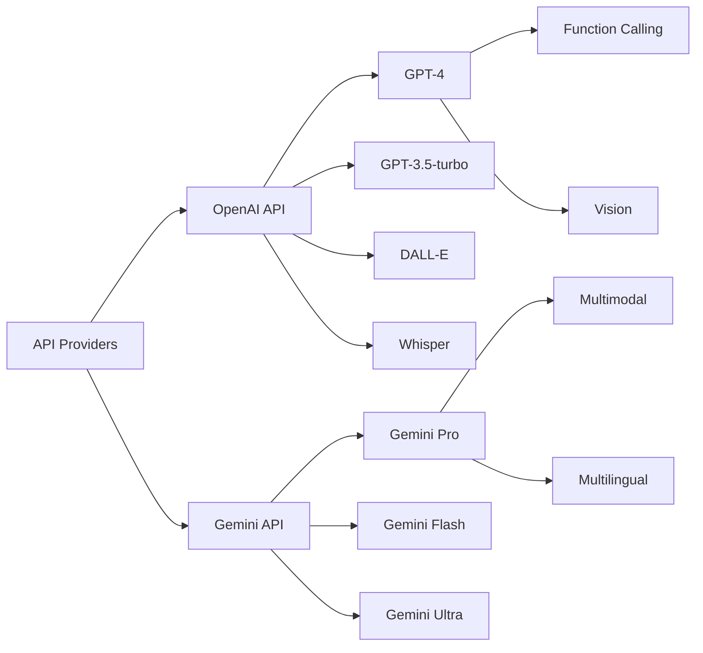
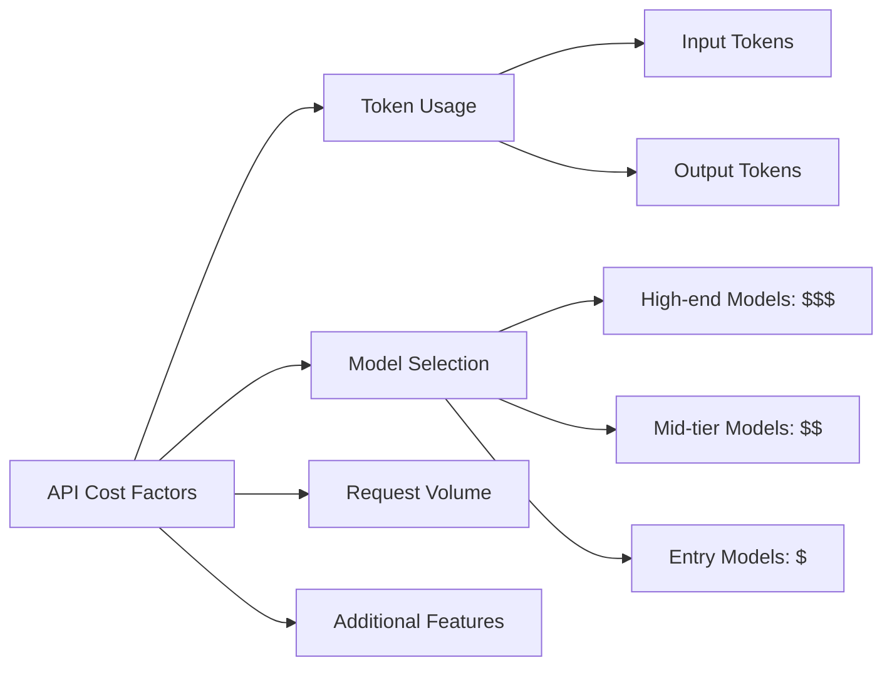

# Session 3: OpenAI API และ Gemini API


## แนะนำ API Providers ในปัจจุบัน

ปัจจุบันมี API Providers หลักๆ ที่ให้บริการด้าน AI โดยเฉพาะ Large Language Models (LLMs) ที่มีความสามารถสูง โดยผู้ให้บริการหลักคือ OpenAI และ Google (Gemini) ซึ่งทั้งสองรายนี้มีจุดเด่นและความสามารถที่แตกต่างกันไป

> **Key Takeaway**: การเลือกใช้ API Provider ควรพิจารณาจากความต้องการของโปรเจค ความสามารถของโมเดล และงบประมาณที่มี

## เปรียบเทียบ OpenAI API และ Gemini API



### OpenAI API

OpenAI เป็นผู้ให้บริการ API ที่มีชื่อเสียงมากที่สุดในปัจจุบัน ด้วยโมเดล GPT รุ่นต่างๆ ที่มีประสิทธิภาพสูง

**โมเดลหลัก:**
- **GPT-4 / GPT-4o** - โมเดลที่ทรงพลังที่สุด รองรับงานที่ซับซ้อน ความสามารถในการเข้าใจบริบท และตีความโจทย์ได้ดี
- **GPT-3.5-turbo** - โมเดลที่มีความสมดุลระหว่างราคาและประสิทธิภาพ เหมาะกับงานทั่วไป
- **DALL-E** - สำหรับสร้างรูปภาพจากข้อความ
- **Whisper** - สำหรับการแปลงเสียงพูดเป็นข้อความ

**การสมัครและการใช้งาน:**
1. ลงทะเบียนที่ [OpenAI Platform](https://platform.openai.com/)
2. สร้าง API key
3. เติมเงินเพื่อใช้งาน (เริ่มต้นได้เครดิตฟรี $5)

**ตัวอย่าง Code การใช้งาน:**

```javascript
const { OpenAI } = require('openai');

const openai = new OpenAI({
  apiKey: 'YOUR_API_KEY',
});

async function main() {
  const completion = await openai.chat.completions.create({
    model: "gpt-3.5-turbo",
    messages: [
      { role: "system", content: "คุณเป็นผู้ช่วยที่เป็นประโยชน์" },
      { role: "user", content: "อธิบายเกี่ยวกับ API ของ OpenAI" }
    ],
  });

  console.log(completion.choices[0].message);
}

main();
```

### Gemini API

Gemini เป็นโมเดล AI จาก Google ที่มีความสามารถด้าน multimodal โดดเด่น สามารถเข้าใจทั้งข้อความ รูปภาพ และเสียงได้อย่างมีประสิทธิภาพ

**โมเดลหลัก:**
- **Gemini Ultra** - รุ่นที่มีประสิทธิภาพสูงสุด
- **Gemini Pro** - รุ่นมาตรฐานสำหรับการใช้งานทั่วไป 
- **Gemini Flash** - รุ่นเบาสำหรับงานที่ต้องการความเร็วและต้นทุนต่ำ

**การสมัครและการใช้งาน:**
1. สร้างโปรเจคใน [Google AI Studio](https://aistudio.google.com/) หรือ [Google Cloud Console](https://console.cloud.google.com/)
2. เปิดใช้งาน Gemini API
3. สร้าง API key

**ตัวอย่าง Code การใช้งาน:**

```python
from google.generativeai import configure, GenerativeModel

# Configure API key
configure(api_key='YOUR_API_KEY')

# Create model instance
model = GenerativeModel('gemini-pro')

# Generate content
response = model.generate_content('อธิบายเกี่ยวกับ API ของ Google Gemini')

print(response.text)
```

## การพัฒนาโปรเจคเล็กๆ ด้วย AI API


### โปรเจคตัวอย่างที่น่าสนใจ

1. **Chatbot สำหรับเว็บไซต์**
   - รับคำถามจากผู้ใช้และส่งไปยัง API เพื่อให้ AI ตอบกลับ
   - สามารถฝังในเว็บไซต์หรือแอพพลิเคชันได้

2. **เครื่องมือสรุปเนื้อหา**
   - รับข้อความยาวๆ และสร้างสรุปสั้นๆ ด้วย AI
   - เหมาะสำหรับสรุปบทความ รายงาน หรือเอกสารต่างๆ

3. **ระบบแปลภาษาอัจฉริยะ**
   - ใช้ AI ในการแปลภาษาที่มีความเข้าใจบริบทมากกว่าเครื่องมือแปลทั่วไป

4. **ผู้ช่วยเขียนโค้ด**
   - ช่วยสร้าง แนะนำ และแก้ไขโค้ดโปรแกรมตามความต้องการ

> **Key Takeaway**: การเริ่มต้นด้วยโปรเจคเล็กๆ ช่วยให้เข้าใจการทำงานของ API และความสามารถของโมเดล ก่อนที่จะขยายไปทำโปรเจคที่ซับซ้อนมากขึ้น

## ข้อควรระวังเรื่อง Cost และแนวปฏิบัติที่ดี



### การคำนวณต้นทุน

โมเดล LLM คิดค่าบริการตาม "tokens" ซึ่งเป็นหน่วยของข้อความ โดยประมาณ 1 token = 4 ตัวอักษรในภาษาอังกฤษ สำหรับภาษาไทยอาจใช้จำนวน tokens มากกว่านี้

**ตัวอย่างค่าใช้จ่าย (OpenAI):**
- GPT-4: $0.03 / 1K tokens (input), $0.06 / 1K tokens (output)
- GPT-3.5-turbo: $0.0005 / 1K tokens (input), $0.0015 / 1K tokens (output)

**ตัวอย่างค่าใช้จ่าย (Gemini):**
- Gemini Pro: $0.0025 / 1K tokens (input), $0.0075 / 1K tokens (output)
- Gemini Flash: $0.0005 / 1K tokens (input), $0.0015 / 1K tokens (output)

### แนวทางลดต้นทุน

1. **ใช้โมเดลที่เหมาะสม**: เลือกโมเดลตามความต้องการจริงๆ ไม่จำเป็นต้องใช้โมเดลที่แพงที่สุดเสมอไป
2. **ลดความยาวของ prompt**: ออกแบบ prompt ให้กระชับแต่ได้ผลลัพธ์ที่ต้องการ
3. **จำกัดความยาวของการตอบกลับ**: กำหนดจำนวนโทเค็นสูงสุดที่ต้องการให้ AI ตอบกลับ
4. **ใช้ caching**: เก็บผลลัพธ์ที่เคยถามแล้วเพื่อไม่ต้องเรียก API ซ้ำ
5. **กำหนดงบประมาณ**: ตั้งค่าการแจ้งเตือนหรือจำกัดการใช้งานเมื่อถึงวงเงินที่กำหนด

### แนวปฏิบัติที่ดีในการใช้งาน API

1. **เก็บ API key ให้ปลอดภัย**: ไม่ควรเปิดเผย API key ในโค้ดสาธารณะหรือไฟล์ที่เข้าถึงได้ง่าย
2. **ใช้ระบบ rate limiting**: ป้องกันการเรียกใช้ API มากเกินไปโดยไม่จำเป็น
3. **มีกระบวนการตรวจสอบผลลัพธ์**: ไม่ควรเชื่อผลลัพธ์จาก AI โดยไม่มีการตรวจสอบ
4. **เคารพนโยบายของผู้ให้บริการ**: ปฏิบัติตามข้อกำหนดการใช้งานของ OpenAI และ Google
5. **ระมัดระวังข้อมูลส่วนบุคคล**: ไม่ส่งข้อมูลส่วนตัวหรือข้อมูลอ่อนไหวไปยัง API

> **Key Takeaway**: การวางแผนการใช้งาน API อย่างรอบคอบช่วยประหยัดต้นทุนและป้องกันปัญหาที่อาจเกิดขึ้นในอนาคต

## Workshop: สร้าง Simple Chatbot ด้วย API

**ขั้นตอนการทำ Workshop:**

1. สร้าง API key จาก OpenAI หรือ Google
2. สร้างโปรเจค Node.js หรือ Python ง่ายๆ
3. ติดตั้ง library สำหรับเชื่อมต่อกับ API
4. เขียนโค้ดสำหรับรับข้อความและส่งไปยัง API
5. แสดงผลลัพธ์ที่ได้กลับมา

**ตัวอย่างโค้ดสำหรับ Workshop (Node.js + OpenAI):**

```javascript
const express = require('express');
const { OpenAI } = require('openai');
require('dotenv').config();

const app = express();
app.use(express.json());
app.use(express.static('public'));

const openai = new OpenAI({
  apiKey: process.env.OPENAI_API_KEY,
});

app.post('/chat', async (req, res) => {
  try {
    const { message } = req.body;
    
    const completion = await openai.chat.completions.create({
      model: "gpt-3.5-turbo",
      messages: [{ role: "user", content: message }],
      max_tokens: 500,
    });
    
    res.json({ reply: completion.choices[0].message.content });
  } catch (error) {
    console.error('Error:', error);
    res.status(500).json({ error: 'Something went wrong' });
  }
});

const PORT = process.env.PORT || 3000;
app.listen(PORT, () => {
  console.log(`Server running on port ${PORT}`);
});
```

## สรุป

การใช้งาน API ของ OpenAI และ Gemini เปิดโอกาสให้เราสามารถนำเทคโนโลยี AI ขั้นสูงมาประยุกต์ใช้ในโปรเจคต่างๆ ได้อย่างง่ายดาย โดยไม่จำเป็นต้องมีความรู้ลึกซึ้งด้าน AI หรือ Machine Learning เพียงแค่เข้าใจวิธีการเรียกใช้ API และการออกแบบ prompt ที่มีประสิทธิภาพก็สามารถสร้างโซลูชันที่ทรงพลังได้

อย่างไรก็ตาม ควรคำนึงถึงต้นทุนและแนวปฏิบัติที่ดีในการใช้งาน เพื่อให้การพัฒนาโปรเจคเป็นไปอย่างมีประสิทธิภาพและประหยัด

## แหล่งข้อมูลเพิ่มเติม

- [OpenAI API Documentation](https://platform.openai.com/docs/)
- [Gemini API Documentation](https://ai.google.dev/docs)
- [OpenAI Cookbook](https://cookbook.openai.com/)
- [Google AI Python SDK](https://github.com/google/generative-ai-python)

---

## RACKSYNC CO., LTD.

[RACKSYNC](https://github.com/racksync) เป็นบริษัทที่มีความเชี่ยวชาญในการพัฒนาโซลูชั่นด้าน IoT และระบบอัตโนมัติ เรามุ่งมั่นในการสร้างเทคโนโลยีที่เชื่อมต่อโลกเข้าด้วยกันผ่านระบบ IoT ที่มีประสิทธิภาพและเสถียร

### บริการของเรา
- การออกแบบและพัฒนาระบบ IoT แบบครบวงจร
- โซลูชั่นเชื่อมต่อสำหรับอุตสาหกรรม 4.0
- ระบบอัตโนมัติสำหรับบ้านและอาคารอัจฉริยะ
- การฝึกอบรมและเวิร์คช็อปด้าน IoT

## ติดต่อเรา
- **โทร**: 08 5880 8885
- **อีเมล**: info@racksync.com
- **เว็บไซต์**: https://racksync.com
- **Facebook**: https://www.facebook.com/racksync

© 2007-2025 RACKSYNC CO., LTD. All rights reserved.
