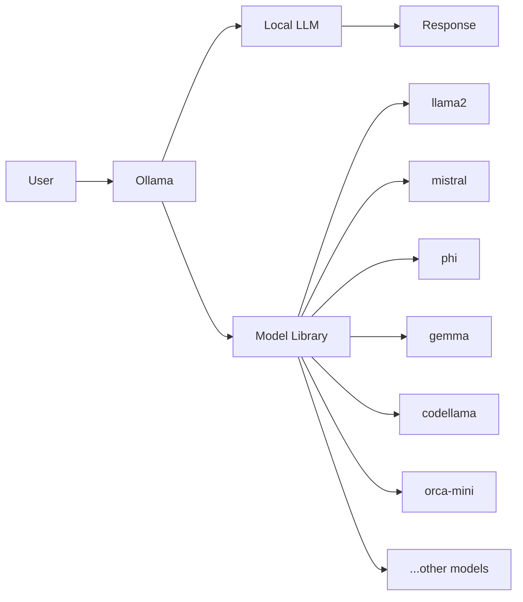
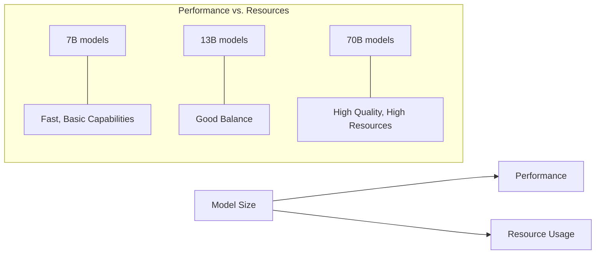

# Local Model: Run LLMs on Your Own Hardware


## What is Ollama?

Ollama is an open-source framework that allows you to run large language models (LLMs) locally on your own hardware. It simplifies the process of downloading, setting up, and using various open-source LLMs without needing to manage complex dependencies or configurations.

Key features of Ollama include:
- Easy installation and setup process
- Support for many popular open-source models
- Simple API similar to OpenAI's for seamless integration
- Ability to run models completely offline
- Low resource requirements compared to traditional model deployment

## Why Run Models Locally?

Running LLMs locally offers several advantages:

- **Privacy**: Your data never leaves your device
- **Cost efficiency**: No API usage fees
- **Customization**: Freedom to fine-tune and modify models
- **Offline operation**: Works without internet connection
- **Lower latency**: No network delay for responses

```bash
# Install Ollama (macOS)
curl -fsSL https://ollama.com/install.sh | sh

# Install Ollama (Linux)
curl -fsSL https://ollama.com/install.sh | sh

# Install Ollama (Windows)
# Download from https://ollama.com/download
```

## Available Models in Ollama

Ollama supports numerous open-source models with varying sizes and capabilities:

```bash
# List available models
ollama list

# Pull a specific model
ollama pull llama2
ollama pull mistral
ollama pull phi
```



## Using Ollama CLI

Ollama provides a simple command-line interface for interacting with models:

```bash
# Basic chat interaction
ollama run llama2

# One-shot prompt
ollama run llama2 "Explain quantum computing in simple terms"

# Specify model parameters
ollama run llama2:13b "Write a short poem about AI" --temperature 0.8
```

## Ollama REST API

Ollama also offers a REST API similar to OpenAI's for integration with applications:

```bash
# Start Ollama server
ollama serve
```

```python
# Example Python request
import requests

response = requests.post('http://localhost:11434/api/generate', 
                        json={
                            'model': 'llama2',
                            'prompt': 'Explain containerization in simple terms',
                            'stream': False
                        })
print(response.json()['response'])
```

## Custom Model Creation

Ollama allows you to create customized models with Modelfiles:

```bash
# Create a Modelfile
echo "FROM llama2
SYSTEM You are a helpful coding assistant specialized in Python.
PARAMETER temperature 0.7" > Modelfile

# Create your custom model
ollama create coder -f Modelfile

# Use your custom model
ollama run coder "Write a Python function to find prime numbers"
```

## Model Performance Comparison



## Hardware Requirements

Different models require varying levels of hardware:

| Model Size | Min RAM | Recommended RAM | GPU Memory |
|------------|---------|----------------|------------|
| 7B         | 8GB     | 16GB           | 8GB        |
| 13B        | 16GB    | 32GB           | 16GB       |
| 33B+       | 32GB+   | 64GB+          | 24GB+      |


## Custom Endpoints with Ollama

You can create custom endpoints by setting up an API gateway in front of Ollama:

```javascript
// Example Express.js wrapper for Ollama
const express = require('express');
const axios = require('axios');
const app = express();
app.use(express.json());

app.post('/custom/chat', async (req, res) => {
  try {
    const response = await axios.post('http://localhost:11434/api/generate', {
      model: req.body.model || 'llama2',
      prompt: req.body.prompt,
      stream: false,
      options: req.body.options || {}
    });
    
    res.json({
      message: response.data.response,
      model_used: req.body.model || 'llama2',
      tokens: response.data.total_duration
    });
  } catch (error) {
    res.status(500).json({ error: error.toString() });
  }
});

app.listen(3000, () => console.log('Custom Ollama API running on port 3000'));
```

## Key Takeaways

> Ollama provides a simple way to run powerful LLMs locally without requiring cloud services or API subscriptions.

> Local models offer significant privacy advantages as your data never leaves your device.

> The resource requirements depend on model size - smaller models (7B) can run on consumer hardware while larger models (70B+) need more powerful setups.

> Custom model creation allows for specialized AI assistants tailored to specific domains or tasks.

> The API compatibility makes it easy to switch between cloud LLM providers and local models with minimal code changes.

## Summary

Ollama represents a significant step forward in democratizing access to large language models by making them runnable on personal hardware. This opens up possibilities for privacy-preserving AI applications, offline capabilities, and cost-effective development environments. While local models may not yet match the performance of the largest cloud-based LLMs, they provide remarkable capabilities for many use cases and continue to improve rapidly.

## Additional Resources

- [Ollama Official Documentation](https://github.com/ollama/ollama/tree/main/docs)
- [LangChain + Ollama Integration Guide](https://python.langchain.com/docs/integrations/llms/ollama)
- [HuggingFace Models compatible with Ollama](https://huggingface.co/models?sort=downloads&search=ollama)
- [Optimizing LLM Performance on Consumer Hardware](https://www.google.com/search?q=optimize+LLM+performance+local+hardware)

---
## RACKSYNC CO., LTD.

[RACKSYNC](https://github.com/racksync) เป็นบริษัทที่มีความเชี่ยวชาญในการพัฒนาโซลูชั่นด้าน IoT และระบบอัตโนมัติ เรามุ่งมั่นในการสร้างเทคโนโลยีที่เชื่อมต่อโลกเข้าด้วยกันผ่านระบบ IoT ที่มีประสิทธิภาพและเสถียร

### บริการของเรา
- การออกแบบและพัฒนาระบบ IoT แบบครบวงจร
- โซลูชั่นเชื่อมต่อสำหรับอุตสาหกรรม 4.0
- ระบบอัตโนมัติสำหรับบ้านและอาคารอัจฉริยะ
- การฝึกอบรมและเวิร์คช็อปด้าน IoT

## ติดต่อเรา
- **โทร**: 08 5880 8885
- **อีเมล**: info@racksync.com
- **เว็บไซต์**: https://racksync.com
- **Facebook**: https://www.facebook.com/racksync

© 2007-2025 RACKSYNC CO., LTD. All rights reserved.
