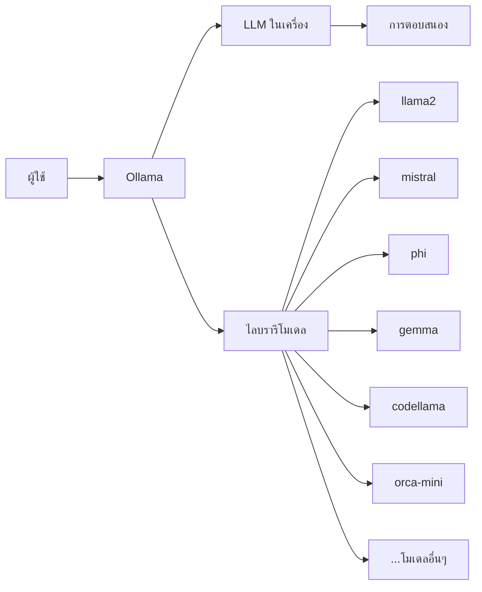
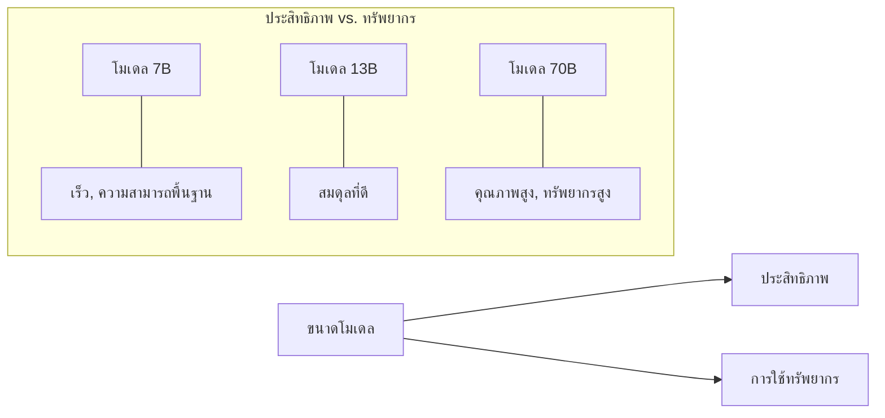

# โมเดลในเครื่อง: รันโมเดล LLM บนฮาร์ดแวร์ของคุณเอง


## Ollama คืออะไร?

Ollama เป็นเฟรมเวิร์กโอเพนซอร์สที่ช่วยให้คุณสามารถรันโมเดลภาษาขนาดใหญ่ (LLMs) บนฮาร์ดแวร์ของคุณเองได้ มันช่วยลดความซับซ้อนในกระบวนการดาวน์โหลด การตั้งค่า และการใช้งานโมเดล LLM โอเพนซอร์สต่างๆ โดยไม่ต้องจัดการกับการพึ่งพาที่ซับซ้อนหรือการกำหนดค่าที่ยุ่งยาก

คุณสมบัติหลักของ Ollama ได้แก่:
- การติดตั้งและตั้งค่าที่ง่าย
- รองรับโมเดลโอเพนซอร์สยอดนิยมหลายตัว
- API ที่เรียบง่ายคล้ายกับของ OpenAI เพื่อการผสมผสานที่ราบรื่น
- ความสามารถในการรันโมเดลแบบออฟไลน์ได้อย่างสมบูรณ์
- ใช้ทรัพยากรน้อยกว่าเมื่อเทียบกับการติดตั้งโมเดลแบบดั้งเดิม

## ทำไมต้องรันโมเดลในเครื่อง?

การรัน LLM ในเครื่องมีข้อดีหลายประการ:

- **ความเป็นส่วนตัว**: ข้อมูลของคุณไม่มีทางออกจากอุปกรณ์ของคุณ
- **ประหยัดต้นทุน**: ไม่มีค่าใช้จ่ายในการใช้ API
- **การปรับแต่ง**: อิสระในการปรับแต่งและแก้ไขโมเดล
- **การทำงานแบบออฟไลน์**: ใช้งานได้โดยไม่ต้องเชื่อมต่ออินเทอร์เน็ต
- **ความหน่วงต่ำ**: ไม่มีความล่าช้าจากเครือข่ายในการตอบสนอง

```bash
# Install Ollama (macOS)
curl -fsSL https://ollama.com/install.sh | sh

# Install Ollama (Linux)
curl -fsSL https://ollama.com/install.sh | sh

# Install Ollama (Windows)
# Download from https://ollama.com/download
```

## โมเดลที่มีให้บริการใน Ollama

Ollama รองรับโมเดลโอเพนซอร์สมากมายหลายขนาดและความสามารถ:

```bash
# List available models
ollama list

# Pull a specific model
ollama pull llama2
ollama pull mistral
ollama pull phi
```



## การใช้ Ollama CLI

Ollama มีอินเตอร์เฟซคำสั่งที่เรียบง่ายสำหรับการโต้ตอบกับโมเดล:

```bash
# Basic chat interaction
ollama run llama2

# One-shot prompt
ollama run llama2 "Explain quantum computing in simple terms"

# Specify model parameters
ollama run llama2:13b "Write a short poem about AI" --temperature 0.8
```

## Ollama REST API

Ollama ยังมี REST API ที่คล้ายกับของ OpenAI สำหรับการผสมผสานกับแอปพลิเคชัน:

```bash
# Start Ollama server
ollama serve
```

```python
# Example Python request
import requests

response = requests.post('http://localhost:11434/api/generate', 
                        json={
                            'model': 'llama2',
                            'prompt': 'Explain containerization in simple terms',
                            'stream': False
                        })
print(response.json()['response'])
```

## การสร้างโมเดลที่กำหนดเอง

Ollama ช่วยให้คุณสามารถสร้างโมเดลที่ปรับแต่งเองได้ด้วย Modelfiles:

```bash
# Create a Modelfile
echo "FROM llama2
SYSTEM You are a helpful coding assistant specialized in Python.
PARAMETER temperature 0.7" > Modelfile

# Create your custom model
ollama create coder -f Modelfile

# Use your custom model
ollama run coder "Write a Python function to find prime numbers"
```

## การเปรียบเทียบประสิทธิภาพของโมเดล



## ความต้องการด้านฮาร์ดแวร์

โมเดลต่างๆ ต้องการระดับฮาร์ดแวร์ที่แตกต่างกัน:

| ขนาดโมเดล | RAM ขั้นต่ำ | RAM ที่แนะนำ | หน่วยความจำ GPU |
|------------|---------|----------------|------------|
| 7B         | 8GB     | 16GB           | 8GB        |
| 13B        | 16GB    | 32GB           | 16GB       |
| 33B+       | 32GB+   | 64GB+          | 24GB+      |


## Endpoints ที่กำหนดเองกับ Ollama

คุณสามารถสร้าง endpoints ที่กำหนดเองได้โดยการตั้งค่า API gateway หน้า Ollama:

```javascript
// Example Express.js wrapper for Ollama
const express = require('express');
const axios = require('axios');
const app = express();
app.use(express.json());

app.post('/custom/chat', async (req, res) => {
  try {
    const response = await axios.post('http://localhost:11434/api/generate', {
      model: req.body.model || 'llama2',
      prompt: req.body.prompt,
      stream: false,
      options: req.body.options || {}
    });
    
    res.json({
      message: response.data.response,
      model_used: req.body.model || 'llama2',
      tokens: response.data.total_duration
    });
  } catch (error) {
    res.status(500).json({ error: error.toString() });
  }
});

app.listen(3000, () => console.log('Custom Ollama API running on port 3000'));
```

## ข้อสรุปสำคัญ

> Ollama ให้วิธีที่ง่ายในการรัน LLMs ที่ทรงพลังในเครื่องโดยไม่จำเป็นต้องใช้บริการคลาวด์หรือการสมัครสมาชิก API

> โมเดลในเครื่องมีข้อได้เปรียบด้านความเป็นส่วนตัวอย่างมากเนื่องจากข้อมูลของคุณไม่มีทางออกจากอุปกรณ์ของคุณ

> ความต้องการทรัพยากรขึ้นอยู่กับขนาดของโมเดล - โมเดลขนาดเล็กกว่า (7B) สามารถรันบนฮาร์ดแวร์ทั่วไปได้ ในขณะที่โมเดลขนาดใหญ่กว่า (70B+) ต้องการการตั้งค่าที่มีประสิทธิภาพมากขึ้น

> การสร้างโมเดลที่กำหนดเองช่วยให้มีผู้ช่วย AI เฉพาะทางที่ปรับแต่งสำหรับโดเมนหรืองานเฉพาะ

> ความเข้ากันได้ของ API ทำให้การสลับระหว่างผู้ให้บริการ LLM บนคลาวด์และโมเดลในเครื่องทำได้ง่ายโดยต้องแก้โค้ดน้อยมาก

## สรุป

Ollama เป็นก้าวสำคัญในการเปิดโอกาสให้ทุกคนเข้าถึงโมเดลภาษาขนาดใหญ่ได้ โดยทำให้สามารถรันบนฮาร์ดแวร์ส่วนบุคคล สิ่งนี้เปิดโอกาสสำหรับแอปพลิเคชัน AI ที่ปกป้องความเป็นส่วนตัว ความสามารถในการทำงานแบบออฟไลน์ และสภาพแวดล้อมการพัฒนาที่คุ้มค่า แม้ว่าโมเดลในเครื่องอาจยังไม่เทียบเท่าประสิทธิภาพของ LLM ขนาดใหญ่ที่อยู่บนคลาวด์ แต่พวกมันก็มอบความสามารถที่น่าทึ่งสำหรับหลายกรณีการใช้งานและยังคงพัฒนาอย่างรวดเร็ว

## ทรัพยากรเพิ่มเติม

- [เอกสารอย่างเป็นทางการของ Ollama](https://github.com/ollama/ollama/tree/main/docs)
- [คู่มือการผสมผสาน LangChain + Ollama](https://python.langchain.com/docs/integrations/llms/ollama)
- [โมเดล HuggingFace ที่เข้ากันได้กับ Ollama](https://huggingface.co/models?sort=downloads&search=ollama)
- [การปรับประสิทธิภาพ LLM บนฮาร์ดแวร์ทั่วไป](https://www.google.com/search?q=optimize+LLM+performance+local+hardware)

---
## RACKSYNC CO., LTD.

[RACKSYNC](https://github.com/racksync) เป็นบริษัทที่มีความเชี่ยวชาญในการพัฒนาโซลูชั่นด้าน IoT และระบบอัตโนมัติ เรามุ่งมั่นในการสร้างเทคโนโลยีที่เชื่อมต่อโลกเข้าด้วยกันผ่านระบบ IoT ที่มีประสิทธิภาพและเสถียร

### บริการของเรา
- การออกแบบและพัฒนาระบบ IoT แบบครบวงจร
- โซลูชั่นเชื่อมต่อสำหรับอุตสาหกรรม 4.0
- ระบบอัตโนมัติสำหรับบ้านและอาคารอัจฉริยะ
- การฝึกอบรมและเวิร์คช็อปด้าน IoT

## ติดต่อเรา
- **โทร**: 08 5880 8885
- **อีเมล**: info@racksync.com
- **เว็บไซต์**: https://racksync.com
- **Facebook**: https://www.facebook.com/racksync

© 2007-2025 RACKSYNC CO., LTD. All rights reserved.
