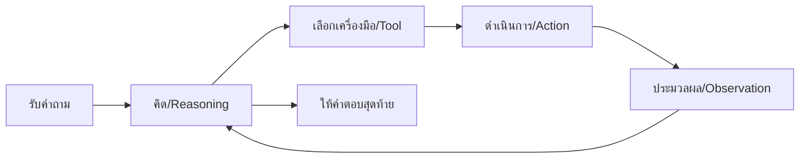
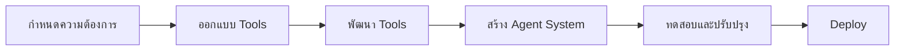

# Function Calling


Function calling เป็นความสามารถที่ทำให้โมเดล AI สามารถเรียกใช้ฟังก์ชันภายนอกได้อย่างถูกต้อง โดยสร้าง JSON ที่มีโครงสร้างเหมาะสม ช่วยให้ AI สามารถทำงานร่วมกับระบบอื่นๆ ได้อย่างมีประสิทธิภาพ

## Function Calling กับ OpenAI

Function calling ใน OpenAI API ช่วยให้เราสามารถกำหนดฟังก์ชันที่ต้องการให้โมเดลเรียกใช้ โดยระบุพารามิเตอร์ที่จำเป็น โมเดลจะวิเคราะห์คำขอของผู้ใช้และส่งคืนข้อมูลในรูปแบบ JSON ที่พร้อมสำหรับการเรียกใช้ฟังก์ชันนั้น

```python
import openai

# กำหนดฟังก์ชันที่ต้องการให้ AI รู้จัก
functions = [
    {
        "name": "get_weather",
        "description": "รับข้อมูลสภาพอากาศจากเมืองที่ระบุ",
        "parameters": {
            "type": "object",
            "properties": {
                "location": {
                    "type": "string",
                    "description": "เมืองและประเทศ เช่น Bangkok, Thailand"
                },
                "unit": {
                    "type": "string",
                    "enum": ["celsius", "fahrenheit"],
                    "description": "หน่วยอุณหภูมิ"
                }
            },
            "required": ["location"]
        }
    }
]

# สร้าง completion ที่มีการเรียกใช้ฟังก์ชัน
response = openai.ChatCompletion.create(
    model="gpt-4",
    messages=[
        {"role": "user", "content": "อยากรู้ว่าอากาศในกรุงเทพเป็นอย่างไรบ้าง"}
    ],
    functions=functions,
    function_call="auto"
)

print(response.choices[0].message)
```

> **Key Takeaway**: Function calling ใน OpenAI ช่วยให้เราสร้างแอปพลิเคชันที่ AI สามารถโต้ตอบกับ API และบริการภายนอกได้ โดยแปลงคำขอในภาษาธรรมชาติเป็นการเรียกฟังก์ชันที่เหมาะสม

## ReAct with LangChain

ReAct (Reasoning + Acting) เป็นเทคนิคที่ช่วยให้ LLM สามารถคิดและลงมือทำได้อย่างเป็นขั้นตอน โดย LangChain ได้นำแนวคิดนี้มาพัฒนาเป็นเฟรมเวิร์กที่ช่วยให้เราสร้างระบบที่มีความสามารถในการใช้เหตุผลและดำเนินการตามลำดับได้

```python
from langchain.agents import initialize_agent, Tool
from langchain.agents import AgentType
from langchain.llms import OpenAI

# กำหนด tools ที่ agent สามารถใช้ได้
tools = [
    Tool(
        name="Search",
        func=lambda x: "Result from searching the web for: " + x,
        description="Useful for searching information from the internet"
    ),
    Tool(
        name="Calculator",
        func=lambda x: eval(x),
        description="Useful for doing math calculations"
    )
]

# สร้าง agent ที่มีความสามารถใช้ tools
agent = initialize_agent(
    tools,
    OpenAI(temperature=0),
    agent=AgentType.ZERO_SHOT_REACT_DESCRIPTION,
    verbose=True
)

# ทดสอบ agent
agent.run("คำนวณผลบวกของ 15 และ 27 แล้วคูณด้วย 2")
```

ReAct Framework ทำให้โมเดลสามารถแสดงขั้นตอนการคิดก่อนตัดสินใจเรียกใช้เครื่องมือหรือให้คำตอบ:



> **Key Takeaway**: ReAct framework ใน LangChain ช่วยให้ AI สามารถคิดอย่างเป็นลำดับขั้นตอน ตัดสินใจเลือกเครื่องมือที่เหมาะสม และดำเนินการเพื่อแก้ปัญหาที่ซับซ้อนได้อย่างมีประสิทธิภาพ

## การพัฒนา Tool-Augmented LLM Application

Tool-Augmented LLM คือการเพิ่มขีดความสามารถให้กับ LLM ด้วยเครื่องมือหรือฟังก์ชันต่างๆ ทำให้โมเดลสามารถทำงานที่หลากหลายได้ นอกเหนือจากการตอบคำถามหรือสร้างข้อความ


ตัวอย่าง tools ที่สามารถเพิ่มให้กับ LLM:

- **Web Search**: ค้นหาข้อมูลจากอินเทอร์เน็ต
- **Database Query**: สืบค้นข้อมูลจากฐานข้อมูล
- **Calculator**: คำนวณทางคณิตศาสตร์
- **API Calls**: เรียกใช้บริการจาก API ภายนอก
- **File Operations**: อ่านหรือเขียนข้อมูลลงไฟล์

### ขั้นตอนการพัฒนา Tool-Augmented LLM Application



ตัวอย่าง Tool-Augmented LLM ที่สามารถช่วยในการวางแผนการเดินทาง:

```python
from langchain.agents import Tool, AgentExecutor
from langchain.memory import ConversationBufferMemory

# สร้าง tools สำหรับวางแผนการเดินทาง
tools = [
    Tool(
        name="FlightSearch",
        func=search_flights,
        description="ค้นหาเที่ยวบินระหว่างสองเมือง"
    ),
    Tool(
        name="HotelBooking",
        func=search_hotels,
        description="ค้นหาโรงแรมในเมืองปลายทาง"
    ),
    Tool(
        name="AttractionSearch",
        func=search_attractions,
        description="ค้นหาสถานที่ท่องเที่ยวในเมืองที่กำหนด"
    ),
    Tool(
        name="WeatherForecast",
        func=get_weather,
        description="ตรวจสอบพยากรณ์อากาศสำหรับเมืองและวันที่ที่กำหนด"
    )
]

# สร้าง agent ที่มี memory เพื่อจำบทสนทนา
memory = ConversationBufferMemory(memory_key="chat_history")
agent = initialize_agent(
    tools,
    OpenAI(temperature=0.2),
    agent=AgentType.CONVERSATIONAL_REACT_DESCRIPTION,
    memory=memory,
    verbose=True
)

# ใช้งาน agent ในการวางแผนการเดินทาง
agent.run("ช่วยวางแผนการเดินทางไปโตเกียวช่วงเดือนเมษายนให้หน่อย อยากไปเที่ยว 5 วัน")
```

> **Key Takeaway**: Tool-Augmented LLM Applications ช่วยขยายขีดความสามารถของ AI ด้วยการเชื่อมต่อกับเครื่องมือภายนอก ทำให้สามารถแก้ปัญหาที่ซับซ้อนและให้บริการที่ครบวงจรแก่ผู้ใช้งานได้

## สรุป

Function Calling เป็นความสามารถสำคัญที่ทำให้ LLM ก้าวข้ามขีดจำกัดของการเป็นเพียงโมเดลที่สร้างข้อความ (text generation) ไปสู่การเป็นระบบที่สามารถโต้ตอบกับโลกภายนอกได้ ไม่ว่าจะเป็นการเรียกใช้ API การคิดวิเคราะห์ที่ซับซ้อน หรือการทำงานร่วมกับระบบอื่นๆ

เทคโนโลยีนี้นำไปสู่การพัฒนาแอปพลิเคชันที่ชาญฉลาดมากขึ้น สามารถแก้ปัญหาที่ซับซ้อนและให้บริการแบบครบวงจรแก่ผู้ใช้งานได้ โดยผสมผสานความสามารถในการเข้าใจภาษาธรรมชาติของ LLM เข้ากับความสามารถในการเรียกใช้เครื่องมือภายนอกที่มีประสิทธิภาพ

## แหล่งข้อมูลเพิ่มเติม

- [OpenAI Function Calling API Documentation](https://platform.openai.com/docs/guides/function-calling)
- [LangChain Documentation](https://python.langchain.com/docs/modules/agents/)
- [ReAct Paper: Reasoning and Acting in Language Models](https://arxiv.org/abs/2210.03629)
- [Tool Learning in LLMs](https://www.google.com/search?q=tool+learning+in+large+language+models)

---

## RACKSYNC CO., LTD.

[RACKSYNC](https://github.com/racksync) เป็นบริษัทที่มีความเชี่ยวชาญในการพัฒนาโซลูชั่นด้าน IoT และระบบอัตโนมัติ เรามุ่งมั่นในการสร้างเทคโนโลยีที่เชื่อมต่อโลกเข้าด้วยกันผ่านระบบ IoT ที่มีประสิทธิภาพและเสถียร

### บริการของเรา
- การออกแบบและพัฒนาระบบ IoT แบบครบวงจร
- โซลูชั่นเชื่อมต่อสำหรับอุตสาหกรรม 4.0
- ระบบอัตโนมัติสำหรับบ้านและอาคารอัจฉริยะ
- การฝึกอบรมและเวิร์คช็อปด้าน IoT

## ติดต่อเรา
- **โทร**: 08 5880 8885
- **อีเมล**: info@racksync.com
- **เว็บไซต์**: https://racksync.com
- **Facebook**: https://www.facebook.com/racksync

© 2007-2025 RACKSYNC CO., LTD. All rights reserved.
