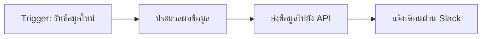

# n8n Automation


n8n คือแพลตฟอร์ม Low-code ที่ช่วยให้สามารถสร้าง Workflow Automation ได้อย่างง่ายดายโดยไม่ต้องเขียนโค้ดมาก เหมาะสำหรับการเชื่อมต่อบริการต่าง ๆ เช่น API, Database, Email, Webhook และอื่น ๆ เข้าด้วยกันแบบอัตโนมัติ

## n8n คืออะไร

n8n (ย่อมาจาก "nodemation") เป็นเครื่องมือ Open Source ที่ช่วยให้ผู้ใช้สามารถสร้างกระบวนการอัตโนมัติ (Workflow) ได้ด้วยการลากและวาง (Drag & Drop) node ต่าง ๆ บน UI ที่ใช้งานง่าย สามารถเชื่อมต่อกับบริการมากกว่า 200+ ตัวอย่างเช่น Google Sheets, Slack, Discord, Telegram, HTTP Request, MySQL, PostgreSQL ฯลฯ

## ตัวอย่างการทำงานของ n8n



## ประโยชน์ของ n8n

- ลดเวลาการพัฒนา Automation
- ไม่จำเป็นต้องมีทักษะการเขียนโค้ดสูง
- รองรับการเชื่อมต่อกับบริการหลากหลาย
- สามารถขยายความสามารถด้วย Custom Node หรือ Script
- เหมาะกับการสร้าง Workflow ที่ซับซ้อนได้

## ตัวอย่าง Use Case

- แจ้งเตือนอัตโนมัติเมื่อมีอีเมลใหม่
- ดึงข้อมูลจาก Google Sheets แล้วส่งเข้า Database
- เชื่อมต่อกับ Webhook เพื่อรับข้อมูลจาก IoT Device
- สร้าง Approval Workflow สำหรับเอกสาร

## การติดตั้งและเริ่มต้นใช้งาน

สามารถติดตั้ง n8n ได้หลายวิธี เช่น Docker, npm, หรือ Cloud Service

ตัวอย่างการติดตั้งด้วย Docker:

```bash
docker run -it --rm \
  -p 5678:5678 \
  -v ~/.n8n:/home/node/.n8n \
  n8nio/n8n
```

หลังจากติดตั้งแล้ว สามารถเข้าใช้งานผ่านเบราว์เซอร์ที่ http://localhost:5678

> **Key Takeaway**: n8n ช่วยให้การสร้าง Workflow Automation เป็นเรื่องง่ายและรวดเร็ว ลดภาระงานซ้ำซ้อน และสามารถเชื่อมต่อกับบริการต่าง ๆ ได้อย่างยืดหยุ่น

## สรุป

n8n เป็นเครื่องมือ Low-code ที่เหมาะสำหรับการสร้าง Automation Workflow ในองค์กรหรือโปรเจกต์ส่วนตัว สามารถเชื่อมต่อกับบริการต่าง ๆ ได้หลากหลาย ช่วยลดเวลาและต้นทุนในการพัฒนา

## แหล่งข้อมูลเพิ่มเติม

- [n8n Documentation](https://docs.n8n.io/)
- [n8n Community](https://community.n8n.io/)
- [n8n Examples](https://n8n.io/workflows)
- [Google Image Search: n8n workflow](https://www.google.com/search?q=n8n+workflow+automation&tbm=isch)

---

## RACKSYNC CO., LTD.

[RACKSYNC](https://github.com/racksync) เป็นบริษัทที่มีความเชี่ยวชาญในการพัฒนาโซลูชั่นด้าน IoT และระบบอัตโนมัติ เรามุ่งมั่นในการสร้างเทคโนโลยีที่เชื่อมต่อโลกเข้าด้วยกันผ่านระบบ IoT ที่มีประสิทธิภาพและเสถียร

### บริการของเรา

- การออกแบบและพัฒนาระบบ IoT แบบครบวงจร
- โซลูชั่นเชื่อมต่อสำหรับอุตสาหกรรม 4.0
- ระบบอัตโนมัติสำหรับบ้านและอาคารอัจฉริยะ
- การฝึกอบรมและเวิร์คช็อปด้าน IoT

- **โทร**: 08 5880 8885
- **อีเมล**: info@racksync.com
- **เว็บไซต์**: https://racksync.com
- **Facebook**: https://www.facebook.com/racksync

© 2007-2025 RACKSYNC CO., LTD. All rights reserved.
