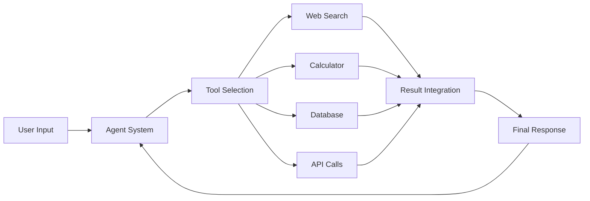
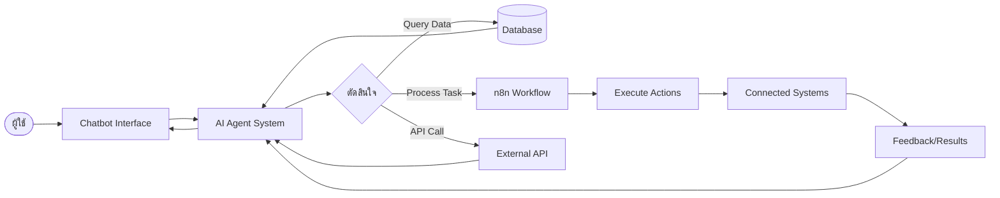

# Session 7: AI Agentic (Agent)

## แนวคิด Agentic AI

Agentic AI คือแนวคิดการสร้างระบบ AI ที่สามารถดำเนินการหรือ "ตัดสินใจ" ได้เองโดยอัตโนมัติ ทำงานในลักษณะของ "ตัวแทน" (Agent) ที่มีความสามารถในการรับข้อมูล วิเคราะห์ ตัดสินใจ และลงมือทำงานต่างๆ เพื่อบรรลุเป้าหมายที่กำหนดไว้

Agent ทำงานผ่านการผสมผสานความสามารถของ LLMs กับการเชื่อมต่อไปยังเครื่องมือภายนอก (Tools) ทำให้สามารถโต้ตอบกับโลกภายนอกและระบบต่างๆ ได้อย่างยืดหยุ่น

คุณสมบัติสำคัญของ AI Agent:
- มีความสามารถในการตัดสินใจว่าควรใช้เครื่องมือใด
- สามารถวางแผนขั้นตอนการทำงานด้วยตัวเอง
- สามารถเรียนรู้และปรับตัวจากประสบการณ์
- ทำงานแบบอิสระโดยมีการตรวจสอบจากมนุษย์เมื่อจำเป็น

**[ค้นหารูปภาพ: AI Agent workflow architecture](https://www.google.com/search?q=AI+Agent+workflow+architecture&tbm=isch)**

## ตัวอย่างเครื่องมือ/Framework สำหรับสร้าง Agent

การพัฒนา AI Agent สามารถทำได้ผ่าน Framework ที่หลากหลาย ซึ่งช่วยให้การพัฒนาเป็นไปอย่างมีประสิทธิภาพ:

### LangChain Agents
LangChain เป็น Framework ยอดนิยมสำหรับพัฒนา AI Agent โดยมีองค์ประกอบหลัก:
- Tools: เป็นฟังก์ชันหรือ API ที่ Agent สามารถเรียกใช้งานได้
- Toolkits: เซ็ทของ Tools ที่ออกแบบมาเพื่อการทำงานเฉพาะด้าน
- Agent Executor: ส่วนที่จัดการลำดับการทำงานและการตัดสินใจ

### AutoGen
Framework จาก Microsoft ที่เน้นการสร้าง Multi-Agent Conversation โดย:
- รองรับการทำงานแบบ Collaborative กับหลาย Agent
- มีความสามารถในการตั้งค่า Persona และบทบาทที่หลากหลาย
- สร้างการสนทนาระหว่าง Agent เพื่อแก้ไขปัญหาที่ซับซ้อน

### CrewAI
Framework ที่มุ่งเน้นการสร้าง Agent แบบทีมงานที่มีบทบาทเฉพาะ:
- กำหนดบทบาทเฉพาะให้แต่ละ Agent
- ออกแบบ Workflow การทำงานร่วมกันระหว่าง Agent
- เหมาะกับงานที่ต้องการความเชี่ยวชาญหลากหลายด้านมาทำงานร่วมกัน

**[ค้นหารูปภาพ: AI Agent frameworks comparison](https://www.google.com/search?q=AI+Agent+frameworks+comparison&tbm=isch)**

## Use Cases: Chatbot ที่ทำงานอัตโนมัติ, สั่งการระบบอื่นๆ

Agent สามารถนำไปประยุกต์ใช้ได้หลากหลายรูปแบบ:

### Customer Service Agent
- ตอบคำถามลูกค้าโดยดึงข้อมูลจาก Knowledge Base
- ดำเนินการแก้ไขปัญหาเบื้องต้น เช่น รีเซ็ตรหัสผ่าน ตรวจสอบสถานะคำสั่งซื้อ
- สร้างคำร้องในระบบ CRM เมื่อไม่สามารถแก้ไขปัญหาได้เอง

### Data Analysis Agent
- วิเคราะห์ข้อมูลจากหลายแหล่งตามความต้องการของผู้ใช้
- สร้างรายงานและกราฟโดยอัตโนมัติ
- แจ้งเตือนเมื่อพบความผิดปกติในข้อมูล

### IoT Management Agent
- ตรวจสอบสถานะอุปกรณ์ IoT และแจ้งเตือนเมื่อพบปัญหา
- ปรับการตั้งค่าอุปกรณ์ตามคำสั่งของผู้ใช้หรือตามสภาพแวดล้อม
- ประมวลผลข้อมูลจากเซ็นเซอร์เพื่อสร้าง Insights

**[ค้นหารูปภาพ: AI Agent use cases for IoT](https://www.google.com/search?q=AI+Agent+use+cases+for+IoT&tbm=isch)**

## การเชื่อมต่อ Agent กับ Automation เพื่อทำงานแบบ End-to-End

การผสมผสาน AI Agent กับเครื่องมือ Automation เช่น n8n ช่วยสร้างระบบอัตโนมัติแบบครบวงจรที่ชาญฉลาด:

### แนวทางการพัฒนา
1. ใช้ AI Agent เป็นส่วน "สมอง" ของระบบที่ตัดสินใจว่าควรทำอะไร
2. ใช้ n8n เป็นส่วน "กล้ามเนื้อ" ที่ดำเนินการตามที่ Agent ตัดสินใจ

### ตัวอย่างการทำงานร่วมกัน
- Agent วิเคราะห์อีเมลขอความช่วยเหลือแล้วสั่งให้ n8n สร้าง Ticket ในระบบ Support
- Agent ตรวจสอบข้อมูลจาก Dashboard แล้วสั่งให้ n8n ปรับการตั้งค่าระบบ
- Agent รับคำสั่งจาก Chatbot แล้วใช้ n8n ทำงานกับหลายระบบพร้อมกัน

### ประโยชน์ของการเชื่อมต่อ Agent กับ Automation
- ลดความซับซ้อนในการพัฒนาระบบอัตโนมัติที่ต้องการความชาญฉลาด
- เพิ่มความยืดหยุ่นในการปรับตัวและตอบสนองต่อสถานการณ์ที่หลากหลาย
- สร้างระบบที่ทั้งอัตโนมัติและมีความสามารถในการเรียนรู้

**[ค้นหารูปภาพ: n8n AI Agent integration](https://www.google.com/search?q=n8n+AI+Agent+integration&tbm=isch)**

## Key Takeaway:
> Agentic AI เปลี่ยนโฉมหน้าระบบอัตโนมัติจากแบบดั้งเดิมที่ต้องกำหนดทุกขั้นตอนไว้ล่วงหน้า มาเป็นระบบที่สามารถคิด วิเคราะห์ และตัดสินใจได้เองอย่างยืดหยุ่น การผสานเทคโนโลยี Agent กับระบบ Automation ช่วยให้องค์กรสามารถพัฒนาโซลูชันที่ทั้งชาญฉลาดและทำงานได้อย่างมีประสิทธิภาพในสภาพแวดล้อมที่ซับซ้อน

## สรุป

Agentic AI นำเสนอแนวทางใหม่ในการพัฒนาระบบอัตโนมัติที่มีความชาญฉลาดและยืดหยุ่น โดยอาศัยความสามารถของ LLMs ผสานกับเครื่องมือและ API ภายนอก ทำให้สามารถสร้างระบบที่ตัดสินใจได้เองและทำงานร่วมกับระบบอื่นๆ ได้อย่างมีประสิทธิภาพ

การพัฒนา Agent ไม่ใช่เพียงการสร้าง AI ที่ตอบคำถามได้เท่านั้น แต่เป็นการสร้างระบบที่สามารถดำเนินการและแก้ไขปัญหาได้จริงในโลกธุรกิจ ไม่ว่าจะเป็นงานด้านบริการลูกค้า การวิเคราะห์ข้อมูล หรือการจัดการระบบ IoT

เมื่อผสานเทคโนโลยี Agent กับเครื่องมือ Automation เช่น n8n จะยิ่งเพิ่มศักยภาพให้ระบบสามารถทำงานแบบ End-to-End ได้อย่างสมบูรณ์ นับเป็นอนาคตของระบบอัตโนมัติยุคใหม่ที่น่าจับตามอง

## แหล่งข้อมูลเพิ่มเติม

- [LangChain Agents Documentation](https://python.langchain.com/docs/modules/agents/)
- [Microsoft AutoGen GitHub](https://github.com/microsoft/autogen)
- [CrewAI Documentation](https://docs.crewai.com/)
- [OpenAI Function Calling](https://platform.openai.com/docs/guides/function-calling)
- [n8n AI Automation Guide](https://n8n.io/blog/ai-automation-n8n/)
- [Haystack Agents Tutorial](https://haystack.deepset.ai/tutorials/32_using_agents)

---

## เกี่ยวกับบริษัท

[RACKSYNC](https://github.com/racksync) เป็นบริษัทที่มีความเชี่ยวชาญในการพัฒนาโซลูชั่นด้าน IoT และระบบอัตโนมัติ เรามุ่งมั่นในการสร้างเทคโนโลยีที่เชื่อมต่อโลกเข้าด้วยกันผ่านระบบ IoT ที่มีประสิทธิภาพและเสถียร

### บริการของเรา

- การออกแบบและพัฒนาระบบ IoT แบบครบวงจร
- โซลูชั่นเชื่อมต่อสำหรับอุตสาหกรรม 4.0
- ระบบอัตโนมัติสำหรับบ้านและอาคารอัจฉริยะ
- การฝึกอบรมและเวิร์คช็อปด้าน IoT

- **โทร**: 08 5880 8885
- **อีเมล**: info@racksync.com
- **เว็บไซต์**: https://racksync.com
- **Facebook**: https://www.facebook.com/racksync

© 2007-2025 RACKSYNC CO., LTD. All rights reserved.
