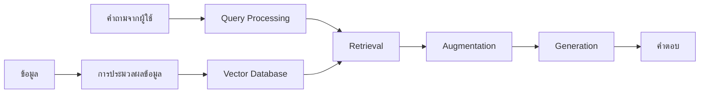
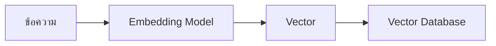
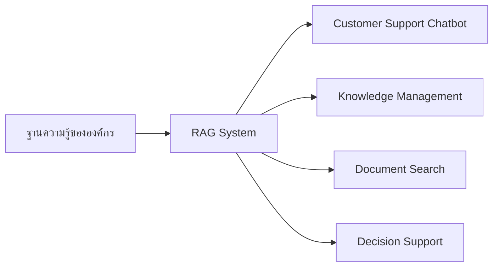

# RAG (Retrieval-Augmented Generation)

RAG เป็นเทคนิคที่ช่วยให้ LLMs สามารถเข้าถึงข้อมูลภายนอกได้ ทำให้แบบจำลองสามารถตอบคำถามโดยใช้ข้อมูลที่เป็นปัจจุบันและมีความน่าเชื่อถือมากขึ้น

## ทำไมต้อง RAG?

LLMs มีข้อจำกัดหลายประการในการตอบคำถามที่ต้องการข้อมูลเฉพาะ:
- มีความรู้จำกัดถึง cut-off date ของข้อมูลที่ใช้เทรน
- ไม่สามารถเข้าถึงข้อมูลเฉพาะขององค์กรหรือข้อมูลส่วนตัวได้
- อาจให้ข้อมูลที่ไม่ถูกต้องหรือ "hallucination"

RAG แก้ปัญหาเหล่านี้โดย:
- ดึงข้อมูลที่เกี่ยวข้องจากแหล่งภายนอกมาเสริมความสามารถ
- อ้างอิงแหล่งที่มาของข้อมูลได้ชัดเจน
- ลดโอกาสเกิด hallucination จากการมีข้อมูลอ้างอิงที่แม่นยำ

## หลักการทำงานของ RAG

## กระบวนการทำงานหลัก

### การเตรียมข้อมูล
- **Document Loading**: นำเข้าเอกสารจากหลายแหล่ง เช่น PDF, Website, Database
- **Text Splitting/Chunking**: แบ่งเอกสารเป็นชิ้นเล็กๆ เพื่อประสิทธิภาพในการค้นหา
- **Embedding**: แปลงข้อความเป็น vector เพื่อการค้นหาเชิงความหมาย
- **Vector Storage**: จัดเก็บ vector ในฐานข้อมูลพร้อมค้นหา

### กระบวนการตอบคำถาม
- **ผู้ใช้ตั้งคำถาม** → แปลงคำถามเป็น vector
- **ค้นหาเอกสารที่เกี่ยวข้อง** จาก vector database
- **เพิ่มเติมคำถาม** ด้วยข้อมูลที่ได้มา (augmentation)
- **LLM สร้างคำตอบ** โดยอ้างอิงจากข้อมูลที่ได้รับ

## Workshop: การใช้ Website เป็น Data Source

### ขั้นตอน
1. **การ Crawling และ Scraping**: ดึงข้อมูลจาก website ด้วย tools เช่น Scrapy, BeautifulSoup
2. **การทำความสะอาดข้อมูล**: กำจัด HTML tags และจัดรูปแบบข้อมูล
3. **การแบ่งข้อมูล**: ใช้เทคนิค chunking เพื่อแบ่งข้อมูลเป็นส่วนๆ
4. **การสร้าง Embedding**: แปลงข้อมูลเป็น vectors ด้วย models เช่น OpenAI's text-embedding-ada-002
5. **การจัดเก็บใน Vector Database**: บันทึกลงใน Chroma หรือ database อื่นๆ

## Processing: เทคนิคสำคัญ

### Chunking Strategies

- **Fixed Size Chunks**: แบ่งตามจำนวนตัวอักษรหรือ tokens
- **Semantic Chunks**: แบ่งตามความหมายของเนื้อหา (เช่น ย่อหน้า หัวข้อ)
- **Recursive Chunks**: แบ่งซ้ำๆ ตามโครงสร้างเอกสาร
- **Sliding Window**: ใช้เทคนิค overlap เพื่อไม่ให้ข้อมูลขาดความต่อเนื่อง

### Embedding Models

- **OpenAI Embeddings**: text-embedding-ada-002
- **Sentence Transformers**: all-MiniLM-L6-v2
- **HuggingFace Models**: BERT, RoBERTa

### Vector Database: Chroma

Chroma เป็น vector database ที่เหมาะสำหรับใช้ใน RAG systems เนื่องจาก:
- เปิดให้ใช้ฟรีและเป็น open source
- ติดตั้งและใช้งานง่าย
- รองรับการทำ semantic search ได้อย่างมีประสิทธิภาพ
- มี Python API ที่ทำงานร่วมกับ LangChain ได้ดี

## Similarity Search และ Re-ranking

### ประเภทของการค้นหา
- **Cosine Similarity**: วัดมุมระหว่าง vectors (ค่าใกล้ 1 = คล้ายกันมาก)
- **Euclidean Distance**: วัดระยะทางระหว่าง vectors ในพื้นที่
- **Dot Product**: คูณ vectors เข้าด้วยกัน (ค่าสูง = คล้ายกันมาก)

### Re-ranking
การจัดอันดับผลลัพธ์ใหม่เพื่อเพิ่มความแม่นยำ:
- **Cross-Encoder Models**: ประเมินความเกี่ยวข้องระหว่างคำถามและเอกสาร
- **Reciprocal Rank Fusion**: รวมผลการจัดอันดับจากหลายวิธี
- **Hybrid Search**: ผสมผสานระหว่าง semantic และ keyword search

## การประยุกต์ใช้ RAG ในองค์กร

### Use Cases ที่น่าสนใจ
- **Virtual Assistants**: ผู้ช่วยเสมือนที่สามารถตอบคำถามจากฐานความรู้ขององค์กร
- **Customer Support**: แชทบอทที่ตอบคำถามลูกค้าได้อย่างแม่นยำ
- **Legal Document Analysis**: การวิเคราะห์เอกสารกฎหมายและสัญญา
- **Research Assistant**: ช่วยค้นหาและสรุปข้อมูลงานวิจัย
- **Internal Knowledge Base**: ระบบค้นหาความรู้ภายในองค์กร

## Key Takeaways

> RAG เป็นเทคนิคที่ช่วยให้ LLMs ตอบคำถามได้อย่างแม่นยำและน่าเชื่อถือมากขึ้น โดยอ้างอิงข้อมูลจากแหล่งภายนอก

> กระบวนการหลักของ RAG คือ: Loading, Chunking, Embedding, Storing, Retrieving, Augmenting และ Generating

> การเลือกกลยุทธ์ในการทำ chunking และ embedding ที่เหมาะสมมีผลอย่างมากต่อประสิทธิภาพของ RAG

> Vector Databases อย่าง Chroma ช่วยให้การค้นหาข้อมูลที่เกี่ยวข้องเชิงความหมายทำได้อย่างมีประสิทธิภาพ

> การใช้ RAG สามารถแก้ปัญหา hallucination และช่วยเพิ่มความน่าเชื่อถือให้กับ AI systems

## สรุป
RAG เป็นเทคนิคที่ช่วยเปลี่ยนโฉม LLMs จากแบบจำลองที่มีความรู้จำกัดให้กลายเป็นระบบที่สามารถเข้าถึงและใช้ข้อมูลจากแหล่งภายนอกได้ ช่วยให้การตอบคำถามมีความแม่นยำ น่าเชื่อถือ และมีแหล่งอ้างอิงที่ชัดเจน ความสำเร็จในการพัฒนาระบบ RAG ขึ้นอยู่กับการเลือกใช้เทคนิคและเครื่องมือที่เหมาะสมในแต่ละขั้นตอน ตั้งแต่การเตรียมข้อมูล ไปจนถึงการค้นหาและสร้างคำตอบ

## แหล่งข้อมูลเพิ่มเติม
- [LangChain RAG Documentation](https://python.langchain.com/docs/use_cases/question_answering/)
- [Chroma Vector Database](https://www.trychroma.com/)
- [Hugging Face Embeddings](https://huggingface.co/models?pipeline_tag=feature-extraction)
- [OpenAI Cookbook: RAG Examples](https://cookbook.openai.com/)
- [LlamaIndex Documentation](https://docs.llamaindex.ai/)

---

## RACKSYNC CO., LTD.

[RACKSYNC](https://github.com/racksync) เป็นบริษัทที่มีความเชี่ยวชาญในการพัฒนาโซลูชั่นด้าน IoT และระบบอัตโนมัติ เรามุ่งมั่นในการสร้างเทคโนโลยีที่เชื่อมต่อโลกเข้าด้วยกันผ่านระบบ IoT ที่มีประสิทธิภาพและเสถียร

### บริการของเรา
- การออกแบบและพัฒนาระบบ IoT แบบครบวงจร
- โซลูชั่นเชื่อมต่อสำหรับอุตสาหกรรม 4.0
- ระบบอัตโนมัติสำหรับบ้านและอาคารอัจฉริยะ
- การฝึกอบรมและเวิร์คช็อปด้าน IoT

- **โทร**: 08 5880 8885
- **อีเมล**: info@racksync.com
- **เว็บไซต์**: https://racksync.com
- **Facebook**: https://www.facebook.com/racksync

© 2007-2025 RACKSYNC CO., LTD. All rights reserved.
