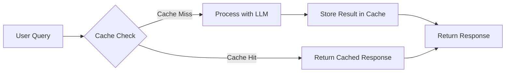
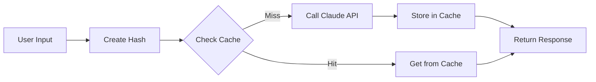
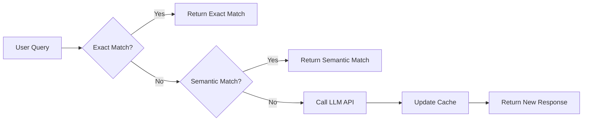

# Advanced Augmentation Methods


## Cache-Augmented Generation (CAG)

Cache-Augmented Generation เป็นวิธีการที่ช่วยเพิ่มประสิทธิภาพของ AI โดยการจัดเก็บข้อมูลและผลลัพธ์ที่เคยประมวลผลแล้วไว้ในระบบ cache เพื่อให้สามารถเรียกใช้ได้อย่างรวดเร็วในครั้งต่อไป แทนที่จะต้องประมวลผลใหม่ทุกครั้ง ซึ่งช่วยลดทั้งเวลาและค่าใช้จ่ายในการเรียกใช้งาน API ของ LLM



### ประโยชน์ของ CAG

CAG มีประโยชน์หลายประการในการพัฒนาแอปพลิเคชันที่ใช้ LLM:

- **ประหยัดต้นทุน**: ลดจำนวนการเรียกใช้ API ที่มีค่าใช้จ่าย
- **เพิ่มความเร็ว**: การดึงข้อมูลจาก cache เร็วกว่าการรอผลลัพธ์จาก API มาก
- **ลดความเสี่ยงจาก Rate Limiting**: หลีกเลี่ยงข้อจำกัดในการเรียกใช้ API
- **ความสม่ำเสมอของคำตอบ**: รับประกันว่าคำถามเดิมจะได้คำตอบที่เหมือนเดิมเสมอ

## Context/Prompt Caching

การทำ Context และ Prompt Caching เป็นเทคนิคที่มีประสิทธิภาพสูงสำหรับการลดการใช้ทรัพยากรในการเรียกใช้ LLM APIs โดยเฉพาะกับผู้ให้บริการเช่น OpenAI และ Anthropic


### การใช้ Context Caching กับ OpenAI

```javascript
// ตัวอย่างการทำ Context Caching กับ OpenAI API
const crypto = require('crypto');
const cache = new Map();

async function getCompletionWithCache(prompt, options = {}) {
  // สร้าง cache key จาก prompt และ options
  const key = createCacheKey(prompt, options);
  
  // ตรวจสอบว่ามีใน cache หรือไม่
  if (cache.has(key)) {
    console.log("Cache hit! Using cached response");
    return cache.get(key);
  }
  
  // ถ้าไม่มีใน cache ให้เรียก API
  console.log("Cache miss. Calling OpenAI API...");
  const response = await openai.createCompletion({
    model: options.model || "text-davinci-003",
    prompt,
    max_tokens: options.maxTokens || 100
  });
  
  // เก็บผลลัพธ์ใน cache
  cache.set(key, response.data);
  return response.data;
}

function createCacheKey(prompt, options) {
  const data = JSON.stringify({ prompt, options });
  return crypto.createHash('md5').update(data).digest('hex');
}
```

### การทำ Caching กับ Anthropic

Anthropic Claude API ก็สามารถใช้เทคนิคการ caching ในลักษณะเดียวกันได้ โดยใช้ key ที่สร้างจากทั้ง prompt และ system parameters:



## Response/Semantic Caching

Semantic Caching เป็นเทคนิคขั้นสูงที่ไม่เพียงจับคู่ prompts ที่เหมือนกันเท่านั้น แต่ยังสามารถจับคู่ prompts ที่มีความหมายคล้ายกันได้ด้วย โดยใช้เทคโนโลยี embedding เพื่อเปรียบเทียบความใกล้เคียงของ prompts


### วิธีการทำ Semantic Caching

1. **สร้าง Embedding** ของคำถามหรือ prompt
2. **จัดเก็บใน Vector Database** เช่น Pinecone, Weaviate หรือ Chroma
3. **ค้นหาด้วย Similarity Search** เมื่อมี prompt ใหม่
4. **ใช้ค่า Threshold** เพื่อตัดสินใจว่าควรใช้ผลลัพธ์จาก cache หรือเรียก API ใหม่

```python
# ตัวอย่างการทำ Semantic Caching ด้วย Python
import numpy as np
from openai import OpenAI
import faiss

# สร้าง client
client = OpenAI(api_key="your-api-key")

# สร้าง vector index
dimension = 1536  # ขนาด embedding
index = faiss.IndexFlatL2(dimension)
prompts = []
responses = []

def get_embedding(text):
    response = client.embeddings.create(
        model="text-embedding-ada-002",
        input=text
    )
    return response.data[0].embedding

def semantic_cache_lookup(prompt, threshold=0.92):
    if index.ntotal == 0:
        return None
    
    # สร้าง embedding
    query_embedding = get_embedding(prompt)
    
    # ค้นหา similarity
    D, I = index.search(np.array([query_embedding], dtype=np.float32), 1)
    
    # ถ้ามีความคล้ายกันมากกว่า threshold
    if D[0][0] < threshold:
        return responses[I[0][0]]
    return None

def add_to_cache(prompt, response):
    embedding = get_embedding(prompt)
    index.add(np.array([embedding], dtype=np.float32))
    prompts.append(prompt)
    responses.append(response)
```

## ระบบ Hybrid Caching

การผสมผสานระหว่าง Exact Match Caching และ Semantic Caching สามารถให้ประสิทธิภาพที่ดีที่สุด:



### TTL (Time-To-Live) และการจัดการ Cache

การกำหนด TTL ให้กับ cache entries มีความสำคัญเพื่อให้ข้อมูลไม่ล้าสมัย:

```javascript
// ตัวอย่างการทำ TTL Caching
class LLMCache {
  constructor(ttlMilliseconds = 3600000) { // default 1 hour
    this.cache = new Map();
    this.ttl = ttlMilliseconds;
  }

  get(key) {
    if (!this.cache.has(key)) return null;
    
    const entry = this.cache.get(key);
    const now = Date.now();
    
    // ตรวจสอบว่าข้อมูลหมดอายุหรือไม่
    if (now - entry.timestamp > this.ttl) {
      this.cache.delete(key);
      return null;
    }
    
    return entry.value;
  }

  set(key, value) {
    this.cache.set(key, {
      value,
      timestamp: Date.now()
    });
  }
}
```

## Key Takeaway:

> การใช้เทคนิค Cache-Augmented Generation (CAG) สามารถลดต้นทุนและเพิ่มความเร็วในการใช้งาน LLM APIs ได้อย่างมีประสิทธิภาพ

> Semantic Caching ช่วยให้ระบบสามารถตอบคำถามหรือ prompts ที่คล้ายกันได้โดยไม่ต้องเรียก API ซ้ำ ช่วยเพิ่มประสิทธิภาพและลดค่าใช้จ่าย

> การผสมผสานระหว่าง Exact Match Caching และ Semantic Caching ให้ประสิทธิภาพสูงสุดในการจัดการ query cache สำหรับระบบ AI

> การกำหนด TTL (Time-To-Live) มีความสำคัญในการรักษาให้ข้อมูลใน cache มีความทันสมัยและถูกต้อง

## สรุป

เทคนิค Advanced Augmentation Methods โดยเฉพาะอย่างยิ่ง Cache-Augmented Generation (CAG) เป็นวิธีการสำคัญที่ช่วยเพิ่มประสิทธิภาพและลดต้นทุนในการพัฒนาระบบ AI ที่ใช้ LLMs ไม่ว่าจะเป็นการทำ context/prompt caching หรือ semantic caching ล้วนมีประโยชน์ในการพัฒนาแอปพลิเคชันที่ต้องการความเร็ว ประสิทธิภาพ และการประหยัดทรัพยากร

การเลือกใช้เทคนิค caching ที่เหมาะสมขึ้นอยู่กับความต้องการของแอปพลิเคชัน โดยต้องพิจารณาถึงความสมดุลระหว่างความแม่นยำ ความเร็ว และการใช้ทรัพยากร

## แหล่งข้อมูลเพิ่มเติม

- [OpenAI Documentation](https://platform.openai.com/docs/guides/embeddings)
- [Semantic Caching for LLMs](https://www.google.com/search?q=semantic+caching+for+LLMs)
- [Vector Databases Comparison](https://www.google.com/search?q=vector+database+comparison+Pinecone+Weaviate+Chroma)
- [LangChain Caching Documentation](https://python.langchain.com/docs/modules/memory/cache_memory)

---

## RACKSYNC CO., LTD.

[RACKSYNC](https://github.com/racksync) เป็นบริษัทที่มีความเชี่ยวชาญในการพัฒนาโซลูชั่นด้าน IoT และระบบอัตโนมัติ เรามุ่งมั่นในการสร้างเทคโนโลยีที่เชื่อมต่อโลกเข้าด้วยกันผ่านระบบ IoT ที่มีประสิทธิภาพและเสถียร

### บริการของเรา
- การออกแบบและพัฒนาระบบ IoT แบบครบวงจร
- โซลูชั่นเชื่อมต่อสำหรับอุตสาหกรรม 4.0
- ระบบอัตโนมัติสำหรับบ้านและอาคารอัจฉริยะ
- การฝึกอบรมและเวิร์คช็อปด้าน IoT

## ติดต่อเรา
- **โทร**: 08 5880 8885
- **อีเมล**: info@racksync.com
- **เว็บไซต์**: https://racksync.com
- **Facebook**: https://www.facebook.com/racksync

© 2007-2025 RACKSYNC CO., LTD. All rights reserved.
