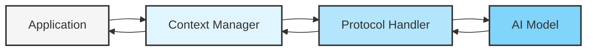
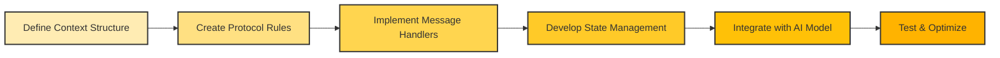

# MCP (Model Context Protocol)


## ทำความเข้าใจ MCP

Model Context Protocol (MCP) เป็นแนวทางที่ช่วยในการจัดการบริบท (Context) ระหว่างคำถามและคำตอบของ AI โดยเฉพาะในระบบ Large Language Models (LLMs) ได้อย่างมีประสิทธิภาพมากขึ้น โดย MCP ช่วยให้แอปพลิเคชันสามารถควบคุมการสื่อสารระหว่างผู้ใช้และโมเดล AI ได้อย่างเป็นระบบ

MCP เป็นส่วนสำคัญในการพัฒนาระบบ AI ที่ต้องการความแม่นยำและคงเส้นคงวาในการตอบสนอง โดยจะช่วยจัดการกับข้อมูลที่ส่งเข้าและออกจากโมเดลในรูปแบบที่มีโครงสร้างชัดเจน

**Key Takeaway:**
> MCP เป็นโปรโตคอลที่ช่วยให้การสื่อสารระหว่างแอปพลิเคชันและโมเดล AI มีประสิทธิภาพมากขึ้น ผ่านการจัดการบริบทที่เป็นระบบ

## การทำงานของ MCP

MCP ทำงานโดยการสร้างโครงสร้างที่ชัดเจนในการส่งข้อมูลระหว่างแอปพลิเคชันและโมเดล โดยมีองค์ประกอบสำคัญ ได้แก่:

1. **Context Management** - การจัดการข้อมูลบริบทที่ส่งให้กับโมเดล
2. **Protocol Rules** - กฎเกณฑ์ที่กำหนดวิธีการสื่อสารระหว่างระบบ
3. **Messaging Format** - รูปแบบของข้อความที่ใช้ในการสื่อสาร
4. **State Management** - การจัดการสถานะของการสนทนาหรือการใช้งาน



**Key Takeaway:**
> MCP สร้างระบบการไหลของข้อมูลที่เป็นระเบียบระหว่างแอปพลิเคชันและโมเดล AI ช่วยให้สามารถควบคุมผลลัพธ์และลดความคลุมเครือในการสื่อสาร

## การประยุกต์ใช้ MCP ในแอปพลิเคชัน

การนำ MCP ไปประยุกต์ใช้ในแอปพลิเคชันช่วยให้สามารถพัฒนาระบบที่มีความยืดหยุ่นและแม่นยำมากขึ้น ตัวอย่างการประยุกต์ใช้มีดังนี้:

### ระบบ Chatbot ที่มีความสามารถเฉพาะทาง

MCP ช่วยให้ Chatbot สามารถเก็บและใช้ข้อมูลบริบทในการสนทนาได้อย่างมีประสิทธิภาพ ทำให้การตอบสนองมีความเฉพาะเจาะจงและสอดคล้องกับประวัติการสนทนามากขึ้น


### ระบบช่วยตัดสินใจอัตโนมัติ

การใช้ MCP ในระบบช่วยตัดสินใจทำให้สามารถจัดการกับข้อมูลที่ซับซ้อนและมีความหลากหลายได้ดียิ่งขึ้น ผ่านการส่งบริบทที่เหมาะสมให้กับโมเดล

### แอปพลิเคชันสร้างเนื้อหาอัตโนมัติ

MCP ช่วยให้แอปพลิเคชันที่สร้างเนื้อหาสามารถควบคุมทิศทางและคุณภาพของเนื้อหาที่สร้างโดย AI ได้อย่างมีประสิทธิภาพ

**Key Takeaway:**
> การประยุกต์ใช้ MCP ช่วยยกระดับประสิทธิภาพของแอปพลิเคชัน AI โดยเพิ่มความสามารถในการควบคุมและปรับแต่งการตอบสนองของโมเดล

## การพัฒนาระบบด้วย MCP - Workshop

การพัฒนาระบบด้วย MCP มีขั้นตอนสำคัญ ดังนี้:

### 1. การออกแบบโครงสร้าง MCP



### 2. การสร้าง Context Manager

Context Manager เป็นส่วนที่จัดการกับข้อมูลที่จะส่งให้กับโมเดล AI โดยมีหน้าที่:
- จัดการประวัติการสนทนา
- คัดกรองข้อมูลที่เกี่ยวข้อง
- จัดรูปแบบข้อมูลให้เหมาะสมกับโมเดล

### 3. การพัฒนา Protocol Handler

Protocol Handler ทำหน้าที่แปลงข้อมูลระหว่างแอปพลิเคชันและโมเดล AI ตามกฎที่กำหนดไว้ในโปรโตคอล ซึ่งจะช่วยให้การสื่อสารมีประสิทธิภาพและเป็นระบบมากขึ้น

**Key Takeaway:**
> การพัฒนาระบบด้วย MCP ต้องคำนึงถึงการออกแบบโครงสร้างของโปรโตคอล การจัดการบริบท และการสร้างตัวจัดการโปรโตคอลที่มีประสิทธิภาพ

## ตัวอย่างการทำงานของ MCP ในโปรเจคจริง

### กรณีศึกษา: ระบบตอบคำถามอัตโนมัติ

ในการพัฒนาระบบตอบคำถามอัตโนมัติ MCP ช่วยให้ระบบสามารถ:
- เก็บประวัติคำถามและคำตอบที่ผ่านมา
- วิเคราะห์บริบทของคำถามปัจจุบัน
- ส่งข้อมูลที่เหมาะสมไปยังโมเดล AI
- รับและประมวลผลคำตอบก่อนแสดงผลให้กับผู้ใช้


### ตัวอย่างโค้ด MCP:

```javascript
class MCPHandler {
  constructor(model) {
    this.model = model;
    this.conversationHistory = [];
    this.contextWindow = 5; // จำนวนข้อความย้อนหลังที่จะส่งเป็น context
  }

  async processQuery(userQuery) {
    // สร้าง context จากประวัติการสนทนา
    const context = this.buildContext();
    
    // สร้างข้อความสำหรับส่งไปยังโมเดล
    const message = {
      role: "user",
      content: userQuery,
      context: context
    };
    
    // ส่งข้อความไปยังโมเดลและรับคำตอบ
    const response = await this.model.generateResponse(message);
    
    // บันทึกการสนทนาลงในประวัติ
    this.conversationHistory.push({ query: userQuery, response: response });
    
    // ตัดประวัติการสนทนาที่เกินความจำเป็น
    this.truncateHistory();
    
    return response;
  }

  buildContext() {
    // สร้างบริบทจากประวัติการสนทนา
    return this.conversationHistory.slice(-this.contextWindow);
  }

  truncateHistory() {
    // รักษาประวัติการสนทนาไม่ให้ยาวเกินไป
    if (this.conversationHistory.length > 20) {
      this.conversationHistory = this.conversationHistory.slice(-15);
    }
  }
}
```

**Key Takeaway:**
> การนำ MCP ไปใช้ในโปรเจคจริงต้องคำนึงถึงการจัดการประวัติการสนทนา การสร้างบริบทที่เหมาะสม และการประมวลผลข้อมูลก่อนและหลังการใช้งานโมเดล AI

## สรุป

Model Context Protocol (MCP) เป็นแนวทางที่ช่วยยกระดับการทำงานของระบบ AI โดยการจัดการบริบทและการสื่อสารระหว่างแอปพลิเคชันและโมเดล AI ได้อย่างมีประสิทธิภาพ การนำ MCP มาใช้ช่วยให้ระบบสามารถให้คำตอบที่แม่นยำและสอดคล้องกับบริบทมากขึ้น ทำให้ประสบการณ์การใช้งาน AI มีความเป็นธรรมชาติและน่าเชื่อถือยิ่งขึ้น

นอกจากนี้ MCP ยังเป็นพื้นฐานสำคัญในการพัฒนาระบบ AI ที่ซับซ้อนและมีความสามารถสูง เช่น ระบบช่วยตัดสินใจ ระบบสร้างเนื้อหา และ Chatbot ที่มีความเฉพาะทาง ผู้พัฒนาที่เข้าใจและนำ MCP มาใช้จะสามารถสร้างโซลูชัน AI ที่มีประสิทธิภาพและตอบโจทย์ความต้องการของผู้ใช้ได้อย่างตรงจุด

## แหล่งข้อมูลเพิ่มเติม

- [OpenAI Documentation on API Protocols](https://platform.openai.com/docs)
- [Hugging Face Documentation](https://huggingface.co/docs)
- [Model Context Management Best Practices](https://www.google.com/search?q=model+context+management+best+practices)
- [Understanding Context Windows in LLMs](https://www.google.com/search?q=understanding+context+windows+in+llms)

## RACKSYNC CO., LTD.

[RACKSYNC](https://github.com/racksync) เป็นบริษัทที่มีความเชี่ยวชาญในการพัฒนาโซลูชั่นด้าน IoT และระบบอัตโนมัติ เรามุ่งมั่นในการสร้างเทคโนโลยีที่เชื่อมต่อโลกเข้าด้วยกันผ่านระบบ IoT ที่มีประสิทธิภาพและเสถียร

### บริการของเรา
- การออกแบบและพัฒนาระบบ IoT แบบครบวงจร
- โซลูชั่นเชื่อมต่อสำหรับอุตสาหกรรม 4.0
- ระบบอัตโนมัติสำหรับบ้านและอาคารอัจฉริยะ
- การฝึกอบรมและเวิร์คช็อปด้าน IoT

- **โทร**: 08 5880 8885
- **อีเมล**: info@racksync.com
- **เว็บไซต์**: https://racksync.com
- **Facebook**: https://www.facebook.com/racksync

© 2007-2025 RACKSYNC CO., LTD. All rights reserved.
