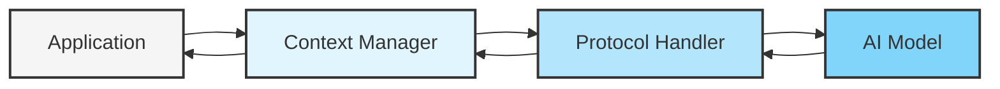
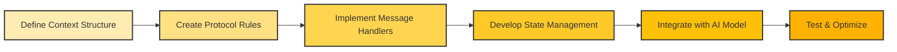

# MCP (Model Context Protocol)


## ทำความเข้าใจ MCP

Model Context Protocol (MCP) เป็นแนวทางที่ช่วยในการจัดการบริบท (Context) ระหว่างคำถามและคำตอบของ AI โดยเฉพาะในระบบ Large Language Models (LLMs) ได้อย่างมีประสิทธิภาพมากขึ้น โดย MCP ช่วยให้แอปพลิเคชันสามารถควบคุมการสื่อสารระหว่างผู้ใช้และโมเดล AI ได้อย่างเป็นระบบ

MCP เป็นส่วนสำคัญในการพัฒนาระบบ AI ที่ต้องการความแม่นยำและคงเส้นคงวาในการตอบสนอง โดยจะช่วยจัดการกับข้อมูลที่ส่งเข้าและออกจากโมเดลในรูปแบบที่มีโครงสร้างชัดเจน

**Key Takeaway:**
> MCP เป็นโปรโตคอลที่ช่วยให้การสื่อสารระหว่างแอปพลิเคชันและโมเดล AI มีประสิทธิภาพมากขึ้น ผ่านการจัดการบริบทที่เป็นระบบ

## การทำงานของ MCP

MCP ทำงานโดยการสร้างโครงสร้างที่ชัดเจนในการส่งข้อมูลระหว่างแอปพลิเคชันและโมเดล โดยมีองค์ประกอบสำคัญ ได้แก่:

1. **Context Management** - การจัดการข้อมูลบริบทที่ส่งให้กับโมเดล
2. **Protocol Rules** - กฎเกณฑ์ที่กำหนดวิธีการสื่อสารระหว่างระบบ
3. **Messaging Format** - รูปแบบของข้อความที่ใช้ในการสื่อสาร
4. **State Management** - การจัดการสถานะของการสนทนาหรือการใช้งาน


```mermaid
graph LR
    A[Application] --> B[Context Manager]
    B --> C[Protocol Handler]
    C --> D[AI Model]
    D --> C
    C --> B
    B --> A
    style A fill:#f5f5f5,stroke:#333,stroke-width:2px
    style B fill:#e1f5fe,stroke:#333,stroke-width:2px
    style C fill:#b3e5fc,stroke:#333,stroke-width:2px
    style D fill:#81d4fa,stroke:#333,stroke-width:2px
```

**Key Takeaway:**
> MCP สร้างระบบการไหลของข้อมูลที่เป็นระเบียบระหว่างแอปพลิเคชันและโมเดล AI ช่วยให้สามารถควบคุมผลลัพธ์และลดความคลุมเครือในการสื่อสาร

## การประยุกต์ใช้ MCP ในแอปพลิเคชัน

การนำ MCP ไปประยุกต์ใช้ในแอปพลิเคชันช่วยให้สามารถพัฒนาระบบที่มีความยืดหยุ่นและแม่นยำมากขึ้น ตัวอย่างการประยุกต์ใช้มีดังนี้:

### ระบบ Chatbot ที่มีความสามารถเฉพาะทาง

MCP ช่วยให้ Chatbot สามารถเก็บและใช้ข้อมูลบริบทในการสนทนาได้อย่างมีประสิทธิภาพ ทำให้การตอบสนองมีความเฉพาะเจาะจงและสอดคล้องกับประวัติการสนทนามากขึ้น


### ระบบช่วยตัดสินใจอัตโนมัติ

การใช้ MCP ในระบบช่วยตัดสินใจทำให้สามารถจัดการกับข้อมูลที่ซับซ้อนและมีความหลากหลายได้ดียิ่งขึ้น ผ่านการส่งบริบทที่เหมาะสมให้กับโมเดล

### แอปพลิเคชันสร้างเนื้อหาอัตโนมัติ

MCP ช่วยให้แอปพลิเคชันที่สร้างเนื้อหาสามารถควบคุมทิศทางและคุณภาพของเนื้อหาที่สร้างโดย AI ได้อย่างมีประสิทธิภาพ

**Key Takeaway:**
> การประยุกต์ใช้ MCP ช่วยยกระดับประสิทธิภาพของแอปพลิเคชัน AI โดยเพิ่มความสามารถในการควบคุมและปรับแต่งการตอบสนองของโมเดล

## การพัฒนาระบบด้วย MCP - Workshop

การพัฒนาระบบด้วย MCP มีขั้นตอนสำคัญ ดังนี้:

### 1. การออกแบบโครงสร้าง MCP


```mermaid
flowchart LR
    A[Define Context Structure] --> B[Create Protocol Rules]
    B --> C[Implement Message Handlers]
    C --> D[Develop State Management]
    D --> E[Integrate with AI Model]
    E --> F[Test & Optimize]
    style A fill:#ffecb3,stroke:#333,stroke-width:2px
    style B fill:#ffe082,stroke:#333,stroke-width:2px
    style C fill:#ffd54f,stroke:#333,stroke-width:2px
    style D fill:#ffca28,stroke:#333,stroke-width:2px
    style E fill:#ffc107,stroke:#333,stroke-width:2px
    style F fill:#ffb300,stroke:#333,stroke-width:2px
```

### 2. การสร้าง Context Manager

Context Manager เป็นส่วนที่จัดการกับข้อมูลที่จะส่งให้กับโมเดล AI โดยมีหน้าที่:
- จัดการประวัติการสนทนา
- คัดกรองข้อมูลที่เกี่ยวข้อง
- จัดรูปแบบข้อมูลให้เหมาะสมกับโมเดล

### 3. การพัฒนา Protocol Handler

Protocol Handler ทำหน้าที่แปลงข้อมูลระหว่างแอปพลิเคชันและโมเดล AI ตามกฎที่กำหนดไว้ในโปรโตคอล ซึ่งจะช่วยให้การสื่อสารมีประสิทธิภาพและเป็นระบบมากขึ้น

**Key Takeaway:**
> การพัฒนาระบบด้วย MCP ต้องคำนึงถึงการออกแบบโครงสร้างของโปรโตคอล การจัดการบริบท และการสร้างตัวจัดการโปรโตคอลที่มีประสิทธิภาพ

## ตัวอย่างการทำงานของ MCP ในโปรเจคจริง

### กรณีศึกษา: ระบบตอบคำถามอัตโนมัติ

ในการพัฒนาระบบตอบคำถามอัตโนมัติ MCP ช่วยให้ระบบสามารถ:
- เก็บประวัติคำถามและคำตอบที่ผ่านมา
- วิเคราะห์บริบทของคำถามปัจจุบัน
- ส่งข้อมูลที่เหมาะสมไปยังโมเดล AI
- รับและประมวลผลคำตอบก่อนแสดงผลให้กับผู้ใช้


### ตัวอย่างโค้ด MCP:

```javascript
class MCPHandler {
  constructor(model) {
    this.model = model;
    this.conversationHistory = [];
    this.contextWindow = 5; // จำนวนข้อความย้อนหลังที่จะส่งเป็น context
  }

  async processQuery(userQuery) {
    // สร้าง context จากประวัติการสนทนา
    const context = this.buildContext();
    
    // สร้างข้อความสำหรับส่งไปยังโมเดล
    const message = {
      role: "user",
      content: userQuery,
      context: context
    };
    
    // ส่งข้อความไปยังโมเดลและรับคำตอบ
    const response = await this.model.generateResponse(message);
    
    // บันทึกการสนทนาลงในประวัติ
    this.conversationHistory.push({ query: userQuery, response: response });
    
    // ตัดประวัติการสนทนาที่เกินความจำเป็น
    this.truncateHistory();
    
    return response;
  }

  buildContext() {
    // สร้างบริบทจากประวัติการสนทนา
    return this.conversationHistory.slice(-this.contextWindow);
  }

  truncateHistory() {
    // รักษาประวัติการสนทนาไม่ให้ยาวเกินไป
    if (this.conversationHistory.length > 20) {
      this.conversationHistory = this.conversationHistory.slice(-15);
    }
  }
}
```

**Key Takeaway:**
> การนำ MCP ไปใช้ในโปรเจคจริงต้องคำนึงถึงการจัดการประวัติการสนทนา การสร้างบริบทที่เหมาะสม และการประมวลผลข้อมูลก่อนและหลังการใช้งานโมเดล AI

## ตัวอย่าง MCP Server (REST API)

ตัวอย่างนี้แสดงการสร้าง MCP Server ด้วย Python (Flask) ที่รับ context และ query จาก client แล้วตอบกลับผลลัพธ์ที่ได้จากโมเดล AI หรือฟังก์ชันจำลอง:

```python
from flask import Flask, request, jsonify
app = Flask(__name__)

def process_with_model(context, query):
    # ตัวอย่าง: รวม context กับ query แล้วตอบกลับ (แทนที่ด้วยโมเดลจริงได้)
    return f"[CTX: {context}] {query} => ตอบกลับจากโมเดล AI"

@app.route('/mcp', methods=['POST'])
def mcp_server():
    data = request.json
    context = data.get('context', '')
    query = data.get('query', '')
    result = process_with_model(context, query)
    return jsonify({'result': result})

if __name__ == '__main__':
    app.run(host='0.0.0.0', port=5000)
```

- สามารถนำไปต่อยอดให้เชื่อมต่อกับโมเดล AI จริง เช่น OpenAI, Hugging Face หรือ LLM อื่นๆ ได้
- รองรับการรับ context/query จาก client และตอบกลับในรูปแบบ JSON

## แหล่งสืบค้นและตัวอย่างการใช้งาน MCP ขั้นสูง

### Streamable HTTP ใน MCP

MCP สมัยใหม่รองรับการสื่อสารแบบ Streamable HTTP (เช่น HTTP/1.1 chunked, HTTP/2 streaming, Server-Sent Events หรือ WebSocket) เพื่อให้โมเดล AI สามารถส่งผลลัพธ์ทีละส่วน (stream) กลับไปยัง client ได้ทันทีที่ประมวลผลเสร็จแต่ละช่วง เช่น การตอบข้อความแบบ real-time หรือการสตรีมข้อมูลขนาดใหญ่

**ตัวอย่างการใช้งาน (Node.js/Express + OpenAI API):**

```javascript
app.post('/mcp/stream', async (req, res) => {
  res.setHeader('Content-Type', 'text/event-stream');
  res.setHeader('Cache-Control', 'no-cache');
  res.flushHeaders();

  const openaiStream = openai.createChatCompletionStream({
    model: 'gpt-4',
    messages: req.body.messages,
    stream: true
  });

  for await (const chunk of openaiStream) {
    res.write(`data: ${JSON.stringify(chunk)}\n\n`);
  }
  res.end();
});
```

---

### ตัวอย่างการตั้งค่า MCP Host และ MCP Client

**MCP Host (Python Flask):**
```python
from flask import Flask, request, jsonify
app = Flask(__name__)

@app.route('/mcp', methods=['POST'])
def mcp_host():
    data = request.json
    # ประมวลผล context และ query
    response = process_with_model(data['context'], data['query'])
    return jsonify({'result': response})

app.run(host='0.0.0.0', port=5000)
```

**MCP Client (Node.js):**
```javascript
const axios = require('axios');
async function askMCP(query, context) {
  const res = await axios.post('http://localhost:5000/mcp', {
    query,
    context
  });
  return res.data.result;
}
```

---

### แหล่งสืบค้น MCP และ Streamable HTTP
- [Model Context Protocol (MCP) Spec](https://github.com/modelcontext/protocol)
- [OpenAI API Streaming](https://platform.openai.com/docs/guides/text-generation/streaming)
- [Hugging Face Inference Endpoints](https://huggingface.co/docs/inference-endpoints/index)
- [Server-Sent Events (MDN)](https://developer.mozilla.org/en-US/docs/Web/API/Server-sent_events)
- [HTTP Streaming Patterns](https://cloud.google.com/architecture/http-streaming-patterns)

## RACKSYNC CO., LTD.

[RACKSYNC](https://github.com/racksync) เป็นบริษัทที่มีความเชี่ยวชาญในการพัฒนาโซลูชั่นด้าน IoT และระบบอัตโนมัติ เรามุ่งมั่นในการสร้างเทคโนโลยีที่เชื่อมต่อโลกเข้าด้วยกันผ่านระบบ IoT ที่มีประสิทธิภาพและเสถียร

### บริการของเรา
- การออกแบบและพัฒนาระบบ IoT แบบครบวงจร
- โซลูชั่นเชื่อมต่อสำหรับอุตสาหกรรม 4.0
- ระบบอัตโนมัติสำหรับบ้านและอาคารอัจฉริยะ
- การฝึกอบรมและเวิร์คช็อปด้าน IoT

## ติดต่อเรา
- **โทร**: 08 5880 8885
- **อีเมล**: info@racksync.com
- **เว็บไซต์**: https://racksync.com
- **Facebook**: https://www.facebook.com/racksync

© 2007-2025 RACKSYNC CO., LTD. All rights reserved.
