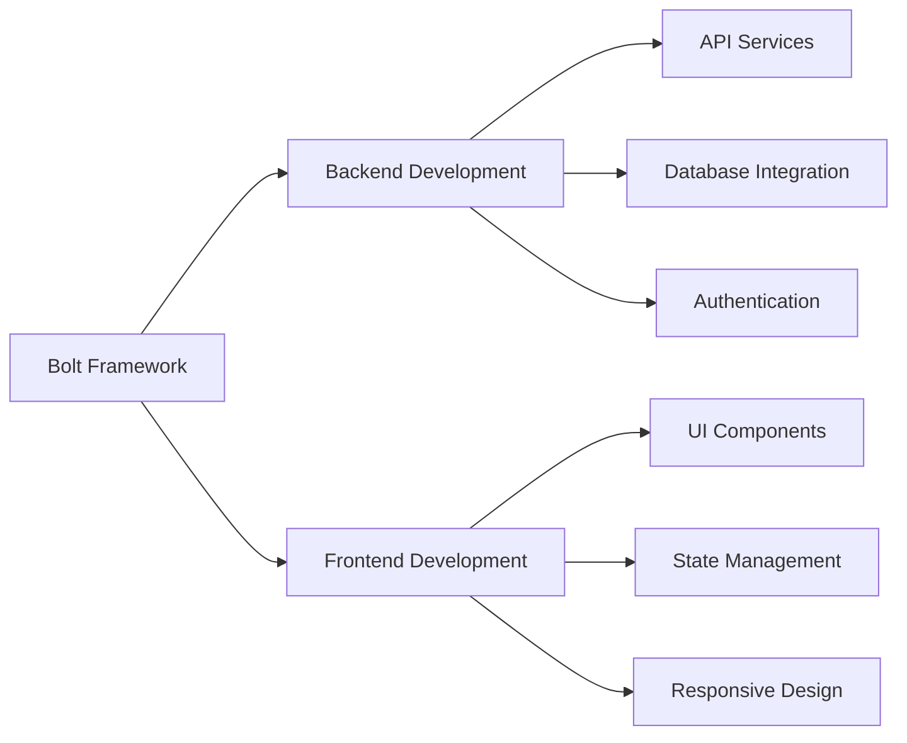
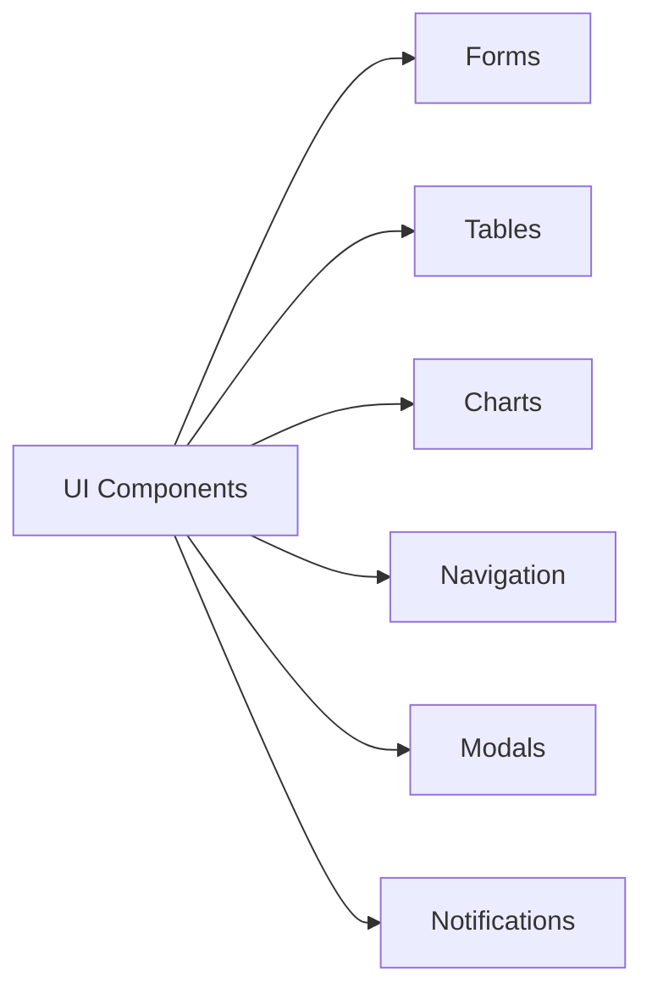
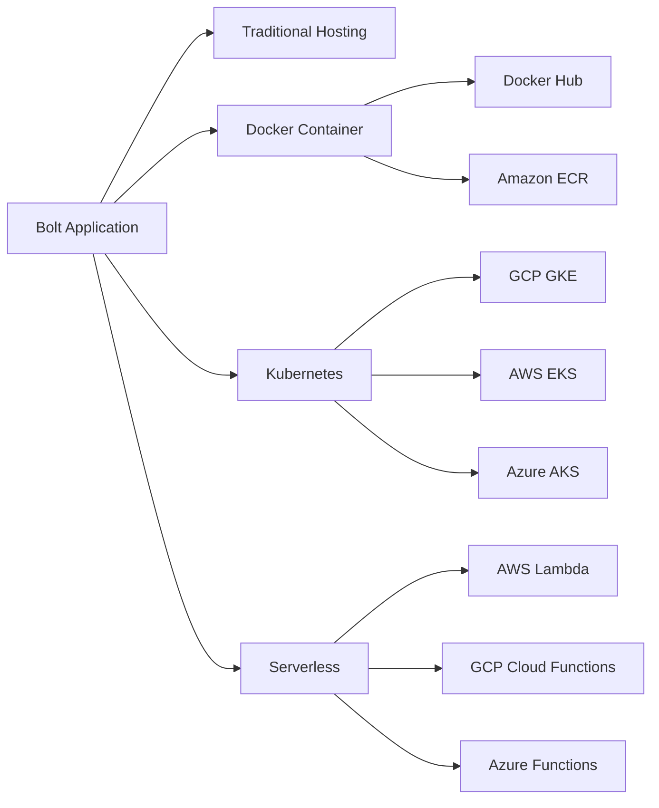

# Session 11: Vibe Coding & Framework


## Introduction to Vibe Coding

Vibe Coding เป็นแนวคิดในการพัฒนาซอฟต์แวร์ที่เน้นความรวดเร็ว ความยืดหยุ่น และประสบการณ์การพัฒนาที่ราบรื่น โดยมุ่งเน้นให้นักพัฒนาสามารถสร้างแอปพลิเคชันได้อย่างมีประสิทธิภาพและสนุกไปกับการเขียนโค้ด แนวคิดนี้ไม่ได้ยึดติดกับกฎเกณฑ์มากเกินไป แต่เน้นการทำงานที่มีประสิทธิภาพและเป็นระบบ

> **Key Takeaway**: Vibe Coding คือแนวทางการพัฒนาที่เน้นความรวดเร็ว ยืดหยุ่น และมีประสิทธิภาพ เหมาะสำหรับการพัฒนาแอปพลิเคชันยุคใหม่

## Bolt Framework คืออะไร?

Bolt เป็น Framework ที่ออกแบบมาเพื่อการพัฒนา Web Application แบบรวดเร็วโดยเฉพาะ สามารถเชื่อมต่อกับระบบ AI และให้ความยืดหยุ่นในการพัฒนาทั้ง Backend และ Frontend ได้อย่างมีประสิทธิภาพ Bolt ถูกสร้างขึ้นมาเพื่อลดความซับซ้อนในการพัฒนา และให้นักพัฒนาสามารถทำงานได้อย่างมีประสิทธิภาพมากขึ้น



> **Key Takeaway**: Bolt Framework ช่วยให้นักพัฒนาสามารถสร้างแอปพลิเคชันแบบ full-stack ได้อย่างรวดเร็วโดยไม่จำเป็นต้องกังวลกับ boilerplate code มากเกินไป

## โครงสร้างและหลักการทำงานของ Bolt

Bolt มีโครงสร้างที่เรียบง่าย แต่มีประสิทธิภาพสูง โดยแบ่งออกเป็นส่วนหลักๆ ดังนี้:

- **Core Module**: ส่วนกลางที่จัดการกับการทำงานพื้นฐานของระบบ
- **API Module**: จัดการกับการเชื่อมต่อและให้บริการข้อมูลผ่าน API
- **UI Module**: จัดการกับการแสดงผลและการโต้ตอบกับผู้ใช้
- **Database Module**: จัดการกับการเชื่อมต่อและการทำงานกับฐานข้อมูล
- **Authentication Module**: จัดการกับระบบยืนยันตัวตนและการกำหนดสิทธิ์


## การใช้งาน Bolt เพื่อพัฒนา Web Application

### การติดตั้งและเริ่มต้น

```bash
# ติดตั้ง Bolt CLI
npm install -g @bolt/cli

# สร้างโปรเจคใหม่
bolt new my-awesome-app

# เข้าไปที่โปรเจค
cd my-awesome-app

# รันโปรเจคในโหมด development
bolt dev
```

### การพัฒนา Backend

Bolt ช่วยให้การพัฒนา Backend เป็นเรื่องง่าย โดยมีระบบ Auto-generation สำหรับ API endpoints และการเชื่อมต่อกับฐานข้อมูล นอกจากนี้ยังมีเครื่องมือสำหรับการจัดการ Authentication และ Authorization อย่างมีประสิทธิภาพ

```javascript
// ตัวอย่างการสร้าง API ใน Bolt
bolt.api('/users', {
  get: async (req, res) => {
    const users = await db.users.findAll();
    return users;
  },
  post: async (req, res) => {
    const newUser = await db.users.create(req.body);
    return newUser;
  }
});
```

> **Key Takeaway**: Bolt ทำให้การสร้าง backend API เป็นเรื่องง่าย ด้วยไวยากรณ์ที่เรียบง่ายและมีประสิทธิภาพ

### การพัฒนา Frontend

Bolt มาพร้อมกับ UI Component Library ที่ครบครัน ช่วยให้การพัฒนา Frontend เป็นไปอย่างรวดเร็ว และยังรองรับ Modern Frontend Framework เช่น React, Vue หรือ Angular อีกด้วย

```javascript
// ตัวอย่างการสร้าง UI Component ใน Bolt
import { Component } from '@bolt/ui';

class UserList extends Component {
  render() {
    return (
      <div>
        {this.state.users.map(user => (
          <UserCard key={user.id} user={user} />
        ))}
      </div>
    );
  }
}
```



## การเชื่อมต่อ Bolt กับ AI

Bolt สามารถเชื่อมต่อกับ AI APIs เช่น OpenAI, Gemini และอื่นๆ ได้อย่างง่ายดาย ช่วยให้นักพัฒนาสามารถสร้างแอปพลิเคชันที่ใช้ประโยชน์จาก AI ได้อย่างเต็มที่

```javascript
// ตัวอย่างการเชื่อมต่อ Bolt กับ OpenAI
bolt.ai.connect('openai', {
  apiKey: process.env.OPENAI_API_KEY
});

// การใช้งาน AI ใน API
bolt.api('/generate-content', {
  post: async (req, res) => {
    const { prompt } = req.body;
    const content = await bolt.ai.generate(prompt);
    return { content };
  }
});
```


> **Key Takeaway**: Bolt มีระบบเชื่อมต่อกับ AI APIs ที่ใช้งานง่าย ทำให้การสร้างแอปพลิเคชันที่ใช้ประโยชน์จาก AI เป็นเรื่องที่เป็นไปได้สำหรับนักพัฒนาทุกระดับ

## การ Deploy Bolt Application

Bolt รองรับการ Deploy ได้หลากหลายรูปแบบ ทั้ง Traditional Hosting, Container (Docker) และ Cloud Services ต่างๆ



### ขั้นตอนการ Deploy บน Cloud Provider

```bash
# Build สำหรับ production
bolt build

# Deploy ไปยัง Cloud Provider
bolt deploy --target aws
```

> **Key Takeaway**: Bolt มีระบบ deployment ที่ยืดหยุ่นและรองรับหลากหลายแพลตฟอร์ม ทำให้การนำแอปพลิเคชันขึ้น production เป็นเรื่องง่าย

## Use Cases ของ Bolt

- **Startups**: เหมาะสำหรับ startups ที่ต้องการพัฒนาแอปพลิเคชันอย่างรวดเร็ว
- **Enterprise**: เหมาะสำหรับองค์กรที่ต้องการสร้าง internal tools หรือ customer-facing applications
- **AI-powered Applications**: เหมาะสำหรับการสร้างแอปพลิเคชันที่ใช้ประโยชน์จาก AI
- **E-commerce**: สามารถสร้างระบบ e-commerce ได้อย่างรวดเร็ว
- **Dashboard & Analytics**: เหมาะสำหรับการสร้างระบบ dashboard และ analytics


## Workshop: สร้าง AI Dashboard ด้วย Bolt

ในส่วนนี้เราจะทดลองสร้าง AI Dashboard ง่ายๆ ด้วย Bolt Framework ซึ่งจะมีความสามารถในการวิเคราะห์ข้อมูลและแสดงผลในรูปแบบต่างๆ

1. **เตรียมโปรเจค**:
   ```bash
   bolt new ai-dashboard
   cd ai-dashboard
   ```

2. **เพิ่ม AI Module**:
   ```bash
   bolt add module ai
   ```

3. **สร้าง API สำหรับวิเคราะห์ข้อมูล**:
   ```javascript
   bolt.api('/analyze', {
     post: async (req, res) => {
       const { data } = req.body;
       const analysis = await bolt.ai.analyze(data);
       return analysis;
     }
   });
   ```

4. **สร้าง Dashboard UI**:
   ```javascript
   import { Dashboard, Chart, Card } from '@bolt/ui';
   
   function AIDashboard() {
     const [data, setData] = useState(null);
     
     useEffect(() => {
       // Fetch data
       fetchData().then(setData);
     }, []);
     
     return (
       <Dashboard>
         <Card title="AI Analysis">
           {data ? (
             <Chart type="bar" data={data.chartData} />
           ) : (
             <Loading />
           )}
         </Card>
       </Dashboard>
     );
   }
   ```

## สรุป

Bolt Framework เป็นเครื่องมือที่มีประสิทธิภาพสำหรับการพัฒนา Web Application แบบรวดเร็ว โดยเน้นแนวคิด Vibe Coding ที่ให้ความสำคัญกับประสบการณ์การพัฒนาที่ราบรื่นและมีประสิทธิภาพ Bolt รองรับการพัฒนาทั้ง Backend และ Frontend และมีความสามารถในการเชื่อมต่อกับ AI APIs ได้อย่างง่ายดาย นอกจากนี้ยังมีระบบ Deployment ที่ยืดหยุ่น ทำให้การนำแอปพลิเคชันขึ้น Production เป็นเรื่องง่าย

> **Key Takeaway**: Bolt Framework ช่วยลดเวลาและความซับซ้อนในการพัฒนา Web Application โดยไม่ลดทอนคุณภาพและประสิทธิภาพของแอปพลิเคชัน เหมาะสำหรับนักพัฒนาที่ต้องการสร้างแอปพลิเคชันคุณภาพสูงในเวลาอันรวดเร็ว

## แหล่งข้อมูลเพิ่มเติม

- [Bolt Framework Official Documentation](https://boltframework.dev/docs)
- [Vibe Coding: A Modern Approach to Web Development](https://medium.com/web-development/vibe-coding-approach)
- [Building AI-powered Applications with Modern Frameworks](https://dev.to/ai-applications)
- [Deployment Strategies for Modern Web Applications](https://www.netlify.com/blog/deployment-strategies)

---

## About RACKSYNC

[RACKSYNC](https://github.com/racksync) เป็นบริษัทที่มีความเชี่ยวชาญในการพัฒนาโซลูชั่นด้าน IoT และระบบอัตโนมัติ เรามุ่งมั่นในการสร้างเทคโนโลยีที่เชื่อมต่อโลกเข้าด้วยกันผ่านระบบ IoT ที่มีประสิทธิภาพและเสถียร

### บริการของเรา

- การออกแบบและพัฒนาระบบ IoT แบบครบวงจร
- โซลูชั่นเชื่อมต่อสำหรับอุตสาหกรรม 4.0
- ระบบอัตโนมัติสำหรับบ้านและอาคารอัจฉริยะ
- การฝึกอบรมและเวิร์คช็อปด้าน IoT

### ติดต่อเรา

- **โทร**: 08 5880 8885
- **อีเมล**: info@racksync.com
- **เว็บไซต์**: https://racksync.com
- **Facebook**: https://www.facebook.com/racksync

© 2007-2025 RACKSYNC CO., LTD. All rights reserved.
