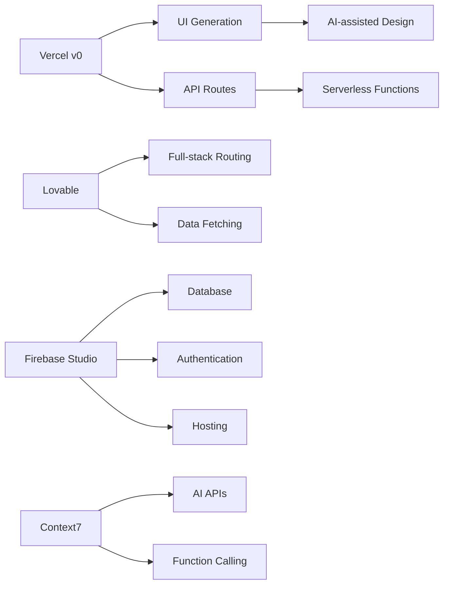
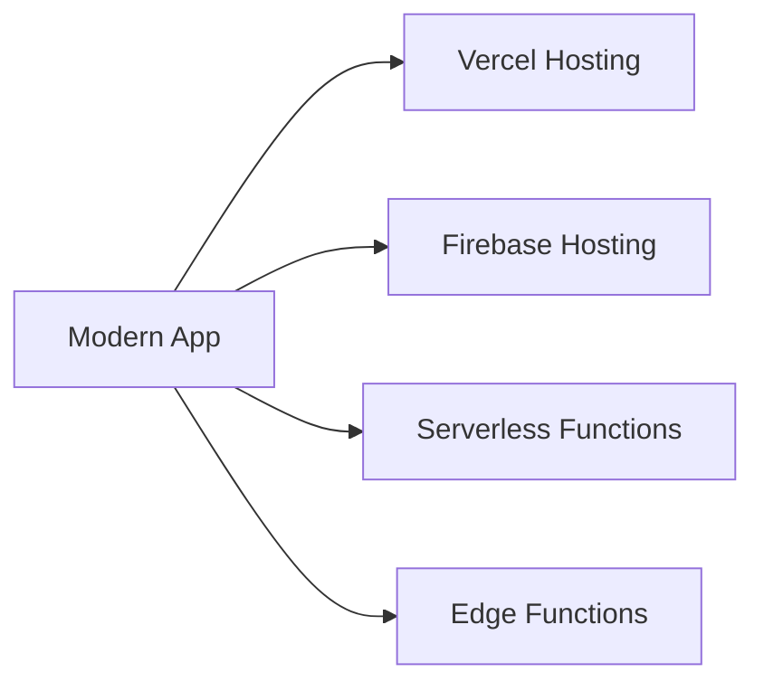

# Session 11: Vibe Coding & Modern Frameworks (Vercel v0, Lovable, Firebase Studio, Context7)


## Introduction to Vibe Coding

Vibe Coding เป็นแนวคิดในการพัฒนาซอฟต์แวร์ที่เน้นความรวดเร็ว ความยืดหยุ่น และประสบการณ์การพัฒนาที่ราบรื่น โดยมุ่งเน้นให้นักพัฒนาสามารถสร้างแอปพลิเคชันได้อย่างมีประสิทธิภาพและสนุกไปกับการเขียนโค้ด แนวคิดนี้ไม่ได้ยึดติดกับกฎเกณฑ์มากเกินไป แต่เน้นการทำงานที่มีประสิทธิภาพและเป็นระบบ

> **Key Takeaway**: Vibe Coding คือแนวทางการพัฒนาที่เน้นความรวดเร็ว ยืดหยุ่น และมีประสิทธิภาพ เหมาะสำหรับการพัฒนาแอปพลิเคชันยุคใหม่

## Modern Frameworks: Vercel v0, Lovable, Firebase Studio, Context7

### Vercel v0
- Framework สำหรับสร้าง UI และ API แบบ serverless ได้อย่างรวดเร็ว
- รองรับการ deploy อัตโนมัติบน Vercel Platform
- ใช้แนวคิด AI-assisted UI/Code Generation

### Lovable
- Full-stack framework ที่เน้น developer experience และ productivity
- มีระบบ routing, data fetching, และ state management ที่ใช้งานง่าย

### Firebase Studio
- เครื่องมือสำหรับสร้าง backend, database, authentication, และ hosting แบบ no-code/low-code
- เหมาะกับ rapid prototyping และ production

### Context7
- แพลตฟอร์มสำหรับเชื่อมต่อ AI APIs และ function calling
- ใช้งานง่ายสำหรับการเพิ่ม AI ความสามารถในแอป


```mermaid
graph LR
    A[Vercel v0] --> B[UI Generation]
    A --> C[API Routes]
    B --> D[AI-assisted Design]
    C --> E[Serverless Functions]
    F[Lovable] --> G[Full-stack Routing]
    F --> H[Data Fetching]
    I[Firebase Studio] --> J[Database]
    I --> K[Authentication]
    I --> L[Hosting]
    M[Context7] --> N[AI APIs]
    M --> O[Function Calling]
```

> **Key Takeaway**: Frameworks ยุคใหม่ช่วยให้การพัฒนาแอปพลิเคชันเป็นไปอย่างรวดเร็วและง่ายดาย พร้อมรองรับ AI และ Cloud-native โดยไม่ต้องเขียนโค้ดซ้ำซ้อน

## โครงสร้างและหลักการทำงานของ Vercel v0, Lovable, Firebase Studio, Context7

- **Vercel v0**: สร้าง UI/Component/Route ได้จาก natural language prompt และ deploy ได้ทันที
- **Lovable**: Full-stack framework ที่เน้น DX (Developer Experience) และ productivity
- **Firebase Studio**: สร้าง backend, database, auth, hosting ได้แบบ visual
- **Context7**: เชื่อมต่อ AI APIs และ function calling ได้ง่าย


## การใช้งาน Frameworks เหล่านี้เพื่อพัฒนา Web Application

### การติดตั้งและเริ่มต้น (Vercel v0)

```bash
# ติดตั้ง Vercel CLI
npm install -g vercel

# สร้างโปรเจคใหม่ด้วย v0
npx v0 init my-v0-app
cd my-v0-app

# รันโปรเจคในโหมด development
vercel dev
```

### การพัฒนา Backend (Lovable, Firebase Studio)

#### Lovable Example
```ts
// lovable/src/routes/api/users.ts
import { defineRoute } from 'lovable';

export default defineRoute({
  async GET(req) {
    // ดึงข้อมูลจาก database
    return Response.json(await db.user.findMany());
  },
  async POST(req) {
    const data = await req.json();
    return Response.json(await db.user.create({ data }));
  }
});
```

#### Firebase Studio Example
- ใช้ UI สร้าง Firestore Database, Auth, และ API Endpoint ได้ทันที
- สามารถ export code หรือเชื่อมต่อผ่าน SDK

### การพัฒนา Frontend (Vercel v0, Lovable)

#### Vercel v0 Example
```ts
// v0/app/page.tsx
import { Button } from 'v0/ui';

export default function Home() {
  return (
    <main>
      <h1>Hello Vercel v0</h1>
      <Button>Click me</Button>
    </main>
  );
}
```

#### Lovable Example
```ts
// lovable/src/components/UserList.tsx
import { useQuery } from 'lovable';

export function UserList() {
  const { data: users } = useQuery('/api/users');
  return (
    <ul>
      {users?.map(u => <li key={u.id}>{u.name}</li>)}
    </ul>
  );
}
```

## การ Deploy Application

- **Vercel v0/Lovable**: deploy ขึ้น Vercel ได้ทันที (CI/CD อัตโนมัติ)
- **Firebase Studio**: deploy backend/frontend/database/auth ได้ในคลิกเดียว

```bash
# Deploy ขึ้น Vercel
vercel --prod

# หรือ deploy ผ่าน Firebase Studio UI
```


```mermaid
graph LR
    A[Modern App] --> B[Vercel Hosting]
    A --> C[Firebase Hosting]
    A --> D[Serverless Functions]
    A --> E[Edge Functions]
```

> **Key Takeaway**: Frameworks เหล่านี้รองรับการ deploy แบบ cloud-native และ serverless ได้ทันที

## Use Cases ของ Vercel v0, Lovable, Firebase Studio, Context7

- **AI-powered Applications**: ใช้ Context7 เชื่อมต่อ AI APIs ได้ทันที
- **Rapid Prototyping**: ใช้ Vercel v0/Firebase Studio สร้าง prototype ได้เร็ว
- **Full-stack Web Apps**: Lovable รองรับทั้ง frontend/backend ในที่เดียว
- **Internal Tools & Dashboard**: สร้าง dashboard ด้วย Vercel v0 + Firebase Studio
- **E-commerce & SaaS**: รองรับ scale และ auth ได้ง่าย


## Workshop: สร้าง AI Dashboard ด้วย Vercel v0 + Context7 + Firebase Studio

1. **เตรียมโปรเจค**:
   ```bash
   npx v0 init ai-dashboard
   cd ai-dashboard
   ```
2. **เชื่อมต่อ Firebase Studio** (สร้าง database/auth ผ่าน UI)
3. **เพิ่ม Context7 สำหรับ AI**
   ```ts
   // src/app/ai-dashboard/page.tsx
   import { useContext7 } from 'context7';
   export default function AIDashboard() {
     const { callAI, result, loading } = useContext7('openai/gpt-4');
     return (
       <div>
         <button onClick={() => callAI({ prompt: 'วิเคราะห์ข้อมูลยอดขาย' })}>
           วิเคราะห์ด้วย AI
         </button>
         {loading ? 'กำลังวิเคราะห์...' : result?.content}
       </div>
     );
   }
   ```
4. **สร้าง Dashboard UI ด้วย v0**
   ```ts
   // src/app/ai-dashboard/components/Chart.tsx
   import { Chart } from 'v0/ui';
   export function SalesChart({ data }) {
     return <Chart type="bar" data={data} />;
   }
   ```

## สรุป

Frameworks ยุคใหม่อย่าง Vercel v0, Lovable, Firebase Studio, Context7 ช่วยให้การพัฒนาแอปพลิเคชันเป็นไปอย่างรวดเร็ว สนุก และรองรับ AI/Cloud-native เต็มรูปแบบ เหมาะกับทั้ง rapid prototyping และ production

> **Key Takeaway**: Modern frameworks ลดเวลาและความซับซ้อนในการพัฒนาแอปพลิเคชัน รองรับ AI และ Cloud-native ได้ทันที

## แหล่งข้อมูลเพิ่มเติม

- [Vercel v0](https://v0.dev)
- [Lovable](https://lovable.dev)
- [Firebase Studio](https://firebase.google.com/products/extensions/studio)
- [Context7](https://context7.com)
- [Vibe Coding: A Modern Approach to Web Development](https://medium.com/web-development/vibe-coding-approach)
- [Deployment Strategies for Modern Web Applications](https://www.netlify.com/blog/deployment-strategies)

---

## RACKSYNC CO., LTD.

[RACKSYNC](https://github.com/racksync) เป็นบริษัทที่มีความเชี่ยวชาญในการพัฒนาโซลูชั่นด้าน IoT และระบบอัตโนมัติ เรามุ่งมั่นในการสร้างเทคโนโลยีที่เชื่อมต่อโลกเข้าด้วยกันผ่านระบบ IoT ที่มีประสิทธิภาพและเสถียร

### บริการของเรา
- การออกแบบและพัฒนาระบบ IoT แบบครบวงจร
- โซลูชั่นเชื่อมต่อสำหรับอุตสาหกรรม 4.0
- ระบบอัตโนมัติสำหรับบ้านและอาคารอัจฉริยะ
- การฝึกอบรมและเวิร์คช็อปด้าน IoT

## ติดต่อเรา
- **โทร**: 08 5880 8885
- **อีเมล**: info@racksync.com
- **เว็บไซต์**: https://racksync.com
- **Facebook**: https://www.facebook.com/racksync

© 2007-2025 RACKSYNC CO., LTD. All rights reserved.
