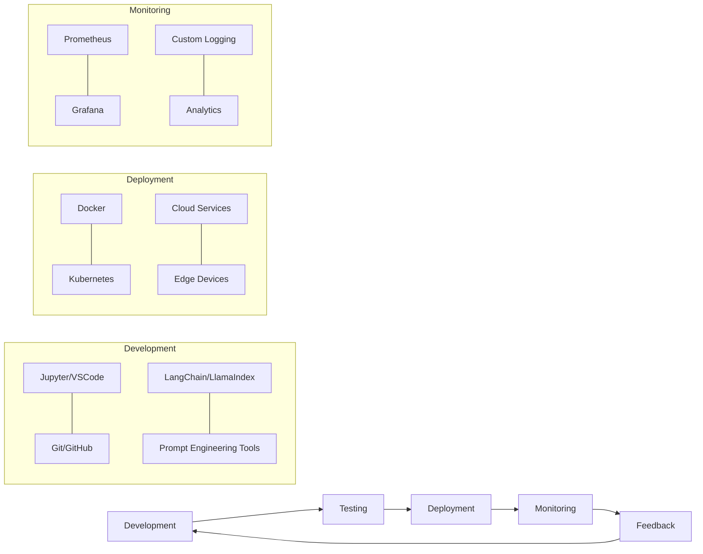
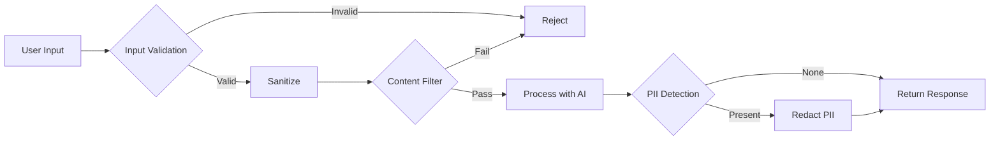

# Bonus: Tools & Best Practices

## AI Development Tools Ecosystem

การพัฒนาโซลูชัน AI สมัยใหม่ต้องอาศัยเครื่องมือที่หลากหลาย ในส่วนนี้เราจะแนะนำเครื่องมือที่นิยมใช้ในการพัฒนา AI applications และ best practices เพื่อให้คุณสามารถสร้าง AI workflow ที่มีประสิทธิภาพและปลอดภัย

## AI Development Tools

### Frameworks & Libraries

- **LangChain / LlamaIndex**: สำหรับการสร้าง RAG และ AI applications แบบซับซ้อน
- **Hugging Face**: แพลตฟอร์มสำหรับ models, datasets และ spaces
- **PyTorch / TensorFlow**: สำหรับการพัฒนาโมเดล ML และ DL
- **Gradio / Streamlit**: สำหรับสร้าง AI demos และ web interfaces อย่างรวดเร็ว

### Orchestration & Deployment

- **BentoML / MLflow**: สำหรับ ML model serving และ tracking
- **Kubernetes / Docker**: สำหรับการ containerize และ deploy AI applications
- **FastAPI / Flask**: สำหรับสร้าง API endpoints ให้กับ AI services

### Vector Databases & Embeddings

- **Pinecone / Weaviate / Chroma**: สำหรับเก็บ vector embeddings
- **pgvector / Milvus**: สำหรับการค้นหา similarity และ vector search
- **sentence-transformers**: สำหรับสร้าง embeddings คุณภาพสูง

## Security & Data Privacy

### Privacy-Preserving Techniques

- **Differential Privacy**: ป้องกันการ leak ข้อมูลส่วนบุคคลระหว่างการเทรนโมเดล
- **Federated Learning**: การเรียนรู้แบบกระจายโดยไม่ต้องรวมข้อมูลไว้ที่ศูนย์กลาง
- **Secure Multi-party Computation**: การคำนวณบนข้อมูลที่เข้ารหัส

### Security Best Practices

- **API Authentication**: ใช้ API keys, OAuth 2.0 หรือ JWT tokens
- **Rate Limiting**: ป้องกันการใช้งานมากเกินไปและลดความเสี่ยงจาก DOS attacks
- **Data Minimization**: เก็บเฉพาะข้อมูลที่จำเป็นต่อการทำงานของแอปพลิเคชัน
- **Input Validation**: ตรวจสอบ prompts ก่อนส่งไปยังโมเดล

## Model Management

### Version Control for Models

- **Git LFS / DVC**: สำหรับ version control ของโมเดลขนาดใหญ่
- **Weights & Biases / Neptune.ai**: สำหรับ track experiments และ model versions
- **Model Registry**: จัดการโมเดลที่ถูก deploy ใน production

### Model Monitoring

- **Drift Detection**: ตรวจจับเมื่อข้อมูล input หรือ output เปลี่ยนแปลงเกินกำหนด
- **Performance Metrics**: วัดประสิทธิภาพของโมเดลอย่างสม่ำเสมอ
- **Explainability Tools**: ใช้ SHAP values, LIME หรือ Integrated Gradients เพื่อเข้าใจการตัดสินใจของโมเดล

## Workflow Design Best Practices

### Modular Design

- **Microservices Architecture**: แยกส่วนประกอบของระบบเป็น services เล็กๆ ที่ทำงานร่วมกัน
- **Function Composition**: ออกแบบให้เป็น functions ที่สามารถนำมาต่อกันได้
- **Reusable Components**: สร้าง libraries ของ components ที่สามารถนำกลับมาใช้ใหม่ได้

### Testing & Quality Assurance

- **Unit Testing**: ตรวจสอบแต่ละส่วนของโค้ดแยกจากกัน
- **Integration Testing**: ตรวจสอบการทำงานร่วมกันของหลายๆ ส่วน
- **Adversarial Testing**: ทดสอบด้วยข้อมูล edge cases หรือข้อมูลที่ออกแบบมาให้ระบบล้มเหลว
- **Red Teaming**: ทดสอบโดยกลุ่มคนที่พยายามหาช่องโหว่ของระบบ

## Ethical AI Development

- **Bias Detection & Mitigation**: ตรวจหาและแก้ไขอคติในโมเดล
- **Transparency**: ทำให้การตัดสินใจของระบบโปร่งใสและสามารถอธิบายได้
- **Environmental Considerations**: คำนึงถึงการใช้พลังงานและ carbon footprint
- **Human Oversight**: เก็บรักษา human-in-the-loop สำหรับการตัดสินใจที่สำคัญ

## Key Takeaway:

> การพัฒนา AI applications ที่มีประสิทธิภาพไม่ได้ขึ้นอยู่กับโมเดลที่ดีเพียงอย่างเดียว แต่ยังรวมถึงการใช้เครื่องมือที่เหมาะสม การออกแบบ workflow ที่ดี และการคำนึงถึงความปลอดภัย ความเป็นส่วนตัว และจริยธรรมตลอดกระบวนการพัฒนา
>
> การทำ AI อย่างมืออาชีพต้องมีการ monitor, maintain และ iterate บน solutions อย่างต่อเนื่อง ไม่ใช่แค่ deploy แล้วปล่อยทิ้งไว้
>
> ความสำเร็จของ AI project มักไม่ได้มาจากการใช้เทคโนโลยีล่าสุดเสมอไป แต่มาจากการเลือกใช้เครื่องมือที่เหมาะสมกับปัญหาและทรัพยากรที่มี

## สรุป

การพัฒนา AI solutions ที่ประสบความสำเร็จต้องอาศัยหลายปัจจัย ทั้งการเลือกใช้เครื่องมือที่เหมาะสม การจัดการโมเดล การออกแบบ workflow ที่ดี และการคำนึงถึงความปลอดภัย ความเป็นส่วนตัว และจริยธรรม การนำ best practices เหล่านี้ไปปรับใช้จะช่วยให้คุณสร้าง AI solutions ที่มีคุณภาพ น่าเชื่อถือ และยั่งยืน

เทคโนโลยี AI มีการพัฒนาอย่างรวดเร็ว การติดตามแนวโน้มและเครื่องมือใหม่ๆ อยู่เสมอเป็นสิ่งสำคัญ แต่เช่นเดียวกับเทคโนโลยีอื่นๆ การมีพื้นฐานที่แข็งแกร่งและการเข้าใจหลักการพื้นฐานจะช่วยให้คุณปรับตัวได้ไม่ว่าเทคโนโลยีจะเปลี่ยนแปลงไปอย่างไร

## แหล่งข้อมูลเพิ่มเติม

- [Hugging Face Documentation](https://huggingface.co/docs)
- [LangChain Documentation](https://python.langchain.com/docs/get_started/introduction)
- [Responsible AI Practices by Google](https://ai.google/responsibilities/responsible-ai-practices/)
- [Microsoft AI Principles & Tools](https://www.microsoft.com/en-us/ai/responsible-ai)
- [Papers with Code - Latest in ML](https://paperswithcode.com/)

## RACKSYNC CO., LTD.

[RACKSYNC](https://github.com/racksync) เป็นบริษัทที่มีความเชี่ยวชาญในการพัฒนาโซลูชั่นด้าน IoT และระบบอัตโนมัติ เรามุ่งมั่นในการสร้างเทคโนโลยีที่เชื่อมต่อโลกเข้าด้วยกันผ่านระบบ IoT ที่มีประสิทธิภาพและเสถียร

### บริการของเรา
- การออกแบบและพัฒนาระบบ IoT แบบครบวงจร
- โซลูชั่นเชื่อมต่อสำหรับอุตสาหกรรม 4.0
- ระบบอัตโนมัติสำหรับบ้านและอาคารอัจฉริยะ
- การฝึกอบรมและเวิร์คช็อปด้าน IoT

- **โทร**: 08 5880 8885
- **อีเมล**: info@racksync.com
- **เว็บไซต์**: https://racksync.com
- **Facebook**: https://www.facebook.com/racksync

© 2007-2025 RACKSYNC CO., LTD. All rights reserved.
