# Session 0: การเตรียมความพร้อมก่อนเรียน

## 🔍 ภาพรวม

เพื่อให้การเรียนรู้ในหลักสูตร AI Workshop เป็นไปอย่างราบรื่นและมีประสิทธิภาพ คุณควรเตรียมความพร้อมทั้งในด้านความรู้พื้นฐาน ซอฟต์แวร์ และทรัพยากรที่จำเป็น เอกสารนี้รวบรวมสิ่งที่ต้องเตรียมทั้งหมดสำหรับทั้ง 8 เซสชัน

<div class="text-center">
  
</div>

## 📋 ความรู้พื้นฐานที่ควรมี

```mermaid
mindmap
  root((ความรู้พื้นฐาน))
    ::icon(fa fa-brain)
    (พื้นฐานทั่วไป)
      ::icon(fa fa-globe)
      [ความเข้าใจคอมพิวเตอร์และอินเทอร์เน็ต]
      [ทักษะการแก้ไขปัญหาเบื้องต้น]
      [ความคุ้นเคยกับเว็บเบราว์เซอร์]
    (พื้นฐานด้านการพัฒนา)
      ::icon(fa fa-code)
      [พื้นฐานการเขียนโปรแกรม]
      [JavaScript/Python]
      [HTML และ JSON]
      [API และการเชื่อมต่อระหว่างระบบ]
    (พื้นฐานด้าน AI)
      ::icon(fa fa-robot)
      [ความเข้าใจพื้นฐาน AI]
      [แนวคิดโมเดลภาษาขนาดใหญ่]
```



### พื้นฐานทั่วไป
- ความเข้าใจพื้นฐานเกี่ยวกับคอมพิวเตอร์และอินเทอร์เน็ต
- ทักษะการแก้ไขปัญหาเบื้องต้น
- ความคุ้นเคยกับการใช้งานเว็บเบราว์เซอร์

### พื้นฐานด้านการพัฒนา
- ความเข้าใจพื้นฐานของการเขียนโปรแกรม (ไม่จำเป็นต้องเชี่ยวชาญ)
- พื้นฐาน JavaScript/Python จะช่วยในการทำความเข้าใจตัวอย่างโค้ด
- ความรู้เบื้องต้นเกี่ยวกับ HTML และ JSON
- ความเข้าใจเบื้องต้นเกี่ยวกับ API และการเชื่อมต่อระหว่างระบบ

### พื้นฐานด้าน AI
- ความเข้าใจพื้นฐานเกี่ยวกับ AI และการเรียนรู้ของเครื่อง (ไม่ลึกมาก)
- คุ้นเคยกับแนวคิดของโมเดลภาษาขนาดใหญ่ (LLMs) จะเป็นประโยชน์

## 🛠️ เครื่องมือและซอฟต์แวร์ที่ต้องติดตั้ง

### ซอฟต์แวร์หลัก
- **Docker และ Docker Compose** - จำเป็นสำหรับเซสชัน 2, 4, 6 และ 8
- **Node.js** (เวอร์ชัน 14.x หรือสูงกว่า) และ npm หรือ yarn - สำหรับเซสชัน 5 และ 7
- **Python** (เวอร์ชัน 3.7+) และ pip - สำหรับเซสชัน 4, 5 และ 8
- **Git** - สำหรับการจัดการเวอร์ชันโค้ด และดาวน์โหลดตัวอย่างโปรเจกต์

### สำหรับ n8n และ RAG (เซสชัน 2 และ 4)
- **Docker Compose** - สำหรับติดตั้ง n8n, PostgreSQL, ChromaDB และ MinIO
- **REST Client** (เช่น Postman, Insomnia) - สำหรับทดสอบ API

### สำหรับ Ollama และ Open-WebUI (เซสชัน 6)
- **Docker** สำหรับติดตั้ง Open-WebUI และ Ollama
- ถ้าไม่ใช้ Docker: ติดตั้ง Ollama ตามระบบปฏิบัติการ
  - macOS: `brew install ollama`
  - Linux: `curl -fsSL https://ollama.com/install.sh | sh`
  - Windows: ดาวน์โหลดจาก https://ollama.com/download

### สำหรับ Bolt Framework (เซสชัน 7)
- **Text editor** หรือ IDE (เช่น Visual Studio Code)
- **Node.js** (เวอร์ชัน 14.x หรือสูงกว่า)
- **npm** หรือ **yarn**
- **Bolt CLI**: `npm install -g @boltframework/cli` หรือ `yarn global add @boltframework/cli`

## 🔑 API Keys และบัญชีที่ต้องเตรียม

### สำหรับ OpenAI API (เซสชัน 5 และอื่นๆ)
- สมัครบัญชีที่ [platform.openai.com](https://platform.openai.com)
- สร้าง API Key และเก็บไว้อย่างปลอดภัย
- เติมเครดิตหากต้องการใช้งานหลังหมดโควต้าทดลองฟรี

### สำหรับ Google Gemini API (เซสชัน 5 และ 6)
- สมัครบัญชีที่ [Google AI Studio](https://aistudio.google.com/)
- สร้าง API Key สำหรับใช้กับ Gemini API

### สำหรับ MinIO (ถ้าใช้ในเซสชัน 4 - RAG)
- เตรียม Access Key และ Secret Key สำหรับ MinIO
- ค่าเริ่มต้นคือ `minioadmin` / `minioadmin`

## 💻 ทรัพยากรฮาร์ดแวร์ที่แนะนำ

### ความต้องการขั้นต่ำ
- **CPU**: Dual-core หรือสูงกว่า
- **RAM**: อย่างน้อย 8GB (แนะนำ 16GB+ สำหรับการรัน Ollama โมเดลขนาดใหญ่)
- **พื้นที่ว่าง**: อย่างน้อย 10GB สำหรับการติดตั้งซอฟต์แวร์และโมเดล
- **การเชื่อมต่ออินเทอร์เน็ต**: ความเร็วปานกลางถึงสูง

### ทรัพยากรแนะนำสำหรับประสิทธิภาพที่ดี
- **CPU**: Quad-core หรือสูงกว่า
- **RAM**: 16GB หรือมากกว่า
- **GPU**: NVIDIA GPU สำหรับการเร่งความเร็วของ Ollama (ถ้ามี)
- **พื้นที่ว่าง**: 20GB หรือมากกว่า
- **การเชื่อมต่ออินเทอร์เน็ต**: ความเร็วสูง (เพื่อดาวน์โหลดโมเดลขนาดใหญ่)

## 📂 ข้อมูลและไฟล์ตัวอย่าง

- ตัวอย่างเอกสารหรือไฟล์ข้อความสำหรับทดสอบ RAG (เซสชัน 4)
- ไฟล์ docker-compose.yml สำหรับติดตั้ง n8n, Open-WebUI และ Ollama (จะให้ในแต่ละเซสชัน)
- โค้ดตัวอย่างสำหรับ OpenAI API และ Gemini API (จะให้ในเซสชัน 5)
- ตัวอย่าง Modelfiles สำหรับ Ollama (จะให้ในเซสชัน 6)

## 📌 การเตรียมสภาพแวดล้อม (Environment Setup)

### สำหรับ Docker
1. ติดตั้ง Docker และ Docker Compose:
   - Windows/Mac: ดาวน์โหลดและติดตั้ง [Docker Desktop](https://www.docker.com/products/docker-desktop)
   - Linux: [ติดตั้ง Docker Engine](https://docs.docker.com/engine/install/) และ [Docker Compose](https://docs.docker.com/compose/install/)

2. ตรวจสอบการติดตั้ง:
   ```bash
   docker --version
   docker-compose --version
   ```

### สำหรับ Node.js และ npm
1. ติดตั้ง Node.js:
   - ดาวน์โหลดและติดตั้งจาก [nodejs.org](https://nodejs.org/)
   - หรือใช้ NVM (Node Version Manager)

2. ตรวจสอบการติดตั้ง:
   ```bash
   node --version
   npm --version
   ```

### สำหรับ Python
1. ติดตั้ง Python:
   - ดาวน์โหลดและติดตั้งจาก [python.org](https://www.python.org/downloads/)
   - หรือใช้ Anaconda/Miniconda

2. ตรวจสอบการติดตั้ง:
   ```bash
   python --version
   pip --version
   ```

## 🌐 แหล่งข้อมูลเพิ่มเติม

- [Docker Documentation](https://docs.docker.com/)
- [n8n Documentation](https://docs.n8n.io/)
- [OpenAI API Documentation](https://platform.openai.com/docs/)
- [Gemini API Documentation](https://ai.google.dev/docs)
- [Ollama Documentation](https://ollama.com/docs)
- [ChromaDB Documentation](https://docs.trychroma.com/)
- [Bolt Framework Documentation](https://boltframework.com/docs) (สมมติ)

## ⚠️ หมายเหตุ

- ตรวจสอบให้แน่ใจว่าคุณมีสิทธิ์ในการติดตั้งซอฟต์แวร์บนคอมพิวเตอร์ที่ใช้
- หากคอมพิวเตอร์ของคุณมีทรัพยากรจำกัด คุณสามารถใช้บริการคลาวด์ เช่น Google Colab, AWS, หรือ DigitalOcean ในบางส่วนของ workshop ได้
- เตรียมพื้นที่ว่างในดิสก์ให้เพียงพอ โดยเฉพาะสำหรับการดาวน์โหลดโมเดล Ollama ที่อาจมีขนาดใหญ่
- ควรตรวจสอบความเร็วอินเทอร์เน็ตก่อนการอบรม เนื่องจากการดาวน์โหลดโมเดลอาจใช้เวลานาน

ด้วยการเตรียมความพร้อมตามรายการข้างต้น คุณจะสามารถเข้าร่วม AI Workshop ได้อย่างราบรื่นและได้รับประโยชน์สูงสุดจากทุกเซสชัน!

