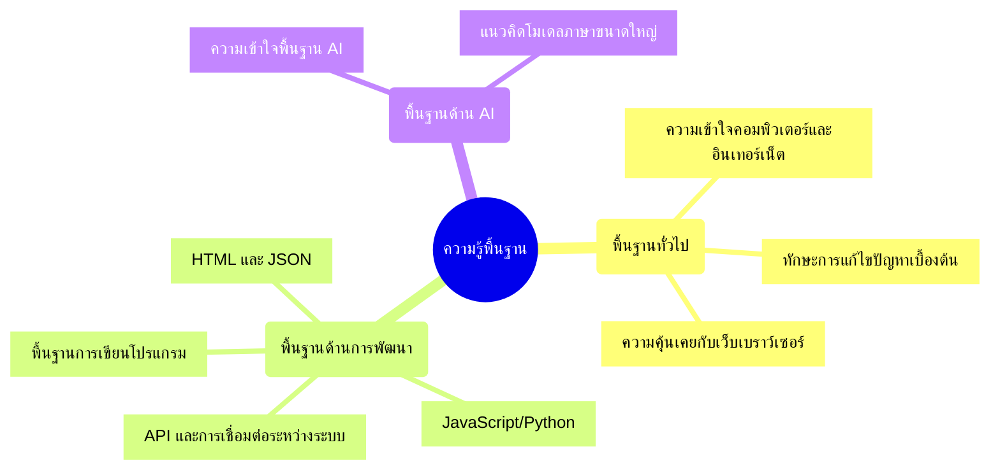

# Session 0: การเตรียมความพร้อมก่อนเรียน

## 🔍 ภาพรวม

เพื่อให้การเรียนรู้ในหลักสูตร AI Workshop ดำเนินไปอย่างราบรื่นและได้ประสิทธิภาพสูงสุด คุณควรเตรียมความพร้อมทั้งในด้านความรู้พื้นฐาน ซอฟต์แวร์ที่จำเป็น และทรัพยากรต่างๆ ที่ต้องใช้ เอกสารนี้รวบรวมสิ่งที่ต้องเตรียมทั้งหมดสำหรับการเรียนทั้ง 8 เซสชัน

## 📋 ความรู้พื้นฐานที่ควรมี

### พื้นฐานทั่วไป
- ความเข้าใจพื้นฐานเกี่ยวกับคอมพิวเตอร์และระบบอินเทอร์เน็ต
- ทักษะในการแก้ไขปัญหาทั่วไปเบื้องต้น
- ความคุ้นเคยกับการใช้งานเว็บเบราว์เซอร์ต่างๆ

### พื้นฐานด้านการพัฒนา
- ความเข้าใจพื้นฐานเกี่ยวกับการเขียนโปรแกรม (ไม่จำเป็นต้องเชี่ยวชาญ)
- พื้นฐาน [JavaScript](https://developer.mozilla.org/en-US/docs/Web/JavaScript) หรือ [Python](https://www.python.org/) จะช่วยให้เข้าใจตัวอย่างโค้ดได้ง่ายขึ้น
- ความรู้เบื้องต้นเกี่ยวกับ [HTML](https://developer.mozilla.org/en-US/docs/Web/HTML) และ [JSON](https://developer.mozilla.org/en-US/docs/Web/JavaScript/Reference/Global_Objects/JSON)
- ความเข้าใจพื้นฐานเกี่ยวกับ [API](https://www.redhat.com/en/topics/api/what-are-application-programming-interfaces) และการเชื่อมต่อระหว่างระบบ

### พื้นฐานด้าน AI
- ความเข้าใจเบื้องต้นเกี่ยวกับ AI และการเรียนรู้ของเครื่อง (ไม่จำเป็นต้องลึกซึ้ง)
- ความคุ้นเคยกับแนวคิดของ [โมเดลภาษาขนาดใหญ่ (LLMs)](https://en.wikipedia.org/wiki/Large_language_model) จะเป็นประโยชน์ต่อการเรียน

## 🛠️ เครื่องมือและซอฟต์แวร์ที่ต้องติดตั้ง

### ซอฟต์แวร์หลัก
- **[Docker](https://www.docker.com/) และ [Docker Compose](https://docs.docker.com/compose/)** - จำเป็นสำหรับเซสชัน 2, 4, 6 และ 8
- **[Git](https://git-scm.com/)** - สำหรับการจัดการเวอร์ชันโค้ด และดาวน์โหลดตัวอย่างโปรเจกต์

### สำหรับ n8n และ RAG (เซสชัน 2 และ 4)
- **[Docker Compose](https://docs.docker.com/compose/)** - สำหรับติดตั้ง [n8n](https://n8n.io/), [PostgreSQL](https://www.postgresql.org/), [ChromaDB](https://www.trychroma.com/) และ [MinIO](https://min.io/)
- **REST Client** (เช่น [Postman](https://www.postman.com/), [Insomnia](https://insomnia.rest/)) - สำหรับทดสอบ API (Optional)

### สำหรับ Ollama และ Open-WebUI (เซสชัน 6)
- **[Docker](https://www.docker.com/)** สำหรับติดตั้ง [Open-WebUI](https://github.com/open-webui/open-webui) และ [Ollama](https://ollama.ai/)
- ถ้าไม่ใช้ Docker: ติดตั้ง Ollama ตามระบบปฏิบัติการของคุณ
  - macOS: `brew install ollama`
  - Linux: `curl -fsSL https://ollama.com/install.sh | sh`
  - Windows: ดาวน์โหลดจาก [https://ollama.com/download](https://ollama.com/download)

## 🔑 API Keys และบัญชีที่ต้องเตรียม

### สำหรับ OpenAI API (เซสชัน 5 และอื่นๆ)
- สมัครบัญชีที่ [platform.openai.com](https://platform.openai.com)
- สร้าง API Key และเก็บไว้อย่างปลอดภัย
- เติมเครดิตหากต้องการใช้งานต่อหลังจากที่โควต้าทดลองฟรีหมด

### สำหรับ Google Gemini API (เซสชัน 5 และ 6)
- สมัครบัญชีที่ [Google AI Studio](https://aistudio.google.com/)
- สร้าง API Key สำหรับใช้กับ [Gemini API](https://ai.google.dev/)
- ตรวจสอบว่า Google AI Studio และ Gemini API ถูก Enable แล้ว

### สำหรับ MinIO (หากใช้ในเซสชัน 4 - RAG)
- เตรียม Access Key และ Secret Key สำหรับ [MinIO](https://min.io/)
- ค่าเริ่มต้นคือ `minioadmin` / `minioadmin`

### สำหรับ QDrant (หากใช้ในเซสชัน 4 - RAG)
- เตรียม Access Key และ Secret Key สำหรับ [QDrant](https://qdrant.tech)

### สำหรับ Picone (หากใช้ในเซสชัน 4 - RAG)

- เตรียม Access Key และ Secret Key สำหรับ [Picone](https://www.pinecone.io)

### สำหรับ Home Assistant
- สมัครบัญชีที่ [Home Assistant](https://www.home-assistant.io/)
- สร้าง Long-Lived Access Token สำหรับการเชื่อมต่อ API

### สำหรับ Google Sheets/Google Drive Trigger และ OAuth API
- สมัครบัญชี Google และเปิดใช้งาน Google Sheets API
- ตั้งค่า OAuth 2.0 Credentials ใน [Google Cloud Console](https://console.cloud.google.com/)

### สำหรับ OpenRouter
- สมัครบัญชีที่ [OpenRouter](https://openrouter.ai/)
- สร้าง API Key สำหรับการใช้งาน

### สำหรับ IMAP Account via Gmail
- เปิดใช้งาน IMAP ในการตั้งค่าบัญชี Gmail
- สร้าง App Password ใน [Google Account Security](https://myaccount.google.com/security)

### สำหรับ LINE Official
- สมัครบัญชี LINE Official Account ที่ [LINE Developers](https://developers.line.biz/)
- สร้าง Channel Access Token และ Channel Secret

### สำหรับ Postgres | Local
- ติดตั้ง PostgreSQL บนเครื่อง Local
- ตั้งค่าบัญชีผู้ใช้และรหัสผ่านสำหรับการเชื่อมต่อฐานข้อมูล

### สำหรับ Supabase | Cloud
- สมัครบัญชีที่ [Supabase](https://supabase.com/)
- สร้าง Project และเก็บ API Key สำหรับการเชื่อมต่อ

## 💻 ทรัพยากรฮาร์ดแวร์ที่แนะนำ

### ความต้องการขั้นต่ำ
- **CPU**: Dual-core หรือสูงกว่า
- **RAM**: อย่างน้อย 8GB (แนะนำ 16GB+ สำหรับการรันโมเดล Ollama ขนาดใหญ่)
- **พื้นที่เก็บข้อมูล**: อย่างน้อย 10GB สำหรับการติดตั้งซอฟต์แวร์และโมเดลต่างๆ
- **การเชื่อมต่ออินเทอร์เน็ต**: ความเร็วปานกลางถึงสูง

### ทรัพยากรแนะนำเพื่อประสิทธิภาพที่ดียิ่งขึ้น
- **CPU**: Quad-core หรือสูงกว่า
- **RAM**: 16GB หรือมากกว่า
- **GPU**: [NVIDIA GPU](https://www.nvidia.com/en-us/gpu/) สำหรับเร่งความเร็วของ Ollama (ถ้ามี)
- **พื้นที่เก็บข้อมูล**: 20GB หรือมากกว่า
- **การเชื่อมต่ออินเทอร์เน็ต**: ความเร็วสูง (สำคัญสำหรับการดาวน์โหลดโมเดลขนาดใหญ่)

## 📌 การเตรียมสภาพแวดล้อม (Environment Setup)

### สำหรับ Docker
1. ติดตั้ง Docker และ Docker Compose:
   - Windows/Mac: ดาวน์โหลดและติดตั้ง [Docker Desktop](https://www.docker.com/products/docker-desktop)
   - Linux: [ติดตั้ง Docker Engine](https://docs.docker.com/engine/install/) และ [Docker Compose](https://docs.docker.com/compose/install/)

## 🌐 แหล่งข้อมูลเพิ่มเติม

- [Docker Documentation](https://docs.docker.com/)
- [n8n Documentation](https://docs.n8n.io/)
- [OpenAI API Documentation](https://platform.openai.com/docs/)
- [Gemini API Documentation](https://ai.google.dev/docs)
- [Ollama Documentation](https://ollama.com)
- [QDrant Documentation](https://qdrant.tech/documentation/)
- [PostgreSQL Documentation](https://www.postgresql.org/docs/)
- [ChromaDB Documentation](https://www.trychroma.com/docs/)
- [MinIO Documentation](https://min.io/docs/minio/linux/index.html)

## ⚠️ หมายเหตุ

- ตรวจสอบให้แน่ใจว่าคุณมีสิทธิ์ในการติดตั้งซอฟต์แวร์บนเครื่องคอมพิวเตอร์ที่จะใช้
- หากเครื่องคอมพิวเตอร์ของคุณมีทรัพยากรจำกัด คุณสามารถใช้บริการคลาวด์อย่าง [Google Colab](https://colab.research.google.com/), [AWS](https://aws.amazon.com/), หรือ [DigitalOcean](https://www.digitalocean.com/) ในบางส่วนของ workshop ได้
- เตรียมพื้นที่ว่างในดิสก์ให้เพียงพอ โดยเฉพาะสำหรับการดาวน์โหลดโมเดล Ollama ที่มักมีขนาดใหญ่
- ควรทดสอบความเร็วอินเทอร์เน็ตของคุณก่อนวันอบรม เนื่องจากการดาวน์โหลดโมเดลบางตัวอาจใช้เวลานานพอสมควร

ด้วยการเตรียมความพร้อมตามรายการข้างต้น คุณจะสามารถเข้าร่วม AI Workshop ได้อย่างราบรื่นและได้รับประโยชน์สูงสุดจากการเรียนรู้ในทุกเซสชัน!

