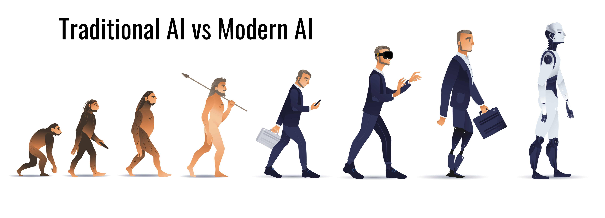
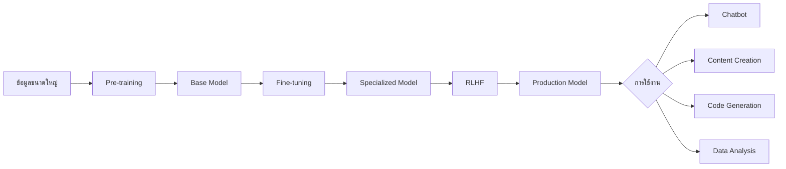
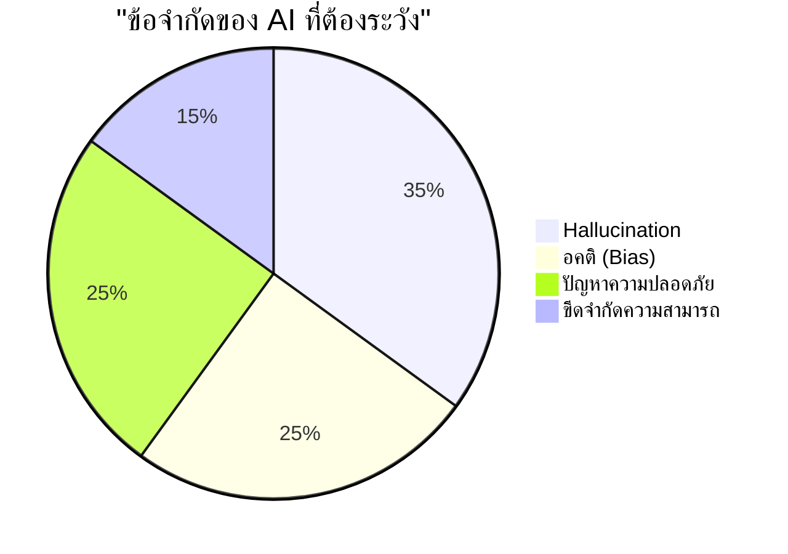

# Session 1: Modern AI Overview

## ภาพรวมเทคโนโลยี AI ปัจจุบัน

  

### AI ยุคปัจจุบัน: ความก้าวหน้าและความสำคัญ

ในช่วงไม่กี่ปีที่ผ่านมา เทคโนโลยี AI ได้ก้าวหน้าอย่างก้าวกระโดด โดยเฉพาะในด้าน Natural Language Processing (NLP) และ Computer Vision ปัจจัยสำคัญที่ทำให้ AI กำลังเป็นที่สนใจอย่างมากในปัจจุบัน ได้แก่:

- **การพัฒนาของ Deep Learning** - โครงข่ายประสาทเทียมที่มีความซับซ้อนมากขึ้น
- **การเพิ่มขึ้นของพลังการประมวลผล** - GPU และ TPU ที่มีประสิทธิภาพสูงขึ้น
- **ข้อมูลมหาศาล** - การมีชุดข้อมูลขนาดใหญ่สำหรับการฝึกฝนโมเดล
- **การเข้าถึงง่าย** - API และเครื่องมือที่ทำให้ผู้ใช้ทั่วไปสามารถใช้งาน AI ได้โดยไม่จำเป็นต้องมีความรู้ด้านเทคนิคมากนัก

### ตัวอย่าง AI ที่โดดเด่นในปัจจุบัน

#### ChatGPT (OpenAI)
- โมเดลภาษาที่สามารถโต้ตอบในลักษณะที่เหมือนมนุษย์
- เข้าใจบริบทของการสนทนา และตอบสนองอย่างสมเหตุสมผล
- สามารถสร้างเนื้อหาหลากหลายรูปแบบ เช่น บทความ โค้ด บทกวี ฯลฯ

#### Midjourney
- AI ที่สร้างภาพจากการอธิบายด้วยข้อความ (text-to-image)
- สร้างภาพที่มีความละเอียดและสวยงามสูง
- เป็นที่นิยมในวงการศิลปะและการออกแบบ

#### Stable Diffusion
- โมเดล open-source สำหรับสร้างภาพจากข้อความ
- สามารถรันบนคอมพิวเตอร์ส่วนบุคคลได้ ไม่จำเป็นต้องใช้พลังประมวลผลจากระบบคลาวด์
- มีชุมชนนักพัฒนาที่กระตือรือร้นในการปรับปรุงและต่อยอด

## Generative AI, LLMs และ Model ต่างๆ

### Generative AI คืออะไร?

Generative AI คือระบบ AI ที่สามารถสร้างเนื้อหาใหม่ได้ ไม่ว่าจะเป็นข้อความ รูปภาพ เสียง หรือวิดีโอ โดยเรียนรู้จากข้อมูลที่มีอยู่และสร้างผลลัพธ์ที่ไม่เคยมีมาก่อน แตกต่างจาก AI แบบดั้งเดิมที่มักจะเน้นการวิเคราะห์หรือจำแนกข้อมูลที่มีอยู่แล้ว

### Large Language Models (LLMs)

LLMs คือโมเดลภาษาขนาดใหญ่ที่ได้รับการฝึกฝนด้วยข้อมูลข้อความจำนวนมหาศาล ทำให้สามารถ:

- **เข้าใจและสร้างภาษามนุษย์** - ตอบคำถาม สรุปเนื้อหา แปลภาษา เขียนบทความ
- **แก้ปัญหา** - การคิดเชิงตรรกะ การแก้โจทย์ปัญหา
- **สร้างสรรค์เนื้อหา** - เขียนเรื่องสั้น กวี บทสนทนา
- **เขียนโค้ด** - สร้างและอธิบายโค้ดในภาษาโปรแกรมมิ่งต่างๆ

LLM ที่มีชื่อเสียง ได้แก่:
- GPT-4 (OpenAI)
- Claude (Anthropic)
- Llama 2 (Meta)
- Gemini (Google)
- DeepSeek (DeepSeek AI)

### กระบวนการทำงานของ LLMs

1. **Pre-training**: ฝึกฝนโมเดลด้วยข้อมูลขนาดใหญ่เพื่อให้เข้าใจภาษาในระดับพื้นฐาน
2. **Fine-tuning**: ปรับแต่งโมเดลให้เหมาะกับงานหรือโดเมนเฉพาะ
3. **RLHF (Reinforcement Learning from Human Feedback)**: ปรับปรุงโมเดลจากข้อเสนอแนะของมนุษย์เพื่อให้ผลลัพธ์มีคุณภาพ ปลอดภัย และมีประโยชน์มากขึ้น

## ตัวอย่างการใช้งาน AI ในโลกธุรกิจและงานวิจัย

### ธุรกิจ
- **Customer Service** - แชทบอทที่ตอบคำถามลูกค้าได้อย่างเป็นธรรมชาติ
- **Content Creation** - สร้างเนื้อหาการตลาด บทความ โฆษณา
- **Product Design** - สร้างแนวคิดการออกแบบและโปรโตไทป์
- **Data Analysis** - วิเคราะห์ข้อมูลและสร้างรายงานโดยอัตโนมัติ

### งานวิจัยและการศึกษา
- **Academic Research** - สรุปงานวิจัย ค้นหาข้อมูล เสนอแนะวิธีการทดลอง
- **Drug Discovery** - ค้นหาโมเลกุลยาที่มีประสิทธิภาพ
- **Climate Modeling** - ทำนายการเปลี่ยนแปลงสภาพภูมิอากาศ
- **Personalized Education** - ปรับเนื้อหาการเรียนรู้ให้เหมาะกับผู้เรียนแต่ละคน

## ประโยชน์และข้อจำกัดของ AI

### ประโยชน์
- **เพิ่มประสิทธิภาพ (Productivity)** - ช่วยให้ทำงานได้เร็วขึ้น ลดเวลาในการทำงานซ้ำๆ
- **ลดต้นทุน** - ลดค่าใช้จ่ายในกระบวนการที่สามารถทำงานอัตโนมัติได้
- **สร้างนวัตกรรม** - เปิดโอกาสให้เกิดแนวคิดและโซลูชันใหม่ๆ
- **การเข้าถึง** - ทำให้เทคโนโลยีขั้นสูงสามารถเข้าถึงได้โดยคนทั่วไป

### ข้อจำกัด
- **Hallucination** - AI อาจสร้างข้อมูลที่ไม่ถูกต้องหรือไม่มีอยู่จริง
- **อคติ (Bias)** - โมเดลอาจสะท้อนอคติที่มีอยู่ในข้อมูลที่ใช้ฝึกฝน
- **ปัญหาความปลอดภัย** - ความท้าทายในการป้องกันการใช้งานในทางที่ผิด
- **ขีดจำกัดความสามารถ** - ยังไม่สามารถทดแทนความคิดสร้างสรรค์หรือการตัดสินใจที่ซับซ้อนของมนุษย์ได้อย่างสมบูรณ์

## อนาคตของ AI

### แนวโน้มสำคัญ
- **Multimodal AI** - AI ที่สามารถทำงานกับข้อมูลหลายรูปแบบ (ข้อความ รูปภาพ เสียง วิดีโอ)
- **Agentic AI** - AI ที่สามารถทำงานอัตโนมัติ มีความเป็นอิสระมากขึ้น
- **Smaller, Specialized Models** - โมเดลขนาดเล็กที่มีประสิทธิภาพสูงสำหรับงานเฉพาะทาง
- **AI-Human Collaboration** - การทำงานร่วมกันระหว่าง AI และมนุษย์อย่างมีประสิทธิภาพยิ่งขึ้น

### ความท้าทายในอนาคต
- **Ethics and Governance** - การกำกับดูแลและจริยธรรมในการใช้ AI
- **Privacy Concerns** - การรักษาความเป็นส่วนตัวของข้อมูล
- **Job Displacement** - ผลกระทบต่อตลาดแรงงาน
- **Digital Divide** - ความไม่เท่าเทียมในการเข้าถึงเทคโนโลยี AI

## สรุป

เทคโนโลยี AI โดยเฉพาะ Generative AI และ LLMs กำลังเปลี่ยนแปลงวิธีที่เราทำงาน สร้างสรรค์ และแก้ปัญหา การเข้าใจพื้นฐานและศักยภาพของเทคโนโลยีเหล่านี้จะช่วยให้เราสามารถใช้ประโยชน์จากมันได้อย่างมีประสิทธิภาพและรับมือกับความท้าทายที่อาจเกิดขึ้น การเรียนรู้เครื่องมือและเทคนิคในคอร์สนี้จะช่วยให้คุณพร้อมสำหรับโลก AI ที่กำลังเติบโตอย่างรวดเร็ว

## แหล่งข้อมูลเพิ่มเติม

- [State of AI Report](https://www.stateof.ai/)
- [OpenAI Documentation](https://platform.openai.com/docs)
- [Hugging Face - The AI community](https://huggingface.co/)
- [AI Index Report - Stanford HAI](https://aiindex.stanford.edu/report/)
- [Papers With Code](https://paperswithcode.com/)
---
## RACKSYNC CO., LTD.

[RACKSYNC](https://github.com/racksync) เป็นบริษัทที่มีความเชี่ยวชาญในการพัฒนาโซลูชั่นด้าน IoT และระบบอัตโนมัติ เรามุ่งมั่นในการสร้างเทคโนโลยีที่เชื่อมต่อโลกเข้าด้วยกันผ่านระบบ IoT ที่มีประสิทธิภาพและเสถียร

### บริการของเรา
- การออกแบบและพัฒนาระบบ IoT แบบครบวงจร
- โซลูชั่นเชื่อมต่อสำหรับอุตสาหกรรม 4.0
- ระบบอัตโนมัติสำหรับบ้านและอาคารอัจฉริยะ
- การฝึกอบรมและเวิร์คช็อปด้าน IoT

ติดตามโปรเจกต์และอัปเดตได้ที่ [GitHub](https://github.com/racksync)

© 2007-2025 RACKSYNC CO., LTD. All rights reserved.