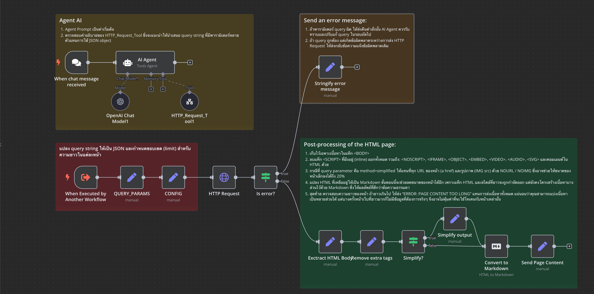
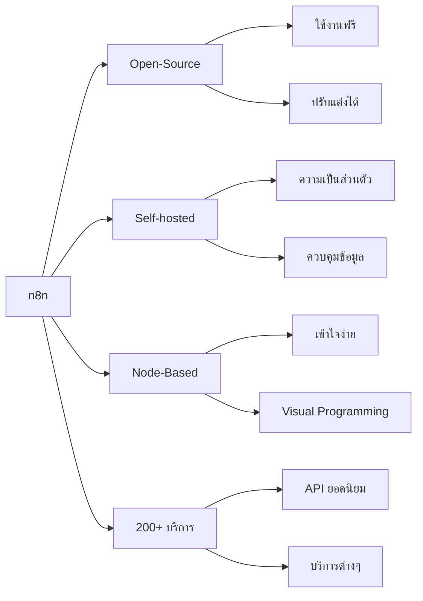
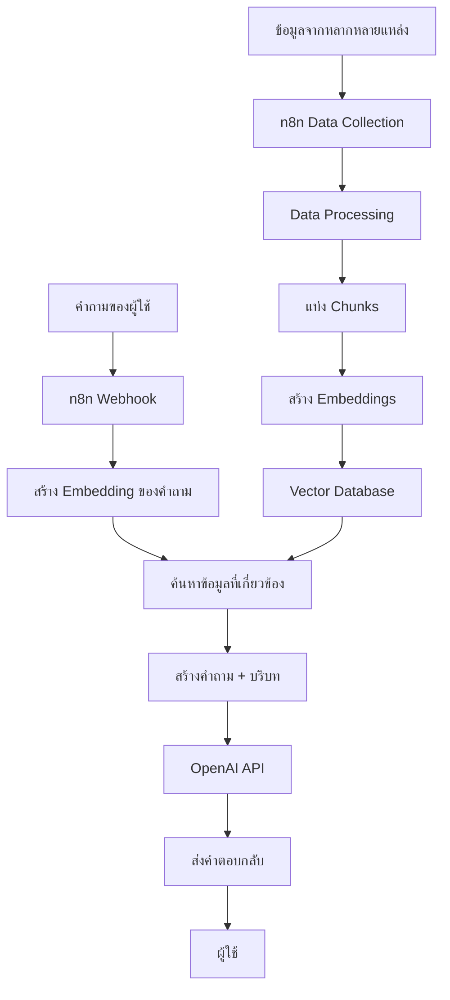

# Session 2: n8n Automation

## 🔍 ภาพรวม

n8n เป็นเครื่องมือสำหรับสร้างระบบอัตโนมัติแบบ open-source ที่ช่วยให้เราเชื่อมต่อและสร้างกระบวนการทำงานอัตโนมัติระหว่างแอปพลิเคชันและบริการต่างๆ ได้อย่างง่ายดายผ่านแนวคิด "low-code"

<div class="text-center">
  
</div>

## 🎯 วัตถุประสงค์การเรียนรู้

- เข้าใจแนวคิดของระบบอัตโนมัติแบบ Low-Code
- สามารถติดตั้งและใช้งาน n8n ผ่าน Docker Compose
- สร้างระบบทำงานอัตโนมัติขั้นพื้นฐานได้
- เชื่อมต่อ n8n กับบริการภายนอกต่างๆ
- ประยุกต์ใช้ n8n กับเทคโนโลยี AI และระบบ RAG

## 📚 เนื้อหา

### 1. แนวคิด Low-code Workflow Automation

ระบบอัตโนมัติแบบ Low-code คือแนวคิดในการสร้างระบบทำงานอัตโนมัติโดยที่ผู้ใช้ไม่จำเป็นต้องเขียนโค้ดมากนัก โดยอาศัยส่วนติดต่อผู้ใช้แบบกราฟิก (visual interface) ที่ช่วยให้แม้แต่ผู้ที่ไม่มีทักษะการเขียนโปรแกรมก็สามารถสร้างระบบอัตโนมัติได้ด้วยตนเอง

### 2. ทำไมต้อง n8n?



- **Open-Source**: เป็นซอฟต์แวร์เปิดเผยรหัสที่ใช้งานฟรี สามารถนำไปปรับแต่งต่อยอดได้อย่างอิสระ
- **Self-hosted**: สามารถติดตั้งบนเซิร์ฟเวอร์ที่คุณควบคุมเองได้ ทำให้มั่นใจในความเป็นส่วนตัวและความปลอดภัยของข้อมูล
- **Node-Based**: ออกแบบด้วยระบบโหนดที่สื่อความหมายและเข้าใจง่าย เพียงลากและวางเพื่อเชื่อมต่อเป็นขั้นตอนการทำงาน
- **รองรับการเชื่อมต่อมากกว่า 200+ บริการ**: ครอบคลุมบริการยอดนิยมเช่น Google Sheets, Airtable, OpenAI, Slack และอีกมากมาย

### 3. การติดตั้ง n8n ด้วย Docker Compose

การติดตั้ง n8n ด้วย Docker Compose เป็นวิธีที่แนะนำเนื่องจากสะดวก รวดเร็ว และง่ายต่อการปรับแต่งหรือขยายระบบในอนาคต

#### สร้างไฟล์ docker-compose.yml:

```yaml
services:
  n8n:
    image: n8nio/n8n
    container_name: n8n
    restart: always
    # Bind n8n only on the internal Docker interface.
    # If you only need to access n8n via Kong, you can
    # even remove this port mapping or restrict it to localhost
    ports:
      - "5678:5678"
    # All Traefik-related labels removed.
    # You can keep environment variables for your domain, etc.
    environment:
      - N8N_HOST=${SUBDOMAIN}.${DOMAIN_NAME}
      - N8N_PORT=5678
      #- N8N_PROTOCOL=https
      - NODE_ENV=production
      - WEBHOOK_URL=https://${SUBDOMAIN}.${DOMAIN_NAME}/
      - GENERIC_TIMEZONE=${GENERIC_TIMEZONE}
    networks:
      - ai-network
    # network host
    #network_mode: host
    volumes:
      - ./n8n_data:/home/node/.n8n

volumes:
  n8n_data:
    external: true

networks:
  ai-network:
    driver: bridge
```

#### สร้างไฟล์ .env (เพื่อความปลอดภัย):

```
DOMAIN_NAME=example.com
SUBDOMAIN=n8n
GENERIC_TIMEZONE=Asia/Bangkok
SSL_EMAIL=email@example.com
```

#### เริ่มการทำงาน:

```bash
# สร้างและเริ่มคอนเทนเนอร์
docker-compose up -d

# ตรวจสอบล็อก
docker-compose logs -f

# หยุดการทำงาน
docker-compose down
```

หลังจากเริ่มระบบแล้ว สามารถเข้าถึง n8n ได้ที่: http://localhost:5678

### 4. การสร้าง Workflow พื้นฐาน

#### ตัวอย่าง Workflow: รับข้อมูลจาก Google Sheet และส่งการแจ้งเตือนผ่าน Line

1. สร้าง Trigger ด้วย Schedule node (ทุก 1 ชั่วโมง)
2. เชื่อมต่อกับ Google Sheets node
3. ส่งข้อมูลไปยัง Line Notify node

### 5. การประยุกต์ใช้ n8n กับ RAG (Retrieval-Augmented Generation)



n8n สามารถใช้เป็นเครื่องมือในการสร้างระบบ RAG โดยช่วยในการ:

1. **การรวบรวมข้อมูล (Data Collection)**:
   - ดึงข้อมูลจากหลากหลายแหล่ง (เว็บไซต์, PDF, ฐานข้อมูล)
   - ตั้งเวลาการอัปเดตข้อมูลอัตโนมัติ

2. **การประมวลผลข้อมูล (Data Processing)**:
   - แปลงรูปแบบเอกสาร
   - ทำความสะอาดข้อมูล
   - แบ่งเอกสารเป็น chunks

3. **การสร้าง Embeddings**:
   - เชื่อมต่อกับ API ของ OpenAI, Cohere หรือ other embedding services
   - จัดเก็บ embeddings ลงในฐานข้อมูล

4. **การเชื่อมต่อกับ Vector Databases**:
   - ส่งข้อมูลไปยัง Pinecone, Weaviate, Qdrant หรือ other vector databases
   - ดึงข้อมูลที่เกี่ยวข้องเมื่อต้องการ

5. **การสร้างอินเทอร์เฟซและ Retrieval Logic**:
   - รับคำถามจากผู้ใช้
   - ค้นหาข้อมูลที่เกี่ยวข้อง
   - ส่งต่อไปยัง LLM เพื่อสร้างคำตอบ

#### ตัวอย่าง RAG Workflow ใน n8n:

1. **Webhook node**: รับคำถามจากผู้ใช้
2. **Function node**: สร้าง embedding ของคำถาม
3. **HTTP Request node**: ส่งคำขอไปยัง Vector DB เพื่อค้นหาข้อมูลที่เกี่ยวข้อง
4. **Function node**: จัดรูปแบบข้อมูลที่ได้รับ
5. **OpenAI node**: ส่งคำถามพร้อมข้อมูลที่เกี่ยวข้องไปยัง GPT
6. **Respond to Webhook**: ส่งคำตอบกลับไปยังผู้ใช้

## 🛠️ Workshop: RAG System ด้วย n8n

### การติดตั้ง n8n พร้อม Vector Database สำหรับระบบ RAG

```yaml
services:
  n8n:
    image: n8nio/n8n:latest
    container_name: n8n
    restart: always
    ports:
      - "5678:5678"
    environment:
      - N8N_HOST=${N8N_HOST:-localhost}
      - N8N_PORT=5678
      - N8N_PROTOCOL=${N8N_PROTOCOL:-http}
      - NODE_ENV=production
      - N8N_ENCRYPTION_KEY=${N8N_ENCRYPTION_KEY:-your-secret-key}
      - DB_TYPE=postgresdb
      - DB_POSTGRESDB_HOST=postgres
      - DB_POSTGRESDB_PORT=5432
      - DB_POSTGRESDB_DATABASE=n8n
      - DB_POSTGRESDB_USER=n8n
      - DB_POSTGRESDB_PASSWORD=${DB_POSTGRESDB_PASSWORD:-n8n}
      - WEBHOOK_URL=${N8N_PROTOCOL:-http}://${N8N_HOST:-localhost}:5678/
    volumes:
      - n8n_data:/home/node/.n8n
    depends_on:
      - postgres
    networks:
      - n8n-network

  postgres:
    image: postgres:14
    container_name: n8n-postgres
    restart: always
    environment:
      - POSTGRES_DB=n8n
      - POSTGRES_USER=n8n
      - POSTGRES_PASSWORD=${DB_POSTGRESDB_PASSWORD:-n8n}
    volumes:
      - postgres_data:/var/lib/postgresql/data
    networks:
      - n8n-network
      
  chroma:
    image: chromadb/chroma:latest
    container_name: chromadb
    restart: always
    ports:
      - "8000:8000"
    volumes:
      - chroma_data:/chroma/chroma
    networks:
      - n8n-network

volumes:
  n8n_data:
  postgres_data:
  chroma_data:

networks:
  n8n-network:
    driver: bridge
```

## 📚 แหล่งข้อมูลเพิ่มเติม

- [เว็บไซต์หลักของ n8n](https://n8n.io/)
- [เอกสารประกอบการใช้งาน n8n](https://docs.n8n.io/)
- [ชุมชน n8n บน GitHub](https://github.com/n8n-io/n8n)
- [ตัวอย่าง Workflows](https://n8n.io/workflows/)
