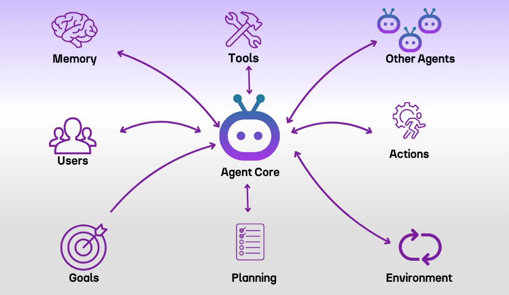
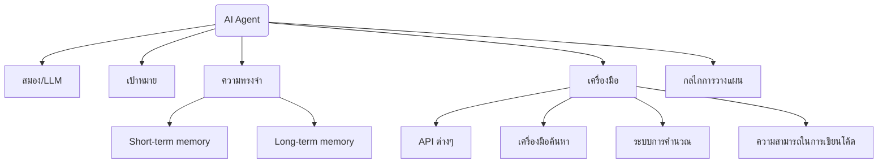
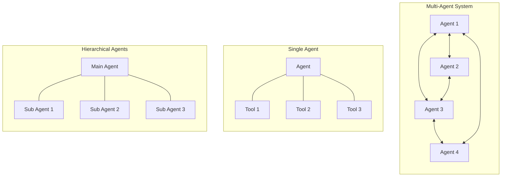

# Session 3: AI Agentic (Agent)

<div class="text-center">
  
</div>

## แนะนำแนวคิด AI Agent

AI Agent คือระบบ AI ที่ไม่ได้เป็นเพียงแค่เครื่องมือที่ตอบสนองต่อคำสั่ง แต่สามารถ "ลงมือทำ" หรือ "ดำเนินการ" เพื่อบรรลุเป้าหมายได้อย่างอิสระ โดยมีความแตกต่างอย่างมีนัยสำคัญจาก AI แบบดั้งเดิม

- **AI แบบ Reactive (ดั้งเดิม)**:
  - ทำงานแบบตอบสนอง (Input -> Process -> Output)
  - จำกัดอยู่ในขอบเขตของข้อมูลที่ถูกป้อนเข้ามา
  - ไม่มีความสามารถในการเริ่มดำเนินการด้วยตนเอง

- **AI แบบ Agentic (Agent)**:
  - มีความเป็นอิสระในการตัดสินใจ (Autonomous)
  - มีเป้าหมาย (Goal-oriented) และสามารถวางแผน (Planning)
  - สามารถโต้ตอบกับสภาพแวดล้อม (Environment interaction)
  - สามารถเรียนรู้และปรับตัวจากประสบการณ์ (Learning and adaptation)
  - มีความสามารถในการทำงานร่วมกับระบบอื่น (System integration)

## องค์ประกอบสำคัญของ AI Agent



AI Agent ประกอบด้วยองค์ประกอบสำคัญที่ทำงานร่วมกัน:

1. **สมอง (Brain)**: มักจะเป็น LLM ที่ทำหน้าที่ในการประมวลผล คิดวิเคราะห์ และตัดสินใจ

2. **เป้าหมาย (Goal)**: ต้องมีเป้าหมายที่ชัดเจนว่าต้องการบรรลุอะไร

3. **ความทรงจำ (Memory)**:
   - **Short-term memory**: ข้อมูลระหว่างการสนทนาหรือการทำงานปัจจุบัน
   - **Long-term memory**: ข้อมูลที่เก็บไว้ใช้ในอนาคต ประสบการณ์ก่อนหน้า

4. **เครื่องมือ (Tools)**: สามารถเรียกใช้เครื่องมือหรือบริการภายนอกได้ เช่น:
   - API ต่างๆ
   - เครื่องมือค้นหาข้อมูล
   - ระบบการคำนวณ
   - ความสามารถในการเขียนโค้ด

5. **กลไกการวางแผน (Planning)**: สามารถแยกปัญหาใหญ่เป็นขั้นตอนย่อยๆ และลำดับการทำงานได้

## รูปแบบของ AI Agent



1. **Single Agent**: Agent เดี่ยวที่ทำงานเพื่อบรรลุเป้าหมายหนึ่งๆ

2. **Multi-Agent System**: ระบบที่มี Agent หลายตัวทำงานร่วมกัน:
   - **Collaborative Agents**: Agent ที่ทำงานร่วมกันเพื่อแก้ปัญหาที่ซับซ้อน
   - **Competitive Agents**: Agent ที่แข่งขันกันเพื่อหาทางออกที่ดีที่สุด
   - **Hierarchical Agents**: Agent ที่มีลำดับการบังคับบัญชา มี Agent หลักที่มอบหมายงานให้ Agent รอง

3. **Specialized Agents**: Agent ที่มีความเชี่ยวชาญเฉพาะด้าน เช่น:
   - Research Agent: เน้นการค้นคว้าและรวบรวมข้อมูล
   - Coding Agent: เชี่ยวชาญในการเขียนและแก้ไขโค้ด
   - Data Analysis Agent: เน้นการวิเคราะห์ข้อมูลและสถิติ

## เครื่องมือและ Framework สำหรับการสร้าง Agent

ปัจจุบันมีเครื่องมือและ Framework มากมายที่ช่วยในการสร้าง AI Agent:

1. **LangChain**: Framework ยอดนิยมที่ช่วยในการสร้าง Agent โดยเชื่อมต่อกับ LLM ต่างๆ
   - รองรับการเชื่อมต่อกับ Memory Systems
   - มีโมดูล Tools และ Toolkit สำเร็จรูป
   - สามารถสร้าง Agent ที่มี "chains" ของการทำงานได้
   - มี Agent ประเภทต่างๆ เช่น ReAct, Plan-and-Execute

2. **AutoGPT**: ระบบ Autonomous GPT ที่สามารถทำงานหลายขั้นตอนได้โดยอัตโนมัติ
   - ตั้งเป้าหมายและดำเนินการเพื่อให้บรรลุเป้าหมาย
   - มีระบบจดจำข้อมูลและแผนการทำงาน

3. **Semantic Kernel**: ของ Microsoft ที่ช่วยในการสร้าง AI Agent แบบ modular
   - เน้นการนำ AI มาผสมผสานกับแอปพลิเคชันที่มีอยู่
   - ใช้งานง่ายกับภาษา C# และ Python
   - รองรับการเชื่อมต่อกับ OpenAI, Azure OpenAI และ Hugging Face

4. **AgentGPT**: แพลตฟอร์มสำหรับสร้าง autonomous AI Agent บนเว็บ
   - ใช้งานง่ายผ่านหน้าเว็บ
   - เหมาะสำหรับการทดลองแนวคิด Agent โดยไม่ต้องเขียนโค้ด

## วิธีการสร้าง AI Agent

### 1. การกำหนดเป้าหมายและขอบเขตที่ชัดเจน

ก่อนเริ่มสร้าง Agent ควรกำหนดอย่างชัดเจนว่า:
- Agent ควรทำอะไรได้บ้าง
- Agent ไม่ควรทำอะไรบ้าง
- ผลลัพธ์ที่คาดหวัง

### 2. การออกแบบโครงสร้าง Prompt

Agent จำเป็นต้องมี prompt ที่ออกแบบอย่างดี:

```
ตัวอย่าง Prompt Template สำหรับ AI Agent:

คุณเป็น {agent_role} ที่ช่วย {agent_purpose}

ความสามารถของคุณ:
1. {capability_1}
2. {capability_2}
...

ขั้นตอนการทำงานของคุณ:
1. วิเคราะห์คำขอของผู้ใช้
2. แยกปัญหาเป็นขั้นตอนย่อย
3. เลือกเครื่องมือที่เหมาะสม
4. ดำเนินการแต่ละขั้นตอน
5. สรุปผลลัพธ์

เครื่องมือที่คุณเข้าถึงได้:
{tool_1}: {tool_1_description}
{tool_2}: {tool_2_description}
...

กฎการทำงาน:
- {rule_1}
- {rule_2}
...
```

### 3. การสร้าง Chain of Thought และ ReAct Pattern

- **Chain of Thought (CoT)**: เป็นเทคนิคที่ให้ Agent แสดงกระบวนการคิดเป็นขั้นตอน
- **ReAct Pattern**: Reasoning และ Acting สลับกัน - คิด -> ลงมือทำ -> ประเมินผล -> คิดต่อ

### 4. การเชื่อมต่อกับ External Tools

เพื่อให้ Agent สามารถทำงานได้จริง ต้องเชื่อมต่อกับเครื่องมือภายนอก:
- API Connections
- Database Access
- File Systems
- Search Engines
- อื่นๆ ตามความต้องการ

## ตัวอย่าง Use Cases ของ AI Agent

### 1. Chatbot อัจฉริยะ
ไม่ใช่เพียงแค่ตอบคำถาม แต่สามารถดำเนินการต่างๆ ได้:
- จองร้านอาหารผ่านระบบจองออนไลน์
- สั่งซื้อสินค้าเมื่อลูกค้าแสดงความต้องการ
- แนะนำสินค้าโดยการวิเคราะห์ความต้องการและพฤติกรรมของลูกค้า

### 2. Personal Assistant
- จัดการตารางนัด โดยเชื่อมต่อกับปฏิทิน
- สรุปอีเมลและจัดลำดับความสำคัญ
- เตือนการประชุมและเตรียมข้อมูลที่เกี่ยวข้อง
- ค้นหาข้อมูลและสรุปเนื้อหาตามที่ร้องขอ

### 3. Data Analysis Assistant
- วิเคราะห์ข้อมูลจำนวนมาก
- สร้างรายงานอัตโนมัติ
- ค้นหาข้อมูลเชิงลึกและแนวโน้ม
- แสดงผลในรูปแบบกราฟหรือตาราง

### 4. Customer Service Agent
- ตอบคำถามทั่วไปโดยอัตโนมัติ
- ส่งต่อปัญหาที่ซับซ้อนให้กับมนุษย์
- ติดตามสถานะคำสั่งซื้อและแจ้งให้ลูกค้าทราบ
- ดำเนินการขอคืนสินค้าหรือขอเงินคืน

## การเชื่อมต่อ Agent กับ Automation Tool (เช่น n8n)

การนำ AI Agent มาทำงานร่วมกับเครื่องมือ Automation เช่น n8n จะช่วยเพิ่มความสามารถให้กับระบบอย่างมาก:

### แนวคิดการทำงานร่วมกัน:
- **AI Agent = สมอง**: ทำหน้าที่คิด วิเคราะห์ ตัดสินใจ
- **n8n = แขนขา**: ทำหน้าที่ดำเนินการตามที่ Agent ตัดสินใจ

### ตัวอย่างการทำงานร่วมกัน:

1. **รับข้อมูลจาก Trigger ใน n8n** (เช่น อีเมลเข้าใหม่, การกรอกฟอร์ม, เวลาที่กำหนด)
2. **ส่งข้อมูลไปยัง AI Agent** ผ่าน API (เช่น OpenAI API)
3. **AI Agent วิเคราะห์และตัดสินใจ** ว่าควรดำเนินการอย่างไร
4. **ส่งคำสั่งกลับมาที่ n8n** เพื่อดำเนินการต่อ
5. **n8n ทำงานตามคำสั่ง** (เช่น ส่งอีเมล, อัปเดตฐานข้อมูล, โพสต์ข้อความ)
6. **รายงานผลกลับไปที่ Agent** เพื่อการตัดสินใจในขั้นต่อไป

### ตัวอย่างการเชื่อมต่อ Workflow:

1. **Customer Support Agent**:
   ```
   n8n Trigger (อีเมลลูกค้าเข้า) → 
   → OpenAI API (AI Agent วิเคราะห์ปัญหา) → 
   → n8n ดำเนินการ (ตอบกลับอัตโนมัติ/สร้างติกเก็ต) →
   → ถ้าต้องเพิ่มข้อมูล กลับไปถาม AI Agent
   ```

2. **Data Monitoring Agent**:
   ```
   n8n Trigger (ข้อมูลจาก API/Database ทุก 1 ชั่วโมง) → 
   → OpenAI API (AI Agent ตรวจสอบความผิดปกติ) → 
   → n8n ดำเนินการ (แจ้งเตือน/บันทึกข้อมูล/แก้ไขอัตโนมัติ)
   ```

3. **Content Creation Agent**:
   ```
   n8n Trigger (มี Topic ใหม่ในระบบ) → 
   → OpenAI API (AI Agent สร้างเนื้อหา) → 
   → n8n ดำเนินการ (จัดรูปแบบ/โพสต์ลงบล็อก/โพสต์โซเชียลมีเดีย)
   ```

## ข้อควรระวังและความท้าทาย

### 1. การควบคุมและ Guardrails
- ต้องกำหนดขอบเขตการทำงานของ Agent ให้ชัดเจน
- ควรมีระบบตรวจสอบและอนุมัติสำหรับการทำงานที่มีผลกระทบสูง
- ออกแบบ "circuit breaker" เพื่อหยุด Agent เมื่อทำงานนอกขอบเขต

### 2. ความปลอดภัยของข้อมูล
- ระมัดระวังการส่งข้อมูลที่เป็นความลับไปยัง External API
- ใช้การเข้ารหัสและการพิสูจน์ตัวตนที่เหมาะสม
- ปฏิบัติตามกฎหมายคุ้มครองข้อมูลส่วนบุคคล (เช่น PDPA, GDPR)

### 3. การจัดการค่าใช้จ่าย
- การเรียกใช้ API มากเกินไปอาจนำไปสู่ค่าใช้จ่ายที่สูง
- ควรมีการตั้งค่าขีดจำกัดและการแจ้งเตือน
- ติดตามการใช้งานและประสิทธิภาพเพื่อปรับปรุง ROI

### 4. ความน่าเชื่อถือของ Agent
- AI Agent อาจให้ข้อมูลที่ไม่ถูกต้อง (Hallucination)
- ควรมีระบบตรวจสอบและยืนยันข้อมูลที่สำคัญ
- ใช้เทคนิคเช่น RAG เพื่อเพิ่มความแม่นยำ

## ประโยชน์ที่ผู้เรียนจะได้รับ:

- **เข้าใจแนวคิดและหลักการทำงานของ AI Agent**: สามารถแยกแยะความแตกต่างระหว่าง AI ทั่วไปกับ Agent ที่มีความสามารถในการตัดสินใจและดำเนินการ

- **สามารถออกแบบและพัฒนา AI Agent เบื้องต้น**: รู้จักองค์ประกอบสำคัญและแนวทางในการสร้าง AI Agent ที่ตอบโจทย์ความต้องการ

- **เห็นภาพรวมการทำงานร่วมกันระหว่าง AI และระบบอัตโนมัติ**: เข้าใจว่า AI Agent สามารถทำงานร่วมกับเครื่องมืออื่นๆ เช่น n8n เพื่อสร้างระบบอัตโนมัติที่ชาญฉลาด

- **สามารถประยุกต์ใช้ AI Agent ในองค์กรหรือธุรกิจ**: มีแนวคิดในการนำ AI Agent ไปใช้แก้ปัญหาหรือเพิ่มประสิทธิภาพในการทำงาน

## Next Steps:

- ลงมือปฏิบัติสร้าง AI Agent อย่างง่ายด้วย LangChain หรือ OpenAI API
- ทดลองเชื่อมต่อ AI Agent กับ n8n เพื่อสร้าง Workflow อัตโนมัติ
- ศึกษาเพิ่มเติมเกี่ยวกับการจัดการ Memory และ Context ของ Agent

## ทรัพยากรเพิ่มเติม

- [OpenAI Function Calling](https://platform.openai.com/docs/guides/function-calling)
- [LangChain Documentation](https://python.langchain.com/docs/get_started/introduction)
- [Semantic Kernel](https://github.com/microsoft/semantic-kernel)
- [AutoGPT](https://github.com/Significant-Gravitas/AutoGPT)
- [AgentGPT](https://agentgpt.reworkd.ai/)
