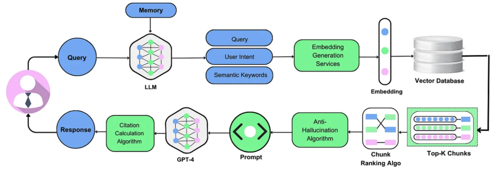
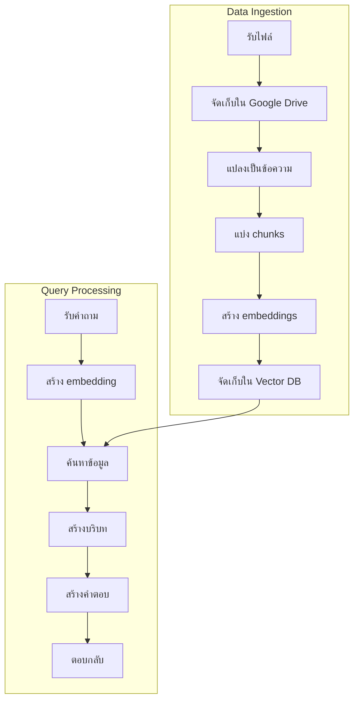

# Session 4: RAG (Retrieval-Augmented Generation) กับ n8n

<div class="text-center">
  
</div>

## 🔍 ภาพรวมของ RAG

RAG (Retrieval-Augmented Generation) เป็นเทคนิคที่ผสมผสานระหว่างการค้นคืนข้อมูล (Retrieval) และการสร้างเนื้อหา (Generation) เพื่อเพิ่มประสิทธิภาพและความแม่นยำให้กับระบบ AI ด้วยการดึงข้อมูลที่เกี่ยวข้องมาเสริมความรู้ให้กับโมเดลก่อนที่จะสร้างคำตอบ

## 🎯 วัตถุประสงค์การเรียนรู้

- เข้าใจหลักการทำงานและประโยชน์ของเทคโนโลยี RAG
- เรียนรู้วิธีการสร้างระบบ RAG โดยใช้ n8n เป็นเครื่องมือหลัก
- สามารถติดตั้งและใช้งาน n8n ร่วมกับฐานข้อมูลแบบเวกเตอร์ (Vector Database)
- ประยุกต์ใช้ RAG ในการพัฒนาแอปพลิเคชันที่ตอบคำถามได้อย่างแม่นยำ

## 📚 เนื้อหา

### 1. ทำไมต้องใช้ RAG?

| LLMs แบบดั้งเดิม (ข้อจำกัด) | RAG (ประโยชน์) |
|--------------------------|----------------|
| **Hallucination**: สร้างข้อมูลที่ไม่ถูกต้องหรือเป็นเท็จโดยไม่มีแหล่งอ้างอิง | **ลดการ Hallucination**: ตอบคำถามโดยอ้างอิงจากข้อมูลที่เชื่อถือได้จริง |
| **ข้อมูลล้าสมัย**: ความรู้ถูกจำกัดอยู่เพียงแค่ข้อมูลที่ใช้ในการฝึกสอนเท่านั้น | **ข้อมูลทันสมัย**: สามารถอัปเดตข้อมูลที่นำมาใช้ได้อย่างต่อเนื่อง |
| **ขาดความเชี่ยวชาญเฉพาะทาง**: ไม่สามารถเข้าถึงข้อมูลเฉพาะขององค์กรหรือโดเมนที่ต้องการได้ | **ความรู้เฉพาะทาง**: เชื่อมต่อกับฐานข้อมูลเฉพาะทางหรือเอกสารภายในองค์กรได้ |
|  | **ปรับปรุงง่าย**: ไม่จำเป็นต้อง fine-tune โมเดลใหม่ทั้งหมด |

#### ข้อจำกัดของ LLMs แบบดั้งเดิม

- **Hallucination**: สร้างข้อมูลที่ไม่ถูกต้องหรือเป็นเท็จโดยไม่มีแหล่งอ้างอิง
- **ข้อมูลล้าสมัย**: ความรู้ถูกจำกัดอยู่เพียงแค่ข้อมูลที่ใช้ในการฝึกสอนเท่านั้น
- **ขาดความเชี่ยวชาญเฉพาะทาง**: ไม่สามารถเข้าถึงข้อมูลเฉพาะขององค์กรหรือโดเมนที่ต้องการได้

#### ประโยชน์ของ RAG

- **ลดการ Hallucination**: ตอบคำถามโดยอ้างอิงจากข้อมูลที่เชื่อถือได้จริง
- **ข้อมูลทันสมัย**: สามารถอัปเดตข้อมูลที่นำมาใช้ได้อย่างต่อเนื่อง
- **ความรู้เฉพาะทาง**: เชื่อมต่อกับฐานข้อมูลเฉพาะทางหรือเอกสารภายในองค์กรได้
- **ปรับปรุงง่าย**: ไม่จำเป็นต้อง fine-tune โมเดลใหม่ทั้งหมด

#### RAG vs Fine-tuning: ทางเลือกที่คุ้มค่ากว่า

| ปัจจัยเปรียบเทียบ | Fine-tuning | RAG |
|-----------------|------------|-----|
| **ทรัพยากร** | สูง | ต่ำ |
| **ต้นทุน** | สูง | ประหยัด |
| **เวลา** | นาน | รวดเร็ว |
| **ข้อมูล** | Static | Dynamic |

**ทำไม RAG จึงเหนือกว่า Fine-tuning?**

การทำ Fine-tuning เปรียบเสมือนการปั้นโมเดลใหม่ทั้งหมด คุณต้องใส่ทรัพยากรมหาศาลเพื่อให้โมเดลเรียนรู้สิ่งใหม่ๆ ไม่ว่าจะเป็น:

- **ทรัพยากรการประมวลผลที่สูงลิบ**: การ fine-tune ต้องใช้ GPU ที่มีประสิทธิภาพสูง บางครั้งต้องใช้หลาย GPU พร้อมกัน อาจต้องลงทุนหลายแสนถึงหลายล้านบาท
- **ต้นทุนที่มองไม่เห็นปลายทาง**: ค่าใช้จ่ายในการเทรนแต่ละครั้งสูงมาก ทั้งค่าไฟฟ้า ค่าเช่าทรัพยากรคลาวด์ ซึ่งอาจสูงถึงหลักหมื่นถึงหลักแสนบาท
- **ระยะเวลาที่ยาวนาน**: การ fine-tune อาจใช้เวลาหลายวันถึงหลายสัปดาห์ ทำให้ไม่สามารถตอบสนองความต้องการเร่งด่วนได้
- **ความไม่ยืดหยุ่นของข้อมูล**: เมื่อข้อมูลมีการเปลี่ยนแปลง คุณต้องเทรนโมเดลใหม่ทั้งหมด เสมือนเริ่มต้นจากศูนย์

ในทางตรงกันข้าม **RAG คือทางออกที่ชาญฉลาด**:

- **ใช้ทรัพยากรอย่างคุ้มค่า**: ไม่จำเป็นต้องมี GPU ที่ทรงพลัง เพียงแค่ประมวลผล embeddings และจัดการการค้นหา
- **ประหยัดต้นทุนอย่างเหลือเชื่อ**: ลดค่าใช้จ่ายลงได้มากกว่า 90% เมื่อเทียบกับการ fine-tune
- **เริ่มใช้งานได้ในพริบตา**: สามารถติดตั้งและเริ่มใช้งานได้ภายในไม่กี่ชั่วโมง ไม่ต้องรอเป็นวันหรือสัปดาห์
- **ข้อมูลแบบ Dynamic**: เมื่อมีข้อมูลใหม่ เพียงแค่เพิ่มเข้าไปในฐานข้อมูลเวกเตอร์ โมเดลก็สามารถใช้ข้อมูลใหม่ได้ทันที โดยไม่ต้องเทรนใหม่

**ความยืดหยุ่นที่เหนือชั้น**: องค์กรที่มีข้อมูลเปลี่ยนแปลงบ่อย เช่น ข้อมูลผลิตภัณฑ์ กฎระเบียบ หรือเอกสารภายใน การใช้ RAG ช่วยให้ระบบ AI ของคุณอัปเดตตามข้อมูลล่าสุดได้โดยอัตโนมัติ ไม่ต้องเสียเวลาและทรัพยากรในการเทรนโมเดลซ้ำแล้วซ้ำเล่า

**ผลลัพธ์ที่ตรวจสอบได้**: RAG สร้างคำตอบโดยอ้างอิงจากแหล่งข้อมูลที่ชัดเจน ทำให้คุณติดตามและตรวจสอบที่มาของคำตอบได้ง่าย สร้างความน่าเชื่อถือให้กับระบบ AI ของคุณ

จากประสบการณ์จริง องค์กรหลายแห่งที่เปลี่ยนจาก Fine-tuning มาใช้ RAG สามารถลดค่าใช้จ่ายได้มากกว่า 80% ขณะที่ได้ผลลัพธ์ที่แม่นยำและมีประสิทธิภาพมากกว่า นี่คือเหตุผลว่าทำไม RAG จึงเป็นทางเลือกที่ฉลาดกว่าสำหรับการพัฒนา AI ในยุคปัจจุบัน

### 2. การติดตั้ง RAG System ด้วย Docker Compose

สำหรับการสร้างระบบ RAG ที่สมบูรณ์ เราจะติดตั้งองค์ประกอบหลักดังนี้:
1. n8n - สำหรับจัดการ workflow และเชื่อมต่อระบบต่างๆ
2. Qdrant - ฐานข้อมูลแบบเวกเตอร์สำหรับเก็บ embeddings
3. Google Drive - บริการจัดเก็บไฟล์บนคลาวด์เพื่อเก็บเอกสาร (PDF, DOCX)
4. PostgreSQL - ฐานข้อมูลสำหรับเก็บข้อมูลการทำงานของ n8n

```yaml
services:
  n8n:
    image: n8nio/n8n:latest
    container_name: n8n
    restart: always
    ports:
      - "5678:5678"
    environment:
      - N8N_HOST=${N8N_HOST:-localhost}
      - N8N_PORT=5678
      - N8N_PROTOCOL=${N8N_PROTOCOL:-http}
      - NODE_ENV=production
      - N8N_ENCRYPTION_KEY=${N8N_ENCRYPTION_KEY:-your-secret-key}
      - DB_TYPE=postgresdb
      - DB_POSTGRESDB_HOST=postgres
      - DB_POSTGRESDB_PORT=5432
      - DB_POSTGRESDB_DATABASE=n8n
      - DB_POSTGRESDB_USER=n8n
      - DB_POSTGRESDB_PASSWORD=${DB_POSTGRESDB_PASSWORD:-n8n}
      - WEBHOOK_URL=${N8N_PROTOCOL:-http}://${N8N_HOST:-localhost}:5678/
    volumes:
      - n8n_data:/home/node/.n8n
    depends_on:
      - postgres
      - qdrant
    networks:
      - ai-network

  postgres:
    image: postgres:14
    container_name: n8n-postgres
    restart: always
    environment:
      - POSTGRES_DB=n8n
      - POSTGRES_USER=n8n
      - POSTGRES_PASSWORD=${DB_POSTGRESDB_PASSWORD:-n8n}
    volumes:
      - postgres_data:/var/lib/postgresql/data
    networks:
      - ai-network
      
  qdrant:
    image: qdrant/qdrant:latest
    container_name: qdrant
    restart: always
    volumes:
      - qdrant_data:/qdrant/storage
    ports:
      - "6333:6333"
    networks:
      - ai-network

volumes:
  n8n_data:
  postgres_data:
  qdrant_data:

networks:
  ai-network:
    driver: bridge
```

### 3. สร้าง RAG System ด้วย n8n



การใช้ n8n ในการสร้างระบบ RAG มีขั้นตอนหลักดังนี้:

#### 3.1 Data Ingestion Workflow

1. **รับไฟล์**: ใช้ HTTP Request node หรือ Webhook node เพื่อรับไฟล์เอกสารจากผู้ใช้
2. **จัดเก็บไฟล์**: บันทึกไฟล์ลงใน Google Drive ด้วย Google Drive node
3. **แปลงเอกสาร**: ทำการแปลงเอกสารประเภทต่างๆ ให้เป็นข้อความด้วย Function node
4. **แบ่ง chunks**: แบ่งข้อความเป็นส่วนย่อยที่มีความหมายด้วย Function node เพื่อให้เหมาะสมกับการสร้าง embeddings
5. **สร้าง embeddings**: ส่งข้อความไปยัง OpenAI API ผ่าน OpenAI node เพื่อแปลงเป็น embedding vectors
6. **จัดเก็บใน Vector DB**: นำ embeddings ที่ได้ส่งไปเก็บใน Qdrant ผ่าน HTTP Request node

#### 3.2 Query Workflow

1. **รับคำถาม**: ใช้ Webhook node เพื่อรับคำถามจากผู้ใช้
2. **สร้าง embedding ของคำถาม**: แปลงคำถามเป็น embedding vector ด้วย OpenAI node
3. **ค้นหาข้อมูลที่เกี่ยวข้อง**: ค้นหาเนื้อหาที่เกี่ยวข้องใน Qdrant ด้วยการเปรียบเทียบ embeddings
4. **สร้างบริบท**: รวบรวมข้อมูลที่ค้นพบมาสร้างเป็นบริบทที่เกี่ยวข้องกับคำถาม
5. **สร้างคำตอบ**: ส่งคำถามพร้อมบริบทไปยัง OpenAI API เพื่อสร้างคำตอบที่แม่นยำ
6. **ตอบกลับ**: ส่งคำตอบกลับไปยังผู้ใช้ผ่าน HTTP Response

### 4. การจัดการองค์ประกอบของ RAG ใน n8n

#### 4.1 Vector Database (Qdrant)

Qdrant API ตัวอย่างที่ใช้ใน n8n HTTP Request node:

- **สร้าง Collection:**
  - Method: PUT
  - URL: http://qdrant:6333/collections/my_documents
  - Body: `{ "vectors": { "size": 1536, "distance": "Cosine" } }`

- **เพิ่ม Embeddings:**
  - Method: PUT
  - URL: http://qdrant:6333/collections/my_documents/points
  - Body: `{ "points": [{ "id": 1, "vector": [embedding_vector], "payload": {"source": "document1.pdf", "text": "text content"} }] }`

- **ค้นหาข้อมูล:**
  - Method: POST
  - URL: http://qdrant:6333/collections/my_documents/points/search
  - Body: `{ "vector": [query_vector], "limit": 5 }`

#### 4.2 Document Storage (Google Drive)

การตั้งค่า Google Drive ใน n8n:

1. เพิ่ม Google Drive credentials ใน n8n
   - ไปที่เมนู Credentials และเลือก "Create New Credentials"
   - เลือกประเภท "OAuth2 API"
   - เลือก "Google Drive" 
   - ทำการเชื่อมต่อกับบัญชี Google ของคุณ

2. สร้างโฟลเดอร์ใน Google Drive สำหรับเก็บเอกสาร
   - สร้างโฟลเดอร์ชื่อ "RAG_Documents"
   - จดบันทึก ID ของโฟลเดอร์เพื่อใช้ในการอัปโหลดไฟล์

3. ใน n8n ใช้ Google Drive node เพื่อจัดการไฟล์:
   - Operation: Upload
   - Folder: ใส่ ID ของโฟลเดอร์ที่สร้างไว้
   - Binary Property: เลือก property ที่มีไฟล์ที่ต้องการอัปโหลด

#### 4.3 OpenAI API Integration

ตัวอย่าง Function node สำหรับสร้าง embeddings:

```javascript
// Input: รับข้อความที่แบ่งเป็น chunks
// จาก items[0].json.chunks = ["text1", "text2", ...]

const chunks = items[0].json.chunks;
const results = [];

// สร้าง return items สำหรับส่งไปที่ OpenAI node
for (const chunk of chunks) {
  results.push({
    json: {
      text: chunk,
      operation: "embeddings"
    }
  });
}

return results;
```

### 5. ตัวอย่าง Workshop: Simple RAG System

#### 5.1 เตรียมระบบ

1. ติดตั้งระบบตาม docker-compose ที่เตรียมไว้
2. เริ่มการทำงานด้วยคำสั่ง:
   ```bash
   docker-compose up -d
   ```
3. ตั้งค่าการเชื่อมต่อกับ Google Drive ใน n8n

#### 5.2 สร้าง Data Ingestion Workflow

1. เข้าสู่ n8n ที่ http://localhost:5678
2. สร้าง Workflow ใหม่ชื่อ "RAG - Data Ingestion"
3. เพิ่ม nodes และเชื่อมต่อตามขั้นตอนที่อธิบายในหัวข้อ 3.1

#### 5.3 สร้าง Query Workflow

1. สร้าง Workflow ใหม่ชื่อ "RAG - Query System"
2. เพิ่ม nodes และเชื่อมต่อตามขั้นตอนที่อธิบายในหัวข้อ 3.2

## 📚 แหล่งข้อมูลเพิ่มเติม

- [n8n Documentation](https://docs.n8n.io/)
- [Qdrant Documentation](https://qdrant.tech/documentation/)
- [Google Drive API Documentation](https://developers.google.com/drive/api/guides/about-sdk)
- [OpenAI API Documentation](https://platform.openai.com/docs/api-reference)
- [RAG: Retrieval-Augmented Generation โดย AWS](https://aws.amazon.com/th/what-is/retrieval-augmented-generation/)
- [LangChain RAG Framework](https://python.langchain.com/docs/use_cases/question_answering/)
- [Vector Databases Explained](https://www.pinecone.io/learn/vector-database/)

## 📌 สรุป

การใช้ n8n ร่วมกับเทคนิค RAG ช่วยให้เราสามารถสร้างระบบ AI ที่ตอบคำถามได้อย่างแม่นยำและมีความน่าเชื่อถือสูง เนื่องจากอ้างอิงจากข้อมูลที่เรากำหนด ข้อดีคือเราไม่จำเป็นต้องเขียนโค้ดมากนัก การติดตั้งระบบด้วย Docker Compose ทำให้การเริ่มต้นใช้งานเป็นเรื่องง่าย และสามารถปรับขยายขนาดหรือปรับแต่งได้ตามความต้องการ นับเป็นทางเลือกที่เหมาะสมอย่างยิ่งสำหรับองค์กรที่ต้องการนำ AI มาประยุกต์ใช้กับข้อมูลภายในองค์กรโดยเฉพาะ
