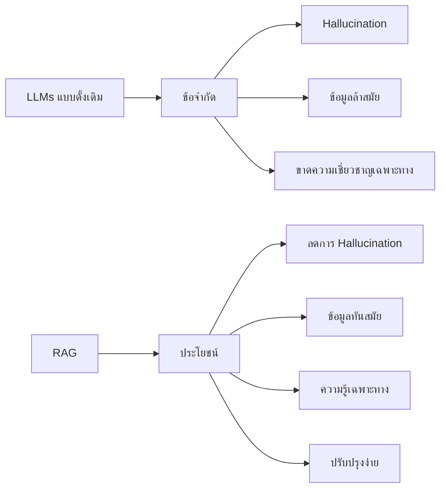
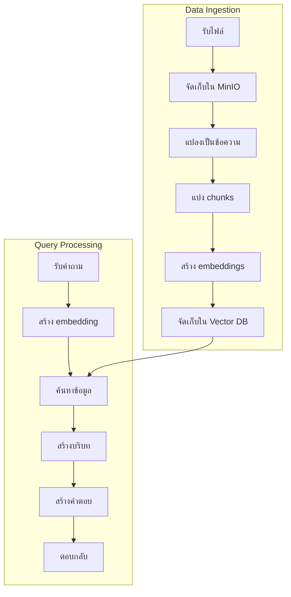

# Session 4: RAG (Retrieval-Augmented Generation) กับ n8n

<div class="text-center">
  
</div>

## 🔍 ภาพรวมของ RAG

RAG (Retrieval-Augmented Generation) เป็นเทคนิคที่ผสมผสานระหว่างการค้นคืนข้อมูล (Retrieval) และการสร้างเนื้อหา (Generation) เพื่อเพิ่มความสามารถและความแม่นยำให้กับระบบ AI โดยเน้นการดึงข้อมูลที่เกี่ยวข้องมาเสริมความรู้ให้กับโมเดลก่อนสร้างคำตอบ

## 🎯 วัตถุประสงค์การเรียนรู้

- เข้าใจหลักการทำงานและประโยชน์ของ RAG
- เรียนรู้วิธีการสร้างระบบ RAG โดยใช้ n8n เป็นเครื่องมือหลัก
- สามารถติดตั้งและใช้งาน n8n ร่วมกับ Vector Database
- ประยุกต์ใช้ RAG ในการพัฒนาแอปพลิเคชันที่มีความแม่นยำสูง

## 📚 เนื้อหา

### 1. ทำไมต้องใช้ RAG?



#### ข้อจำกัดของ LLMs แบบดั้งเดิม

- **Hallucination**: สร้างข้อมูลที่ไม่ถูกต้อง
- **ข้อมูลล้าสมัย**: ความรู้จำกัดอยู่ที่ข้อมูลการฝึกสอน
- **ขาดความเชี่ยวชาญเฉพาะทาง**: ไม่เข้าถึงข้อมูลเฉพาะองค์กร

#### ประโยชน์ของ RAG

- **ลดการ Hallucination**: อ้างอิงข้อมูลที่เชื่อถือได้
- **ข้อมูลทันสมัย**: ข้อมูลที่นำมาใช้สามารถปรับปรุงได้
- **ความรู้เฉพาะทาง**: เชื่อมต่อกับฐานข้อมูลเฉพาะ
- **ปรับปรุงง่าย**: ไม่ต้อง fine-tune โมเดลใหม่

### 2. การติดตั้ง RAG System ด้วย Docker Compose

สำหรับการสร้างระบบ RAG ที่สมบูรณ์ เราจะติดตั้งองค์ประกอบหลักดังนี้:
1. n8n - สำหรับจัดการ workflow
2. ChromaDB - vector database สำหรับเก็บ embeddings
3. MinIO - สำหรับเก็บไฟล์เอกสาร (PDF, DOCX)
4. PostgreSQL - สำหรับเก็บข้อมูลของ n8n

```yaml
version: '3.8'

services:
  n8n:
    image: n8nio/n8n:latest
    container_name: n8n
    restart: always
    ports:
      - "5678:5678"
    environment:
      - N8N_HOST=${N8N_HOST:-localhost}
      - N8N_PORT=5678
      - N8N_PROTOCOL=${N8N_PROTOCOL:-http}
      - NODE_ENV=production
      - N8N_ENCRYPTION_KEY=${N8N_ENCRYPTION_KEY:-your-secret-key}
      - DB_TYPE=postgresdb
      - DB_POSTGRESDB_HOST=postgres
      - DB_POSTGRESDB_PORT=5432
      - DB_POSTGRESDB_DATABASE=n8n
      - DB_POSTGRESDB_USER=n8n
      - DB_POSTGRESDB_PASSWORD=${DB_POSTGRESDB_PASSWORD:-n8n}
      - WEBHOOK_URL=${N8N_PROTOCOL:-http}://${N8N_HOST:-localhost}:5678/
    volumes:
      - n8n_data:/home/node/.n8n
    depends_on:
      - postgres
      - chroma
      - minio
    networks:
      - rag-network

  postgres:
    image: postgres:14
    container_name: n8n-postgres
    restart: always
    environment:
      - POSTGRES_DB=n8n
      - POSTGRES_USER=n8n
      - POSTGRES_PASSWORD=${DB_POSTGRESDB_PASSWORD:-n8n}
    volumes:
      - postgres_data:/var/lib/postgresql/data
    networks:
      - rag-network
      
  chroma:
    image: chromadb/chroma:latest
    container_name: chromadb
    restart: always
    volumes:
      - chroma_data:/chroma/chroma
    ports:
      - "8000:8000"
    networks:
      - rag-network
      
  minio:
    image: minio/minio:latest
    container_name: minio
    restart: always
    command: server /data --console-address ":9001"
    ports:
      - "9000:9000"
      - "9001:9001"
    environment:
      - MINIO_ROOT_USER=${MINIO_ROOT_USER:-minioadmin}
      - MINIO_ROOT_PASSWORD=${MINIO_ROOT_PASSWORD:-minioadmin}
    volumes:
      - minio_data:/data
    networks:
      - rag-network

volumes:
  n8n_data:
  postgres_data:
  chroma_data:
  minio_data:

networks:
  rag-network:
    driver: bridge
```

### 3. สร้าง RAG System ด้วย n8n



การใช้ n8n ในการสร้างระบบ RAG มีขั้นตอนหลักดังนี้:

#### 3.1 Data Ingestion Workflow

1. **รับไฟล์**: ใช้ HTTP Request node หรือ Webhook node รับไฟล์เอกสาร
2. **จัดเก็บไฟล์**: เก็บไฟล์ใน MinIO ด้วย S3 node
3. **แปลงเอกสาร**: แปลงเอกสารเป็นข้อความด้วย Function node
4. **แบ่ง chunks**: แบ่งข้อความเป็นส่วนที่มีความหมายด้วย Function node
5. **สร้าง embeddings**: ใช้ OpenAI node เพื่อสร้าง embeddings
6. **จัดเก็บใน Vector DB**: ส่ง embeddings ไปยัง ChromaDB ด้วย HTTP Request node

#### 3.2 Query Workflow

1. **รับคำถาม**: ใช้ Webhook node รับคำถามจากผู้ใช้
2. **สร้าง embedding ของคำถาม**: ใช้ OpenAI node
3. **ค้นหาข้อมูลที่เกี่ยวข้อง**: ส่งคำขอไปยัง ChromaDB ด้วย HTTP Request node
4. **สร้างบริบท**: นำข้อมูลที่ได้มาสร้างบริบทด้วย Function node
5. **สร้างคำตอบ**: ส่งคำถามและบริบทไปยัง OpenAI node
6. **ตอบกลับ**: ส่งคำตอบกลับไปยังผู้ใช้

### 4. การจัดการองค์ประกอบของ RAG ใน n8n

#### 4.1 Vector Database (ChromaDB)

ChromaDB API ตัวอย่างที่ใช้ใน n8n HTTP Request node:

- **สร้าง Collection:**
  - Method: POST
  - URL: http://chroma:8000/api/v1/collections
  - Body: `{ "name": "my_documents" }`

- **เพิ่ม Embeddings:**
  - Method: POST
  - URL: http://chroma:8000/api/v1/collections/my_documents/add
  - Body: `{ "ids": ["1"], "embeddings": [embedding_vector], "metadatas": [{"source": "document1.pdf"}], "documents": ["text content"] }`

- **ค้นหาข้อมูล:**
  - Method: POST
  - URL: http://chroma:8000/api/v1/collections/my_documents/query
  - Body: `{ "query_embeddings": [query_vector], "n_results": 5 }`

#### 4.2 Document Storage (MinIO)

ตั้งค่า MinIO ใน n8n:

1. เข้าถึง MinIO Console ที่ http://localhost:9001
2. สร้าง bucket ชื่อ "documents"
3. สร้าง access key สำหรับใช้งานใน n8n
4. ใน n8n ใช้ S3 node เชื่อมต่อกับ MinIO โดยตั้งค่า:
   - Host: minio
   - Port: 9000
   - Access Key ID: [your-access-key]
   - Secret Access Key: [your-secret-key]
   - Use SSL: false

#### 4.3 OpenAI API Integration

ตัวอย่าง Function node สำหรับสร้าง embeddings:

```javascript
// Input: รับข้อความที่แบ่งเป็น chunks
// จาก items[0].json.chunks = ["text1", "text2", ...]

const chunks = items[0].json.chunks;
const results = [];

// สร้าง return items สำหรับส่งไปที่ OpenAI node
for (const chunk of chunks) {
  results.push({
    json: {
      text: chunk,
      operation: "embeddings"
    }
  });
}

return results;
```

### 5. ตัวอย่าง Workshop: Simple RAG System

#### 5.1 เตรียมระบบ

1. ติดตั้งระบบตาม docker-compose ข้างต้น
2. เริ่มการทำงานด้วยคำสั่ง:
   ```bash
   docker-compose up -d
   ```

#### 5.2 สร้าง Data Ingestion Workflow

1. เข้าสู่ n8n ที่ http://localhost:5678
2. สร้าง Workflow ใหม่ชื่อ "RAG - Data Ingestion"
3. เพิ่ม nodes และเชื่อมต่อตามที่อธิบายในหัวข้อ 3.1

#### 5.3 สร้าง Query Workflow

1. สร้าง Workflow ใหม่ชื่อ "RAG - Query System"
2. เพิ่ม nodes และเชื่อมต่อตามที่อธิบายในหัวข้อ 3.2

## 📚 แหล่งข้อมูลเพิ่มเติม

- [n8n Documentation](https://docs.n8n.io/)
- [ChromaDB Documentation](https://docs.trychroma.com/)
- [MinIO Documentation](https://min.io/docs/minio/linux/index.html)
- [OpenAI API Documentation](https://platform.openai.com/docs/api-reference)

## 📌 สรุป

การใช้ n8n ร่วมกับเทคนิค RAG ช่วยให้เราสามารถสร้างระบบ AI ที่มีความแม่นยำและอ้างอิงข้อมูลได้อย่างถูกต้อง โดยไม่ต้องเขียนโค้ดมากนัก การติดตั้งด้วย Docker Compose ทำให้การเริ่มต้นใช้งานระบบเป็นเรื่องง่าย และสามารถปรับขยายได้ตามต้องการ ซึ่งเป็นทางเลือกที่ดีสำหรับองค์กรที่ต้องการนำ AI มาประยุกต์ใช้กับข้อมูลภายในองค์กร
