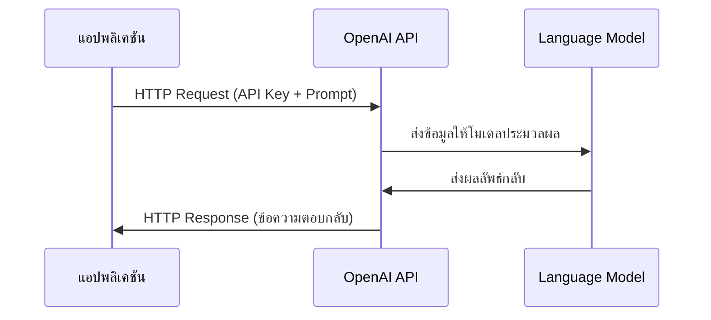
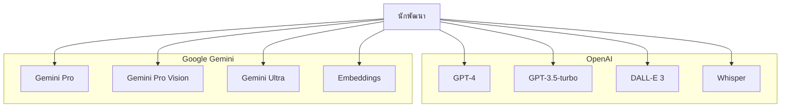

# Session 5: OpenAI API และ Gemini API

<div class="text-center">
  
</div>

## 🔍 ภาพรวม

API (Application Programming Interface) ของโมเดล AI เช่น OpenAI และ Google Gemini เปิดโอกาสให้นักพัฒนาสามารถนำความสามารถของโมเดลภาษาขนาดใหญ่ (Large Language Models) มาประยุกต์ใช้กับแอปพลิเคชันของตนเองได้โดยไม่จำเป็นต้องสร้างและฝึกฝนโมเดลเอง ในเซสชันนี้ เราจะเรียนรู้วิธีการใช้งาน OpenAI API และ Gemini API รวมถึงการพัฒนาโปรเจกต์เล็กๆ เพื่อนำไปประยุกต์ใช้งานจริง

## 🎯 วัตถุประสงค์การเรียนรู้

- เข้าใจหลักการทำงานและความสามารถของ OpenAI API และ Gemini API
- สามารถตั้งค่าและเริ่มต้นใช้งาน API ได้อย่างถูกต้อง
- รู้จักรูปแบบการเรียกใช้งาน API ที่หลากหลายและการปรับแต่งพารามิเตอร์ให้เหมาะสม
- เข้าใจเรื่องค่าใช้จ่ายและวิธีการบริหารจัดการให้มีประสิทธิภาพสูงสุด
- สามารถพัฒนาโปรเจกต์จริงโดยใช้ AI API

## 📚 เนื้อหา

### 1. แนะนำ OpenAI API

OpenAI API ให้บริการเข้าถึงโมเดล AI หลากหลายประเภทผ่านการเรียกใช้ HTTP requests ทำให้นักพัฒนาสามารถนำความสามารถของ AI มาใช้งานในแอปพลิเคชันได้อย่างยืดหยุ่น

#### 1.1 โมเดลที่ให้บริการผ่าน API

- **Chat Completion**: GPT-4, GPT-3.5-turbo - สำหรับการสร้างบทสนทนาโต้ตอบอัจฉริยะ
- **Text Completion**: text-davinci-003 (legacy) - สำหรับการเติมข้อความต่อจากที่กำหนด
- **Embeddings**: text-embedding-ada-002 - สร้าง vector representations ของข้อความสำหรับการค้นหาความคล้ายคลึง
- **Image Generation**: DALL-E 3 - สร้างภาพจากคำอธิบายที่กำหนด
- **Vision**: GPT-4 Vision - วิเคราะห์และประมวลผลภาพพร้อมให้คำอธิบาย
- **Speech to Text**: Whisper - แปลงเสียงพูดเป็นข้อความที่แม่นยำ
- **Text to Speech**: TTS - แปลงข้อความเป็นเสียงพูดที่เป็นธรรมชาติ

#### 1.2 การตั้งค่าเริ่มต้น

1. **สมัคร/ล็อกอินเข้า OpenAI**: ไปที่ [platform.openai.com](https://platform.openai.com)
2. **สร้าง API Key**: ไปที่ "API Keys" และคลิก "Create new secret key"
3. **เติมเครดิต**: เพื่อใช้งานหลังจากหมดช่วงทดลองใช้งานฟรี (Free tier)

#### 1.3 การเรียกใช้ API พื้นฐาน



##### HTTP Request โดยตรง

```bash
curl https://api.openai.com/v1/chat/completions \
  -H "Content-Type: application/json" \
  -H "Authorization: Bearer $OPENAI_API_KEY" \
  -d '{
    "model": "gpt-3.5-turbo",
    "messages": [
      {
        "role": "system",
        "content": "คุณคือผู้ช่วย AI ที่เป็นประโยชน์"
      },
      {
        "role": "user",
        "content": "เขียนบทความสั้นๆ เกี่ยวกับประเทศไทย"
      }
    ]
  }'
```

##### Python SDK

```python
import openai

client = openai.OpenAI(api_key="your-api-key")

completion = client.chat.completions.create(
  model="gpt-3.5-turbo",
  messages=[
    {"role": "system", "content": "คุณคือผู้ช่วย AI ที่เป็นประโยชน์"},
    {"role": "user", "content": "เขียนบทความสั้นๆ เกี่ยวกับประเทศไทย"}
  ]
)

print(completion.choices[0].message.content)
```

##### Node.js SDK

```javascript
const { OpenAI } = require('openai');

const openai = new OpenAI({
  apiKey: process.env.OPENAI_API_KEY,
});

async function main() {
  const completion = await openai.chat.completions.create({
    model: "gpt-3.5-turbo",
    messages: [
      {"role": "system", "content": "คุณคือผู้ช่วย AI ที่เป็นประโยชน์"},
      {"role": "user", "content": "เขียนบทความสั้นๆ เกี่ยวกับประเทศไทย"}
    ],
  });

  console.log(completion.choices[0].message.content);
}

main();
```

#### 1.4 พารามิเตอร์สำคัญ

- **temperature**: (0-2) ควบคุมความสร้างสรรค์/ความแน่นอนของผลลัพธ์ ค่าต่ำ = แน่นอนและคงเส้นคงวา, ค่าสูง = สร้างสรรค์และหลากหลาย
- **max_tokens**: จำนวนโทเค็นสูงสุดที่จะสร้าง เพื่อควบคุมความยาวของผลลัพธ์
- **top_p**: การสุ่มตัวอย่างจากความน่าจะเป็นสะสม (nucleus sampling) ควบคุมความหลากหลายในการตอบกลับ
- **frequency_penalty**: ลดโอกาสการเกิดซ้ำของคำ/วลีเดิมๆ ทำให้เนื้อหามีความหลากหลาย
- **presence_penalty**: ลดโอกาสการพูดซ้ำในหัวข้อเดิม ช่วยให้เนื้อหากระจายครอบคลุมมากขึ้น
- **stop**: ตัวกำหนดเมื่อไหร่ควรหยุดการสร้างข้อความ สามารถระบุเป็นคำหรือสัญลักษณ์ได้

### 2. แนะนำ Gemini API

Gemini API เป็นบริการ AI จาก Google ที่เปิดให้นักพัฒนาสามารถเข้าถึงโมเดล Gemini ซึ่งเป็นโมเดลภาษาขนาดใหญ่ที่มีความสามารถทั้งในด้านข้อความและมัลติโมดัล (รูปภาพ) Gemini โดดเด่นในด้านการรองรับภาษาไทยได้อย่างดีเยี่ยมและมีราคาที่แข่งขันได้

#### 2.1 โมเดลที่ให้บริการผ่าน API

- **Gemini Pro**: โมเดลหลักสำหรับงานทั่วไป มีประสิทธิภาพสูงใกล้เคียง GPT-3.5
- **Gemini Pro Vision**: รองรับการวิเคราะห์รูปภาพและข้อความร่วมกันได้ (multimodal)
- **Gemini Ultra**: โมเดลประสิทธิภาพสูงสุด (มีให้บริการในบางพื้นที่/บางกรณีเท่านั้น)
- **Embeddings**: สร้าง vector representations ของข้อความสำหรับงานค้นหาความคล้ายคลึง

#### 2.2 การตั้งค่าเริ่มต้น

1. **สมัคร/ล็อกอินเข้า Google AI Studio**: ไปที่ [aistudio.google.com](https://aistudio.google.com/)
2. **สร้าง API Key**: ไปที่ "API Keys" และสร้าง API Key ใหม่
3. **เลือกแผนการใช้งาน**: มีทั้งแบบฟรีและแบบ Enterprise สำหรับการใช้งานในองค์กรขนาดใหญ่

#### 2.3 การเรียกใช้ API พื้นฐาน

##### HTTP Request โดยตรง

```bash
curl -X POST https://generativelanguage.googleapis.com/v1/models/gemini-pro:generateContent \
  -H "Content-Type: application/json" \
  -H "x-goog-api-key: YOUR_API_KEY" \
  -d '{
    "contents": [
      {
        "parts": [
          {
            "text": "เขียนโปรแกรม Python สำหรับคำนวณเลขฟีโบนัชชี"
          }
        ]
      }
    ],
    "generationConfig": {
      "temperature": 0.1
    }
  }'
```

##### Python SDK

```python
import google.generativeai as genai
import os

# ตั้งค่า API key
genai.configure(api_key=os.environ["GEMINI_API_KEY"])

# เรียกใช้โมเดล Gemini
model = genai.GenerativeModel('gemini-pro')

# สร้างคำตอบ
response = model.generate_content("เขียนโปรแกรม Python สำหรับคำนวณเลขฟีโบนัชชี")
print(response.text)
```

##### Node.js SDK

```javascript
const { GoogleGenerativeAI } = require('@google/generative-ai');

// ตั้งค่า API key
const genAI = new GoogleGenerativeAI(process.env.GEMINI_API_KEY);

async function run() {
  // เรียกใช้โมเดล Gemini
  const model = genAI.getGenerativeModel({ model: "gemini-pro" });
  
  // สร้างคำตอบ
  const result = await model.generateContent("เขียนโปรแกรม Python สำหรับคำนวณเลขฟีโบนัชชี");
  const response = await result.response;
  
  console.log(response.text());
}

run();
```

### 3. เปรียบเทียบ OpenAI API และ Gemini API



| คุณลักษณะ | OpenAI | Google Gemini |
|----------|--------|----------|
| **โมเดลหลัก** | GPT-4, GPT-3.5-turbo | Gemini Pro, Gemini Pro Vision, Gemini Ultra |
| **จุดเด่น** | ความหลากหลายของโมเดล, ประสิทธิภาพสูง | ราคาที่แข่งขันได้, รองรับภาษาไทยได้ดี, ความสามารถมัลติโมดัล |
| **การใช้งาน** | เข้าถึงง่าย, มี SDK รองรับหลายภาษาโปรแกรม | ใช้งานสะดวก, เชื่อมโยงกับบริการ Google อื่นๆ ได้ง่าย |
| **ราคา** | ค่อนข้างสูงสำหรับโมเดลประสิทธิภาพสูง | ราคาถูกกว่า มีโควต้าฟรีให้ใช้มากกว่า |
| **ความเป็นส่วนตัว** | มีนโยบายการเก็บข้อมูลที่ชัดเจน | อยู่ภายใต้นโยบายความเป็นส่วนตัวของ Google |

### 4. การสร้างโปรเจกต์เล็กๆ ด้วย API

#### 4.1 โปรเจกต์ 1: แชทบอทอย่างง่าย

##### HTML + JavaScript

```html
<!DOCTYPE html>
<html>
<head>
  <title>Simple Chatbot</title>
  <style>
    #chat-container {
      width: 500px;
      height: 500px;
      border: 1px solid #ccc;
      padding: 10px;
      margin: 0 auto;
      overflow-y: scroll;
    }
    .user-message {
      background-color: #e6f7ff;
      padding: 10px;
      margin: 5px;
      border-radius: 10px;
    }
    .bot-message {
      background-color: #f0f0f0;
      padding: 10px;
      margin: 5px;
      border-radius: 10px;
    }
    #message-input {
      width: 400px;
      padding: 5px;
    }
    button {
      padding: 5px 10px;
    }
  </style>
</head>
<body>
  <h1>AI Chatbot</h1>
  <div id="chat-container"></div>
  <div>
    <input type="text" id="message-input" placeholder="พิมพ์ข้อความที่นี่...">
    <button onclick="sendMessage()">ส่ง</button>
  </div>
  
  <script>
    async function sendMessage() {
      const messageInput = document.getElementById('message-input');
      const message = messageInput.value;
      if (!message) return;
      
      // แสดงข้อความของผู้ใช้
      displayMessage(message, 'user');
      messageInput.value = '';
      
      try {
        // ส่งข้อความไปยัง API (โดยผ่าน proxy server เพื่อป้องกันปัญหา CORS)
        const response = await fetch('https://your-backend-api.com/chat', {
          method: 'POST',
          headers: {
            'Content-Type': 'application/json'
          },
          body: JSON.stringify({ message })
        });
        
        const data = await response.json();
        displayMessage(data.reply, 'bot');
      } catch (error) {
        console.error('Error:', error);
        displayMessage('ขออภัย เกิดข้อผิดพลาดบางอย่าง โปรดลองอีกครั้งในภายหลัง', 'bot');
      }
    }
    
    function displayMessage(message, sender) {
      const chatContainer = document.getElementById('chat-container');
      const messageElement = document.createElement('div');
      messageElement.classList.add(sender === 'user' ? 'user-message' : 'bot-message');
      messageElement.innerText = sender === 'user' ? `คุณ: ${message}` : `บอท: ${message}`;
      chatContainer.appendChild(messageElement);
      chatContainer.scrollTop = chatContainer.scrollHeight;
    }
    
    // กดปุ่ม Enter เพื่อส่งข้อความ
    document.getElementById('message-input').addEventListener('keypress', function(e) {
      if (e.key === 'Enter') {
        sendMessage();
      }
    });
  </script>
</body>
</html>
```

##### Backend (Node.js)

```javascript
const express = require('express');
const { OpenAI } = require('openai');
const cors = require('cors');
require('dotenv').config();

const app = express();
app.use(cors());
app.use(express.json());

const openai = new OpenAI({
  apiKey: process.env.OPENAI_API_KEY,
});

// ประวัติการสนทนา (ในการใช้งานจริงควรใช้ฐานข้อมูลจัดเก็บ)
const conversations = {};

app.post('/chat', async (req, res) => {
  try {
    const { message } = req.body;
    const userId = req.headers['user-id'] || 'default-user'; // ในการใช้งานจริงควรใช้ระบบยืนยันตัวตน
    
    // สร้างหรือดึงประวัติการสนทนา
    if (!conversations[userId]) {
      conversations[userId] = [
        { role: "system", content: "คุณคือผู้ช่วยที่เป็นมิตรและให้ข้อมูลที่เป็นประโยชน์" }
      ];
    }
    
    // เพิ่มข้อความของผู้ใช้
    conversations[userId].push({ role: "user", content: message });
    
    // เรียกใช้ OpenAI API
    const completion = await openai.chat.completions.create({
      model: "gpt-3.5-turbo",
      messages: conversations[userId],
      temperature: 0.7,
      max_tokens: 500
    });
    
    // บันทึกการตอบกลับจาก AI
    const reply = completion.choices[0].message.content;
    conversations[userId].push({ role: "assistant", content: reply });
    
    // ส่งการตอบกลับไปยังผู้ใช้
    res.json({ reply });
    
  } catch (error) {
    console.error('Error:', error);
    res.status(500).json({ error: 'เกิดข้อผิดพลาดบางอย่าง' });
  }
});

const PORT = process.env.PORT || 3000;
app.listen(PORT, () => {
  console.log(`เซิร์ฟเวอร์ทำงานที่พอร์ต ${PORT}`);
});
```

#### 4.2 โปรเจกต์ 2: เครื่องมือสรุปบทความ

##### Python

```python
import streamlit as st
import openai
import os

# ตั้งค่า OpenAI API
openai.api_key = os.getenv("OPENAI_API_KEY")
if not openai.api_key:
    openai.api_key = st.secrets["openai_api_key"]

st.title("📝 เครื่องมือสรุปบทความอัตโนมัติ")
st.write("เพียงวางเนื้อหาที่ต้องการสรุป แล้วระบบ AI จะช่วยสรุปให้คุณอย่างรวดเร็ว")

# รับข้อมูลจากผู้ใช้
article = st.text_area("วางบทความที่นี่:", height=250)
language = st.selectbox("ภาษาที่ต้องการใช้สรุป:", ["ไทย", "อังกฤษ"])
summary_length = st.slider("ความยาวของบทสรุป:", min_value=1, max_value=10, value=5)

# แปลงค่า summary_length เป็นคำอธิบาย
length_map = {
    1: "สั้นมาก (1-2 ประโยค)",
    3: "สั้น (ย่อหน้าเล็ก)",
    5: "ปานกลาง (1 ย่อหน้า)",
    7: "ค่อนข้างยาว (2-3 ย่อหน้า)",
    10: "ยาว (บทสรุปละเอียด)"
}

if st.button("สรุปบทความ"):
    if not article:
        st.error("กรุณาวางบทความก่อนทำการสรุป")
    else:
        try:
            with st.spinner("AI กำลังวิเคราะห์และสรุปบทความ..."):
                # สร้าง prompt
                if language == "ไทย":
                    prompt = f"""
                    สรุปบทความต่อไปนี้เป็นภาษาไทย โดยทำให้มีความยาว {length_map[summary_length]}
                    ดึงประเด็นสำคัญและข้อมูลที่จำเป็น รักษาสาระสำคัญของบทความไว้
                    
                    บทความ:
                    {article}
                    """
                else:
                    prompt = f"""
                    Summarize the following article in English with a length that is {length_map[summary_length]}
                    Extract key points and necessary information while maintaining the essence of the article.
                    
                    Article:
                    {article}
                    """
                
                # เรียกใช้ OpenAI API
                client = openai.OpenAI()
                response = client.chat.completions.create(
                    model="gpt-3.5-turbo",
                    messages=[
                        {"role": "system", "content": "คุณคือเครื่องมือสรุปบทความมืออาชีพ"},
                        {"role": "user", "content": prompt}
                    ],
                    temperature=0.5
                )
                
                summary = response.choices[0].message.content
                
                # แสดงผลลัพธ์
                st.subheader("📋 บทสรุป")
                st.write(summary)
                
                # แสดงสถิติ
                original_words = len(article.split())
                summary_words = len(summary.split())
                reduction = ((original_words - summary_words) / original_words) * 100 if original_words > 0 else 0
                
                col1, col2, col3 = st.columns(3)
                col1.metric("จำนวนคำในต้นฉบับ", original_words)
                col2.metric("จำนวนคำในบทสรุป", summary_words)
                col3.metric("ลดความยาวลง", f"{reduction:.1f}%")
                
        except Exception as e:
            st.error(f"เกิดข้อผิดพลาด: {e}")
```

### 5. ข้อควรระวังเรื่อง Cost และ Best Practices

#### 5.1 โครงสร้างค่าใช้จ่าย

```mermaid
bar
    title ค่าใช้จ่ายโดยประมาณต่อ 1,000 tokens (USD)
    "GPT-3.5 Input": 0.0015
    "GPT-3.5 Output": 0.002
    "GPT-4 Input": 0.03
    "GPT-4 Output": 0.06
    "Gemini Pro Input": 0.00025
    "Gemini Pro Output": 0.0005
```

ค่าใช้จ่ายของ API จะขึ้นอยู่กับปัจจัยต่างๆ ดังนี้:

- **โมเดลที่เลือกใช้**: โมเดลที่มีประสิทธิภาพสูงกว่ามักจะมีราคาแพงกว่า (เช่น GPT-4 แพงกว่า GPT-3.5)
- **จำนวน Token**: การคิดค่าใช้จ่ายคำนวณตามจำนวน token (โดยประมาณ 4 ตัวอักษรภาษาอังกฤษ = 1 token, สำหรับภาษาไทยจะใช้ token มากกว่า)
- **Input vs Output**: บางบริการจะคิดราคาต่างกันระหว่าง token ที่เป็น input และ output

**ตัวอย่างค่าใช้จ่าย OpenAI (อาจมีการเปลี่ยนแปลงได้)**
- GPT-3.5-turbo: $0.0015 / 1K tokens (input), $0.002 / 1K tokens (output)
- GPT-4: $0.03 / 1K tokens (input), $0.06 / 1K tokens (output)
- Embeddings: $0.0001 / 1K tokens

**ตัวอย่างค่าใช้จ่าย Gemini (อาจมีการเปลี่ยนแปลงได้)**
- Gemini Pro: $0.00025 / 1K characters (input), $0.0005 / 1K characters (output)
- Gemini Pro Vision: $0.0005 / 1K characters (input), $0.0015 / 1K characters (output) + ค่าใช้จ่ายเพิ่มเติมตามจำนวนรูปภาพ
- Embeddings: $0.00002 / 1K characters

#### 5.2 วิธีลดค่าใช้จ่าย

1. **เลือกโมเดลให้เหมาะกับงาน**: ไม่จำเป็นต้องใช้โมเดลที่มีประสิทธิภาพสูงสุดเสมอไป พิจารณาเลือกตามความซับซ้อนของงาน
2. **จำกัดความยาวของ Input/Output**: กำหนดค่า max_tokens ให้เหมาะสมกับความต้องการจริงๆ
3. **Caching**: จัดเก็บผลลัพธ์สำหรับคำถามที่พบบ่อยเพื่อลดการเรียกใช้ API ซ้ำ
4. **Batching**: รวม request หลายๆ รายการเข้าด้วยกันเมื่อทำได้
5. **Streaming Response**: ใช้ stream การตอบกลับเพื่อให้สามารถหยุดการสร้างเนื้อหาได้เมื่อได้ข้อมูลที่ต้องการครบถ้วนแล้ว

#### 5.3 การตั้งค่าการเตือนและควบคุมค่าใช้จ่าย

- ตั้งค่าการแจ้งเตือนเมื่อค่าใช้จ่ายถึงเกณฑ์ที่กำหนด (สามารถทำได้ในแดชบอร์ดของ OpenAI และ Google)
- กำหนดการจำกัดการใช้งานสูงสุดต่อเดือนเพื่อป้องกันค่าใช้จ่ายเกินที่คาดการณ์ไว้
- หมั่นตรวจสอบการใช้งานและค่าใช้จ่ายอย่างสม่ำเสมอ

#### 5.4 แนวปฏิบัติที่ดีในการใช้งาน API

1. **รักษาความปลอดภัยของ API Key**
   - ไม่เปิดเผย API Key ในโค้ดหน้าบ้านหรือใน repository สาธารณะ
   - ใช้ environment variables หรือระบบจัดการรหัสลับ (secret management)
   - หมุนเวียนเปลี่ยน API Key เป็นระยะเพื่อความปลอดภัย

2. **การออกแบบ Prompt อย่างมีประสิทธิภาพ**
   - เขียน prompt ที่ชัดเจน มีโครงสร้าง และเฉพาะเจาะจง
   - ใช้ system message เพื่อกำหนดบทบาทและขอบเขตการทำงานของ AI
   - แบ่งงานที่ซับซ้อนออกเป็นขั้นตอนย่อยๆ (Chain) เพื่อให้จัดการได้ง่ายขึ้น

3. **การจัดการข้อผิดพลาด**
   - พัฒนาระบบรองรับกรณี API ไม่ตอบสนองหรือมีปัญหา
   - จัดการ rate limits อย่างเหมาะสมเพื่อป้องกันการถูกบล็อก
   - ประยุกต์ใช้ exponential backoff เมื่อเกิดข้อผิดพลาดในการเชื่อมต่อ
   - เชื่อมต่อกับระบบ automation เช่น [n8n](https://n8n.io/) (จากเซสชัน 2) เพื่อจัดการ retry logic

4. **การตรวจสอบและกรองเนื้อหา**
   - ตรวจสอบข้อมูลนำเข้าจากผู้ใช้ก่อนส่งไปยัง API
   - พัฒนาระบบกรองเนื้อหาที่ไม่เหมาะสม
   - ใช้เทคนิค RAG (Retrieval-Augmented Generation) (จากเซสชัน 4) เพื่อเพิ่มความแม่นยำและลดปัญหาการสร้างข้อมูลเท็จ

5. **การติดตามและเก็บ Logs**
   - บันทึก prompts และ responses สำหรับการวิเคราะห์และปรับปรุง
   - ติดตามประสิทธิภาพและค่าใช้จ่ายอย่างเป็นระบบ
   - เก็บข้อมูลอย่างเป็นระบบเพื่อใช้ในการปรับปรุงระบบในอนาคต

### 6. กรณีศึกษา: การใช้ API ในธุรกิจจริง

#### 6.1 บริษัทสตาร์ทอัพด้านการศึกษา

บริษัทสตาร์ทอัพด้านการศึกษาแห่งหนึ่งใช้ OpenAI API เพื่อพัฒนาระบบติวเตอร์อัจฉริยะ:

- **การใช้งาน**: พัฒนาระบบตอบคำถาม อธิบายแนวคิดที่ซับซ้อน และสร้างแบบฝึกหัดที่ปรับระดับความยากตามความสามารถของผู้เรียน
- **การแก้ปัญหาเรื่องค่าใช้จ่าย**: พัฒนาระบบ caching ขั้นสูง และออกแบบ prompts ให้กระชับได้ใจความ
- **ผลลัพธ์**: ช่วยลดภาระงานของครูลงได้ถึง 40% และเพิ่มความเข้าใจของนักเรียนได้ถึง 25%

#### 6.2 บริษัทจัดการเอกสารทางกฎหมาย

บริษัทจัดการเอกสารทางกฎหมายได้นำ Gemini API มาใช้ในการวิเคราะห์สัญญา:

- **การใช้งาน**: สกัดข้อมูลสำคัญจากสัญญาและช่วยระบุข้อความที่อาจมีความเสี่ยงทางกฎหมาย
- **การแก้ปัญหา**: ประยุกต์ใช้ Gemini Pro Vision เพื่อวิเคราะห์ทั้งข้อความและรูปแบบของเอกสาร
- **ผลลัพธ์**: สามารถลดเวลาในการวิเคราะห์สัญญาลงได้ถึง 70% และเพิ่มความแม่นยำในการตรวจสอบ

## 🛠️ Workshop: สร้าง AI Content Generator อย่างง่าย

### สิ่งที่ต้องเตรียม

1. บัญชี OpenAI และ API Key
2. Node.js และ npm
3. Text editor ที่คุณถนัด

### ขั้นตอนการทำ

1. **ตั้งค่าโปรเจกต์**

```bash
mkdir ai-content-generator
cd ai-content-generator
npm init -y
npm install express cors openai dotenv
```

2. **สร้างไฟล์ .env**

```
OPENAI_API_KEY=your_api_key_here
PORT=3000
```

3. **สร้าง server.js**

```javascript
const express = require('express');
const cors = require('cors');
const { OpenAI } = require('openai');
require('dotenv').config();

const app = express();
app.use(cors());
app.use(express.json());
app.use(express.static('public'));

const openai = new OpenAI({
  apiKey: process.env.OPENAI_API_KEY,
});

app.post('/generate', async (req, res) => {
  try {
    const { topic, type, tone, length } = req.body;
    
    const prompt = `
    สร้าง${type}เกี่ยวกับ${topic} ในโทนเสียง${tone} ความยาวประมาณ${length}คำ
    เนื้อหาควรมีความน่าสนใจ มีข้อมูลที่ถูกต้อง และเข้าใจง่าย
    `;
    
    const completion = await openai.chat.completions.create({
      model: "gpt-3.5-turbo",
      messages: [
        { role: "system", content: "คุณคือนักเขียนเนื้อหามืออาชีพที่เชี่ยวชาญในการสร้างเนื้อหาที่น่าดึงดูดและมีคุณภาพสูง" },
        { role: "user", content: prompt }
      ],
      temperature: 0.7,
      max_tokens: 1000
    });
    
    res.json({ content: completion.choices[0].message.content });
  } catch (error) {
    console.error('Error:', error);
    res.status(500).json({ error: 'เกิดข้อผิดพลาดในการสร้างเนื้อหา' });
  }
});

const PORT = process.env.PORT || 3000;
app.listen(PORT, () => {
  console.log(`Server is running on port ${PORT}`);
});
```

4. **สร้างไฟล์ public/index.html**

```html
<!DOCTYPE html>
<html lang="th">
<head>
  <meta charset="UTF-8">
  <meta name="viewport" content="width=device-width, initial-scale=1.0">
  <title>AI Content Generator</title>
  <link href="https://cdn.jsdelivr.net/npm/bootstrap@5.3.0/dist/css/bootstrap.min.css" rel="stylesheet">
  <style>
    .container { max-width: 800px; }
    #loading { display: none; }
    #result { display: none; }
  </style>
</head>
<body>
  <div class="container mt-5">
    <h1 class="text-center mb-4">🤖 AI Content Generator</h1>
    
    <div class="card mb-4">
      <div class="card-body">
        <form id="content-form">
          <div class="mb-3">
            <label for="topic" class="form-label">หัวข้อ</label>
            <input type="text" class="form-control" id="topic" required placeholder="เช่น การท่องเที่ยวในเชียงใหม่">
          </div>
          
          <div class="mb-3">
            <label for="type" class="form-label">ประเภทเนื้อหา</label>
            <select class="form-select" id="type" required>
              <option value="บทความ">บทความ</option>
              <option value="บทความการตลาด">บทความการตลาด</option>
              <option value="โพสต์บล็อก">โพสต์บล็อก</option>
              <option value="โพสต์โซเชียลมีเดีย">โพสต์โซเชียลมีเดีย</option>
              <option value="อีเมลจดหมายข่าว">อีเมลจดหมายข่าว</option>
            </select>
          </div>
          
          <div class="mb-3">
            <label for="tone" class="form-label">โทนเสียง</label>
            <select class="form-select" id="tone" required>
              <option value="เป็นทางการ">เป็นทางการ</option>
              <option value="เป็นมิตร">เป็นมิตร</option>
              <option value="กระตือรือร้น">กระตือรือร้น</option>
              <option value="ขบขัน">ขบขัน</option>
              <option value="ให้ข้อมูล">ให้ข้อมูล</option>
            </select>
          </div>
          
          <div class="mb-3">
            <label for="length" class="form-label">ความยาว</label>
            <select class="form-select" id="length" required>
              <option value="300">สั้น (300 คำ)</option>
              <option value="500">ปานกลาง (500 คำ)</option>
              <option value="800">ยาว (800 คำ)</option>
            </select>
          </div>
          
          <div class="d-grid">
            <button type="submit" class="btn btn-primary">สร้างเนื้อหา</button>
          </div>
        </form>
      </div>
    </div>
    
    <div id="loading" class="text-center my-4">
      <div class="spinner-border text-primary" role="status">
        <span class="visually-hidden">กำลังโหลด...</span>
      </div>
      <p class="mt-2">AI กำลังสร้างเนื้อหา...</p>
    </div>
    
    <div id="result" class="card">
      <div class="card-header d-flex justify-content-between align-items-center">
        <h5 class="mb-0">เนื้อหาที่สร้าง</h5>
        <button id="copy-btn" class="btn btn-sm btn-outline-primary">คัดลอก</button>
      </div>
      <div class="card-body">
        <div id="content-output"></div>
      </div>
    </div>
  </div>

  <script>
    document.getElementById('content-form').addEventListener('submit', async function(e) {
      e.preventDefault();
      
      const topic = document.getElementById('topic').value;
      const type = document.getElementById('type').value;
      const tone = document.getElementById('tone').value;
      const length = document.getElementById('length').value;
      
      document.getElementById('loading').style.display = 'block';
      document.getElementById('result').style.display = 'none';
      
      try {
        const response = await fetch('/generate', {
          method: 'POST',
          headers: {
            'Content-Type': 'application/json'
          },
          body: JSON.stringify({ topic, type, tone, length })
        });
        
        const data = await response.json();
        
        if (data.error) {
          alert('เกิดข้อผิดพลาด: ' + data.error);
        } else {
          document.getElementById('content-output').innerHTML = data.content.replace(/\n/g, '<br>');
          document.getElementById('result').style.display = 'block';
        }
      } catch (error) {
        alert('เกิดข้อผิดพลาด: ' + error);
      } finally {
        document.getElementById('loading').style.display = 'none';
      }
    });
    
    document.getElementById('copy-btn').addEventListener('click', function() {
      const content = document.getElementById('content-output').innerText;
      navigator.clipboard.writeText(content).then(() => {
        const copyBtn = this;
        copyBtn.textContent = 'คัดลอกแล้ว!';
        copyBtn.classList.remove('btn-outline-primary');
        copyBtn.classList.add('btn-success');
        
        setTimeout(() => {
          copyBtn.textContent = 'คัดลอก';
          copyBtn.classList.remove('btn-success');
          copyBtn.classList.add('btn-outline-primary');
        }, 2000);
      });
    });
  </script>
</body>
</html>
```

5. **เริ่มต้นเซิร์ฟเวอร์**

```bash
node server.js
```

6. **เปิดเบราว์เซอร์** ไปที่ http://localhost:3000

## 📚 แหล่งข้อมูลเพิ่มเติม

- [OpenAI API Documentation](https://platform.openai.com/docs/)
- [OpenAI Cookbook](https://cookbook.openai.com/)
- [OpenAI Usage Policies](https://openai.com/policies/usage-policies)
- [Google AI Studio](https://aistudio.google.com/)
- [Gemini API Documentation](https://ai.google.dev/docs/gemini_api_overview)
- [Best Practices for API Integrations](https://platform.openai.com/docs/guides/best-practices)
- [AI API Cost Calculator](https://gptforwork.com/tools/openai-api-pricing-calculator)

## 📌 สรุป

การใช้งาน OpenAI API และ Gemini API เปิดโอกาสมหาศาลในการพัฒนาแอปพลิเคชันที่มีความสามารถด้าน AI โดยไม่ต้องสร้างและฝึกฝนโมเดลเอง อย่างไรก็ตาม การใช้งานอย่างมีประสิทธิภาพจำเป็นต้องคำนึงถึงค่าใช้จ่าย การออกแบบ prompt ที่ดี และแนวปฏิบัติด้านความปลอดภัย การเริ่มต้นด้วยโปรเจกต์เล็กๆ และค่อยๆ ขยายขอบเขตคือแนวทางที่เหมาะสมสำหรับการเรียนรู้และพัฒนาทักษะในการใช้งาน AI API
