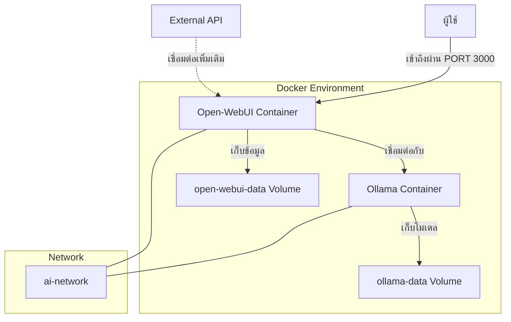
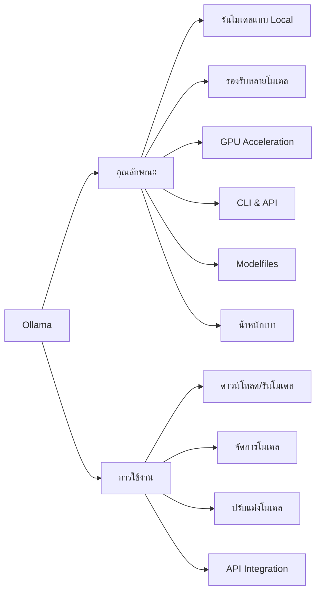
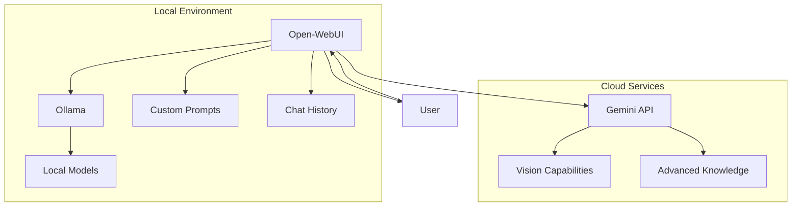

# Session 6: Open-WebUI และ Ollama

<div class="text-center">
  
</div>

## 🔍 ภาพรวม

Open-WebUI และ Ollama เป็นเครื่องมือที่ช่วยให้ผู้ใช้สามารถเข้าถึงและใช้งานโมเดลภาษาขนาดใหญ่ (LLMs) ได้ง่ายขึ้น โดยไม่จำเป็นต้องพึ่งพาบริการเชิงพาณิชย์เช่น ChatGPT หรือ Claude API ในเซสชันนี้ เราจะเรียนรู้วิธีการติดตั้ง ตั้งค่า และใช้งาน Open-WebUI และ Ollama เพื่อรัน LLMs บนเครื่องคอมพิวเตอร์ของคุณเองหรือบนเซิร์ฟเวอร์ส่วนตัว รวมถึงการปรับแต่งและเชื่อมต่อกับบริการภายนอก

## 🎯 วัตถุประสงค์การเรียนรู้

- เข้าใจคอนเซปต์ของ Open-WebUI และประโยชน์ของอินเตอร์เฟซเว็บสำหรับ LLMs
- สามารถติดตั้งและตั้งค่า Ollama สำหรับการรัน LLMs แบบ local
- เรียนรู้การใช้งาน Ollama API เพื่อเชื่อมต่อกับแอปพลิเคชันอื่น
- เข้าใจการปรับแต่งโมเดลและการตั้งค่า custom endpoints
- สามารถประยุกต์ใช้ Open-WebUI และ Ollama ในโปรเจกต์จริง

## 📚 เนื้อหา

### 1. แนะนำ Open-WebUI

Open-WebUI (เดิมชื่อ Ollama Web UI) เป็นอินเตอร์เฟซเว็บแบบ open-source ที่ถูกออกแบบมาให้ทำงานร่วมกับ Ollama และ โมเดล AI ต่างๆ เพื่อให้ผู้ใช้สามารถโต้ตอบกับ AI ได้ผ่านเว็บบราวเซอร์ในรูปแบบที่คุ้นเคยคล้ายกับ ChatGPT

#### 1.1 คุณลักษณะหลักของ Open-WebUI

- **หน้าตาที่ใช้งานง่าย**: อินเตอร์เฟซแบบแชทที่คล้ายกับ ChatGPT
- **รองรับหลายโมเดล**: ทำงานได้กับโมเดล AI หลากหลายที่รันบน Ollama
- **การจัดการบทสนทนา**: จัดเก็บและจัดระเบียบประวัติการสนทนา
- **การแชร์และส่งออก**: ส่งออกบทสนทนาในรูปแบบต่างๆ
- **การอัปโหลดไฟล์**: รองรับการอัปโหลดไฟล์สำหรับโมเดลที่มีความสามารถ multi-modal
- **ระบบ prompt templates**: สร้างและจัดการเทมเพลต prompts สำหรับใช้งานซ้ำ
- **การปรับแต่งโมเดล**: ปรับพารามิเตอร์ต่างๆ เช่น temperature และ context length
- **การเชื่อมต่อ API**: เชื่อมต่อกับ endpoints ภายนอกนอกเหนือจาก Ollama

#### 1.2 ข้อดีของการใช้ Open-WebUI

1. **ฟรีและเป็น Open Source**: ไม่มีค่าใช้จ่าย และชุมชนมีส่วนร่วมในการพัฒนา
2. **ความเป็นส่วนตัว**: ข้อมูลทั้งหมดอยู่ในระบบของคุณเอง ไม่ถูกส่งไปยังบริการภายนอก
3. **ยืดหยุ่น**: ปรับแต่งได้ตามความต้องการ สามารถเพิ่มฟีเจอร์หรือแก้ไขโค้ดได้
4. **รองรับหลายโมเดล**: ใช้งานกับโมเดลได้หลากหลาย ไม่จำกัดเพียงโมเดลเดียว
5. **ใช้งานง่าย**: ไม่จำเป็นต้องมีความรู้ด้านการเขียนโปรแกรมมากนักในการใช้งานพื้นฐาน

#### 1.3 Use Cases ที่เหมาะสม

- **Personal AI Assistant**: ผู้ช่วยส่วนตัวที่รันบนคอมพิวเตอร์ของคุณเอง
- **ระบบภายในองค์กร**: ใช้ในองค์กรที่ต้องการความเป็นส่วนตัวของข้อมูลสูง
- **ระบบ offline**: ใช้งานในสภาพแวดล้อมที่ไม่มีอินเทอร์เน็ต
- **การพัฒนาและทดสอบ**: ทดสอบ prompts และการตอบสนองของโมเดลต่างๆ
- **การศึกษาและวิจัย**: ศึกษาพฤติกรรมของ LLMs โดยไม่มีข้อจำกัดจากผู้ให้บริการ

### 2. การติดตั้งและตั้งค่า Open-WebUI

#### 2.1 ข้อกำหนดเบื้องต้น

การติดตั้ง Open-WebUI และ Ollama ด้วย docker-compose มีข้อกำหนดเบื้องต้นดังนี้:

- Docker และ Docker Compose ติดตั้งบนเครื่องของคุณ
- แนะนำให้มี RAM อย่างน้อย 8GB (ขึ้นอยู่กับโมเดลที่ใช้)
- พื้นที่ว่างอย่างน้อย 10GB สำหรับ image และ volume

#### 2.2 การติดตั้งด้วย Docker Compose



ให้สร้างไฟล์ `docker-compose.yml` ด้วยเนื้อหาต่อไปนี้:

```yaml
version: '3.8'

services:
  open-webui:
    image: ghcr.io/open-webui/open-webui:latest
    container_name: open-webui
    restart: always
    volumes:
      - open-webui-data:/app/backend/data
    environment:
      - OLLAMA_API_BASE_URL=http://ollama:11434/api
      - OPENAI_API_KEY=${OPENAI_API_KEY:-} # ถ้ามี
      - ANTHROPIC_API_KEY=${ANTHROPIC_API_KEY:-} # ถ้ามี
      - PORT=8080
      - HOST=0.0.0.0
    ports:
      - "3000:8080"
    depends_on:
      - ollama
    networks:
      - ai-network

  ollama:
    image: ollama/ollama:latest
    container_name: ollama
    restart: always
    volumes:
      - ollama-data:/root/.ollama
    ports:
      - "11434:11434"
    # สำหรับผู้ใช้ GPU NVIDIA, ปลดคอมเมนต์บรรทัดต่อไปนี้
    # deploy:
    #   resources:
    #     reservations:
    #       devices:
    #         - driver: nvidia
    #           count: 1
    #           capabilities: [gpu]
    networks:
      - ai-network

networks:
  ai-network:
    driver: bridge

volumes:
  open-webui-data:
  ollama-data:
```

### การใช้งานและการจัดการ

```bash
# สร้าง .env file สำหรับเก็บ API keys (ไม่จำเป็น)
echo "OPENAI_API_KEY=your-api-key-here" > .env

# เริ่มการทำงานของทั้งสองบริการ
docker-compose up -d

# ตรวจสอบสถานะ
docker-compose ps

# ดูบันทึกจาก service
docker-compose logs -f open-webui
docker-compose logs -f ollama

# ดาวน์โหลดโมเดล (ตัวอย่าง: llama3)
docker-compose exec ollama ollama pull llama3

# หยุดบริการ
docker-compose down

# หยุดบริการและลบ volumes (ระวัง: จะลบข้อมูลทั้งหมด)
docker-compose down -v
```

สามารถเข้าถึง Open-WebUI ได้ที่ http://localhost:3000 หลังจากที่ services เริ่มทำงานเรียบร้อยแล้ว

### 3. แนะนำ Ollama



Ollama เป็นเครื่องมือที่ช่วยให้คุณสามารถรัน ใช้งาน และปรับแต่งโมเดลภาษาขนาดใหญ่ (LLMs) บนเครื่องคอมพิวเตอร์ส่วนบุคคลหรือเซิร์ฟเวอร์ของคุณได้อย่างง่ายดาย โดยไม่จำเป็นต้องมีทักษะด้านการเขียนโปรแกรมระดับสูง

#### 3.1 คุณลักษณะหลักของ Ollama

- **รันโมเดลแบบ Local**: รันโมเดล LLM บนเครื่องของคุณเองโดยไม่ต้องส่งข้อมูลไปยังบริการคลาวด์
- **โมเดลหลากหลาย**: รองรับโมเดลยอดนิยมหลายตัว เช่น Llama 3, Mistral, Phi, Vicuna ฯลฯ
- **GPU Acceleration**: ใช้ประโยชน์จาก GPU เพื่อเร่งความเร็วในการประมวลผล
- **CLI & API**: รองรับทั้งการใช้งานผ่าน Command Line และ RESTful API
- **Modelfiles**: สร้างและปรับแต่งโมเดลด้วยไฟล์คอนฟิกอย่างง่าย
- **น้ำหนักเบา**: ออกแบบมาให้มีขนาดเล็กและประสิทธิภาพสูง

#### 3.2 การติดตั้ง Ollama

##### macOS

```bash
brew install ollama
```

##### Linux

```bash
curl -fsSL https://ollama.com/install.sh | sh
```

##### Windows

ดาวน์โหลดและติดตั้งจาก [https://ollama.com/download](https://ollama.com/download)

##### Docker

```bash
docker pull ollama/ollama
docker run -d -v ollama:/root/.ollama -p 11434:11434 --name ollama ollama/ollama
```

#### 3.3 การใช้งาน Ollama พื้นฐาน

##### ดาวน์โหลดและรันโมเดล

```bash
# Pull โมเดล
ollama pull llama3

# Chat กับโมเดล
ollama run llama3

# รันโมเดลอื่นๆ
ollama run mistral
ollama run phi
```

##### การดูรายชื่อโมเดลที่มี

```bash
ollama list
```

##### การลบโมเดล

```bash
ollama rm llama3
```

### 4. Ollama API

Ollama มาพร้อมกับ RESTful API ที่ช่วยให้คุณสามารถเชื่อมต่อกับโมเดล LLM จากแอปพลิเคชันของคุณได้ API นี้เปิดให้บริการที่พอร์ต 11434 โดยค่าเริ่มต้น

#### 4.1 การเริ่มต้นใช้งาน API

API จะทำงานโดยอัตโนมัติเมื่อคุณเริ่ม Ollama ไม่จำเป็นต้องตั้งค่าเพิ่มเติม

#### 4.2 การเรียกใช้ API ด้วย curl

##### API สำหรับ Chat Completion

```bash
curl -X POST http://localhost:11434/api/chat -d '{
  "model": "llama3",
  "messages": [
    { "role": "user", "content": "สวัสดี คุณชื่ออะไร?" }
  ]
}'
```

##### API สำหรับ Generation

```bash
curl -X POST http://localhost:11434/api/generate -d '{
  "model": "llama3",
  "prompt": "เขียนบทความสั้นๆ เกี่ยวกับประเทศไทย",
  "stream": false
}'
```

##### API สำหรับดูรายชื่อโมเดล

```bash
curl http://localhost:11434/api/tags
```

#### 4.3 การเรียกใช้ API ด้วย Python

```python
import requests
import json

# Chat Completion
response = requests.post(
    "http://localhost:11434/api/chat",
    json={
        "model": "llama3",
        "messages": [
            {"role": "user", "content": "สวัสดี คุณชื่ออะไร?"}
        ]
    }
)

print(response.json()["message"]["content"])

# Generation (แบบ stream)
response = requests.post(
    "http://localhost:11434/api/generate",
    json={
        "model": "llama3",
        "prompt": "เขียนบทความสั้นๆ เกี่ยวกับประเทศไทย",
        "stream": True
    },
    stream=True
)

for line in response.iter_lines():
    if line:
        data = json.loads(line)
        print(data.get("response", ""), end="", flush=True)
        if data.get("done"):
            print()
```

#### 4.4 การเรียกใช้ API ด้วย Node.js

```javascript
const axios = require('axios');

// Chat Completion
async function chatWithOllama() {
  try {
    const response = await axios.post('http://localhost:11434/api/chat', {
      model: 'llama3',
      messages: [
        { role: 'user', content: 'สวัสดี คุณชื่ออะไร?' }
      ]
    });
    
    console.log(response.data.message.content);
  } catch (error) {
    console.error('Error:', error);
  }
}

chatWithOllama();

// Generation (แบบ stream)
async function generateWithOllama() {
  try {
    const response = await axios.post('http://localhost:11434/api/generate', {
      model: 'llama3',
      prompt: 'เขียนบทความสั้นๆ เกี่ยวกับประเทศไทย',
      stream: true
    }, {
      responseType: 'stream'
    });
    
    response.data.on('data', chunk => {
      try {
        const lines = chunk.toString().split('\n').filter(line => line.trim() !== '');
        for (const line of lines) {
          const data = JSON.parse(line);
          process.stdout.write(data.response || '');
        }
      } catch (e) {
        console.error('Error parsing chunk:', e);
      }
    });
  } catch (error) {
    console.error('Error:', error);
  }
}

generateWithOllama();
```

### 5. การปรับแต่งโมเดลด้วย Modelfiles

Modelfiles เป็นไฟล์ที่ใช้กำหนดค่าและปรับแต่งโมเดลใน Ollama ช่วยให้คุณสามารถปรับเปลี่ยนพฤติกรรมของโมเดลได้ตามความต้องการ

#### 5.1 โครงสร้างของ Modelfile

```
FROM llama3
PARAMETER temperature 0.7
PARAMETER top_p 0.9
PARAMETER top_k 40
SYSTEM """คุณคือผู้ช่วย AI ที่ชาญฉลาด สุภาพ และให้ข้อมูลที่ถูกต้อง คุณจะตอบคำถามอย่างดีที่สุดโดยอ้างอิงข้อมูลจริง"""
```

การตั้งค่า PARAMETER เหล่านี้คล้ายกับการปรับแต่งพารามิเตอร์ใน OpenAI API และ Gemini API ที่เราได้เรียนรู้จากเซสชัน 5 แต่ในกรณีนี้เราสามารถกำหนดค่าเริ่มต้นไว้ใน Modelfile ได้เลย

#### 5.2 การสร้างโมเดลที่ปรับแต่งแล้ว

1. สร้างไฟล์ Modelfile:

```bash
echo 'FROM llama3
PARAMETER temperature 0.7
SYSTEM "คุณคือผู้ช่วยด้านการเขียนโค้ด Python ที่เชี่ยวชาญ"' > Modelfile
```

2. สร้างโมเดลใหม่จาก Modelfile:

```bash
ollama create python-assistant -f Modelfile
```

3. ทดสอบโมเดลที่สร้างขึ้น:

```bash
ollama run python-assistant
```

#### 5.3 พารามิเตอร์ที่สามารถปรับแต่งได้

| พารามิเตอร์ | คำอธิบาย | ค่าปกติ |
|------------|----------|---------|
| `temperature` | ควบคุมความสร้างสรรค์ (0 = แน่นอน, 2 = สร้างสรรค์สูง) | 0.8 |
| `top_p` | Nucleus sampling: จำกัดการเลือกโทเค็น | 0.9 |
| `top_k` | จำนวนโทเค็นที่พิจารณา | 40 |
| `repeat_penalty` | บทลงโทษสำหรับคำที่ซ้ำ | 1.1 |
| `seed` | ค่าเริ่มต้นสำหรับการสุ่ม | 0 |
| `num_ctx` | ขนาดความยาว context สูงสุด | ขึ้นกับโมเดล |
| `num_gpu` | จำนวน GPU layers | ขึ้นกับอุปกรณ์ |
| `num_thread` | จำนวน CPU threads | ขึ้นกับอุปกรณ์ |

### 6. การเชื่อมต่อ Custom Endpoints ใน Open-WebUI

Open-WebUI สามารถเชื่อมต่อกับ endpoints ต่างๆ นอกเหนือจาก Ollama ทำให้คุณสามารถใช้งานกับ API อื่นๆ เช่น OpenAI, Anthropic, หรือ Engines ที่ใช้ LLM ต่างๆ ได้

#### 6.1 การเพิ่ม Custom Endpoint

1. เข้าสู่ Open-WebUI และไปที่หน้า Settings
2. คลิกที่ "Models & Endpoints"
3. คลิก "Add Endpoint"
4. กรอกข้อมูล Endpoint:
   - Name: ชื่อของ endpoint
   - Endpoint URL: URL ของ API
   - API Key: กรณีที่จำเป็นต้องใช้
   - Models: รายชื่อโมเดลที่ endpoint นี้รองรับ

#### 6.2 ตัวอย่าง Custom Endpoint

##### OpenAI-compatible API

```
Name: LocalAI
Endpoint URL: http://localhost:8080/v1
API Key: (ไม่จำเป็นหรือตั้งค่าตามที่ LocalAI กำหนด)
Models: gpt-3.5-turbo, gpt-4 (ตามที่ LocalAI รองรับ)
```

##### Anthropic API

```
Name: Anthropic
Endpoint URL: https://api.anthropic.com
API Key: (API key จาก Anthropic)
Models: claude-3-opus-20240229, claude-3-sonnet-20240229
```

#### 6.3 ประโยชน์ของ Custom Endpoints

- **ความยืดหยุ่น**: ใช้งานได้กับ API หลากหลายจากผู้ให้บริการต่างๆ
- **การเปรียบเทียบ**: ทดสอบผลลัพธ์ของโมเดลต่างๆ ในอินเตอร์เฟซเดียวกัน
- **Fallback**: ตั้งค่า endpoint สำรองเมื่อ endpoint หลักไม่สามารถใช้งานได้
- **ความเป็นส่วนตัว**: เลือกใช้ endpoint ที่เหมาะสมกับความต้องการด้านความเป็นส่วนตัวของข้อมูล

### 7. การใช้งาน Gemini API กับ Open-WebUI

Gemini API เป็น API สำหรับโมเดลภาษาและ multimodal AI จาก Google ที่มีความสามารถในการประมวลผลทั้งข้อความ รูปภาพ และการสร้างเนื้อหา ด้วยความสามารถที่หลากหลาย Gemini จึงเป็นตัวเลือกที่ดีสำหรับการเพิ่มความสามารถให้กับ Open-WebUI

#### 7.1 ความสามารถหลักของ Gemini API

- **Multimodal**: รองรับทั้งข้อความและรูปภาพในการรับข้อมูลนำเข้า
- **โมเดลหลากหลาย**: มีให้เลือกหลายขนาด เช่น Gemini Pro, Gemini Ultra
- **Function Calling**: สามารถใช้สำหรับเรียกฟังก์ชันภายนอก
- **แปลภาษา**: รองรับภาษาไทยได้อย่างดี
- **ราคาที่แข่งขันได้**: มีโควต้าฟรี และราคาต่อ token ที่แข่งขันได้เมื่อเทียบกับ provider รายอื่น

#### 7.2 การสมัครและรับ API Key

1. ไปที่ [Google AI Studio](https://aistudio.google.com/)
2. ลงชื่อเข้าใช้ด้วยบัญชี Google ของคุณ
3. ไปที่ "Get API key" หรือ "API Keys" ในเมนู
4. สร้าง API key ใหม่และบันทึกไว้ในที่ปลอดภัย

#### 7.3 การเชื่อมต่อ Gemini API กับ Open-WebUI

##### 7.3.1 เพิ่ม Gemini เป็น Custom Endpoint ใน Open-WebUI

1. เข้าสู่ Open-WebUI และไปที่หน้า Settings
2. คลิกที่ "Models & Endpoints"
3. คลิก "Add Endpoint"
4. กรอกข้อมูล Endpoint:
   - Name: Gemini
   - Endpoint Type: Google Vertex AI หรือ OpenAI-Compatible (ขึ้นอยู่กับรุ่นของ Open-WebUI)
   - API Key: ใส่ API key ที่ได้จาก Google AI Studio
   - Models: gemini-pro, gemini-pro-vision (หรือตามที่ต้องการใช้)

> **หมายเหตุ**: ในบางรุ่นของ Open-WebUI อาจจำเป็นต้องใช้ Proxy API เพื่อแปลงจาก Gemini API format เป็น OpenAI-compatible format

##### 7.3.2 การสร้าง Proxy API (ถ้าจำเป็น)

หากต้องการใช้ Proxy API เพื่อเชื่อมต่อ Gemini API กับ Open-WebUI สามารถทำได้โดย:

```javascript
// ตัวอย่าง code สำหรับสร้าง Proxy API ด้วย Express
const express = require('express');
const { GoogleGenerativeAI } = require('@google/generative-ai');
const app = express();
app.use(express.json());

// ตั้งค่า Gemini API
const genAI = new GoogleGenerativeAI(process.env.GEMINI_API_KEY);

app.post('/v1/chat/completions', async (req, res) => {
  try {
    const { messages, model, temperature = 0.7 } = req.body;
    const geminiModel = genAI.getGenerativeModel({ model: model === 'gemini-pro-vision' ? 'gemini-pro-vision' : 'gemini-pro' });
    
    // แปลง OpenAI messages format เป็น Gemini format
    const geminiMessages = [];
    for (const msg of messages) {
      if (msg.role === 'system') {
        // ใส่ system message เป็น user message แรก
        geminiMessages.push({ role: 'user', parts: [{ text: msg.content }] });
        geminiMessages.push({ role: 'model', parts: [{ text: 'เข้าใจแล้ว ฉันจะปฏิบัติตามคำแนะนำที่คุณให้' }] });
      } else {
        geminiMessages.push({ 
          role: msg.role === 'assistant' ? 'model' : 'user', 
          parts: [{ text: msg.content }] 
        });
      }
    }
    
    const result = await geminiModel.generateContent({
      contents: geminiMessages,
      generationConfig: {
        temperature: temperature,
      }
    });
    
    // แปลงผลลัพธ์กลับเป็น OpenAI format
    res.json({
      id: 'chatcmpl-' + Date.now(),
      object: 'chat.completion',
      created: Math.floor(Date.now() / 1000),
      model: model,
      choices: [{
        index: 0,
        message: {
          role: 'assistant',
          content: result.response.text(),
        },
        finish_reason: 'stop'
      }],
      usage: {
        prompt_tokens: -1,
        completion_tokens: -1,
        total_tokens: -1
      }
    });
  } catch (error) {
    console.error('Error:', error);
    res.status(500).json({ error: error.message });
  }
});

app.listen(3100, () => {
  console.log('Gemini Proxy API running on port 3100');
});
```

##### 7.3.3 ตัวอย่างการเรียกใช้ Gemini API โดยตรง

สำหรับการทดสอบหรือใช้งานนอก Open-WebUI:

```python
import google.generativeai as genai
import os

# ตั้งค่า API Key
genai.configure(api_key=os.getenv("GEMINI_API_KEY"))

# เลือกโมเดล
model = genai.GenerativeModel('gemini-pro')

# สร้างการสนทนา
chat = model.start_chat(history=[])

# ส่งข้อความและรับการตอบกลับ
response = chat.send_message("เขียนบทความสั้นๆ เกี่ยวกับประเทศไทย")
print(response.text)

# ส่งข้อความเพิ่มเติมในการสนทนาเดียวกัน
response = chat.send_message("เพิ่มข้อมูลเกี่ยวกับอาหารไทย")
print(response.text)
```

#### 7.4 การใช้ Gemini API กับรูปภาพ

Gemini Pro Vision สามารถวิเคราะห์รูปภาพได้ ซึ่งเป็นข้อได้เปรียบเมื่อเทียบกับ LLM ธรรมดา:

```python
import google.generativeai as genai
import os
import PIL.Image

# ตั้งค่า API Key
genai.configure(api_key=os.getenv("GEMINI_API_KEY"))

# เลือกโมเดลที่รองรับรูปภาพ
model = genai.GenerativeModel('gemini-pro-vision')

# โหลดรูปภาพ
image = PIL.Image.open('thai_food.jpg')

# ส่งคำถามพร้อมรูปภาพ
response = model.generate_content(["อธิบายว่านี่คืออาหารอะไรและมีส่วนประกอบอะไรบ้าง", image])
print(response.text)
```

#### 7.5 ข้อดีและข้อควรพิจารณาเมื่อใช้ Gemini API

**ข้อดี**:
- รองรับภาษาไทยได้อย่างดี
- ค่าใช้จ่ายที่แข่งขันได้และมีโควตาฟรี
- ความสามารถ multimodal ที่เหนือกว่าโมเดล text-only
- อัปเดตความรู้ที่ทันสมัย

**ข้อควรพิจารณา**:
- อาจต้องใช้ proxy middleware เพื่อเชื่อมต่อกับ Open-WebUI
- ข้อจำกัดด้านความยาว context ในบางโมเดล
- ข้อควรระวังเกี่ยวกับความเป็นส่วนตัวของข้อมูลตามนโยบายของ Google

### 8. การประยุกต์ใช้งานร่วมกัน: Ollama, Open-WebUI และ Gemini API



การนำ Ollama, Open-WebUI และ Gemini API มาใช้ร่วมกันช่วยให้เราสามารถสร้างระบบ AI ที่มีประสิทธิภาพและยืดหยุ่นสูง โดยใช้จุดแข็งของแต่ละเทคโนโลยี:

- **Ollama**: รันโมเดล local เพื่อความเป็นส่วนตัวและข้อมูลที่อ่อนไหว
- **Open-WebUI**: อินเทอร์เฟซที่ใช้งานง่าย จัดการบทสนทนาและประวัติ
- **Gemini API**: ความสามารถขั้นสูงในการประมวลผลรูปภาพและงานที่ซับซ้อน

ยกตัวอย่างเช่น การสร้างระบบตอบคำถามอัจฉริยะที่:
1. ใช้ Ollama+llama3 ตอบคำถามทั่วไปแบบ offline
2. ส่งต่อไปยัง Gemini Pro Vision เมื่อต้องการวิเคราะห์รูปภาพ
3. ใช้ Open-WebUI เป็นหน้าต่างหลักสำหรับผู้ใช้ในการโต้ตอบกับทั้งสองระบบ

## 🛠️ Workshop: สร้าง AI Assistant แบบส่วนตัวด้วย Open-WebUI และ Ollama

### สิ่งที่ต้องมี

1. คอมพิวเตอร์ที่มี RAM อย่างน้อย 8GB (แนะนำ 16GB+ สำหรับโมเดลขนาดใหญ่)
2. Docker และ Docker Compose
3. พื้นที่ดิสก์ว่างประมาณ 5-10GB (ขึ้นอยู่กับจำนวนโมเดลที่จะใช้)

### ขั้นตอน

1. **ตั้งค่าสภาพแวดล้อม**

สร้างโฟลเดอร์สำหรับโปรเจกต์:

```bash
mkdir ai-assistant
cd ai-assistant
```

สร้างไฟล์ docker-compose.yml:

```yaml
version: '3.8'

services:
  open-webui:
    image: ghcr.io/open-webui/open-webui:latest
    container_name: open-webui
    volumes:
      - open-webui:/app/backend/data
    environment:
      - OLLAMA_API_BASE_URL=http://ollama:11434/api
    ports:
      - 3000:8080
    restart: always
    depends_on:
      - ollama

  ollama:
    image: ollama/ollama:latest
    container_name: ollama
    volumes:
      - ollama:/root/.ollama
    restart: always
    deploy:
      resources:
        reservations:
          devices:
            - driver: nvidia
              count: 1
              capabilities: [gpu]

volumes:
  ollama:
  open-webui:
```

หมายเหตุ: หากไม่มี GPU NVIDIA ให้ลบส่วน `deploy` ออก

2. **เริ่มต้นระบบ**

```bash
docker-compose up -d
```

3. **ดาวน์โหลดและตั้งค่าโมเดล**

```bash
# เข้าสู่ container
docker exec -it ollama /bin/bash

# ดาวน์โหลดโมเดล (เช่น llama3)
ollama pull llama3

# ดาวน์โหลดโมเดลอื่นๆ ตามต้องการ
ollama pull mistral
ollama pull phi

# ออกจาก container
exit
```

4. **สร้าง Assistant ที่ปรับแต่งแล้ว**

สร้างไฟล์ Modelfile:

```bash
cat > thai-assistant.modelfile << 'EOF'
FROM llama3

# ปรับพารามิเตอร์
PARAMETER temperature 0.7
PARAMETER top_p 0.9
PARAMETER top_k 40
PARAMETER num_ctx 4096

# กำหนด system prompt
SYSTEM """
คุณคือผู้ช่วยส่วนตัวที่เชี่ยวชาญในหลายๆ ด้าน ทั้งการตอบคำถามทั่วไป การแนะนำการเขียนโค้ด 
การช่วยวางแผนการทำงาน และการให้คำแนะนำในด้านต่างๆ คุณมีความสามารถในการสื่อสารภาษาไทยได้อย่างดีเยี่ยม 
คุณจะให้ข้อมูลที่ถูกต้อง เป็นกลาง และให้คำแนะนำที่เป็นประโยชน์ คุณจะแจ้งให้ทราบเมื่อคุณไม่แน่ใจ
หรือไม่มีข้อมูลเพียงพอที่จะตอบคำถาม

เมื่อมีผู้ถามเกี่ยวกับการเขียนโค้ด ให้พยายามอธิบายโค้ดอย่างละเอียดพร้อมคำอธิบาย
และถ้าเป็นไปได้ ให้แนะนำแนวทางการทดสอบหรือพัฒนาต่อยอด
"""
EOF

docker exec -it ollama ollama create thai-assistant -f thai-assistant.modelfile
```

5. **เข้าใช้งาน Open-WebUI**

- เปิดเว็บบราวเซอร์และไปที่ http://localhost:3000
- ลงทะเบียนผู้ใช้ (ข้อมูลจะถูกเก็บในเครื่องของคุณเอง)
- เลือกโมเดล thai-assistant ที่เราสร้างไว้
- เริ่มการสนทนากับ AI

6. **สร้าง Prompt Templates**

- ไปที่ Settings > Prompt Templates
- คลิก "New Template"
- สร้าง template สำหรับการเขียนโค้ด:
  - Title: "โค้ด Python"
  - Content: "เขียนโค้ด Python สำหรับ{task}. กรุณาอธิบายโค้ดในแต่ละส่วนอย่างละเอียด และให้คำแนะนำในการปรับปรุงประสิทธิภาพ."
- บันทึก template และทดลองใช้งาน

7. **เพิ่ม OpenAI API เป็น Custom Endpoint (ถ้ามี API key)**

- ไปที่ Settings > Models & Endpoints
- คลิก "Add Endpoint"
- กรอกข้อมูล:
  - Name: OpenAI
  - Endpoint URL: https://api.openai.com/v1
  - API Key: (ใส่ API key ของคุณ)
  - Models: gpt-3.5-turbo, gpt-4 (ตามที่คุณมีสิทธิ์เข้าถึง)
- บันทึกและทดลองใช้งานโมเดล OpenAI ผ่าน Open-WebUI

8. **เพิ่ม Gemini API เป็น Custom Endpoint**

- ไปที่ Settings > Models & Endpoints
- คลิก "Add Endpoint"
- กรอกข้อมูล:
  - Name: Gemini
  - Endpoint URL: [URL ของ Gemini Proxy API หรือตามที่ Open-WebUI รองรับ]
  - API Key: [ใส่ Gemini API key]
  - Models: gemini-pro, gemini-pro-vision
- บันทึกและทดลองใช้งาน

9. **สร้าง Prompt Template สำหรับ Gemini Vision**

- ไปที่ Settings > Prompt Templates
- คลิก "New Template"
- สร้าง template สำหรับการวิเคราะห์รูปภาพ:
  - Title: "วิเคราะห์รูปภาพ"
  - Content: "นี่คือรูปภาพที่ฉันอัปโหลด กรุณาวิเคราะห์และอธิบายสิ่งที่เห็นในรูปภาพอย่างละเอียด"
- บันทึก template และใช้งานเมื่อต้องการวิเคราะห์รูปภาพ

## 📚 แหล่งข้อมูลเพิ่มเติม

- [Open-WebUI GitHub Repository](https://github.com/open-webui/open-webui)
- [Ollama Documentation](https://ollama.com/docs)
- [Ollama GitHub Repository](https://github.com/ollama/ollama)
- [LLM Models Library](https://ollama.com/library)
- [Modelfile Documentation](https://github.com/ollama/ollama/blob/main/docs/modelfile.md)
- [Open-WebUI Docker Image](https://github.com/open-webui/open-webui/pkgs/container/open-webui)
- [Community Extensions for Ollama](https://github.com/ollama/ollama/tree/main/docs/extensions)
- [Google AI Studio](https://aistudio.google.com/)
- [Gemini API Documentation](https://ai.google.dev/docs)
- [Google Generative AI Node.js SDK](https://www.npmjs.com/package/@google/generative-ai)
- [Google Generative AI Python SDK](https://pypi.org/project/google-generativeai/)

## 📌 สรุป

Open-WebUI และ Ollama มอบอิสระและความยืดหยุ่นในการใช้งานโมเดลภาษาขนาดใหญ่ (LLMs) โดยไม่ต้องพึ่งพาบริการเชิงพาณิชย์ ทำให้ผู้ใช้สามารถควบคุมความเป็นส่วนตัวของข้อมูลและปรับแต่งการทำงานตามความต้องการเฉพาะ การรัน LLMs แบบ local ด้วย Ollama ช่วยให้เข้าถึงความสามารถของ AI ได้โดยไม่มีค่าใช้จ่ายต่อเนื่อง ในขณะที่ Open-WebUI มอบอินเตอร์เฟซที่ใช้งานง่ายและคุ้นเคย การรวมทั้งสองเครื่องมือเข้าด้วยกันช่วยสร้าง AI assistant ส่วนตัวที่มีประสิทธิภาพ พร้อมคุณสมบัติความเป็นส่วนตัวและการควบคุมที่เหนือกว่าบริการออนไลน์ทั่วไป ทั้งยังสามารถปรับแต่งและขยายขอบเขตการทำงานได้อย่างไม่มีขีดจำกัด
