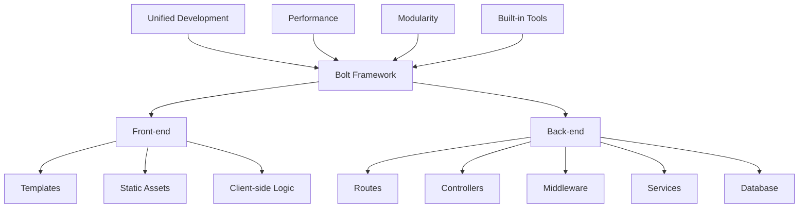

# Session 7: Vibe Coding - Bolt Framework

<div class="text-center">
  
</div>

## 🔍 ภาพรวม

Bolt Framework เป็นเฟรมเวิร์กสำหรับพัฒนาเว็บแอปพลิเคชันที่มุ่งเน้นความเร็วและประสิทธิภาพ โดยรวมทั้งฝั่ง front-end และ back-end ไว้ในเฟรมเวิร์กเดียวกัน ช่วยให้นักพัฒนาสามารถสร้างแอปได้รวดเร็วโดยไม่จำเป็นต้องตั้งค่าสภาพแวดล้อมที่ซับซ้อน Bolt Framework จัดอยู่ในกลุ่ม "vibe coding" ที่เน้นการพัฒนาอย่างรวดเร็วและลื่นไหล เปิดโอกาสให้นักพัฒนาได้แสดงความคิดสร้างสรรค์อย่างอิสระโดยไม่ต้องกังวลกับรายละเอียดทางเทคนิคมากเกินไป ในเซสชันนี้ เราจะเรียนรู้เกี่ยวกับ Bolt Framework ตั้งแต่พื้นฐาน การติดตั้ง การพัฒนาแอป ไปจนถึงการนำไปใช้งานจริง

## 🎯 วัตถุประสงค์การเรียนรู้

- เข้าใจหลักการทำงานและข้อดีของ Bolt Framework
- สามารถติดตั้งและตั้งค่า Bolt Framework ได้อย่างถูกต้อง
- เรียนรู้การพัฒนาแอปพลิเคชันด้วย Bolt ทั้งฝั่ง front-end และ back-end
- เข้าใจการจัดการเส้นทาง (routing), มิดเดิลแวร์ (middleware) และการสร้างเทมเพลต (templating) ใน Bolt
- สามารถเชื่อมต่อ Bolt กับฐานข้อมูลและบริการภายนอกต่างๆ ได้
- เรียนรู้วิธีการนำแอปพลิเคชัน Bolt ไปติดตั้ง (deploy) ในสภาพแวดล้อมต่างๆ

## 📚 เนื้อหา

### 1. Bolt Framework คืออะไร



Bolt Framework เป็นเฟรมเวิร์กที่ช่วยให้นักพัฒนาสร้างแอปพลิเคชันเว็บได้อย่างรวดเร็วและมีประสิทธิภาพ จุดเด่นคือการรวมทั้งฝั่ง front-end และ back-end ไว้ในเฟรมเวิร์กเดียวกัน

Bolt Framework มีให้ใช้งานใน 2 รูปแบบ ได้แก่:
1. **bolt.new** - เป็นแพลตฟอร์มออนไลน์ที่สามารถเริ่มต้นพัฒนาได้ทันทีบนเว็บเบราว์เซอร์ เหมาะสำหรับการเรียนรู้อย่างรวดเร็วและการทำต้นแบบ
2. **bolt.diy** (Do It Yourself) - เป็นเวอร์ชันที่สามารถดาวน์โหลดและรันบนเครื่องของตนเอง สามารถ clone จาก GitHub ได้ที่ [https://github.com/stackblitz-labs/bolt.diy](https://github.com/stackblitz-labs/bolt.diy)

ในเซสชันนี้ เราจะมุ่งเน้นไปที่การใช้งาน **bolt.diy** เนื่องจากสามารถนำไปพัฒนาในโปรเจกต์จริงและปรับแต่งได้อย่างยืดหยุ่น

### 2. การติดตั้ง Bolt.diy ด้วย Docker Compose

การใช้งาน Bolt.diy สามารถทำได้อย่างง่ายดายด้วย Docker Compose ซึ่งช่วยให้การเตรียมสภาพแวดล้อมทำได้อย่างรวดเร็ว ไม่จำเป็นต้องติดตั้ง dependencies หรือตั้งค่าใดๆ เพิ่มเติมบนเครื่อง

#### 2.1 ขั้นตอนการติดตั้ง

1. Clone repository จาก GitHub:

```bash
git clone https://github.com/stackblitz-labs/bolt.diy.git
cd bolt.diy
```

2. ขั้นตอนการติดตั้ง:
   สร้าง Docker Image:

```bash
# ใช้คำสั่ง npm script:
npm run dockerbuild

# หรือใช้คำสั่ง Docker โดยตรง:
docker build . --target bolt-ai-development
```

3. รัน Container:

```bash
docker compose --profile development up
```

#### 2.2 การตั้งค่า API Keys และ Providers

##### การเพิ่ม API Keys ของคุณ
การตั้งค่า API keys ใน Bolt.DIY ทำได้ง่ายดังนี้:

1. เปิดหน้าแรก (หน้าอินเตอร์เฟซหลัก)
2. เลือก provider ที่ต้องการจากเมนูแบบเลื่อนลง (dropdown menu)
3. คลิกไอคอนรูปดินสอ (แก้ไข)
4. ป้อน API key ของคุณในช่องกรอกข้อมูลที่ปลอดภัย

### 3. การเริ่มต้นใช้งาน Bolt.diy

หลังจากรัน Docker Compose แล้ว คุณสามารถเข้าถึง Bolt.diy ได้ที่ http://localhost:5137 โดยจะพบกับหน้า Welcome ของ Bolt Framework

การพัฒนาแอปพลิเคชันใน Bolt.diy สามารถทำได้โดยการแก้ไขไฟล์ในโฟลเดอร์ `src/` โดยไม่จำเป็นต้องรันคำสั่งใดๆ เพิ่มเติม เนื่องจาก Bolt.diy มี hot-reload ในตัว ทำให้การเปลี่ยนแปลงแสดงผลทันที

## 📌 สรุป

Bolt Framework เป็นเครื่องมือที่ทรงพลังสำหรับการพัฒนาเว็บแอปพลิเคชันแบบเต็มรูปแบบ โดยรวมทั้ง front-end และ back-end ไว้ในเฟรมเวิร์กเดียว ช่วยให้นักพัฒนาสามารถสร้างแอปพลิเคชันได้อย่างรวดเร็วและมีประสิทธิภาพ

ในเซสชันนี้ เราได้เรียนรู้วิธีการติดตั้งและใช้งาน Bolt.diy ด้วย Docker Compose ซึ่งทำให้การเริ่มต้นพัฒนาแอปพลิเคชันทำได้อย่างรวดเร็วโดยไม่จำเป็นต้องตั้งค่าสภาพแวดล้อมที่ซับซ้อน

Bolt.diy เป็นเวอร์ชันที่สามารถดาวน์โหลดและรันบนเครื่องของตนเอง เหมาะสำหรับการพัฒนาโปรเจกต์จริงและสามารถปรับแต่งได้อย่างยืดหยุ่น ขณะที่ bolt.new เป็นแพลตฟอร์มออนไลน์ที่เหมาะสำหรับการเรียนรู้และทดลองอย่างรวดเร็ว

สำหรับข้อมูลเพิ่มเติมเกี่ยวกับการพัฒนาแอปพลิเคชันด้วย Bolt Framework สามารถศึกษาได้จาก GitHub repository อย่างเป็นทางการที่ [https://github.com/stackblitz-labs/bolt.diy](https://github.com/stackblitz-labs/bolt.diy)

## 🔄 เครื่องมือ "Vibe Coding" อื่นๆ ที่น่าศึกษาต่อ

Bolt Framework เป็นตัวอย่างหนึ่งของเครื่องมือในกลุ่ม "vibe coding" ที่เน้นประสบการณ์การพัฒนาแบบลื่นไหล สนุกสนาน และมีประสิทธิภาพ หากคุณสนใจแนวทางการพัฒนาในลักษณะนี้ ขอแนะนำให้ศึกษาเครื่องมืออื่นๆ เพิ่มเติม:

### Lovable.dev

Lovable เป็นเฟรมเวิร์กที่เน้นการสร้างเว็บแอปพลิเคชันที่มีลูกเล่นสวยงาม ใช้งานง่าย และเป็นที่รักของผู้ใช้ โดยมีเครื่องมือที่ช่วยให้นักพัฒนาสามารถสร้างอินเทอร์เฟซที่น่าดึงดูดและมีปฏิสัมพันธ์ที่ดีโดยไม่ต้องเขียนโค้ดที่ซับซ้อน เหมาะสำหรับผู้ที่ต้องการสร้าง UI ที่มีความพิเศษและแตกต่าง

### v0.dev

v0.dev เป็นเครื่องมือที่ใช้ AI ในการช่วยสร้าง UI จาก prompt ข้อความ ทำให้สามารถพัฒนาหน้าเว็บ component และส่วนประกอบต่างๆ ได้อย่างรวดเร็ว เพียงแค่อธิบายสิ่งที่ต้องการ v0 จะสร้างโค้ด React และ Tailwind CSS ให้โดยอัตโนมัติ เหมาะสำหรับการ prototype อย่างรวดเร็วหรือเมื่อต้องการแรงบันดาลใจในการออกแบบ

### Vercel AI SDK

ชุดเครื่องมือที่ช่วยให้นักพัฒนาสามารถสร้าง UI ที่ใช้ AI ได้อย่างง่ายดาย รวมถึงการสร้าง chat interfaces และการทำ text generation แบบ streaming เป็นเครื่องมือที่ช่วยให้การผสาน AI เข้ากับแอปพลิเคชันทำได้อย่างราบรื่น

