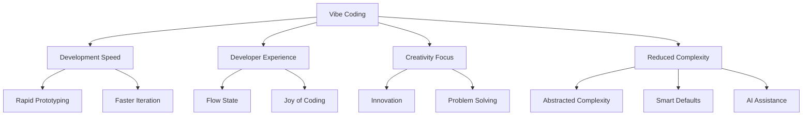
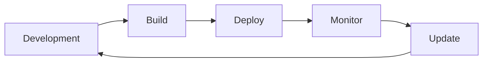
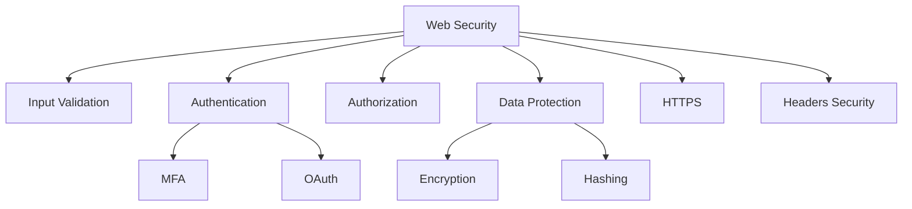

# Session 7: Vibe Coding - พัฒนา Web Application อย่างลื่นไหล

<div class="text-center">
  
</div>

## 🔍 ภาพรวม

Vibe Coding คือแนวคิดในการพัฒนาซอฟต์แวร์ที่มุ่งเน้นความลื่นไหล สนุกสนาน และมีประสิทธิภาพ โดยใช้เครื่องมือและเทคโนโลยีที่ทันสมัยเพื่อลดความซับซ้อนในการพัฒนา ช่วยให้นักพัฒนาสามารถสร้างแอปพลิเคชันได้อย่างรวดเร็วโดยไม่ติดขัดกับขั้นตอนหรือกระบวนการที่ซับซ้อน การพัฒนาแบบ Vibe Coding เปิดโอกาสให้นักพัฒนาได้แสดงความคิดสร้างสรรค์อย่างอิสระ โดยไม่ต้องกังวลกับรายละเอียดทางเทคนิคมากเกินไป ในเซสชันนี้ เราจะเรียนรู้เกี่ยวกับแนวคิด Vibe Coding และเครื่องมือต่างๆ ที่ช่วยให้การพัฒนาเว็บแอปพลิเคชันเป็นไปอย่างรวดเร็วและมีประสิทธิภาพ

## 🎯 วัตถุประสงค์การเรียนรู้

- เข้าใจแนวคิด Vibe Coding และเหตุผลว่าทำไมจึงช่วยเพิ่มประสิทธิภาพในการพัฒนา
- รู้จักและเข้าใจเครื่องมือต่างๆ ในกลุ่ม Vibe Coding เช่น v0, Bolt, Lovable, Claude, Cursor, GitHub Copilot, Windsurf
- เรียนรู้วิธีการนำเครื่องมือเหล่านี้มาใช้ในการพัฒนาทั้งฝั่ง front-end และ back-end
- เข้าใจแนวทางการ Deploy แอปพลิเคชันที่พัฒนาด้วยเครื่องมือ Vibe Coding
- เรียนรู้การจัดการด้านความปลอดภัย, Environment Variables และการดูแลรักษาระบบ

## 📚 เนื้อหา

### 1. Vibe Coding คืออะไร?



Vibe Coding เป็นแนวคิดในการพัฒนาซอฟต์แวร์ที่มุ่งเน้นการสร้างประสบการณ์การพัฒนาที่ลื่นไหล (flow) และสนุกสนาน โดยมีองค์ประกอบสำคัญดังนี้:

1. **ความรวดเร็วในการพัฒนา** - ลดขั้นตอนที่ซ้ำซ้อนและไม่จำเป็น เพื่อให้นักพัฒนาสามารถสร้างแอปได้อย่างรวดเร็ว
2. **ประสบการณ์นักพัฒนาที่ดี** - มีเครื่องมือและสภาพแวดล้อมที่เอื้อต่อการทำงานอย่างมีความสุข
3. **โฟกัสที่ความคิดสร้างสรรค์** - ลดการกังวลเรื่องรายละเอียดทางเทคนิค เพื่อให้นักพัฒนาโฟกัสที่การแก้ปัญหาและสร้างสรรค์
4. **ลดความซับซ้อน** - ซ่อนความซับซ้อนของระบบไว้เบื้องหลัง และมีค่าเริ่มต้นที่เหมาะสม

### 2. ทำไม Vibe Coding ถึงช่วยเพิ่มประสิทธิภาพในการพัฒนา?

Vibe Coding ช่วยเพิ่มประสิทธิภาพในการพัฒนาด้วยเหตุผลหลายประการ:

1. **ลดเวลาในการตั้งค่าและเริ่มต้นโปรเจกต์** - เครื่องมือ Vibe Coding มักมีการตั้งค่าเริ่มต้นที่ดี ช่วยให้นักพัฒนาเริ่มต้นได้เร็ว
2. **ลดความเครียดจากขั้นตอนที่ซับซ้อน** - นักพัฒนาสามารถโฟกัสที่การแก้ปัญหาหลักโดยไม่ต้องกังวลกับรายละเอียดปลีกย่อย
3. **เพิ่ม Flow State** - สภาวะที่นักพัฒนาอยู่ในโซนการทำงานที่มีประสิทธิภาพสูงสุด
4. **ผสานการทำงานของ AI** - ใช้ประโยชน์จาก AI เพื่อช่วยในการเขียนโค้ดและแก้ปัญหา

### 3. เครื่องมือและเทคโนโลยี Vibe Coding

#### 3.1 เครื่องมือสร้าง UI และ Front-end

##### v0.dev
v0.dev เป็นเครื่องมือที่ใช้ AI ในการช่วยสร้าง UI จากการอธิบายด้วยข้อความ (prompt) ทำให้สามารถพัฒนาหน้าเว็บ component และส่วนประกอบต่างๆ ได้อย่างรวดเร็ว เพียงแค่อธิบายสิ่งที่ต้องการ v0 จะสร้างโค้ด React และ Tailwind CSS ให้โดยอัตโนมัติ

**ตัวอย่างการใช้งาน**:

```
"สร้างหน้า dashboard สำหรับแอปพลิเคชันจัดการโปรเจกต์ที่มี chart แสดงความคืบหน้า, รายการงานที่ต้องทำ, และส่วนของสมาชิกในทีม"
```

**ผลลัพธ์**:
```jsx
// React component generated by v0.dev
import { Card, CardContent, CardDescription, CardHeader, CardTitle } from "@/components/ui/card"
import { Progress } from "@/components/ui/progress"
import { Avatar, AvatarFallback, AvatarImage } from "@/components/ui/avatar"

export default function Dashboard() {
  return (
    <div className="grid gap-4 md:grid-cols-2 lg:grid-cols-3">
      <Card>
        <CardHeader>
          <CardTitle>Project Progress</CardTitle>
          <CardDescription>Track your project completion</CardDescription>
        </CardHeader>
        <CardContent>
          <div className="space-y-2">
            <div className="flex items-center justify-between">
              <div className="text-sm font-medium">Overall Completion</div>
              <div className="text-sm text-muted-foreground">65%</div>
            </div>
            <Progress value={65} />
          </div>
          {/* Additional chart content would go here */}
        </CardContent>
      </Card>
      
      <Card>
        <CardHeader>
          <CardTitle>Tasks</CardTitle>
          <CardDescription>Upcoming deadlines</CardDescription>
        </CardHeader>
        <CardContent>
          <div className="space-y-4">
            <div className="grid gap-2">
              <div className="flex items-center gap-2">
                <input type="checkbox" className="h-4 w-4 rounded border-gray-300" />
                <div className="text-sm font-medium">Complete wireframes</div>
              </div>
              <div className="text-xs text-muted-foreground">Due in 2 days</div>
            </div>
            {/* Additional tasks would go here */}
          </div>
        </CardContent>
      </Card>
      
      <Card>
        <CardHeader>
          <CardTitle>Team Members</CardTitle>
          <CardDescription>Project collaborators</CardDescription>
        </CardHeader>
        <CardContent>
          <div className="space-y-4">
            <div className="flex items-center gap-4">
              <Avatar>
                <AvatarImage src="/avatars/01.png" />
                <AvatarFallback>JD</AvatarFallback>
              </Avatar>
              <div>
                <div className="text-sm font-medium">Jane Doe</div>
                <div className="text-xs text-muted-foreground">Product Manager</div>
              </div>
            </div>
            {/* Additional team members would go here */}
          </div>
        </CardContent>
      </Card>
    </div>
  )
}
```

##### Bolt.new
Bolt.new เป็นเครื่องมือที่ช่วยให้นักพัฒนาสามารถสร้างและแชร์ web components ได้อย่างรวดเร็ว โดยไม่ต้องตั้งค่าโปรเจกต์ที่ซับซ้อน

**จุดเด่น**:
- เริ่มต้นได้ทันที ไม่ต้องติดตั้งอะไรเพิ่มเติม
- มี live preview แบบ real-time
- แชร์ผลงานผ่าน URL ได้ทันที
- รองรับ framework หลายตัว เช่น React, Vue, Svelte

##### Windsurf
Windsurf เป็นเครื่องมือที่ช่วยเร่งการพัฒนา UI โดยการรวม Tailwind CSS กับ React components ให้ทำงานร่วมกันได้อย่างลงตัว

**ฟีเจอร์หลัก**:
- มี component library ที่ใช้งานง่าย
- สร้าง UI ได้รวดเร็วด้วย utility classes ของ Tailwind
- มีเครื่องมือช่วยสร้าง theme และปรับแต่งสไตล์
- ช่วยให้การออกแบบเป็นระบบและคงเส้นคงวามากขึ้น

##### Lovable
Lovable เป็นเฟรมเวิร์คที่ช่วยให้นักพัฒนาสร้าง UI ที่น่าประทับใจได้อย่างรวดเร็ว โดยเน้นการออกแบบที่สวยงามและ micro-interactions ที่ทำให้ผู้ใช้รู้สึกประทับใจ

**ประโยชน์ของ Lovable**:
- มี animation และ transition ที่ลื่นไหลในตัว
- ช่วยให้สร้าง delightful UX ได้โดยไม่ต้องเขียนโค้ดซับซ้อน
- มี templates และ patterns ที่ออกแบบมาให้ผู้ใช้ประทับใจ
- เน้นการออกแบบที่เป็น human-centered

#### 3.2 AI Coding Assistants

##### GitHub Copilot
GitHub Copilot เป็น AI pair programmer ที่ช่วยแนะนำโค้ดขณะที่คุณกำลังเขียน โดยใช้ OpenAI Codex ในการวิเคราะห์โค้ดที่คุณกำลังทำงานและแนะนำบรรทัดหรือฟังก์ชันต่อไป

**วิธีใช้ GitHub Copilot ให้มีประสิทธิภาพ**:
- เขียน comments ที่ชัดเจนว่าคุณต้องการทำอะไร
- เริ่มเขียนฟังก์ชันและให้ Copilot แนะนำส่วนที่เหลือ
- ใช้ Copilot ในการแนะนำการทดสอบ
- ตรวจสอบโค้ดที่ Copilot แนะนำเสมอ เพื่อความเข้าใจและความปลอดภัย

##### Cursor
Cursor เป็น Code Editor ที่ออกแบบมาเพื่อทำงานร่วมกับ AI โดยเฉพาะ ช่วยให้นักพัฒนาสามารถสื่อสารกับ AI ผ่านการพิมพ์โดยตรง และขอให้ AI ช่วยแก้ไข, อธิบาย, หรือปรับปรุงโค้ด

**ฟีเจอร์เด่นของ Cursor**:
- มีการสนทนากับ AI ในตัว editor
- สามารถขอให้ AI ช่วยเขียน, แก้ไข, และอธิบายโค้ดได้
- ช่วยในการ debug และแนะนำวิธีแก้ไขปัญหา
- เข้าใจบริบทของโค้ดและโปรเจกต์ทั้งหมด

##### Claude
Claude เป็น AI assistant จาก Anthropic ที่สามารถช่วยในการพัฒนาซอฟต์แวร์ได้หลายด้าน ตั้งแต่การเขียนโค้ด, การแก้ไขบั๊ก, ไปจนถึงการออกแบบระบบ

**การใช้ Claude ในการพัฒนา**:
- สามารถอธิบายแนวคิดทาง programming และช่วยเขียนโค้ด
- ช่วยวิเคราะห์โค้ดที่มีปัญหาและเสนอวิธีแก้ไข
- ช่วยในการออกแบบระบบและ architecture
- สนับสนุนการทำงานกับหลายภาษาและ frameworks

#### 3.3 Back-end และ API Tools

##### Prisma
Prisma เป็น ORM (Object-Relational Mapping) ที่ช่วยให้การจัดการกับฐานข้อมูลเป็นเรื่องง่ายขึ้นมาก โดยมี schema language ที่เข้าใจง่ายและมี type safety

**ประโยชน์ของ Prisma**:
- ลดความซับซ้อนในการเขียน SQL
- มี auto-completion และ type checking
- มี migration tools ที่ใช้งานง่าย
- ช่วยป้องกันข้อผิดพลาดด้านฐานข้อมูล

ตัวอย่าง Prisma Schema:
```prisma
model User {
  id        Int      @id @default(autoincrement())
  email     String   @unique
  name      String?
  posts     Post[]
  createdAt DateTime @default(now())
}

model Post {
  id        Int      @id @default(autoincrement())
  title     String
  content   String?
  published Boolean  @default(false)
  author    User     @relation(fields: [authorId], references: [id])
  authorId  Int
}
```

##### tRPC
tRPC ช่วยให้การสร้าง type-safe API เป็นเรื่องง่าย โดยไม่ต้องใช้ code generation หรือ schemas ที่ซับซ้อน เหมาะสำหรับโปรเจกต์ที่ใช้ TypeScript ทั้งฝั่ง frontend และ backend

**จุดเด่นของ tRPC**:
- End-to-end type safety โดยไม่ต้องใช้ GraphQL หรือ REST schema
- Auto-completion สำหรับ API endpoints
- ลดความซับซ้อนในการสร้างและใช้ API
- ทำงานได้ดีกับ React, Next.js และ TypeScript

##### Supabase
Supabase เป็นแพลตฟอร์ม Backend-as-a-Service (BaaS) แบบ open source ที่ช่วยให้นักพัฒนาสร้าง back-end ได้อย่างรวดเร็วด้วยฟีเจอร์ที่หลากหลาย

**ความสามารถของ Supabase**:
- ฐานข้อมูล PostgreSQL ที่มาพร้อมกับ realtime subscriptions
- Authentication และ authorization ในตัว
- Storage สำหรับไฟล์
- Edge functions
- ใช้งานง่ายผ่าน SDK และมี dashboard ที่ใช้งานสะดวก

### 4. การ Deploy แอปพลิเคชันแบบ Vibe Coding



#### 4.1 Vercel
Vercel เป็นแพลตฟอร์มที่เหมาะสำหรับการ deploy front-end applications โดยเฉพาะโปรเจกต์ที่พัฒนาด้วย Next.js, React, Vue หรือ frameworks อื่นๆ

**จุดเด่นของ Vercel**:
- Preview deployments สำหรับทุก pull request
- CI/CD แบบอัตโนมัติ
- Edge network ทั่วโลก ทำให้เว็บโหลดเร็ว
- Analytics และ monitoring ในตัว
- ตั้งค่า custom domains ได้ง่าย

#### 4.2 Netlify
Netlify เป็นแพลตฟอร์มที่ช่วยให้นักพัฒนาสามารถ deploy และจัดการเว็บไซต์แบบ static และ serverless applications ได้อย่างรวดเร็ว

**ประโยชน์ของ Netlify**:
- Continuous deployment จาก Git
- Preview deployments
- Serverless functions
- Forms handling
- ระบบ authentication ในตัว

#### 4.3 Railway
Railway เป็น platform ที่ช่วยให้การ deploy applications, databases และ services อื่นๆ เป็นเรื่องง่าย โดยเฉพาะสำหรับ full-stack applications

**ฟีเจอร์เด่นของ Railway**:
- Deploy จาก Git repository ได้ง่าย
- รองรับ databases หลายประเภท เช่น PostgreSQL, MySQL, MongoDB
- Monitoring และ logging ในตัว
- สามารถปรับแต่ง infrastructure ได้ตามต้องการ
- มี templates สำหรับ common stack

### 5. การจัดการด้านความปลอดภัยและการบำรุงรักษา

#### 5.1 การจัดการ Environment Variables
การจัดการ Environment Variables เป็นส่วนสำคัญของการพัฒนาแอปพลิเคชันที่ปลอดภัย:

- **ไม่เก็บ secrets ใน source code** - ใช้ .env files และเพิ่มไฟล์เหล่านี้ใน .gitignore
- **ใช้ environment variables platform** - Vercel, Netlify และ Railway มีระบบจัดการ environment variables ในตัว
- **แยก environment ให้ชัดเจน** - มี variables แยกสำหรับ development, staging และ production
- **จำกัดการเข้าถึง** - ให้สิทธิ์การเข้าถึง secrets เฉพาะกับผู้ที่จำเป็นต้องรู้เท่านั้น

#### 5.2 Security Best Practices



- **ใช้ Authentication services** - ใช้บริการเช่น Clerk, Auth0, NextAuth.js แทนการเขียนระบบ authentication เอง
- **Regular updates** - อัพเดต dependencies อย่างสม่ำเสมอเพื่อแก้ไขช่องโหว่ด้านความปลอดภัย
- **Content Security Policy (CSP)** - ป้องกัน XSS และการโจมตีอื่นๆ
- **Rate limiting** - ป้องกัน brute force และ DDoS attacks
- **Data validation** - ตรวจสอบข้อมูลทั้งฝั่ง client และ server

#### 5.3 Monitoring และ Error Tracking
การติดตามและจัดการ errors เป็นส่วนสำคัญของการดูแลรักษาแอปพลิเคชัน:

- **เครื่องมือ monitoring** - ใช้บริการเช่น Sentry, LogRocket หรือ New Relic
- **Real-time alerts** - ตั้งค่าการแจ้งเตือนเมื่อเกิดปัญหา
- **Error logging** - บันทึก errors อย่างเป็นระบบเพื่อช่วยในการ debug
- **Performance monitoring** - ติดตาม metrics สำคัญเช่น load time และ API response time
- **User behavior analytics** - เข้าใจว่าผู้ใช้ใช้งานแอปอย่างไร เพื่อปรับปรุงประสบการณ์

## 🛠 Workshop Activities

1. **เลือกเครื่องมือ Vibe Coding ที่สนใจ** - ศึกษาและลองใช้งานเครื่องมือที่คุณสนใจ
2. **สร้าง Component Library ด้วย v0.dev** - ลองใช้ v0.dev สร้าง components ต่างๆ สำหรับโปรเจกต์
3. **พัฒนา Full Stack App** - ลองพัฒนา full stack app เล็กๆ โดยใช้ Next.js, Prisma และ Vercel
4. **ใช้ GitHub Copilot หรือ Cursor** - เปรียบเทียบประสิทธิภาพการทำงานเมื่อใช้ AI coding assistants
5. **Deploy แอปพลิเคชัน** - ลอง deploy แอปพลิเคชันที่พัฒนาด้วยเครื่องมือ Vibe Coding บน Vercel หรือ Railway

## 📘 สรุป

Vibe Coding ไม่ใช่เพียงเทคโนโลยีหรือเครื่องมือ แต่เป็นแนวทางในการพัฒนาที่มุ่งเน้นความลื่นไหลและความสนุกสนานในการสร้างซอฟต์แวร์ การใช้เครื่องมือที่ทันสมัยและมีประสิทธิภาพสูงช่วยให้นักพัฒนาสามารถโฟกัสที่การสร้างสรรค์มากกว่าการติดขัดกับรายละเอียดทางเทคนิค ในขณะที่เทคโนโลยีมีการพัฒนาอย่างต่อเนื่อง แนวคิด Vibe Coding จะช่วยให้นักพัฒนาสามารถปรับตัวและใช้ประโยชน์จากเครื่องมือใหม่ๆ ได้อย่างมีประสิทธิภาพ

## 🔗 แหล่งข้อมูลเพิ่มเติม

- [v0.dev Documentation](https://v0.dev)
- [GitHub Copilot](https://github.com/features/copilot)
- [Cursor Editor](https://cursor.sh/)
- [Vercel Platform](https://vercel.com/)
- [Railway Platform](https://railway.app/)
- [Prisma Documentation](https://prisma.io/docs/)
- [tRPC Documentation](https://trpc.io/)
- [Supabase Documentation](https://supabase.com/docs)

