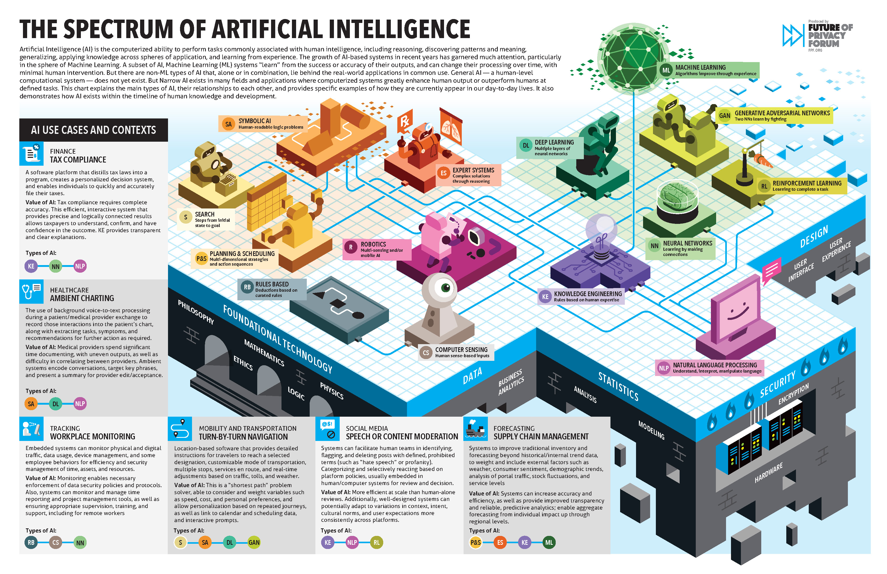

# Session 8: Tools & Best Practices

  

## 🔍 ภาพรวม

ในโลกของ AI ที่เติบโตอย่างรวดเร็ว การเลือกใช้เครื่องมือที่เหมาะสมและการปฏิบัติตามแนวทางที่ดีเป็นสิ่งสำคัญที่จะช่วยให้โปรเจกต์ AI ประสบความสำเร็จ เซสชันนี้จะแนะนำเครื่องมือที่เป็นประโยชน์นอกเหนือจากที่เรียนรู้ในเซสชันที่ผ่านมา รวมถึงแนวทางในการดูแลโมเดล การรักษาความปลอดภัย ความเป็นส่วนตัวของข้อมูล และแนวปฏิบัติที่ดีในการออกแบบ workflow ที่มีประสิทธิภาพ โดยเฉพาะอย่างยิ่ง การปูพื้นฐานไปยัง Model Context Protocol (MCP) ซึ่งเป็นแนวทางใหม่ที่ช่วยให้การพัฒนา AI มีความยืดหยุ่นและสามารถปรับตัวได้ดีในบริบทที่หลากหลาย

## 🎯 วัตถุประสงค์การเรียนรู้

- รู้จักเครื่องมือเพิ่มเติมที่เกี่ยวข้องกับการพัฒนาและใช้งาน AI
- เข้าใจแนวทางการดูแลและบำรุงรักษาโมเดล AI
- เรียนรู้หลักการด้านความปลอดภัยและความเป็นส่วนตัวของข้อมูลในโปรเจกต์ AI
- เข้าใจพื้นฐานของ Model Context Protocol (MCP) และการนำไปประยุกต์ใช้

## 📚 เนื้อหา

### 1. เครื่องมือเพิ่มเติมสำหรับการพัฒนาและใช้งาน AI

#### 1.1 เครื่องมือสำหรับการจัดการข้อมูล

การบริหารจัดการข้อมูลถือเป็นหัวใจสำคัญของการพัฒนาโมเดล AI ที่มีคุณภาพ นี่คือเครื่องมือที่จะช่วยให้การทำงานกับชุดข้อมูลมีประสิทธิภาพสูงขึ้น:

- **DVC (Data Version Control)**: ระบบจัดการเวอร์ชันสำหรับชุดข้อมูลและโมเดล ML
- **Great Expectations**: เครื่องมือสำหรับตรวจสอบคุณภาพข้อมูล
- **Label Studio**: แพลตฟอร์ม open-source สำหรับการทำ data labeling

#### 1.2 เครื่องมือสำหรับการติดตามและจัดการโมเดล

- **MLflow**: เครื่องมือ open-source สำหรับจัดการวงจรชีวิตของ ML แบบครบวงจร
- **Weights & Biases**: แพลตฟอร์มสำหรับติดตามการทดลอง, การวิเคราะห์, และการจัดการโมเดล
- **Hugging Face Hub**: แพลตฟอร์มสำหรับแบ่งปัน จัดเก็บ และทำงานร่วมกันบนโมเดล

#### 1.3 เครื่องมือสำหรับ Deployment

- **BentoML**: เครื่องมือสำหรับการสร้าง packaging และ deployment โมเดล ML
- **Gradio**: สร้าง UI สำหรับโมเดล ML อย่างรวดเร็ว
- **Streamlit**: แพลตฟอร์มสำหรับสร้างเว็บแอปพลิเคชัน data science

#### 1.4 เครื่องมือสำหรับความเป็นส่วนตัวและความปลอดภัย

- **PySyft**: ไลบรารีสำหรับการเรียนรู้แบบ federated และการประมวลผลแบบเข้ารหัส
- **TensorFlow Privacy**: ไลบรารีสำหรับฝึกโมเดล ML แบบรักษาความเป็นส่วนตัว
- **Microsoft Presidio**: เครื่องมือสำหรับตรวจจับและปกปิดข้อมูลส่วนบุคคล

### 2. แนวทางการดูแลโมเดล AI

การดูแลรักษาโมเดลให้ทำงานได้อย่างมีประสิทธิภาพในระยะยาวเป็นสิ่งสำคัญ

#### 2.1 การติดตามประสิทธิภาพโมเดล

การติดตามประสิทธิภาพของโมเดล AI อย่างสม่ำเสมอเป็นสิ่งสำคัญเพื่อให้แน่ใจว่าโมเดลยังคงทำงานได้ดีในสถานการณ์จริง:

1. **ตั้งค่าเมทริกที่สำคัญ (Key Metrics)**
2. **การติดตามแบบต่อเนื่อง (Continuous Monitoring)**
3. **การตรวจจับ Drift**

#### 2.2 การปรับปรุงโมเดลอย่างต่อเนื่อง

1. **การฝึกซ้ำตามกำหนด (Scheduled Retraining)**
2. **การฝึกซ้ำตามตัวกระตุ้น (Trigger-based Retraining)**
3. **การเรียนรู้แบบต่อเนื่อง (Continuous Learning)**

#### 2.3 การจัดการเวอร์ชันและการบันทึกประวัติ

1. **การติดแท็กและให้เวอร์ชันโมเดล**
2. **การบันทึกข้อมูลสำคัญ**
3. **การทำ A/B Testing**

### 3. ความปลอดภัยและความเป็นส่วนตัวของข้อมูล

#### 3.1 หลักการสำคัญด้านความปลอดภัย

1. **การป้องกันโมเดล (Model Protection)**
2. **การป้องกันการโจมตี (Attack Prevention)**
3. **การตรวจสอบและบันทึก (Auditing and Logging)**

#### 3.2 ความเป็นส่วนตัวของข้อมูล

1. **การทำความสะอาดข้อมูล (Data Sanitization)**
2. **การปฏิบัติตามกฎหมาย (Compliance)**
3. **เทคนิค Privacy-Preserving ML**

#### 3.3 การกำกับดูแล AI (AI Governance)

1. **การอธิบายได้ (Explainability)**
2. **การตรวจสอบความเป็นธรรม (Fairness)**
3. **การทำเอกสารและรายงาน (Documentation)**

### 4. Best Practices ในการออกแบบ Workflow

การนำความรู้จากเซสชันที่ผ่านมาเกี่ยวกับ n8n, RAG, AI Agentic และเครื่องมืออื่นๆ มาผสมผสานในการออกแบบ workflow ที่มีประสิทธิภาพ

#### 4.1 การวางโครงสร้างโปรเจกต์

การวางโครงสร้างโปรเจกต์ AI อย่างเป็นระบบช่วยให้การพัฒนาและการบำรุงรักษามีประสิทธิภาพมากขึ้น

#### 4.2 การสร้าง MLOps Pipeline

MLOps (Machine Learning Operations) เป็นแนวทางที่รวมแนวปฏิบัติด้าน DevOps เข้ากับการพัฒนาและการใช้งาน ML

#### 4.3 การทำงานร่วมกันและการทำเอกสาร

1. **Git Workflow**
2. **การทำเอกสาร**
3. **การแชร์แอปพลิเคชันและโมเดล**

### 5. การบูรณาการเครื่องมือจากทุกเซสชัน

การนำความรู้และเครื่องมือจากทุกเซสชันมาประยุกต์ใช้ร่วมกันเพื่อสร้าง End-to-End AI Solution

#### 5.1 ตัวอย่างการบูรณาการ

1. **ระบบ AI Assistant ที่สมบูรณ์**
2. **ระบบวิเคราะห์ข้อมูลอัตโนมัติ**

#### 5.2 การเลือกใช้เครื่องมือให้เหมาะสมกับแต่ละสถานการณ์

| สถานการณ์ | เครื่องมือที่เหมาะสม | เหตุผล |
|----------|-------------------|-------|
| ต้องการระบบที่ทำงานแบบ Offline | Ollama + Open-WebUI | ทำงานได้โดยไม่ต้องพึ่งพา Cloud API |
| ต้องการความแม่นยำสูง | RAG + OpenAI/Gemini API | ค้นหาข้อมูลที่เกี่ยวข้องและใช้โมเดลคุณภาพสูง |
| ต้องการระบบอัตโนมัติ | n8n + AI Agent | สร้าง Workflow อัตโนมัติที่มี AI เป็นสมอง |
| ต้องการ UI สำหรับผู้ใช้ | Bolt Framework + Open-WebUI | พัฒนา Web Application ได้รวดเร็ว |
| ต้องการประหยัดค่าใช้จ่าย | Ollama + n8n + Open-WebUI | ลดการพึ่งพา API เชิงพาณิชย์ |

### 6. Model Context Protocol (MCP): หลักการและการประยุกต์ใช้

Model Context Protocol (MCP) เป็นแนวทางที่ช่วยให้การพัฒนาและการใช้งานโมเดล AI มีความยืดหยุ่นและสามารถปรับตัวได้ในบริบทที่หลากหลาย

#### 6.1 หลักการของ MCP

1. **Context Awareness**
2. **Modular Design**
3. **Interoperability**
4. **Scalability**
5. **Security and Privacy**

#### 6.2 การประยุกต์ใช้ MCP

1. **การจัดการบริบทในระบบ AI**
2. **การออกแบบ Workflow ที่ยืดหยุ่น**
3. **การบูรณาการโมเดลและระบบต่างๆ**
4. **การปรับปรุงโมเดลอย่างต่อเนื่อง**
5. **การรักษาความปลอดภัยและความเป็นส่วนตัว**

#### 6.3 ตัวอย่างการใช้งาน MCP

การนำ MCP มาใช้ในระบบ AI จะช่วยให้ระบบสามารถปรับตัวได้ในบริบทที่หลากหลายและรองรับการใช้งานที่ยืดหยุ่นมากขึ้น

## 🛠️ Workshop: สร้าง Robust AI System with Best Practices

### วัตถุประสงค์

ในการทำ workshop นี้ คุณจะได้สร้างระบบ AI โดยปฏิบัติตาม best practices ที่ได้เรียนรู้ในคอร์สนี้ และนำความรู้จากทุกเซสชันมาประยุกต์ใช้ร่วมกัน

### ขั้นตอนที่ 1: เตรียมโครงสร้างโปรเจกต์

1. สร้างโครงสร้างโฟลเดอร์ตามแนวทางที่แนะนำ
2. กำหนด requirements และสร้างไฟล์ config
3. เตรียม git repository และ .gitignore

### ขั้นตอนที่ 2: สร้างแบบจำลองพื้นฐานและติดตามการทดลอง

1. ใช้ชุดข้อมูลตัวอย่างสำหรับงาน (เช่น การจำแนกข้อความ)
2. เชื่อมต่อกับ MLflow หรือ W&B เพื่อติดตามการทดลอง
3. ทดลองสร้างโมเดลหลายแบบและบันทึกผล

### ขั้นตอนที่ 3: สร้างระบบที่ปลอดภัยและรักษาความเป็นส่วนตัว

1. สร้างระบบการตรวจสอบและกรองข้อมูลนำเข้า
2. จัดการ PII ในข้อมูลด้วย anonymization
3. กำหนดนโยบายการเข้าถึง API

### ขั้นตอนที่ 4: สร้าง MLOps Pipeline

1. สร้าง data pipeline ที่ reproducible
2. ตั้งค่า automatic model evaluation
3. จัดเตรียม model deployment process

### ขั้นตอนที่ 5: สร้างแอป UI สำหรับตรวจสอบและ demo

1. สร้าง Streamlit หรือ Gradio app
2. แสดงประสิทธิภาพโมเดลและการทำงาน
3. เพิ่มคุณสมบัติความโปร่งใส (เช่น การอธิบายผลลัพธ์)

## 📚 แหล่งข้อมูลเพิ่มเติม

- [MLflow Documentation](https://www.mlflow.org/docs/latest/index.html)
- [Weights & Biases Documentation](https://docs.wandb.ai/)
- [Hugging Face Documentation](https://huggingface.co/docs)
- [Streamlit Documentation](https://docs.streamlit.io/)
- [Prefect Documentation](https://docs.prefect.io/)
- [Responsible AI Practices (Google)](https://ai.google/responsibilities/responsible-ai-practices/)
- [Microsoft AI principles](https://www.microsoft.com/en-us/ai/responsible-ai)
- [TensorFlow Privacy](https://github.com/tensorflow/privacy)
- [AI Fairness 360](https://github.com/Trusted-AI/AIF360)

## 📌 สรุป

ในเซสชันนี้ เราได้เรียนรู้เกี่ยวกับเครื่องมือที่หลากหลายที่ช่วยในการพัฒนา จัดการ และใช้งาน AI อย่างมีประสิทธิภาพ นอกจากนี้ ยังได้ทำความเข้าใจแนวทางในการดูแลโมเดล AI การรักษาความปลอดภัยและความเป็นส่วนตัวของข้อมูล รวมถึงแนวปฏิบัติที่ดีในการออกแบบ workflow

การนำแนวคิดและเครื่องมือเหล่านี้ไปใช้จะช่วยให้คุณสามารถพัฒนาระบบ AI ที่มีประสิทธิภาพ น่าเชื่อถือ และยั่งยืน ซึ่งเป็นสิ่งสำคัญในยุคที่เทคโนโลยี AI มีบทบาทสำคัญในหลากหลายอุตสาหกรรมและการใช้งานในชีวิตประจำวัน

ตลอดหลักสูตร 8 เซสชัน เราได้เดินทางผ่านเส้นทางการพัฒนา AI ตั้งแต่พื้นฐานจนถึงการประยุกต์ใช้ขั้นสูง ความรู้และทักษะที่คุณได้รับจะเป็นรากฐานสำคัญในการพัฒนาโซลูชัน AI ที่ตอบโจทย์ความต้องการได้อย่างแท้จริง เราหวังว่าคุณจะนำความรู้เหล่านี้ไปต่อยอดและสร้างสรรค์นวัตกรรมที่มีคุณค่าต่อไป
