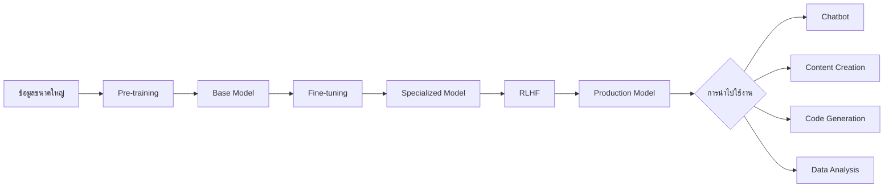

# กระบวนการทำงานของ LLM

## กระบวนการพัฒนาโมเดล LLM

## ขั้นตอนหลัก
1. **Pre-training**: ฝึกโมเดลด้วยข้อมูลปริมาณมหาศาลเพื่อให้เข้าใจพื้นฐานของภาษา
2. **Fine-tuning**: ปรับแต่งโมเดลให้เชี่ยวชาญงานหรือโดเมนเฉพาะทาง
3. **RLHF**: พัฒนาโมเดลต่อยอดจากข้อเสนอแนะของมนุษย์

## Presenter Notes (ข้อมูลสำหรับผู้บรรยาย)

> Key Takeaway: การพัฒนา LLM เป็นกระบวนการหลายขั้นตอน เริ่มจากการฝึกฝนทั่วไป ตามด้วยการปรับแต่งเฉพาะทาง และสุดท้ายคือการปรับปรุงโดยมนุษย์
>
> คำศัพท์เทคนิค: Pre-training, Fine-tuning, RLHF (Reinforcement Learning from Human Feedback), Base Model, Specialized Model
>
> อธิบายเพิ่มเติม:
> - Pre-training คือการฝึกฝนด้วยข้อมูลจำนวนมหาศาล ทำให้โมเดลเข้าใจโครงสร้างภาษา แต่ยังไม่เฉพาะเจาะจงกับงานใด
> - Fine-tuning ใช้ข้อมูลเฉพาะทางจำนวนน้อยกว่าแต่มีคุณภาพสูง เพื่อให้โมเดลเชี่ยวชาญในงานเฉพาะด้าน
> - RLHF ใช้มนุษย์ช่วยในการประเมินและให้คะแนนคำตอบของโมเดล เพื่อปรับปรุงให้ตอบสนองได้ตรงความต้องการมากขึ้น
> - แต่ละขั้นตอนช่วยเพิ่มความสามารถของโมเดล แต่ก็เพิ่มต้นทุนและความซับซ้อนในการพัฒนา
