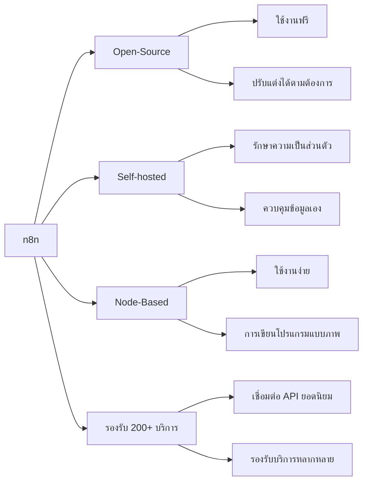

# ทำไมต้องเลือกใช้ n8n?

## Presenter Notes (ข้อมูลสำหรับผู้บรรยาย)

> Key Takeaway: n8n มีข้อได้เปรียบด้านความเป็น open-source, การควบคุมข้อมูล และความยืดหยุ่นในการใช้งาน

- อธิบายคุณสมบัติหลักของ n8n:
  1. **Open-Source**: ไม่มีค่าใช้จ่าย สามารถดูและแก้ไขโค้ดได้ มีชุมชนช่วยพัฒนา
  2. **Self-hosted**: ติดตั้งบนเซิร์ฟเวอร์ของตัวเอง ไม่ต้องส่งข้อมูลออกไปนอกองค์กร
  3. **Node-Based**: ใช้งานง่ายด้วยการเชื่อมต่อ nodes ที่เป็นภาพ
  4. **รองรับ 200+ บริการ**: Google Services, Social Media, CRM, Database และอื่นๆ
- เปรียบเทียบกับคู่แข่งเช่น Zapier (มีค่าใช้จ่าย ไม่สามารถเห็นการทำงานภายใน)
- เหมาะสำหรับองค์กรที่ต้องการควบคุมข้อมูลและมีความยืดหยุ่น
- มีลิมิตในการทำ workflow น้อยกว่าเมื่อเทียบกับแพลตฟอร์มเชิงพาณิชย์

Technical Terms:
- Open-source Software
- Self-hosted Solution
- Node-based Interface
- API Integration
- Fair-code Licensed
