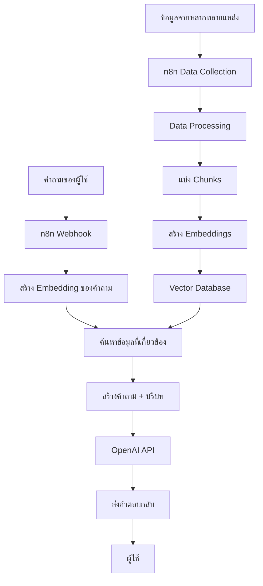

# การใช้งาน n8n กับ RAG

## Presenter Notes (ข้อมูลสำหรับผู้บรรยาย)

> Key Takeaway: n8n สามารถใช้เป็นเครื่องมือในการออกแบบและจัดการระบบ RAG ที่ซับซ้อนได้โดยไม่ต้องเขียนโค้ดมาก

- อธิบายว่า RAG (Retrieval-Augmented Generation) คือเทคนิคที่ช่วยให้ AI สามารถดึงข้อมูลที่เกี่ยวข้องมาใช้ในการตอบคำถาม
- จุดเด่นของการใช้ n8n กับ RAG:
  1. สามารถดึงข้อมูลจากหลายแหล่ง (PDF, เว็บไซต์, ฐานข้อมูล)
  2. จัดการกระบวนการแปลงข้อมูลในรูปแบบต่างๆ
  3. อัปเดตข้อมูลแบบอัตโนมัติตามตารางเวลา
  4. เชื่อมต่อกับ Vector DB เช่น ChromaDB, Pinecone, Weaviate
  5. สามารถสร้าง API endpoint สำหรับผู้ใช้
- อธิบายกระบวนการทำงานของ RAG ใน n8n ตามแผนภาพ:
  - ฝั่งซ้าย: กระบวนการ Ingestion (การนำเข้าและแปลงข้อมูล)
  - ฝั่งขวา: กระบวนการ Query (การค้นหาและตอบคำถาม)
- ประโยชน์: คำตอบมีความแม่นยำมากขึ้น อิงกับข้อมูลขององค์กร ลดการ hallucination ของ AI

Technical Terms:
- RAG (Retrieval-Augmented Generation)
- Embedding
- Vector Database
- Chunking
- Semantic Search
- Prompt Engineering
- Context Window
