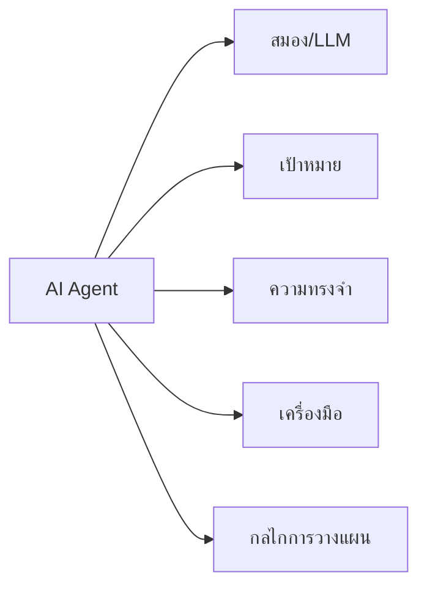

# องค์ประกอบหลักของ AI Agent

AI Agent ประกอบด้วย 5 องค์ประกอบหลักที่ทำงานร่วมกัน:

- **สมอง (Brain)**: โดยทั่วไปคือ LLM ที่ทำหน้าที่ประมวลผล คิดวิเคราะห์และตัดสินใจ
- **เป้าหมาย (Goal)**: วัตถุประสงค์ที่ชัดเจนว่าต้องการบรรลุอะไร
- **ความทรงจำ (Memory)**: ระบบจัดเก็บข้อมูลทั้งแบบระยะสั้นและระยะยาว
- **เครื่องมือ (Tools)**: ความสามารถในการใช้เครื่องมือหรือเชื่อมต่อกับ API ต่างๆ
- **กลไกการวางแผน (Planning)**: ความสามารถในการแบ่งงานเป็นขั้นตอนย่อยๆ

## Presenter Notes (ข้อมูลสำหรับผู้บรรยาย)

> Key Takeaway: AI Agent ที่มีประสิทธิภาพจำเป็นต้องมีองค์ประกอบทั้ง 5 ส่วนทำงานประสานกันอย่างลงตัว ขาดส่วนใดส่วนหนึ่งไม่ได้

- **สมอง (Brain)**: อธิบายว่าโดยทั่วไปคือ LLM เช่น GPT-4, Claude, Llama ที่มีความสามารถในการคิดวิเคราะห์ ให้เหตุผล 
  และประมวลผลข้อความ โดยเป็นส่วนที่ซับซ้อนที่สุดในระบบ

- **เป้าหมาย (Goal)**: เน้นย้ำว่าการกำหนดเป้าหมายที่ชัดเจนเป็นสิ่งสำคัญ โดยเป้าหมายต้องวัดผลได้ ทำได้จริง และมีขอบเขตที่เหมาะสม
  ตัวอย่างเป้าหมาย: "รวบรวมข้อมูลเกี่ยวกับยอดขายในไตรมาสล่าสุดและสรุปเป็นรายงาน"

- **ความทรงจำ (Memory)**: มี 2 ประเภท
  * Short-term memory: ข้อมูลในการสนทนาหรือการทำงานปัจจุบัน (เช่น context window)
  * Long-term memory: ข้อมูลที่จัดเก็บไว้ใช้ในอนาคต (มักใช้ vector database)

- **เครื่องมือ (Tools)**: ยกตัวอย่างเครื่องมือที่ AI Agent สามารถใช้ได้
  * API สำหรับค้นหาข้อมูล (Google Search, Wikipedia)
  * เครื่องมือจัดการไฟล์ (อ่าน/เขียนไฟล์ PDF, Excel)
  * API สำหรับจัดการข้อมูล (Database queries, REST APIs)
  * เครื่องมือการคำนวณ (คำนวณทางคณิตศาสตร์ที่ซับซ้อน)

- **กลไกการวางแผน (Planning)**: เปรียบเสมือนความสามารถในการ "คิดก่อนทำ" ช่วยให้ Agent จัดการกับงานที่ซับซ้อนได้อย่างมีประสิทธิภาพ

Technical Terms:
- Large Language Models (LLMs)
- Context Window
- Vector Database
- External Tool Integration
- Action Planning
- Task Decomposition
- Short-term Memory
- Long-term Memory
