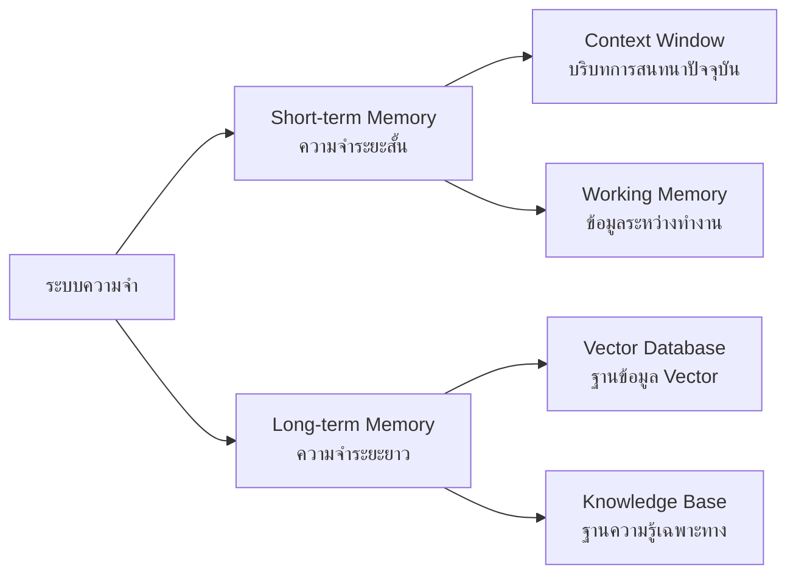

# ระบบความจำของ AI Agent

## Presenter Notes (ข้อมูลสำหรับผู้บรรยาย)

> Key Takeaway: ระบบความจำที่มีประสิทธิภาพช่วยให้ AI Agent สามารถจดจำบทสนทนา เรียนรู้จากประสบการณ์ และจัดเก็บข้อมูลเพื่อใช้งานในอนาคต

- **Short-term Memory (ความจำระยะสั้น)**:
  - Context Window: เป็นขีดจำกัดของข้อความที่ LLM สามารถ "จำ" ได้ในการสนทนา
  - ยกตัวอย่าง: GPT-4 มี context window ประมาณ 128,000 tokens (~100,000 คำ)
  - Working Memory: ข้อมูลที่ถูกใช้ระหว่างการทำงาน เช่น ตัวแปร ผลลัพธ์ชั่วคราว
  - ข้อจำกัด: มีขีดจำกัดในการเก็บข้อมูล เมื่อเกินก็จะลืมหรือต้อง "สรุป" เพื่อรักษาข้อมูลสำคัญ

- **Long-term Memory (ความจำระยะยาว)**:
  - เปรียบเสมือนห้องสมุดส่วนตัวของ AI Agent
  - มักใช้ Vector Database เช่น Pinecone, ChromaDB, Weaviate ในการจัดเก็บ
  - วิธีการทำงาน: แปลงข้อความเป็น embeddings (เวกเตอร์ตัวเลข) และจัดเก็บแบบค้นหาด้วยความคล้ายคลึง
  - เมื่อต้องการข้อมูล จะค้นหา embeddings ที่ใกล้เคียงกับคำถามหรือหัวข้อที่สนใจ
  - ช่วยให้ Agent จำได้ว่าเคยทำอะไรไปแล้ว เรียนรู้จากประสบการณ์เดิม

- **ความสำคัญของระบบความจำ**:
  - ช่วยให้การสนทนากับ AI มีความต่อเนื่อง น่าพึงพอใจ
  - เพิ่มความสามารถในการเรียนรู้และปรับตัว
  - ลดการทำงานซ้ำซ้อน
  - ช่วยให้ AI สามารถเข้าถึงข้อมูลได้มากขึ้นโดยไม่ต้องอยู่ใน context window

- **การประยุกต์ใช้ในงานจริง**:
  - Customer service bot ที่จำประวัติการสนทนากับลูกค้า
  - Personal assistant ที่เรียนรู้นิสัยและความชอบของผู้ใช้
  - Research agent ที่เก็บรวบรวมข้อมูลจากการค้นคว้า

Technical Terms:
- Context Window
- Token Limitation
- Embeddings
- Vector Database
- Semantic Search
- Memory Compression
- Information Retrieval
- Conversation History
