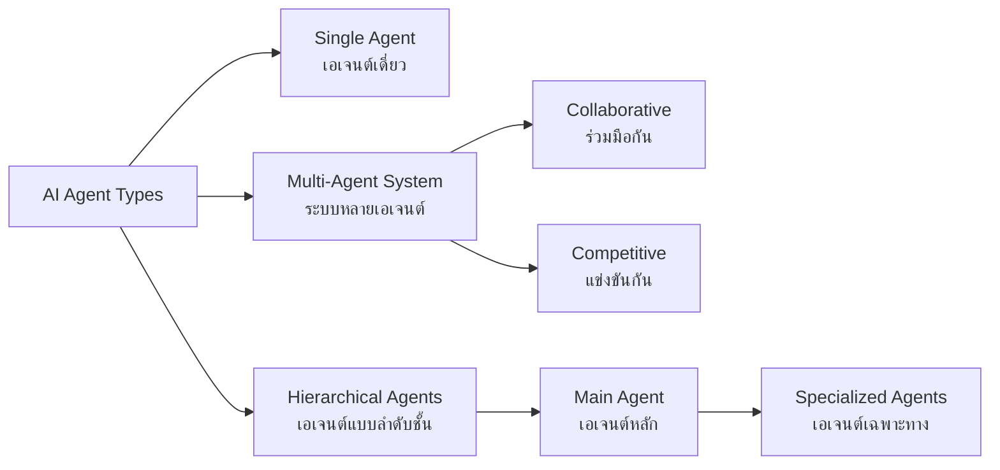

# รูปแบบของ AI Agent

## Presenter Notes (ข้อมูลสำหรับผู้บรรยาย)

> Key Takeaway: การเลือกรูปแบบ AI Agent ที่เหมาะสมกับงานช่วยให้แก้ปัญหาได้มีประสิทธิภาพ โดยเฉพาะงานที่ซับซ้อนมักใช้ Multi-Agent System

- **Single Agent (เอเจนต์เดี่ยว)**:
  - เหมาะกับงานที่ไม่ซับซ้อนมาก มีขอบเขตชัดเจน
  - ข้อดี: บริหารจัดการง่าย ใช้ทรัพยากรน้อย ออกแบบไม่ซับซ้อน
  - ข้อจำกัด: อาจไม่เหมาะกับงานที่ต้องการความเชี่ยวชาญหลายด้าน
  - ตัวอย่าง: ผู้ช่วยตอบคำถาม, เครื่องมือสรุปเอกสาร, AI เขียนโค้ดอย่างง่าย

- **Multi-Agent System (ระบบหลายเอเจนต์)**:
  - **Collaborative (ร่วมมือกัน)**:
    - Agent หลายตัวทำงานร่วมกัน แต่ละตัวมีความเชี่ยวชาญต่างกัน
    - เหมาะกับงานที่ต้องการมุมมองหลากหลาย หรืองานที่แบ่งเป็นส่วนๆ ได้
    - ตัวอย่าง: ทีม AI วิจัยที่มี Agent ค้นหาข้อมูล, Agent วิเคราะห์ข้อมูล และ Agent สรุปผล
  
  - **Competitive (แข่งขันกัน)**:
    - Agent หลายตัวแข่งขันเพื่อหาวิธีแก้ปัญหาที่ดีที่สุด
    - ใช้ในการตรวจสอบคุณภาพ หรือมุมมองที่แตกต่างกัน
    - ตัวอย่าง: AI สำหรับเกม, ระบบวิเคราะห์ความเสี่ยง, การจำลองสถานการณ์ทางธุรกิจ

- **Hierarchical Agents (เอเจนต์แบบลำดับชั้น)**:
  - มี Main Agent ที่ทำหน้าที่มอบหมายงานและรวบรวมผลลัพธ์
  - Sub-agents ทำงานเฉพาะทางตามความเชี่ยวชาญ
  - เหมือนโครงสร้างองค์กรที่มี CEO และทีมงานเฉพาะด้าน
  - ตัวอย่าง: ระบบบริหารโครงการ AI, ผู้ช่วยผู้บริหารอัจฉริยะ

- **ตัวอย่าง Specialized Agents (เอเจนต์เฉพาะทาง)**:
  - Research Agent: เชี่ยวชาญการค้นคว้าและจัดการข้อมูล
  - Coding Agent: เชี่ยวชาญการเขียนและตรวจแก้โค้ด
  - Data Analysis Agent: เชี่ยวชาญวิเคราะห์และแสดงผลข้อมูล
  - Marketing Agent: เชี่ยวชาญด้านการตลาดและพฤติกรรมผู้บริโภค

- เล่าถึงแนวโน้มในอนาคตที่จะมีการพัฒนา "Society of AI Minds" หรือระบบที่มี AI จำนวนมากทำงานร่วมกันเหมือนสังคมมนุษย์

Technical Terms:
- Multi-Agent System (MAS)
- Agent Collaboration
- Agent Specialization
- Hierarchical Agent Structure
- Task Distribution
- Competitive Agents
- Consensus Building
- Society of AI Minds
