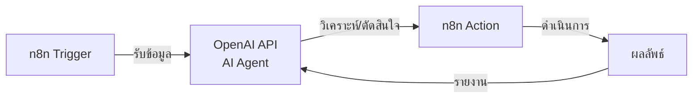

# การเชื่อมต่อ Agent กับระบบอัตโนมัติ (เช่น n8n)

## แนวคิดการทำงานร่วมกัน

- **AI Agent = สมอง**: ทำหน้าที่คิด วิเคราะห์ ตัดสินใจ
- **n8n = แขนขา**: ทำหน้าที่ดำเนินการตามที่ Agent ตัดสินใจ

## ตัวอย่าง Workflow

## Presenter Notes (ข้อมูลสำหรับผู้บรรยาย)

> Key Takeaway: การผสมผสาน AI Agent กับเครื่องมือการทำงานอัตโนมัติอย่าง n8n สร้างระบบที่ทั้งฉลาดและมีประสิทธิภาพสูง โดย AI ทำหน้าที่เป็นสมอง และเครื่องมือ automation ทำหน้าที่เป็นแขนขาในการทำงาน

- **อธิบายหลักการทำงานร่วมกัน**:
  - เปรียบเทียบให้เข้าใจง่าย: AI Agent เป็นเสมือนสมองที่คิดและตัดสินใจ ส่วน n8n เป็นเสมือนแขนขาที่ลงมือทำ
  - อธิบาย workflow พื้นฐานในแผนภาพ:
    1. **Trigger**: เหตุการณ์ที่เริ่มต้นกระบวนการ (เช่น อีเมลเข้า, การกรอกฟอร์ม, กำหนดเวลา)
    2. **AI Agent Processing**: ส่งข้อมูลให้ AI วิเคราะห์และตัดสินใจ
    3. **Action**: n8n ดำเนินการตามการตัดสินใจของ AI Agent
    4. **Feedback Loop**: รายงานผลลัพธ์กลับไปให้ AI Agent

- **ยกตัวอย่างการประยุกต์ใช้จริงในองค์กร IT**:
  
  1. **ระบบจัดการอีเมลอัจฉริยะ**:
     - Trigger: อีเมลเข้าใหม่ใน inbox
     - AI Agent: วิเคราะห์เนื้อหา จัดประเภท ประเมินความสำคัญ
     - n8n Action: จัดเก็บใน folder, แท็กอีเมล, ส่งต่อให้บุคคลที่เกี่ยวข้อง, สร้าง task ใน project management
     - ประโยชน์: ลดเวลาจัดการอีเมล เพิ่มประสิทธิภาพการตอบสนอง ไม่พลาดเรื่องสำคัญ
  
  2. **ระบบตรวจสอบและแก้ไขปัญหาเซิร์ฟเวอร์**:
     - Trigger: การแจ้งเตือนจาก monitoring system
     - AI Agent: วิเคราะห์ log, สาเหตุของปัญหา, และแนะนำวิธีแก้ไข
     - n8n Action: รันคำสั่งเพื่อแก้ไขปัญหา, รีสตาร์ทเซอร์วิส, สำรองข้อมูล
     - Feedback Loop: รายงานผลการแก้ไขและเรียนรู้จากสถานการณ์
     - ประโยชน์: ลดเวลา downtime, ลดภาระ DevOps Engineer
  
  3. **ระบบวิเคราะห์และรายงานข้อมูล**:
     - Trigger: ตามกำหนดเวลา (ทุกวัน/สัปดาห์/เดือน)
     - n8n Action 1: รวบรวมข้อมูลจากแหล่งต่างๆ (database, API, file storage)
     - AI Agent: วิเคราะห์ข้อมูล หาเทรนด์ แนวโน้ม ความผิดปกติ
     - n8n Action 2: สร้างรายงาน ส่งอีเมล แจ้งเตือนหากพบสิ่งผิดปกติ
     - ประโยชน์: ได้ insights โดยอัตโนมัติ ไม่ต้องทำรายงานด้วยมือ

- **คำแนะนำในการเริ่มต้นสร้างระบบ**:
  1. เริ่มจากระบบขนาดเล็ก แล้วค่อยขยาย
  2. ออกแบบให้มนุษย์สามารถแทรกแซงและตรวจสอบได้ (human-in-the-loop)
  3. มีระบบติดตามและประเมินผลการทำงาน
  4. เตรียมการรับมือกรณี AI ทำงานผิดพลาด

- **ข้อควรระวัง**:
  - การให้สิทธิ์มากเกินไปแก่ระบบอัตโนมัติ
  - การพึ่งพาระบบมากเกินไปโดยไม่มีการตรวจสอบ
  - ค่าใช้จ่าย API ที่อาจเพิ่มขึ้นหากมีการเรียกใช้บ่อย

Technical Terms:
- Automation Workflow
- Autonomous System
- Trigger Events
- Decision Node
- Action Node
- Feedback Loop
- System Integration
- Human-in-the-loop
- Machine-Human Collaboration
- Fail-safe Mechanisms
