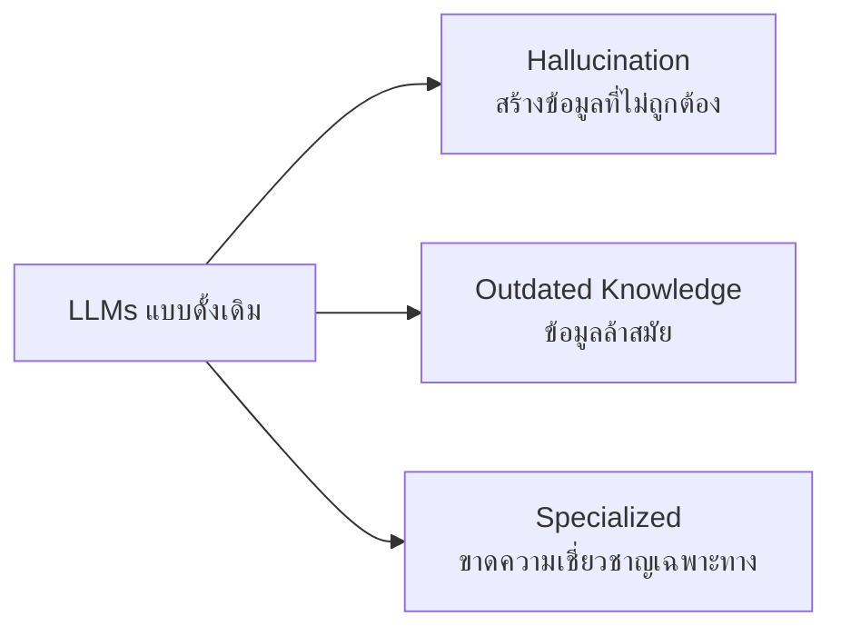

# ข้อจำกัดของ LLMs แบบดั้งเดิม

LLMs แบบดั้งเดิมมีข้อจำกัดสำคัญที่ส่งผลต่อการนำไปใช้งานจริงในองค์กร

## Presenter Notes (ข้อมูลสำหรับผู้บรรยาย)

> Key Takeaway: LLM แบบทั่วไปมีข้อจำกัดสำคัญ 3 ประการ ได้แก่: 1) Hallucination คือการสร้างข้อมูลที่ไม่ถูกต้องหรือไม่มีอยู่จริง 2) ข้อมูลล้าสมัย เนื่องจากถูกฝึกด้วยข้อมูลที่มีขอบเขตจำกัด 3) ขาดความเชี่ยวชาญเฉพาะทางในข้อมูลขององค์กร ทำให้ไม่สามารถตอบคำถามเฉพาะทางได้อย่างแม่นยำ ข้อจำกัดเหล่านี้เป็นสาเหตุที่ทำให้เราต้องใช้เทคนิค RAG

> Technical Terms: Hallucination, Outdated Knowledge, Domain-specific Knowledge, Knowledge Cutoff Date, Training Data
