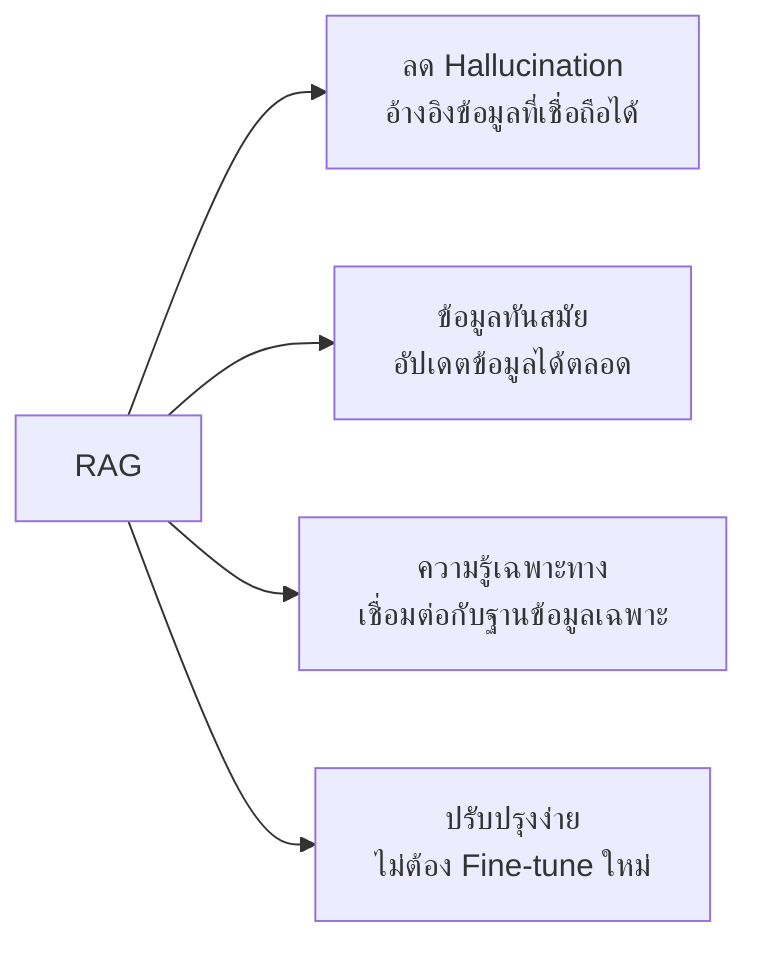

# ประโยชน์ของระบบ RAG

RAG ช่วยแก้ไขข้อจำกัดของโมเดล LLM แบบดั้งเดิมและเพิ่มประสิทธิภาพให้กับระบบ AI อย่างมาก

## Presenter Notes (ข้อมูลสำหรับผู้บรรยาย)

> Key Takeaway: RAG มีประโยชน์หลายประการที่สำคัญสำหรับการใช้งาน AI ในองค์กร: 1) ลดการ Hallucination โดยอ้างอิงข้อมูลจากแหล่งที่เชื่อถือได้ 2) ข้อมูลทันสมัย สามารถอัปเดตฐานข้อมูลได้โดยไม่ต้องฝึกโมเดลใหม่ 3) เพิ่มความรู้เฉพาะทางโดยเชื่อมต่อกับฐานข้อมูลขององค์กร 4) ปรับปรุงง่าย ไม่จำเป็นต้อง fine-tune โมเดลเมื่อต้องการเพิ่มความรู้ใหม่ เพียงแค่เพิ่มข้อมูลในฐานข้อมูล

> Technical Terms: Fact-based Responses, Ground Truth, Knowledge Base, Domain-specific Data, Fine-tuning Alternative
