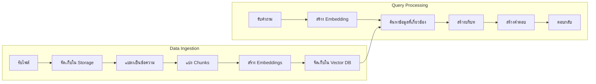

# โครงสร้างของ RAG System

โครงสร้างของ RAG System ประกอบด้วย 2 กระบวนการหลัก: Data Ingestion และ Query Processing

## Presenter Notes (ข้อมูลสำหรับผู้บรรยาย)

> Key Takeaway: RAG System มีองค์ประกอบหลัก 2 ส่วน: 1) Data Ingestion คือการนำข้อมูลเข้าสู่ระบบ ประกอบด้วยการรับไฟล์ จัดเก็บ แปลงเป็นข้อความ แบ่งเป็นส่วนย่อย (chunks) สร้าง embeddings และจัดเก็บใน Vector Database 2) Query Processing คือกระบวนการประมวลผลคำถาม ประกอบด้วยการรับคำถาม สร้าง embedding ของคำถาม ค้นหาข้อมูลที่เกี่ยวข้อง สร้างบริบท นำไปสร้างคำตอบ และส่งกลับให้ผู้ใช้ ทั้งสองกระบวนการนี้ทำงานเชื่อมโยงกันผ่าน Vector Database ที่จัดเก็บ embeddings

> Technical Terms: Data Ingestion, Query Processing, Document Processing, Chunking, Embeddings, Vector Database, Semantic Search, Context Window, Prompt Engineering
