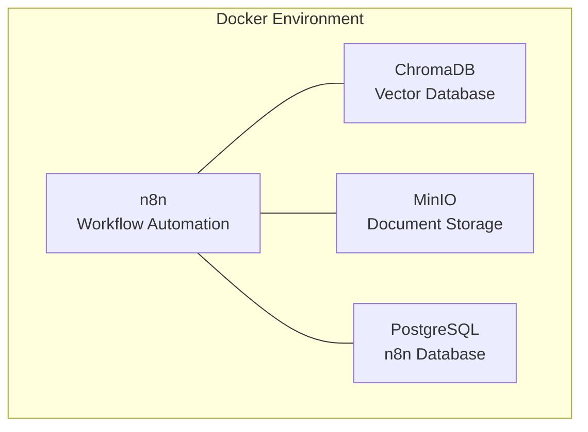

# การติดตั้ง RAG System ด้วย Docker Compose

การติดตั้ง RAG System ด้วย Docker Compose ช่วยให้สามารถเริ่มต้นใช้งานได้อย่างรวดเร็ว

## Presenter Notes (ข้อมูลสำหรับผู้บรรยาย)

> Key Takeaway: เราจะใช้ Docker Compose เพื่อติดตั้งองค์ประกอบหลักทั้งหมดที่จำเป็นสำหรับ RAG System ได้แก่ 1) n8n สำหรับจัดการ workflow ทั้ง data ingestion และ query processing 2) ChromaDB เป็น vector database สำหรับเก็บ embeddings 3) MinIO สำหรับจัดเก็บไฟล์เอกสารต่างๆ เช่น PDF, DOCX 4) PostgreSQL สำหรับเก็บข้อมูลของ n8n เอง การใช้ Docker Compose ทำให้ไม่ต้องติดตั้งแต่ละส่วนแยกกัน และสามารถกำหนดค่าทั้งหมดได้ในไฟล์เดียว นอกจากนี้ยังสามารถปรับขนาดและกำหนดค่าแต่ละส่วนได้ตามต้องการ

> Technical Terms: Docker Compose, Container Orchestration, Service Configuration, Environment Variables, Network Configuration, Volume Management
