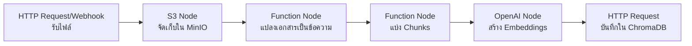

# กระบวนการนำเข้าข้อมูลใน n8n

Workflow สำหรับนำข้อมูลเข้าสู่ระบบ RAG ใน n8n

## Presenter Notes (ข้อมูลสำหรับผู้บรรยาย)

> Key Takeaway: Data Ingestion Workflow ใน n8n มีขั้นตอนสำคัญดังนี้: 1) รับไฟล์เอกสารผ่าน HTTP Request หรือ Webhook node 2) จัดเก็บไฟล์ใน MinIO ด้วย S3 node เพื่อเก็บต้นฉบับไว้อ้างอิง 3) แปลงเอกสารเป็นข้อความด้วย Function node ซึ่งอาจใช้ไลบรารีเสริมเช่น pdf.js หรือ mammoth.js 4) แบ่งข้อความเป็นส่วนย่อย (chunks) เพื่อให้เหมาะสมกับการค้นหาและอยู่ในขนาดที่เหมาะสมกับ context window ของ LLM 5) สร้าง embeddings ด้วย OpenAI node 6) บันทึก embeddings ลงใน ChromaDB ผ่าน HTTP Request node นอกจากนี้ในแต่ละขั้นตอนสามารถเพิ่ม node สำหรับจัดการข้อผิดพลาด (Error Handling) หรือแปลงข้อมูลให้เหมาะสม (Data Transformation) ได้ตามต้องการ

> Technical Terms: Webhook, Document Parsing, Text Extraction, Chunking Strategies, Semantic Chunking, Embedding Generation, Vector Storage, S3 Compatible Storage
