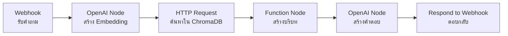

# กระบวนการประมวลผลคำค้นหาใน n8n

Workflow สำหรับประมวลผลคำถามและสร้างคำตอบด้วย RAG ใน n8n

## Presenter Notes (ข้อมูลสำหรับผู้บรรยาย)

> Key Takeaway: กระบวนการประมวลผลคำค้นหาใน n8n มีขั้นตอนดังนี้: 1) รับคำถามจากผู้ใช้ผ่าน Webhook node 2) สร้าง embedding ของคำถามด้วย OpenAI node 3) ส่ง embedding ไปค้นหาข้อมูลที่เกี่ยวข้องใน ChromaDB ด้วย HTTP Request node 4) นำข้อมูลที่ได้มาสร้างบริบท (context) ด้วย Function node ซึ่งอาจรวมถึงการจัดรูปแบบข้อมูล การเรียงลำดับตามความเกี่ยวข้อง และการตัดข้อมูลให้พอดีกับขนาดที่เหมาะสม 5) ส่งคำถามพร้อมบริบทไปยัง OpenAI node เพื่อสร้างคำตอบ 6) ส่งคำตอบกลับไปยังผู้ใช้ผ่าน Respond to Webhook node ในขั้นตอนที่ 4 ควรพิจารณาใส่คำแนะนำ (prompt engineering) เพื่อให้ LLM สร้างคำตอบที่อ้างอิงจากบริบทที่ให้มาเท่านั้น และให้ระบุชัดเจนเมื่อไม่มีข้อมูลเพียงพอ

> Technical Terms: Query Embedding, Semantic Search, Context Construction, Vector Similarity, Top-k Retrieval, Prompt Engineering, Response Generation, RAG Prompt Template
