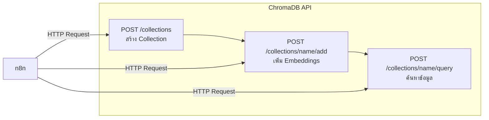

# การใช้งาน ChromaDB ใน RAG System

ChromaDB เป็น Vector Database ที่ใช้เก็บและค้นหา embeddings ใน RAG System

## Presenter Notes (ข้อมูลสำหรับผู้บรรยาย)

> Key Takeaway: ChromaDB เป็น Vector Database ที่มีประสิทธิภาพและใช้งานง่ายสำหรับ RAG System โดยมีการใช้งานผ่าน API หลัก 3 ส่วน: 1) การสร้าง Collection สำหรับจัดกลุ่มข้อมูล 2) การเพิ่ม Embeddings เพื่อจัดเก็บ vector representations ของข้อความพร้อมด้วย metadata และเนื้อหาต้นฉบับ 3) การ Query เพื่อค้นหาข้อมูลที่เกี่ยวข้องกับคำถาม โดยใช้ similarity search เพื่อหาเอกสารที่มีความหมายใกล้เคียงกับคำถาม การใช้งาน ChromaDB ผ่าน n8n จะใช้ HTTP Request node ในการส่งคำสั่ง API โดยตั้งค่า method, URL และ body ให้ถูกต้องตามข้อกำหนดของ ChromaDB API

> Technical Terms: Vector Database, Collection, Vector Embeddings, Metadata, Document Storage, Similarity Search, Cosine Similarity, L2 Distance, Vector Indexing, Approximate Nearest Neighbor (ANN) Search
