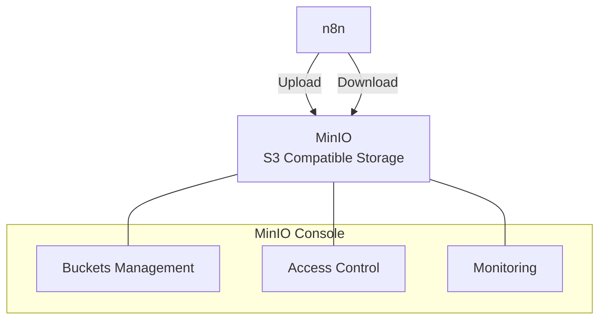

# การจัดการเอกสารด้วย MinIO

MinIO เป็น object storage ที่รองรับ S3 API สำหรับจัดเก็บเอกสารต้นฉบับใน RAG System

## Presenter Notes (ข้อมูลสำหรับผู้บรรยาย)

> Key Takeaway: MinIO เป็น object storage ระบบเปิดที่รองรับ Amazon S3 API ช่วยในการจัดเก็บเอกสารต้นฉบับในระบบ RAG โดยมีประโยชน์ดังนี้: 1) เก็บไฟล์ต้นฉบับไว้อ้างอิงในอนาคต 2) รองรับไฟล์หลากหลายประเภท เช่น PDF, DOCX, TXT 3) ปรับขนาดได้ตามความต้องการ 4) มีระบบจัดการสิทธิ์และความปลอดภัย การใช้งาน MinIO ใน n8n จะใช้ S3 node โดยตั้งค่าการเชื่อมต่อดังนี้: Host (minio), Port (9000), Access Key และ Secret Key จากการตั้งค่า MinIO และตั้งค่า Use SSL เป็น false สำหรับการใช้งานใน local การมี UI ของ MinIO ที่เข้าถึงได้ที่พอร์ต 9001 ทำให้สามารถจัดการไฟล์และตรวจสอบข้อมูลได้ง่าย

> Technical Terms: Object Storage, S3 Compatible Storage, Buckets, Access Keys, Object Lifecycle, Content-Type Detection, Multipart Upload, Pre-signed URLs
