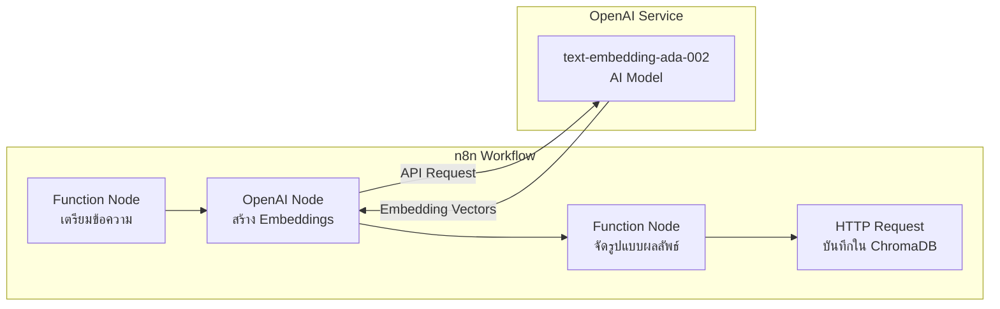

# การเชื่อมต่อ OpenAI API เพื่อสร้าง Embeddings

การเชื่อมต่อกับ OpenAI API เพื่อแปลงข้อความให้เป็น Embeddings สำหรับระบบ RAG

## Presenter Notes (ข้อมูลสำหรับผู้บรรยาย)

> Key Takeaway: การใช้ OpenAI API สำหรับสร้าง embeddings เป็นส่วนสำคัญของ RAG System ซึ่งใน n8n เราจะใช้ OpenAI node โดยมีขั้นตอนดังนี้: 1) ใช้ Function node เพื่อเตรียมข้อความที่จะส่งไปสร้าง embeddings โดยอาจต้องแปลงรูปแบบข้อมูลให้เหมาะสม 2) ตั้งค่า OpenAI node ให้ใช้ API key ที่ถูกต้องและเลือกโมเดล embedding เช่น text-embedding-ada-002 3) รับผลลัพธ์ที่เป็น vector และใช้ Function node อีกตัวเพื่อจัดรูปแบบก่อนส่งไปบันทึกใน ChromaDB ควรคำนึงถึงค่าใช้จ่ายในการใช้ OpenAI API ซึ่งคิดตามจำนวน tokens ที่ใช้ โดยโมเดล embedding มักจะมีราคาถูกกว่าโมเดล LLM ทั่วไป แต่เมื่อมีข้อมูลปริมาณมาก ค่าใช้จ่ายอาจสูงขึ้นได้

> Technical Terms: Embeddings, Vector Representation, text-embedding-ada-002, Dimensionality, Semantic Similarity, API Rate Limiting, Token Counting, Batch Processing, Cosine Similarity
