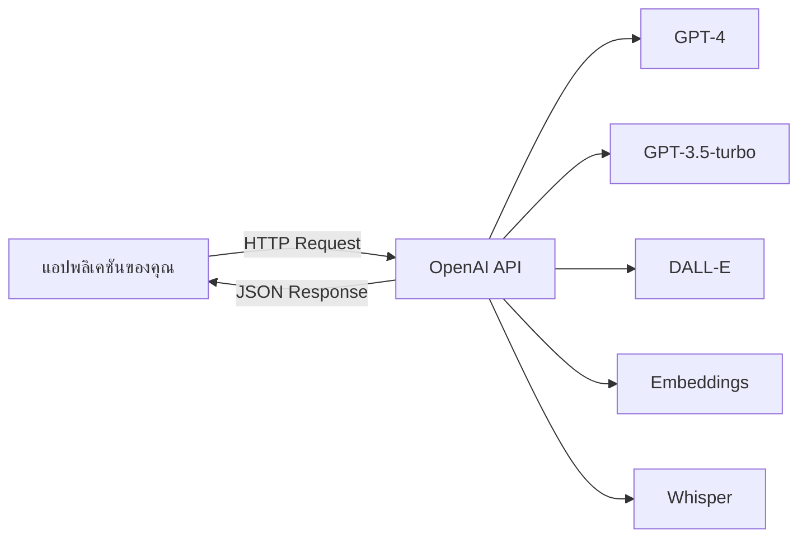

# OpenAI API: รู้จักและเข้าใจ

OpenAI API ให้บริการเข้าถึงโมเดล AI หลากหลายรูปแบบ:
- **ChatGPT/GPT-4**: สร้างข้อความและตอบคำถาม
- **DALL-E**: สร้างภาพจากคำอธิบาย
- **Whisper**: แปลงเสียงเป็นข้อความ
- **Embeddings**: สร้าง vector representations ของข้อความ

## Presenter Notes (ข้อมูลสำหรับผู้บรรยาย)

> Key Takeaway: OpenAI API เป็นหนึ่งในบริการ AI API ที่ได้รับความนิยมสูงสุดในปัจจุบัน เนื่องจากมีโมเดลที่หลากหลายและมีประสิทธิภาพสูง ทำให้นักพัฒนาสามารถเลือกใช้โมเดลที่เหมาะสมกับงานได้ ตั้งแต่การสร้างข้อความ ไปจนถึงการสร้างภาพหรือการประมวลผลเสียง การเข้าใจว่าแต่ละโมเดลเหมาะกับงานประเภทใดจะช่วยให้การพัฒนาแอปพลิเคชันมีประสิทธิภาพและประหยัดต้นทุน

> Technical Terms: GPT-4, GPT-3.5-turbo, DALL-E, Whisper, Embeddings, Vector representation, Tokens, Text generation, Image generation, Speech-to-text
