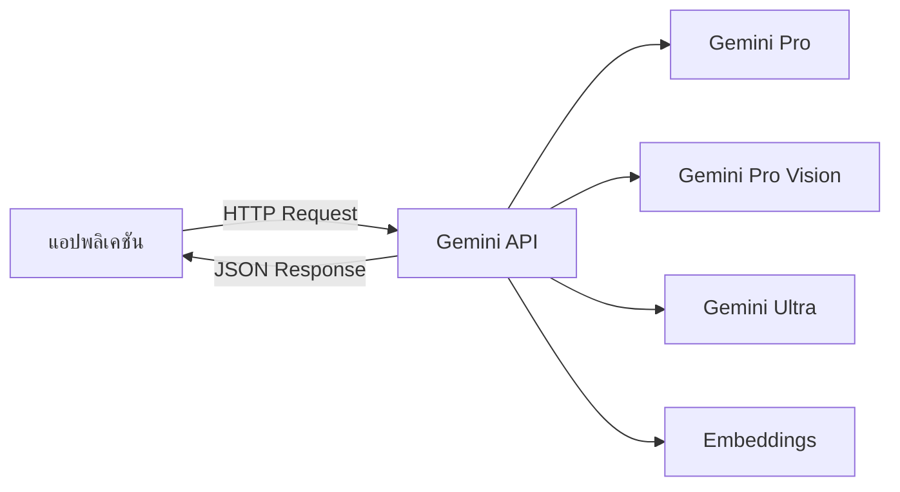

# Gemini API: บริการ AI จาก Google

Gemini API เป็นบริการ AI จาก Google ที่มีจุดเด่น:
- **รองรับภาษาไทยได้ดีเยี่ยม**
- **มัลติโมดัล** (ข้อความ + รูปภาพ)
- **ราคาที่แข่งขันได้** (โควตาฟรี + ราคาต่อ token ที่ต่ำกว่า)
- **เชื่อมโยงกับบริการ Google อื่นๆ** ได้สะดวก

## Presenter Notes (ข้อมูลสำหรับผู้บรรยาย)

> Key Takeaway: Gemini API เป็นคู่แข่งสำคัญของ OpenAI API จากทาง Google โดยมีจุดเด่นที่ราคาที่แข่งขันได้และการรองรับภาษาไทยที่ดีเยี่ยม โมเดล Gemini Pro มีประสิทธิภาพใกล้เคียงกับ GPT-3.5 ในขณะที่ Gemini Pro Vision สามารถวิเคราะห์ทั้งข้อความและรูปภาพได้พร้อมกัน เหมาะสำหรับงานที่ต้องการความสามารถมัลติโมดัล และสำหรับองค์กรที่ต้องการประหยัดต้นทุนแต่ยังคงได้คุณภาพที่ดี

> Technical Terms: Multimodal AI, Vision-language model, Google AI Studio, Generative AI, API endpoints, Token pricing, Character-based billing
