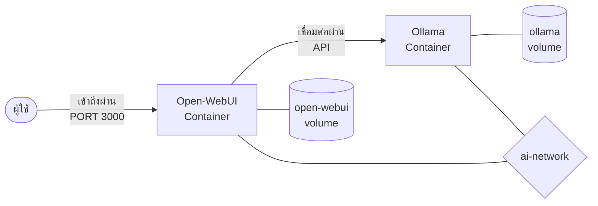

# การติดตั้งด้วย Docker Compose

Docker Compose ช่วยให้การติดตั้งระบบทั้ง Open-WebUI และ Ollama ทำได้ง่ายเพียงแค่ไม่กี่ขั้นตอน

## Presenter Notes (ข้อมูลสำหรับผู้บรรยาย)

> Key Takeaway: การติดตั้งด้วย Docker Compose ทำให้การเริ่มต้นใช้งานเป็นเรื่องง่าย เพียงสร้างไฟล์ docker-compose.yml และรันคำสั่งเดียว โดยในไฟล์จะระบุการเชื่อมต่อระหว่าง container, การ map ports, การตั้งค่า volume สำหรับเก็บข้อมูล และการกำหนดค่า environment variables ต่างๆ นอกจากนี้ ยังสามารถเพิ่มการใช้งาน GPU ได้หากมี NVIDIA GPU โดยเพิ่มการตั้งค่า deploy resources ในส่วนของ Ollama container

> Technical Terms: Docker, Docker Compose, Container, Volume, Network, Port Mapping, Environment Variables, GPU Acceleration
