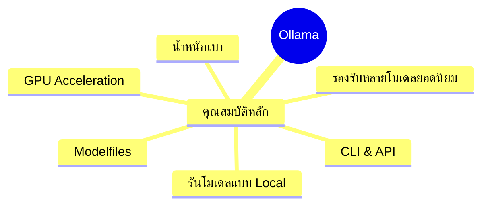

# แนะนำ Ollama

Ollama คือเครื่องมือที่ช่วยให้รัน LLMs บนเครื่องของคุณได้อย่างง่ายดาย

## Presenter Notes (ข้อมูลสำหรับผู้บรรยาย)

> Key Takeaway: Ollama เป็นซอฟต์แวร์ที่ออกแบบมาให้ใช้งาน LLMs ได้ง่าย โดยไม่จำเป็นต้องมีความรู้ด้านการเขียนโปรแกรมระดับสูง จุดเด่นคือ สามารถรันโมเดลได้บนเครื่องของคุณเอง (ไม่ต้องส่งข้อมูลออกไปข้างนอก) รองรับโมเดลยอดนิยมมากมาย เช่น Llama 3, Mistral, Phi, Vicuna สามารถเร่งความเร็วด้วย GPU ได้ และมี API ให้เชื่อมต่อกับแอปพลิเคชันอื่น ทำให้เหมาะสำหรับใช้ในองค์กรที่มีข้อกังวลด้านความเป็นส่วนตัวของข้อมูล หรือต้องการประหยัดค่าใช้จ่าย API

> Technical Terms: Local Inference, Command Line Interface (CLI), API, GPU Acceleration, Neural Network Models, Modelfiles
