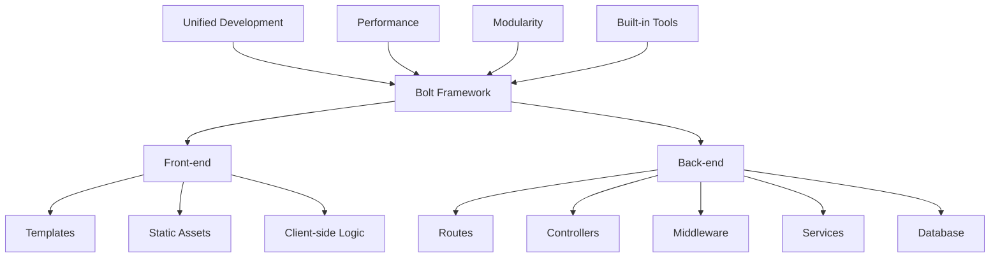

# Bolt Framework คืออะไร?

เฟรมเวิร์กที่ช่วยให้นักพัฒนาสามารถสร้างแอปพลิเคชันเว็บได้อย่างรวดเร็วและมีประสิทธิภาพ

## Presenter Notes (ข้อมูลสำหรับผู้บรรยาย)

> Key Takeaway: แผนภาพนี้แสดงให้เห็นโครงสร้างและส่วนประกอบหลักของ Bolt Framework ซึ่งรวมทั้งส่วน front-end และ back-end เข้าไว้ด้วยกัน อธิบายว่า Bolt เป็นเฟรมเวิร์กแบบ "unified" ที่ช่วยให้นักพัฒนาไม่ต้องเสียเวลาในการเชื่อมต่อระหว่างเฟรมเวิร์ก front-end กับ back-end แยกกัน แนวคิดนี้ช่วยลดความซับซ้อนในการพัฒนา ลดเวลาเรียนรู้เฟรมเวิร์กหลายตัว และทำให้การเชื่อมต่อระหว่างส่วนต่างๆ ราบรื่นกว่า แสดงให้เห็นถึงแนวโน้มปัจจุบันของเฟรมเวิร์กที่พยายามลดความซับซ้อนและเพิ่มประสิทธิภาพการพัฒนา

> Technical Terms: Unified Framework, Front-end, Back-end, Templates, Static Assets, Routes, Controllers, Middleware, Services
