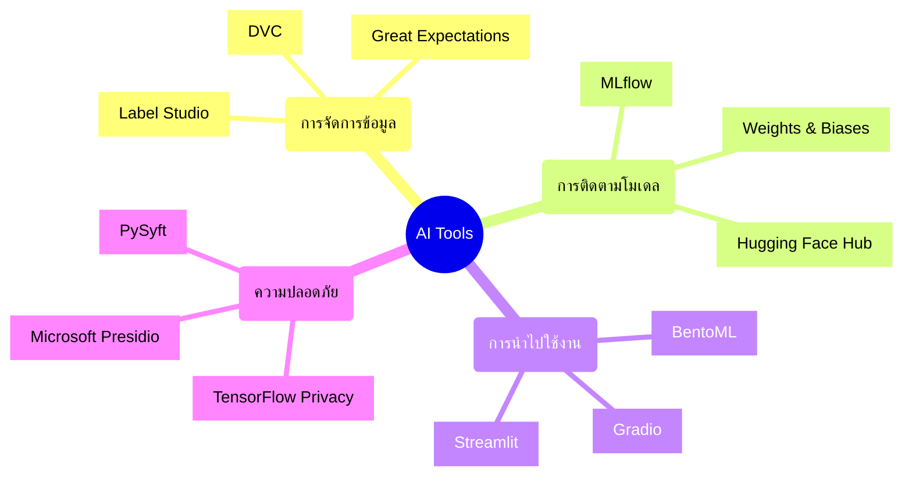

# เครื่องมือเสริมสำหรับการพัฒนาและใช้งาน AI

เครื่องมือที่ช่วยเพิ่มประสิทธิภาพในการพัฒนาและใช้งานระบบ AI

## Presenter Notes (ข้อมูลสำหรับผู้บรรยาย)

> Key Takeaway: นอกจากเครื่องมือหลักที่เรียนรู้ในเซสชันก่อนหน้า (OpenAI API, Gemini API, Ollama, Open-WebUI, n8n) ยังมีเครื่องมือเฉพาะทางอีกมากมายที่ช่วยให้การทำงานกับ AI มีประสิทธิภาพยิ่งขึ้น การทำความรู้จักกับเครื่องมือเหล่านี้จะช่วยให้นักพัฒนาสามารถเลือกใช้ได้ตามความเหมาะสมกับโปรเจกต์ เช่น DVC สำหรับการจัดการเวอร์ชันข้อมูล, MLflow สำหรับติดตามการทดลอง, Gradio/Streamlit สำหรับการสร้างหน้าเว็บแสดงผลงาน AI อย่างรวดเร็ว และ Microsoft Presidio สำหรับการปกป้องข้อมูลส่วนบุคคล เน้นย้ำว่าแต่ละเครื่องมือสามารถนำมาใช้ร่วมกับเทคโนโลยีที่เรียนมาก่อนหน้านี้ได้

> Technical Terms: Data Version Control, Experiment Tracking, Model Registry, Interpretability Tools, Privacy-Preserving ML, Data Quality Management, Deployment Pipeline
